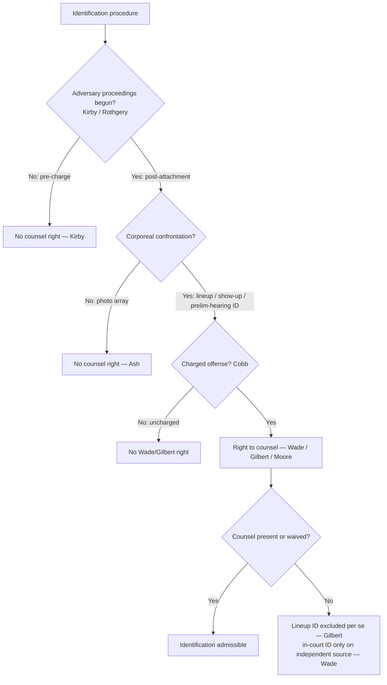

# Lineups & the Right to Counsel

*At this identification procedure, did the accused have a Sixth Amendment right to counsel: was it a corporeal lineup conducted after adversary judicial proceedings had begun?*

> [!rule] Black-letter rule
> A **post-attachment corporeal lineup** is a **critical stage** of the prosecution at which the accused has a **Sixth Amendment right to counsel**. Testimony that a witness identified the accused at an **uncounseled** post-charge lineup is excluded **per se**; an **in-court** identification survives only if the prosecution shows a **source independent** of the tainted lineup. The right does **not** reach a **pre-charge** lineup or a **photographic array**. *[[United States v. Wade|Wade]]*, 388 U.S. 218, [237](https://www.courtlistener.com/opinion/107486/united-states-v-wade/) (1967); *[[Gilbert v. California|Gilbert]]*, 388 U.S. 263, [273](https://www.courtlistener.com/opinion/107487/gilbert-v-california/) (1967); *[[Kirby v. Illinois|Kirby]]*, 406 U.S. 682, [689](https://www.courtlistener.com/opinion/108554/kirby-v-illinois/) (1972); *[[United States v. Ash|Ash]]*, 413 U.S. 300, [321](https://www.courtlistener.com/opinion/108846/united-states-v-ash/) (1973).
> ^rule-lineup-counsel

## The Brief

**This page is the counsel-presence half of the identification doctrine.** It asks one question only: was the accused entitled to a lawyer at the identification, and what follows if that lawyer was absent. It does **not** ask whether the identification was suggestive or reliable. That second, independent screen is a **Fourteenth Amendment due-process** inquiry that lives on [[Eyewitness Identification]]; an identification can satisfy this counsel rule and still fail the reliability screen, or the reverse. Keep the two apart, and map the procedure first, because the counsel right sorts by procedure.

**The rule: a post-attachment corporeal lineup is a critical stage.** In *[[United States v. Wade|Wade]]* the Court held that the "post-indictment lineup was a critical stage of the prosecution at which he was 'as much entitled to such aid [of counsel] . . . as at the trial itself.'" *[[United States v. Wade|Wade]]*, 388 U.S. at [237](https://www.courtlistener.com/opinion/107486/united-states-v-wade/). The reasoning is that a corporeal lineup is a confrontation the defense cannot reconstruct after the fact: suggestive influences leave no record, the witness's memory is reshaped by the procedure, and counsel's presence is the practical safeguard against those risks at the one moment they can be observed. Because the confrontation is trial-like, the accused is entitled to have a lawyer there.

**The remedy: per se exclusion plus the independent-source rule.** *[[Gilbert v. California|Gilbert]]*, the companion decided the same day, supplies the sanction. Testimony that the witness identified the accused **at** an uncounseled post-charge lineup is excluded outright, a **[[Common Legal Terms#per-se|per se]]** rule with no reliability cure: "Only a *per se* exclusionary rule as to such testimony can be an effective sanction to assure that law enforcement authorities will respect the accused's constitutional right to the presence of his counsel at the critical lineup." *[[Gilbert v. California|Gilbert]]*, 388 U.S. at [273](https://www.courtlistener.com/opinion/107487/gilbert-v-california/). A later **in-court** identification is not automatically barred, but it comes in only if the prosecution establishes by **clear and convincing evidence** that it rests on a source **independent** of the lineup, that is, on the witness's observation of the crime itself. *[[United States v. Wade|Wade]]*, 388 U.S. at [240-42](https://www.courtlistener.com/opinion/107486/united-states-v-wade/).

**Limit one: the right does not attach pre-charge.** The counsel right runs only from the initiation of adversary judicial proceedings. In *[[Kirby v. Illinois|Kirby]]* the Court declined to extend *Wade/Gilbert* to a stationhouse showup conducted **before** any charge, holding that the right attaches only "at or after the initiation of adversary judicial criminal proceedings, whether by way of formal charge, preliminary hearing, indictment, information, or arraignment." *[[Kirby v. Illinois|Kirby]]*, 406 U.S. at [689](https://www.courtlistener.com/opinion/108554/kirby-v-illinois/) (plurality). A field showup or a pre-charge lineup therefore needs no defense counsel.

**Limit two: no counsel at a photographic array.** A photo display is not a trial-like confrontation because the accused is not present and cannot be misled or overborne; the safeguard is the prosecutor's later production of the array for cross-examination, not counsel at the viewing. So there is **no** Sixth Amendment right to counsel at a photographic identification, even one conducted after indictment. *[[United States v. Ash|Ash]]*, 413 U.S. at [321](https://www.courtlistener.com/opinion/108846/united-states-v-ash/).

**The corporeal-confrontation point extends to other post-charge identifications.** The critical-stage line follows the trial-like corporeal confrontation, not the label "lineup." *[[Moore v. Illinois|Moore]]* applied *Wade/Gilbert* to a one-on-one identification of the accused by the victim **at a preliminary hearing**, where he stood before the bench without counsel and was pointed out: that post-charge corporeal confrontation was a critical stage, and conducting it without counsel violated the Sixth Amendment. *[[Moore v. Illinois|Moore]]*, 434 U.S. 220 (1977).

**The right is offense-specific.** Because it is one application of the Sixth Amendment right, the lineup-counsel right reaches only the **charged** offense. A post-charge lineup investigating a **different, uncharged** offense is not a *Wade/Gilbert* critical stage, just as questioning about an uncharged offense is outside the *[[Massiah v. United States|Massiah]]* rule. *[[Texas v. Cobb|Cobb]]*, 532 U.S. 162 (2001); see [[Sixth Amendment Right to Counsel]].

**Burden · standard of review · remedy.** The defendant carries the initial burden of showing a **post-attachment corporeal** identification conducted **without counsel or a valid waiver**. The burden then shifts to the **prosecution**, which must prove by **clear and convincing evidence** that any in-court identification has an **independent source** (*[[United States v. Wade|Wade]]*, 388 U.S. at [240](https://www.courtlistener.com/opinion/107486/united-states-v-wade/)). The subsidiary historical facts are reviewed for [[Common Legal Terms#clear-error|clear error]] and the ultimate critical-stage and independent-source questions **[[Common Legal Terms#de-novo|de novo]]**. The **remedy** is **per se exclusion** of the uncounseled-lineup identification testimony (*[[Gilbert v. California|Gilbert]]*), with the in-court identification admitted only on a proven independent source (*[[United States v. Wade|Wade]]*).

**Common pitfalls.**
- **Assuming counsel attaches at every identification.** The right reaches only **post-charge corporeal** confrontations. It does **not** attach at a **pre-charge** showup or lineup (*[[Kirby v. Illinois|Kirby]]*) or at a **photo array** (*[[United States v. Ash|Ash]]*).
- **Confusing this counsel rule with the reliability screen.** A properly counseled lineup can still be **unnecessarily suggestive** and challenged under **due process**, and an uncounseled photo array escapes this rule but remains subject to the suggestiveness/reliability screen ([[Eyewitness Identification]]).
- **Forgetting the [[Inevitable Discovery and Independent Source|independent source]].** *[[Gilbert v. California|Gilbert]]* excludes the **lineup** identification outright, but an **in-court** identification still comes in if the prosecution proves a source independent of the tainted procedure (*[[United States v. Wade|Wade]]*).
- **Overlooking offense-specificity.** A post-charge lineup on an **uncharged** offense triggers no counsel right (*[[Texas v. Cobb|Cobb]]*).

## Lower-court developments

Circuit and state developments only; no SCOTUS. The controlling Supreme Court authorities (*[[United States v. Wade|Wade]]*, *[[Gilbert v. California|Gilbert]]*, *[[Kirby v. Illinois|Kirby]]*, *[[United States v. Ash|Ash]]*, and *[[Moore v. Illinois|Moore]]*) home to **Key cases** regardless of date, per the no-SCOTUS-in-recent-developments rule. The federal rule is stable; the live line-drawing at the lower-court level tracks two recurring frontiers: (a) whether a particular **post-charge showup** is a trial-like corporeal confrontation that triggers the *Wade/Gilbert* right, or is instead an emergency field identification analyzed only under due process; and (b) the sufficiency of the prosecution's **independent-source** showing after an uncounseled lineup. No SCOTUS case is pending on either point. *Specific circuit and state authority developing these frontiers is a live-verify addition (serial CL, L2/L4) deferred to the standing find, adjudicate, and fix gate (R13) and S9; no new case holding is asserted here.*

## Key cases

| Case | Holding | Opinion |
|---|---|---|
| *[[United States v. Wade]]*, 388 U.S. 218 (1967) | **Anchor.** A **post-indictment corporeal lineup** is a **critical stage** with a Sixth Amendment right to counsel; an uncounseled lineup may taint a later in-court identification absent a proven **[[Inevitable Discovery and Independent Source\|independent source]]**. | [opinion](https://www.courtlistener.com/opinion/107486/united-states-v-wade/) |
| *[[Gilbert v. California]]*, 388 U.S. 263 (1967) | **Anchor (remedy).** Testimony that a witness identified the accused **at** an uncounseled post-charge lineup is excluded **[[Common Legal Terms#per-se\|per se]]**, with no reliability or harmless-error cure. | [opinion](https://www.courtlistener.com/opinion/107487/gilbert-v-california/) |
| *[[Kirby v. Illinois]]*, 406 U.S. 682 (1972) (plurality) | **Limit.** The right attaches only **at or after** the initiation of adversary judicial proceedings; a **pre-charge** identification is not a critical stage. | [opinion](https://www.courtlistener.com/opinion/108554/kirby-v-illinois/) |
| *[[United States v. Ash]]*, 413 U.S. 300 (1973) | **Limit.** **No** right to counsel at a **photographic array**, even after indictment, because it is not a trial-like confrontation of the accused. | [opinion](https://www.courtlistener.com/opinion/108846/united-states-v-ash/) |
| *[[Moore v. Illinois]]*, 434 U.S. 220 (1977) | **Application.** *Wade/Gilbert* reaches a post-charge corporeal identification of the accused **at a preliminary hearing**; conducting it without counsel violated the Sixth Amendment. | [opinion](https://www.courtlistener.com/opinion/109757/moore-v-illinois/) |

## Related cases across doctrines

These cases are treated in full elsewhere but bear directly on the lineup-counsel right; each holding is framed here for that context.

| Case | Relevance here | Primary home | Opinion |
|---|---|---|---|
| *[[Rothgery v. Gillespie County]]*, 554 U.S. 191 (2008) | Fixes **when** the right can attach: the Sixth Amendment attaches at the initial appearance or arraignment. But **attachment is distinct from the critical-stage question**; *[[Rothgery v. Gillespie County\|Rothgery]]* did not decide which post-attachment events require counsel, and it is *Wade/Gilbert* that makes a post-charge corporeal lineup a critical stage. | [[Sixth Amendment Right to Counsel]] | [opinion](https://www.courtlistener.com/opinion/145785/rothgery-v-gillespie-county/) |
| *[[Manson v. Brathwaite]]*, 432 U.S. 98 (1977) | The **other** identification doctrine: the due-process reliability screen that governs **suggestive** procedures, which applies to lineups, showups, and photo arrays alike and is independent of the counsel right. A lineup can be counseled yet suggestive, or suggestive yet reliable. | [[Eyewitness Identification]] | [opinion](https://www.courtlistener.com/opinion/109693/manson-v-brathwaite/) |
| *[[Texas v. Cobb]]*, 532 U.S. 162 (2001) | The lineup-counsel right is **offense-specific**: counsel is required only for a lineup concerning the **charged** offense; a post-charge lineup on a different, uncharged offense triggers no *Wade/Gilbert* right. | [[Sixth Amendment Right to Counsel]] | [opinion](https://www.courtlistener.com/opinion/118417/texas-v-cobb/) |

## Visual

## Sources

- [United States v. Wade, 388 U.S. 218 (1967)](https://www.courtlistener.com/opinion/107486/united-states-v-wade/) — pinpoints 237, 240, 242
- [Gilbert v. California, 388 U.S. 263 (1967)](https://www.courtlistener.com/opinion/107487/gilbert-v-california/) — pinpoint 273
- [Kirby v. Illinois, 406 U.S. 682 (1972)](https://www.courtlistener.com/opinion/108554/kirby-v-illinois/) — pinpoint 689 (plurality)
- [United States v. Ash, 413 U.S. 300 (1973)](https://www.courtlistener.com/opinion/108846/united-states-v-ash/) — pinpoint 321
- [Moore v. Illinois, 434 U.S. 220 (1977)](https://www.courtlistener.com/opinion/109757/moore-v-illinois/) (post-charge preliminary-hearing identification)
- [Rothgery v. Gillespie County, 554 U.S. 191 (2008)](https://www.courtlistener.com/opinion/145785/rothgery-v-gillespie-county/) (cross-doctrine; attachment)
- [Manson v. Brathwaite, 432 U.S. 98 (1977)](https://www.courtlistener.com/opinion/109693/manson-v-brathwaite/) (cross-doctrine; due-process reliability, [[Eyewitness Identification]])
- [Texas v. Cobb, 532 U.S. 162 (2001)](https://www.courtlistener.com/opinion/118417/texas-v-cobb/) (cross-doctrine; offense-specificity)
