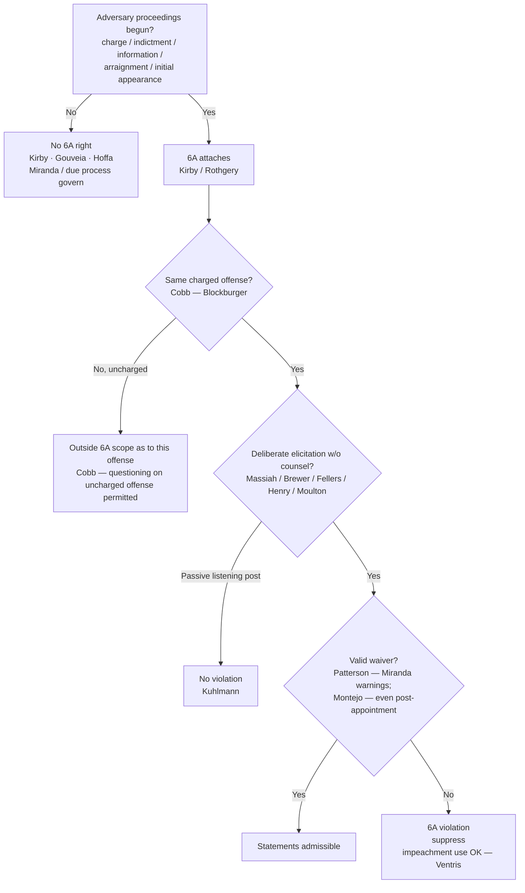

# Sixth Amendment Right to Counsel

*Has the Sixth Amendment right to counsel attached, and did the government deliberately elicit a statement about the charged offense without counsel or a valid waiver?*

> [!rule] Black-letter rule
> The Sixth Amendment right to counsel **attaches at the initiation of adversary judicial proceedings** (formal charge, indictment, information, preliminary hearing, arraignment, or the initial appearance before a magistrate). It is **offense-specific**: it reaches only the charged offense and its *Blockburger* same-offense equivalents, not other uncharged offenses. Once attached, the **Massiah rule** bars the government from **deliberately eliciting** incriminating statements about the charged offense outside the presence of counsel, absent a valid waiver. This is a **distinct** guarantee from the Fifth Amendment *Miranda–Edwards* counsel right. *[[Massiah v. United States|Massiah]]*, 377 U.S. 201, 206 (1964); *[[Kirby v. Illinois|Kirby]]*, 406 U.S. 682, 689 (1972); *[[Texas v. Cobb|Cobb]]*, 532 U.S. 162, 173 (2001); *[[Rothgery v. Gillespie County|Rothgery]]*, 554 U.S. 191, 213 (2008).
> ^rule-sixth-amendment

## The Brief

**Field-decisive frame.** The doctrine turns on four questions in sequence: has the right **attached**; is this the **charged offense**; did the government **deliberately elicit** the statement without counsel; and was there a **valid waiver**. Pre-charge investigation is not this doctrine's territory; it is governed by [[Miranda and Custodial Interrogation|Miranda]] and [[Due-Process Voluntariness of Confessions|due-process voluntariness]].

**Stage 1: attachment (the timing gate).** The right turns on the **initiation of adversary judicial proceedings**, not on arrest or investigative focus. *[[Kirby v. Illinois|Kirby]]* fixes the line: the Court's right-to-counsel decisions "have involved points of time at or after the initiation of adversary judicial criminal proceedings, whether by way of formal charge, preliminary hearing, indictment, information, or arraignment." *[[Kirby v. Illinois|Kirby]]*, 406 U.S. at 689. *[[Rothgery v. Gillespie County|Rothgery]]* pushes the point of attachment to the **initial appearance**: once a defendant appears before a judicial officer, learns the charge, and has his liberty restricted, adversary proceedings have begun, and attachment does not require that a prosecutor be aware of that initial proceeding or be involved in its conduct. *[[Rothgery v. Gillespie County|Rothgery]]*, 554 U.S. at 213. Before that point there is **no** Sixth Amendment claim: the right attaches only at or after the initiation of adversary proceedings, so there is no counsel right during pre-charge administrative segregation (*[[United States v. Gouveia|Gouveia]]*, 467 U.S. at 187-88), and the Constitution does not force the government to arrest or charge early to trigger it, because "[t]here is no constitutional right to be arrested" (*[[Hoffa v. United States|Hoffa]]*, 385 U.S. at 310).

**Stage 1(b): offense-specificity.** Attachment as to a charged offense does **not** bar questioning about *other, uncharged* offenses, even closely related ones; the reach of an "offense" is fixed by the *Blockburger* same-elements test, "whether each provision requires proof of a fact which the other does not." *[[Texas v. Cobb|Cobb]]*, 532 U.S. at 173. And a Sixth Amendment invocation is **not** an invocation of the Fifth Amendment *[[Miranda v. Arizona|Miranda]]*-counsel right: the two are distinct rights serving different purposes and are not interchangeable (*[[McNeil v. Wisconsin|McNeil]]*, 501 U.S. 171 (1991)). Contrast *[[Arizona v. Roberson|Roberson]]*, where a **Fifth Amendment** *Edwards* invocation bars custodial interrogation on **any** offense, a sharp divide the instructor should teach side by side (see [[Miranda Waiver and Invocation]]).

**Stage 2: the *[[Massiah v. United States|Massiah]]* rule, "deliberate elicitation," not "interrogation."** Once the right attaches, the government may not **deliberately elicit** statements without counsel or waiver. In *[[Massiah v. United States|Massiah]]* the accused "was denied the basic protections of that guarantee when there was used against him at his trial evidence of his own incriminating words, which federal agents had deliberately elicited from him after he had been indicted and in the absence of his counsel." *[[Massiah v. United States|Massiah]]*, 377 U.S. at 206. The trigger is **broader than *[[Miranda v. Arizona|Miranda]]* interrogation**: it reaches surreptitious, non-custodial efforts to draw out statements, and the *absence* of interrogation does not defeat the claim, because the Court has "expressly distinguished this standard from the Fifth Amendment custodial-interrogation standard." *[[Fellers v. United States|Fellers]]*, 540 U.S. at 524. Open elicitation counts: the detective who gave the "Christian burial speech" "deliberately and designedly set out to elicit information." *[[Brewer v. Williams|Brewer]]*, 430 U.S. at 399. So does **covert** elicitation through informants, but only **active inducement**, not passive listening:

- **Active inducement violates the right.** Using a paid informant planted in the cell to "intentionally creat[e] a situation likely to induce" an indicted defendant's statements is deliberate elicitation (*[[United States v. Henry|Henry]]*, 447 U.S. at 274); so is the State's "knowing exploitation ... of an opportunity to confront the accused without counsel," even where the *defendant* set up the meeting (*[[Maine v. Moulton|Moulton]]*, 474 U.S. at 176).
- **A passive "listening post" does not.** A jailhouse informant who merely listens and reports commits no violation; the accused "must demonstrate that the police and their informant took some action, beyond merely listening, that was designed deliberately to elicit incriminating remarks." *[[Kuhlmann v. Wilson|Kuhlmann]]*, 477 U.S. at 459.

**Stage 2 limit: a passive presence at defense meetings is not itself a violation.** The mere presence of a government informant at meetings between the defendant and defense counsel does **not** by itself violate the Sixth Amendment; there must be **purposeful intrusion** with communication of defense strategy to the prosecution and resulting **prejudice**. *[[Weatherford v. Bursey|Weatherford v. Bursey]]*, 429 U.S. 545 (1977). The line is the same as *[[Kuhlmann v. Wilson|Kuhlmann]]*'s: passivity is not the wrong; deliberate exploitation is.

**Stage 3: waiver.** The attached right can be **waived**. Standard *[[Miranda v. Arizona|Miranda]]* warnings ordinarily supply a knowing and intelligent waiver of the post-attachment right, because an accused so warned has "been sufficiently apprised of the nature of his Sixth Amendment rights, and of the consequences of abandoning those rights." *[[Patterson v. Illinois|Patterson]]*, 487 U.S. at 296. And *[[Montejo v. Louisiana|Montejo]]* removed the old counsel-request bar: a defendant may validly waive during **police-initiated** interrogation **even after counsel has been requested or appointed**, so long as the waiver is voluntary, knowing, and intelligent, because "*Michigan v. Jackson* should be and now is overruled." *[[Montejo v. Louisiana|Montejo]]*, 556 U.S. at 797. The defendant who does not wish to be questioned without counsel is now protected through the Fifth Amendment *Edwards*/*[[Miranda v. Arizona|Miranda]]* regime instead of a Sixth Amendment presumption.

> [!warning] Historical — *[[Michigan v. Jackson]]* is no longer law
> *[[Michigan v. Jackson|Jackson]]* (1986) had held that a post-attachment, police-initiated waiver is presumptively invalid once the defendant requested counsel at arraignment. *[[Montejo v. Louisiana|Montejo]]* **overruled** it; present it **only as history**, never as current doctrine (*[[Michigan v. Jackson|Jackson]]*, *overruled by* *[[Montejo v. Louisiana|Montejo]]*, 556 U.S. at 797).

**The remedy has an impeachment exception (*[[Kansas v. Ventris|Ventris]]*).** A statement taken in violation of *[[Massiah v. United States|Massiah]]* is inadmissible in the prosecution's **case-in-chief**, but it may still be used to **impeach** the defendant if he takes the stand and testifies inconsistently. *[[Kansas v. Ventris|Kansas v. Ventris]]*, 556 U.S. 586 (2009). The exclusionary sanction protects against affirmative use of the tainted statement, not against exposing perjury, so the officer should understand that a *[[Massiah v. United States|Massiah]]* problem bars the government's main case but does not license contrary trial testimony.

**Critical stages beyond questioning: lineups.** The attachment/critical-stage rule also governs identification procedures (developed in full on [[Lineups and the Right to Counsel]] and [[Eyewitness Identification]]). A **post-attachment corporeal lineup** is a "critical stage" requiring counsel (*[[United States v. Wade|Wade]]*, 388 U.S. at 237); testimony about an uncounseled post-attachment lineup is subject to a **[[Common Legal Terms#per-se|per se]]** exclusionary rule (*[[Gilbert v. California|Gilbert]]*, 388 U.S. at 273). But a **pre-charge** lineup is **not** a critical stage (*[[Kirby v. Illinois|Kirby]]*), and there is **no** right to counsel at a **photographic array** (*[[United States v. Ash|Ash]]*, 413 U.S. at 321).

**Escobedo: the precursor.** *[[Escobedo v. Illinois|Escobedo]]* (1964) held that denying a focus-suspect's request to consult his lawyer during custodial interrogation violated the Sixth Amendment. It was a **precursor** to *[[Miranda v. Arizona|Miranda]]*: its rationale was recast as a Fifth Amendment matter and confined largely to its facts, so it is taught as **origin, not a freestanding test** (treatment: *limited*, result intact, rationale superseded by *[[Miranda v. Arizona|Miranda]]*).

**Elements · burden · standard of review · remedy.**
- **Elements:** (1) the right has **attached** (adversary proceedings begun, *[[Kirby v. Illinois|Kirby]]* / *[[Rothgery v. Gillespie County|Rothgery]]*); (2) as to **this charged offense** (offense-specific, *[[Texas v. Cobb|Cobb]]*); (3) the government **deliberately elicited** the statement without counsel (*[[Massiah v. United States|Massiah]]* / *[[Fellers v. United States|Fellers]]*), by active inducement, not passive listening (*[[Kuhlmann v. Wilson|Kuhlmann]]*); (4) **no valid waiver** (*[[Patterson v. Illinois|Patterson]]* / *[[Montejo v. Louisiana|Montejo]]*).
- **Burden:** on the *[[Massiah v. United States|Massiah]]* claim, the **defendant/movant** bears the burden of showing **deliberate elicitation** after attachment (a mere listening-post informant is insufficient, *[[Kuhlmann v. Wilson|Kuhlmann]]*). Once a waiver is asserted, the **government** bears a **heavy** burden of proving an "intentional relinquishment or abandonment of a known right" (*[[Brewer v. Williams|Brewer]]*, 430 U.S. at 404).
- **Standard of review:** the ultimate waiver/voluntariness determination is reviewed **[[Common Legal Terms#de-novo|de novo]]**; subsidiary historical facts for **[[Common Legal Terms#clear-error|clear error]]**.
- **Remedy:** **suppression** of the deliberately-elicited statement from the case-in-chief, subject to the impeachment exception (*[[Kansas v. Ventris|Ventris]]*); for an uncounseled post-attachment lineup, a **[[Common Legal Terms#per-se|per se]]** bar on testimony about the lineup, with in-court identification admissible only on an **[[Inevitable Discovery and Independent Source|independent source]]** (*[[United States v. Wade|Wade]]* / *[[Gilbert v. California|Gilbert]]*).

**Common pitfalls.**
- **Do not confuse the 5A *[[Miranda v. Arizona|Miranda]]*-counsel right with the 6A counsel right.** Different triggers (custodial interrogation vs. charging) and different scope; a *[[Miranda v. Arizona|Miranda]]* invocation is not a 6A invocation, and vice versa (*[[McNeil v. Wisconsin|McNeil]]*). Keep [[Miranda and Custodial Interrogation]] and this doctrine separate.
- **Do not assume the right attaches at arrest.** It attaches at **charging/initial appearance** (*[[Kirby v. Illinois|Kirby]]*; *[[Rothgery v. Gillespie County|Rothgery]]*); pre-charge investigation is [[Miranda and Custodial Interrogation|Miranda]] / [[Due-Process Voluntariness of Confessions|due-process]] territory (*[[United States v. Gouveia|Gouveia]]*; *[[Hoffa v. United States|Hoffa]]*).
- **Do not forget offense-specificity.** A charged defendant **may** be questioned about **uncharged** offenses (*[[Texas v. Cobb|Cobb]]*).
- **Do not treat a passive jailhouse informant as automatically unlawful.** Mere listening is not deliberate elicitation (*[[Kuhlmann v. Wilson|Kuhlmann]]*); the violation is in *inducing* the statements (*[[United States v. Henry|Henry]]* / *[[Maine v. Moulton|Moulton]]*). Compare the pre-charge undercover-informant setting, governed by *[[Miranda v. Arizona|Miranda]]* and permitted, where the 6A is not yet at issue (*[[Illinois v. Perkins|Perkins]]*).
- **Do not cite *[[Michigan v. Jackson]]* as live law.** It is **overruled** (*[[Montejo v. Louisiana|Montejo]]*).

## Lower-court developments

Circuit and state developments only; no SCOTUS. Every controlling holding in this doctrine lives in **Key cases** regardless of date, per the no-SCOTUS-in-recent-developments rule (N5). The framework is entirely Supreme Court: the *[[Kirby v. Illinois|Kirby]]*/*[[Rothgery v. Gillespie County|Rothgery]]* attachment line, the *[[Texas v. Cobb|Cobb]]*/*[[McNeil v. Wisconsin|McNeil]]* offense-specificity line, the *[[Massiah v. United States|Massiah]]*/*[[United States v. Henry|Henry]]*/*[[Kuhlmann v. Wilson|Kuhlmann]]* deliberate-elicitation-versus-listening-post line, and the *[[Patterson v. Illinois|Patterson]]*/*[[Montejo v. Louisiana|Montejo]]* waiver line all remain settled at the SCOTUS level. The live line-drawing at the lower-court level tracks how the circuits draw the **active-inducement / passive-listening-post** boundary for jailhouse informants and the **point-of-attachment quantum** for pre-charge appearances. *A circuit and state frontier pass is a live-verify addition (serial CL, L2/L4) deferred to the standing find, adjudicate, and fix gate (R13) and S9; no new case holding is asserted here.*

## Key cases

| Case | Holding | Opinion |
|---|---|---|
| *[[Kirby v. Illinois]]*, 406 U.S. 682 (1972) (plurality) | **Anchor.** The right attaches only at or after the initiation of adversary judicial proceedings; a pre-charge identification is not a critical stage. | [opinion](https://www.courtlistener.com/opinion/108554/kirby-v-illinois/) |
| *[[Rothgery v. Gillespie County]]*, 554 U.S. 191 (2008) | **Progeny.** Attachment occurs at the initial appearance before a magistrate, even if no prosecutor is aware of or involved in it. | [opinion](https://www.courtlistener.com/opinion/145785/rothgery-v-gillespie-county/) |
| *[[United States v. Gouveia]]*, 467 U.S. 180 (1984) | **Progeny.** The right attaches only at or after initiation of adversary proceedings; no counsel during pre-charge administrative detention. | [opinion](https://www.courtlistener.com/opinion/111193/united-states-v-gouveia/) |
| *[[Hoffa v. United States]]*, 385 U.S. 293 (1966) | **Progeny.** No 6A claim when an informant elicits statements before the right attaches; there is no constitutional right to be arrested, so the government need not charge early to trigger counsel. | [opinion](https://www.courtlistener.com/opinion/107318/hoffa-v-united-states/) |
| *[[Texas v. Cobb]]*, 532 U.S. 162 (2001) | **Progeny.** The 6A right is offense-specific; it does not extend to uncharged offenses, even factually related ones (*Blockburger* same-elements test). | [opinion](https://www.courtlistener.com/opinion/118417/texas-v-cobb/) |
| *[[McNeil v. Wisconsin]]*, 501 U.S. 171 (1991) | **Progeny.** The 6A right is offense-specific and is **not** an invocation of the distinct 5A *Miranda–Edwards* right; the two are separate. | [opinion](https://www.courtlistener.com/opinion/112622/mcneil-v-wisconsin/) |
| *[[Massiah v. United States]]*, 377 U.S. 201 (1964) | **Anchor.** Post-indictment deliberate elicitation of statements without counsel, even surreptitiously and outside custody, violates the 6A. | [opinion](https://www.courtlistener.com/opinion/106822/massiah-v-united-states/) |
| *[[Brewer v. Williams]]*, 430 U.S. 387 (1977) | **Progeny.** The "Christian burial speech" deliberately elicited statements after attachment with no valid waiver, a *[[Massiah v. United States|Massiah]]* violation. | [opinion](https://www.courtlistener.com/opinion/109624/brewer-v-williams/) |
| *[[Fellers v. United States]]*, 540 U.S. 519 (2004) | **Progeny.** The 6A standard is *deliberate elicitation*, not interrogation; the absence of interrogation does not defeat the claim. | [opinion](https://www.courtlistener.com/opinion/131158/fellers-v-united-states/) |
| *[[United States v. Henry]]*, 447 U.S. 264 (1980) | **Progeny.** Using a paid informant to intentionally induce an indicted defendant's statements "deliberately elicited" them, violating the 6A. | [opinion](https://www.courtlistener.com/opinion/110300/united-states-v-henry/) |
| *[[Maine v. Moulton]]*, 474 U.S. 159 (1985) | **Progeny.** Knowingly exploiting an opportunity to confront the charged accused without counsel violates the 6A, even if the defendant set up the meeting. | [opinion](https://www.courtlistener.com/opinion/111546/maine-v-moulton/) |
| *[[Kuhlmann v. Wilson]]*, 477 U.S. 436 (1986) | **Progeny.** A passive "listening post" informant does not violate the 6A; the accused must show deliberate elicitation *beyond merely listening*. | [opinion](https://www.courtlistener.com/opinion/111726/kuhlmann-v-wilson/) |
| *[[Weatherford v. Bursey]]*, 429 U.S. 545 (1977) | **Progeny (limit).** The mere presence of an informant at defense meetings is not a [[Common Legal Terms#per-se\|per se]] 6A violation absent purposeful intrusion, disclosure of strategy, and prejudice. | [opinion](https://www.courtlistener.com/opinion/109590/weatherford-v-bursey/) |
| *[[Patterson v. Illinois]]*, 487 U.S. 285 (1988) | **Progeny.** An accused may knowingly and intelligently waive the 6A counsel right for post-indictment questioning via *[[Miranda v. Arizona|Miranda]]* warnings. | [opinion](https://www.courtlistener.com/opinion/112127/patterson-v-illinois/) |
| *[[Montejo v. Louisiana]]*, 556 U.S. 778 (2009) | **Progeny.** A defendant may validly waive the 6A right during police-initiated interrogation even after counsel is appointed; **overrules *[[Michigan v. Jackson]]***. | [opinion](https://www.courtlistener.com/opinion/145873/montejo-v-louisiana/) |
| *[[Kansas v. Ventris]]*, 556 U.S. 586 (2009) | **Progeny (remedy).** A statement taken in violation of *[[Massiah v. United States|Massiah]]*, though inadmissible in the case-in-chief, may be used to **impeach** the defendant's conflicting testimony. | [opinion](https://www.courtlistener.com/opinion/145880/kansas-v-ventris/) |
| *[[Escobedo v. Illinois]]*, 378 U.S. 478 (1964) | **The *[[Miranda v. Arizona|Miranda]]* precursor.** Denying a focus-suspect's request for counsel during custodial interrogation violated the 6A; result intact, rationale superseded by *[[Miranda v. Arizona|Miranda]]* (treatment: limited). | [opinion](https://www.courtlistener.com/opinion/106883/escobedo-v-illinois/) |
| *[[Michigan v. Jackson]]*, 475 U.S. 625 (1986) | **No longer law.** Presumed a post-appointment, police-initiated waiver invalid; *overruled by* *[[Montejo v. Louisiana|Montejo]]*, and survives only as history. | [opinion](https://www.courtlistener.com/opinion/111622/michigan-v-jackson/) |

## Related cases across doctrines

These cases are treated in full on other doctrine pages but bear directly on the Sixth Amendment right to counsel and are framed for it here.

| Case | Relevance here | Primary home | Opinion |
|---|---|---|---|
| *[[United States v. Wade]]*, 388 U.S. 218 (1967) | A post-attachment corporeal lineup is a "critical stage" at which counsel is required, the lineup application of the same attachment/critical-stage rule that governs *[[Massiah v. United States|Massiah]]* questioning; in-court identification admissible only on an [[Inevitable Discovery and Independent Source\|independent source]]. | [[Lineups and the Right to Counsel]] | [opinion](https://www.courtlistener.com/opinion/107486/united-states-v-wade/) |
| *[[Gilbert v. California]]*, 388 U.S. 263 (1967) | The remedy for an uncounseled post-attachment lineup: testimony that a witness identified the accused there is excluded **[[Common Legal Terms#per-se\|per se]]**, a strict sanction for the 6A violation. | [[Lineups and the Right to Counsel]] | [opinion](https://www.courtlistener.com/opinion/107487/gilbert-v-california/) |
| *[[United States v. Ash]]*, 413 U.S. 300 (1973) | Limit on the critical-stage rule: **no** right to counsel at a photographic array, because it is not a trial-like adversary confrontation of the accused. | [[Lineups and the Right to Counsel]] | [opinion](https://www.courtlistener.com/opinion/108846/united-states-v-ash/) |
| *[[Illinois v. Perkins]]*, 496 U.S. 292 (1990) | The pre-charge undercover-informant counterpart: no *[[Miranda v. Arizona|Miranda]]* coercion, and the 6A is **not** at issue because the suspect had not been charged, fixing the line that *[[Massiah v. United States|Massiah]]* deliberate-elicitation applies only **after** attachment. | [[Miranda and Custodial Interrogation]] | [opinion](https://www.courtlistener.com/opinion/112452/illinois-v-perkins/) |
| *[[Arizona v. Roberson]]*, 486 U.S. 675 (1988) | Contrast on offense-specificity: the **5A** *Edwards* bar is **not** offense-specific; once counsel is invoked, police may not interrogate about **any** offense. Pair with *[[Texas v. Cobb|Cobb]]* to show the divide from the offense-specific 6A right. | [[Miranda Waiver and Invocation]] | [opinion](https://www.courtlistener.com/opinion/112100/arizona-v-roberson/) |

## Visual

## Sources

- [Massiah v. United States, 377 U.S. 201 (1964)](https://www.courtlistener.com/opinion/106822/massiah-v-united-states/) — pinpoint 206
- [Escobedo v. Illinois, 378 U.S. 478 (1964)](https://www.courtlistener.com/opinion/106883/escobedo-v-illinois/) (precursor; treatment limited)
- [Hoffa v. United States, 385 U.S. 293 (1966)](https://www.courtlistener.com/opinion/107318/hoffa-v-united-states/) — pinpoint 310
- [United States v. Wade, 388 U.S. 218 (1967)](https://www.courtlistener.com/opinion/107486/united-states-v-wade/) — pinpoints 237, 242
- [Gilbert v. California, 388 U.S. 263 (1967)](https://www.courtlistener.com/opinion/107487/gilbert-v-california/) — pinpoint 273
- [Kirby v. Illinois, 406 U.S. 682 (1972)](https://www.courtlistener.com/opinion/108554/kirby-v-illinois/) — pinpoint 689
- [United States v. Ash, 413 U.S. 300 (1973)](https://www.courtlistener.com/opinion/108846/united-states-v-ash/) — pinpoint 321
- [Weatherford v. Bursey, 429 U.S. 545 (1977)](https://www.courtlistener.com/opinion/109590/weatherford-v-bursey/) (informant-at-defense-meetings limit)
- [Brewer v. Williams, 430 U.S. 387 (1977)](https://www.courtlistener.com/opinion/109624/brewer-v-williams/) — pinpoints 399, 404
- [United States v. Henry, 447 U.S. 264 (1980)](https://www.courtlistener.com/opinion/110300/united-states-v-henry/) — pinpoint 274
- [United States v. Gouveia, 467 U.S. 180 (1984)](https://www.courtlistener.com/opinion/111193/united-states-v-gouveia/) — pinpoints 187-88
- [Maine v. Moulton, 474 U.S. 159 (1985)](https://www.courtlistener.com/opinion/111546/maine-v-moulton/) — pinpoint 176
- [Michigan v. Jackson, 475 U.S. 625 (1986)](https://www.courtlistener.com/opinion/111622/michigan-v-jackson/) (overruled by Montejo)
- [Kuhlmann v. Wilson, 477 U.S. 436 (1986)](https://www.courtlistener.com/opinion/111726/kuhlmann-v-wilson/) — pinpoint 459
- [Arizona v. Roberson, 486 U.S. 675 (1988)](https://www.courtlistener.com/opinion/112100/arizona-v-roberson/) (cross-doctrine)
- [Patterson v. Illinois, 487 U.S. 285 (1988)](https://www.courtlistener.com/opinion/112127/patterson-v-illinois/) — pinpoint 296
- [Illinois v. Perkins, 496 U.S. 292 (1990)](https://www.courtlistener.com/opinion/112452/illinois-v-perkins/) (cross-doctrine)
- [McNeil v. Wisconsin, 501 U.S. 171 (1991)](https://www.courtlistener.com/opinion/112622/mcneil-v-wisconsin/) (offense-specific; distinct from 5A right)
- [Texas v. Cobb, 532 U.S. 162 (2001)](https://www.courtlistener.com/opinion/118417/texas-v-cobb/) — pinpoint 173
- [Fellers v. United States, 540 U.S. 519 (2004)](https://www.courtlistener.com/opinion/131158/fellers-v-united-states/) — pinpoint 524
- [Rothgery v. Gillespie County, 554 U.S. 191 (2008)](https://www.courtlistener.com/opinion/145785/rothgery-v-gillespie-county/) — pinpoint 213
- [Kansas v. Ventris, 556 U.S. 586 (2009)](https://www.courtlistener.com/opinion/145880/kansas-v-ventris/) (impeachment exception)
- [Montejo v. Louisiana, 556 U.S. 778 (2009)](https://www.courtlistener.com/opinion/145873/montejo-v-louisiana/) — pinpoint 797
