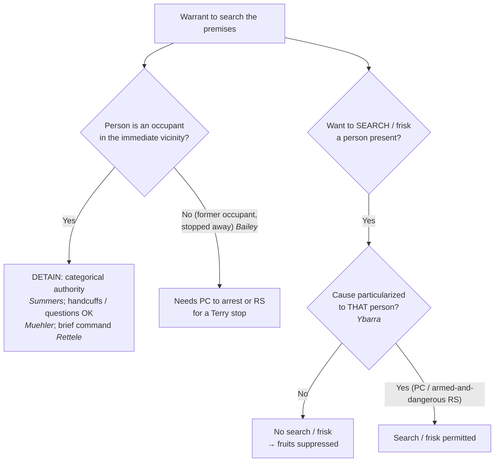

# Detention & Search of Persons at the Scene

*This page is about the **people** present when a search warrant is executed: whom officers may detain, and when they may search or frisk. For securing spaces and protective sweeps, see [[Securing the Scene]]; for the manner of the search itself, see [[Scope Manner and Related Issues]].*

> [!rule] Black-letter rule
> **A search warrant for premises carries the limited, categorical authority to detain the occupants while the search is conducted — but not to search them.** "A warrant to search for contraband founded on probable cause implicitly carries with it the limited authority to detain the occupants of the premises while a proper search is conducted." *[[Michigan v. Summers#^pin-705|Michigan v. Summers]]*, 452 U.S. 692, 705 (1981). That authority is **categorical** (it needs no individualized suspicion) and may be enforced with reasonable force such as handcuffs (*[[Muehler v. Mena|Muehler v. Mena]]*), but it is **spatially limited to the immediate vicinity of the premises** (*[[Bailey v. United States#^pin-201|Bailey v. United States]]*). Detention is not search: a premises warrant does **not** authorize searching a person who merely happens to be present; that needs cause **particularized to that person**. *[[Ybarra v. Illinois|Ybarra v. Illinois]]*, 444 U.S. 85, 91 (1979).
> ^rule-detention-scene

## The Brief

**Field-decisive question: this warrant lets me search the place — what may I do with the people I find here?** Two different powers are in play, and they run on different rules. Officers may **detain** the occupants automatically while they search, but they may not **search** those occupants without cause aimed at each one.

**Detention of occupants is automatic during the search.** A premises warrant founded on probable cause carries "the limited authority to detain the occupants of the premises while a proper search is conducted." *[[Michigan v. Summers#^pin-705|Michigan v. Summers]]*, 452 U.S. 692, 705 (1981). The justification is practical: preventing flight, minimizing the risk of harm to officers and occupants, and orderly completion of the search. Because those interests are present in every such search, the authority does not depend on any suspicion of the particular occupant.

**The authority is categorical, and reasonable force is permitted.** Officers need no separate quantum of proof to detain an occupant: "An officer's authority to detain incident to a search is categorical; it does not depend on the 'quantum of proof justifying detention or the extent of the intrusion to be imposed by the seizure.'" *[[Muehler v. Mena|Muehler v. Mena]]*, 544 U.S. 93, 98 (2005). Where the circumstances justify it (a warrant for weapons at a suspected gang house), officers may detain an occupant in **handcuffs** for the duration of the search, and may ask questions (including about immigration status) without separate reasonable suspicion, because questioning that does not prolong the detention is not itself a seizure. *Id.* at 101.

**Unquestioned command, briefly, does not turn on the occupants' innocence or state of dress.** Officers securing the scene "may briefly detain the occupants and exercise unquestioned command of the situation to protect themselves," including ordering unclothed occupants out of bed for a couple of minutes while they secure the room — even when the occupants turn out to be innocent people of a different race than the suspects. *[[Los Angeles County v. Rettele|Los Angeles County v. Rettele]]*, 550 U.S. 609 (2007). Valid warrants issue on probable cause, not certainty, and the reasonableness of a brief, safety-driven detention does not evaporate because the search comes up empty.

**But the detention must stay within the immediate vicinity, and must not be prolonged.** The *[[Michigan v. Summers|Summers]]* authority is bounded in space. It "is limited to the immediate vicinity of the premises to be searched": "A spatial constraint defined by the immediate vicinity of the premises to be searched is therefore required for detentions incident to the execution of a search warrant." *[[Bailey v. United States#^pin-201|Bailey v. United States]]*, 568 U.S. 186, 201 (2013). An occupant who has already left and is stopped a mile away is **outside** the rule; the flight-prevention interest "does not independently justify detention of an occupant beyond the immediate vicinity." *Id.* at 199. Stopping such a person needs ordinary justification: probable cause to arrest, or reasonable suspicion for a *[[Terry Stops and Reasonable Suspicion|Terry]]* stop.

**Searching the people present needs individualized cause.** A warrant to search a place is not a warrant to search whoever is standing in it. Officers who patted down every patron in a tavern named in a warrant violated the Fourth Amendment as to a customer they knew nothing about: "a person's mere propinquity to others independently suspected of criminal activity does not, without more, give rise to probable cause to search that person," and "[w]here the standard is probable cause, a search or seizure of a person must be supported by probable cause particularized with respect to that person." *[[Ybarra v. Illinois|Ybarra v. Illinois]]*, 444 U.S. 85, 91 (1979). A protective **frisk** likewise needs individualized suspicion that **this** person is armed and presently dangerous. *Id.* at 92–93.

**Burden, standard of review, and remedy.** Detention of occupants during a premises search is justified by the warrant itself, so the government need show only that the person detained was an occupant within the premises' immediate vicinity; a search or frisk of that person, by contrast, must be justified by particularized probable cause or reasonable suspicion, which the government bears the burden to show. The reasonableness questions are reviewed [[Common Legal Terms#de-novo|de novo]] on the historical facts; evidence from an unlawful search of a bystander, or from a detention beyond *[[Michigan v. Summers|Summers]]*' spatial limit, is suppressed.

**Common pitfalls.**

- **Treating the premises warrant as a warrant to search the people.** It is not; frisking or searching a bystander needs cause aimed at that person (*[[Ybarra v. Illinois|Ybarra]]*).
- **Detaining a former occupant away from the scene.** The *[[Michigan v. Summers|Summers]]* power stops at the immediate vicinity; a stop down the street needs its own justification (*[[Bailey v. United States|Bailey]]*).
- **Assuming detention authority is thin.** It is categorical — handcuffs and questioning are permissible where justified, and questioning that does not prolong the stop needs no separate suspicion (*[[Muehler v. Mena|Muehler]]*).
- **Letting a brief safety detention run long.** *[[Los Angeles County v. Rettele|Rettele]]* allows only a brief, unquestioned-command detention; a prolonged one loses its justification.

## Key cases

| Case | Holding | Opinion |
|---|---|---|
| *[[Michigan v. Summers]]*, 452 U.S. 692 (1981) | **Anchor.** A premises warrant founded on probable cause carries the limited authority to detain the occupants while the search is conducted. | [opinion](https://www.courtlistener.com/opinion/110534/michigan-v-summers/) |
| *[[Bailey v. United States]]*, 568 U.S. 186 (2013) | **Spatial limit.** The *[[Michigan v. Summers|Summers]]* detention authority reaches only the immediate vicinity of the premises; a former occupant stopped a mile away is outside it. | [opinion](https://www.courtlistener.com/opinion/820749/bailey-v-united-states/) |
| *[[Muehler v. Mena]]*, 544 U.S. 93 (2005) | **Categorical + force.** The authority to detain incident to a search is categorical; handcuffs for the duration are permissible where justified, and non-prolonging questions need no separate suspicion. | [opinion](https://www.courtlistener.com/opinion/142878/muehler-v-mena/) |
| *[[Los Angeles County v. Rettele]]*, 550 U.S. 609 (2007) | **Manner.** Officers may briefly exercise unquestioned command to secure the scene, including ordering unclothed occupants up for a few minutes; brief safety detentions are reasonable even when the occupants are innocent. | [opinion](https://www.courtlistener.com/opinion/145728/los-angeles-county-california-v-rettele/) |
| *[[Ybarra v. Illinois]]*, 444 U.S. 85 (1979) | **The limit.** A premises warrant does not authorize searching persons merely present; a search or frisk needs cause particularized to that person. | [opinion](https://www.courtlistener.com/opinion/110158/ybarra-v-illinois/) |

## Visual

## Sources

- [*Michigan v. Summers*, 452 U.S. 692 (1981)](https://www.courtlistener.com/opinion/110534/michigan-v-summers/) (pinpoint: 705)
- [*Bailey v. United States*, 568 U.S. 186 (2013)](https://www.courtlistener.com/opinion/820749/bailey-v-united-states/) (pinpoints: 199, 201)
- [*Muehler v. Mena*, 544 U.S. 93 (2005)](https://www.courtlistener.com/opinion/142878/muehler-v-mena/) (pinpoints: 98, 101)
- [*Los Angeles County v. Rettele*, 550 U.S. 609 (2007)](https://www.courtlistener.com/opinion/145728/los-angeles-county-california-v-rettele/) (pinpoints: 550 U.S. at 614; 127 S. Ct. at 1993–94)
- [*Ybarra v. Illinois*, 444 U.S. 85 (1979)](https://www.courtlistener.com/opinion/110158/ybarra-v-illinois/) (pinpoints: 91, 92–93)
