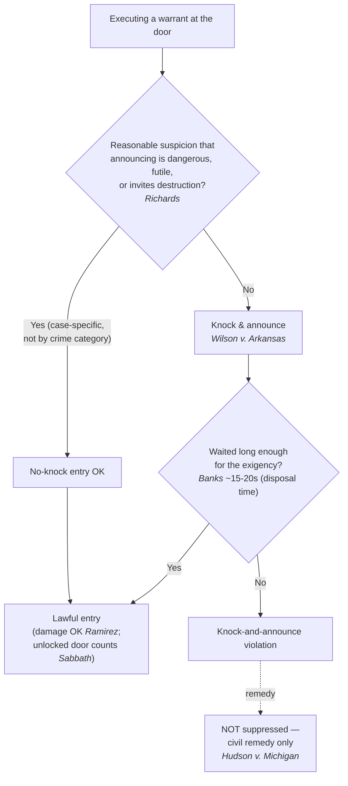

# Knock-and-Announce

*This page is about **announcement at the door** when executing a warrant. For what officers may do once inside, see [[Detention and Search of Persons at the Scene]] and [[Scope Manner and Related Issues]].*

> [!rule] Black-letter rule
> **Before forcing entry, officers must ordinarily announce their presence and authority; the common-law knock-and-announce principle is part of the Fourth Amendment reasonableness inquiry.** *[[Wilson v. Arkansas|Wilson v. Arkansas]]*, 514 U.S. 927, [929](https://www.courtlistener.com/opinion/117936/wilson-v-arkansas/) (1995). It is not absolute: a **no-knock** entry is reasonable where officers have a **reasonable suspicion** that announcing would be **dangerous, futile, or would inhibit the effective investigation** (e.g., by allowing destruction of evidence), but there is **no blanket exception by crime category**. *[[Richards v. Wisconsin#^pin-394a|Richards v. Wisconsin]]*, 520 U.S. 385, [394](https://www.courtlistener.com/opinion/118103/richards-v-wisconsin/) (1997). The **pivotal remedy point:** a knock-and-announce violation does **NOT** trigger the exclusionary rule — the evidence found inside stays in, and the remedy is civil. *[[Hudson v. Michigan#^pin-594|Hudson v. Michigan]]*, 547 U.S. 586, [594](https://www.courtlistener.com/opinion/145646/hudson-v-michigan/) (2006).
> ^rule-knock-announce

## The Brief

**Field-decisive question: must I announce before I force this entry, and what happens if I do not?** The default at the threshold of a home is announcement, but the rule flexes for real [[Exigent Circumstances and Hot Pursuit|exigencies]], and a violation does not suppress the evidence (the part officers most often get wrong).

**The rule and its source.** The common-law requirement that officers announce before entering "forms a part of the reasonableness inquiry under the Fourth Amendment," so "in some circumstances an officer's unannounced entry into a home might be unreasonable." *[[Wilson v. Arkansas|Wilson v. Arkansas]]*, 514 U.S. 927, [929](https://www.courtlistener.com/opinion/117936/wilson-v-arkansas/), 934 (1995). But the requirement is "flexible," not "a rigid rule of announcement that ignores countervailing law enforcement interests." *Id.* at 934.

**No categorical no-knock: it takes reasonable suspicion, case by case.** There is no "it's a drug case" shortcut. A blanket exception "cannot remove from the neutral scrutiny of a reviewing court the reasonableness of the police decision not to knock and announce in a particular case." *[[Richards v. Wisconsin|Richards v. Wisconsin]]*, 520 U.S. 385, [394](https://www.courtlistener.com/opinion/118103/richards-v-wisconsin/) (1997). The standard is reasonable suspicion, tied to the specific circumstances: "the police must have a reasonable suspicion that knocking and announcing their presence, under the particular circumstances, would be dangerous or futile, or that it would inhibit the effective investigation of the crime by, for example, allowing the destruction of evidence." *Id.*

**How long to wait: measure the exigency, not the walk to the door.** Where the exigency is the imminent destruction of easily disposable evidence, the wait is short. After knocking and announcing on a felony drug warrant, "after 15 or 20 seconds without a response, police could fairly suspect that cocaine would be gone if they were reticent any longer." *[[United States v. Banks|United States v. Banks]]*, 540 U.S. 31, [38](https://www.courtlistener.com/opinion/131146/united-states-v-banks/) (2003). The clock runs on **disposal time**, not on how long the occupant needs to reach the door: "it is imminent disposal, not travel time to the entrance, that governs when the police may reasonably enter." *Id.* at 40.

**Property damage does not raise the bar.** A forced or destructive entry is judged by the same *[[Richards v. Wisconsin|Richards]]* reasonable-suspicion standard even when it breaks something. Whether officers must destroy property "depends in no way" on the analysis; there is no higher standard for a no-knock entry that causes damage. *[[United States v. Ramirez|United States v. Ramirez]]*, 523 U.S. 65, [71](https://www.courtlistener.com/opinion/118180/united-states-v-ramirez/) (1998). The manner is still bounded, though: "Excessive or unnecessary destruction of property in the course of a search may violate the Fourth Amendment, even though the entry itself is lawful." *Id.* (further treated at [[Scope Manner and Related Issues]]).

**"Breaking" is broader than force.** An unannounced entry is not limited to smashing a door. Opening "a closed but unlocked door" without first announcing authority and purpose is an unannounced "breaking" just as much as forcing a locked one; the protection cannot turn on "the fortuitous circumstance of an unlocked door." *[[Sabbath v. United States#^pin-590b|Sabbath v. United States]]*, 391 U.S. 585, [590](https://www.courtlistener.com/opinion/107718/sabbath-v-united-states/#:~:text=governed%20by%20something%20more%20than) (1968).

**The remedy: no suppression for a knock-and-announce violation.** This is the single most overstated rule in the doctrine. Suppression does not follow a knock-and-announce violation, because the interests the rule protects are not the interests exclusion serves: "What the knock-and-announce rule has never protected . . . is one's interest in preventing the government from seeing or taking evidence described in a warrant," so "since the interests that were violated in this case have nothing to do with the seizure of the evidence, the exclusionary rule is inapplicable." *[[Hudson v. Michigan#^pin-594|Hudson v. Michigan]]*, 547 U.S. 586, [594](https://www.courtlistener.com/opinion/145646/hudson-v-michigan/) (2006). The entry may be unlawful for **civil** purposes while the seized evidence is admitted.

**Burden, standard of review, and remedy.** The government bears the burden of justifying a no-knock or shortened-wait entry with the reasonable suspicion *[[Richards v. Wisconsin|Richards]]* requires; whether that suspicion existed is reviewed [[Common Legal Terms#de-novo|de novo]] on the historical facts. And per *[[Hudson v. Michigan|Hudson]]*, the remedy for a violation is **not** suppression — it is a civil action (and, separately, excessive destruction may independently violate the Fourth Amendment).

**Common pitfalls.**

- **Assuming a violation suppresses the evidence.** It does not; the remedy is civil (*[[Hudson v. Michigan|Hudson]]*). Do not concede suppression on this ground.
- **Treating "drug case" as an automatic no-knock.** There is no categorical exception; a no-knock entry needs case-specific reasonable suspicion (*[[Richards v. Wisconsin|Richards]]*).
- **Counting the wait by travel time.** The clock measures imminent disposal of the evidence, not how long the occupant needs to answer (*[[United States v. Banks|Banks]]*).
- **Thinking an unlocked door is a free pass.** Opening a closed but unlocked door without announcing is still an unannounced entry (*[[Sabbath v. United States|Sabbath]]*).

## Key cases

| Case | Holding | Opinion |
|---|---|---|
| *[[Wilson v. Arkansas]]*, 514 U.S. 927 (1995) | **Anchor.** The common-law knock-and-announce principle is part of the Fourth Amendment reasonableness inquiry, but it is flexible and yields to countervailing law-enforcement interests. | [opinion](https://www.courtlistener.com/opinion/117936/wilson-v-arkansas/) |
| *[[Richards v. Wisconsin]]*, 520 U.S. 385 (1997) | **No blanket rule.** A no-knock entry needs case-specific reasonable suspicion of danger, futility, or evidence destruction; no crime category is automatically exempt. | [opinion](https://www.courtlistener.com/opinion/118103/richards-v-wisconsin/) |
| *[[United States v. Banks]]*, 540 U.S. 31 (2003) | **Wait time.** A 15-to-20-second wait before forcing entry on a felony drug warrant is reasonable; the clock measures imminent disposal, not travel time to the door. | [opinion](https://www.courtlistener.com/opinion/131146/united-states-v-banks/) |
| *[[United States v. Ramirez]]*, 523 U.S. 65 (1998) | **Property damage.** Damage does not raise the no-knock standard, though excessive or unnecessary destruction can independently violate the Fourth Amendment. | [opinion](https://www.courtlistener.com/opinion/118180/united-states-v-ramirez/) |
| *[[Sabbath v. United States]]*, 391 U.S. 585 (1968) | **Breaking.** An unannounced "breaking" includes opening a closed but unlocked door without first announcing authority and purpose. | [opinion](https://www.courtlistener.com/opinion/107718/sabbath-v-united-states/) |
| *[[Hudson v. Michigan]]*, 547 U.S. 586 (2006) | **Remedy.** A knock-and-announce violation does not trigger suppression of the evidence found inside; the remedy is civil, not exclusionary. | [opinion](https://www.courtlistener.com/opinion/145646/hudson-v-michigan/) |

## Visual

## Sources

- [*Wilson v. Arkansas*, 514 U.S. 927 (1995)](https://www.courtlistener.com/opinion/117936/wilson-v-arkansas/) (pinpoints: 929, 934)
- [*Richards v. Wisconsin*, 520 U.S. 385 (1997)](https://www.courtlistener.com/opinion/118103/richards-v-wisconsin/) (pinpoint: 394)
- [*United States v. Banks*, 540 U.S. 31 (2003)](https://www.courtlistener.com/opinion/131146/united-states-v-banks/) (pinpoints: 38, 40)
- [*United States v. Ramirez*, 523 U.S. 65 (1998)](https://www.courtlistener.com/opinion/118180/united-states-v-ramirez/) (pinpoints: 68, 71)
- [*Sabbath v. United States*, 391 U.S. 585 (1968)](https://www.courtlistener.com/opinion/107718/sabbath-v-united-states/) (pinpoints: 585–86, 590)
- [*Hudson v. Michigan*, 547 U.S. 586 (2006)](https://www.courtlistener.com/opinion/145646/hudson-v-michigan/) (pinpoint: 594)
