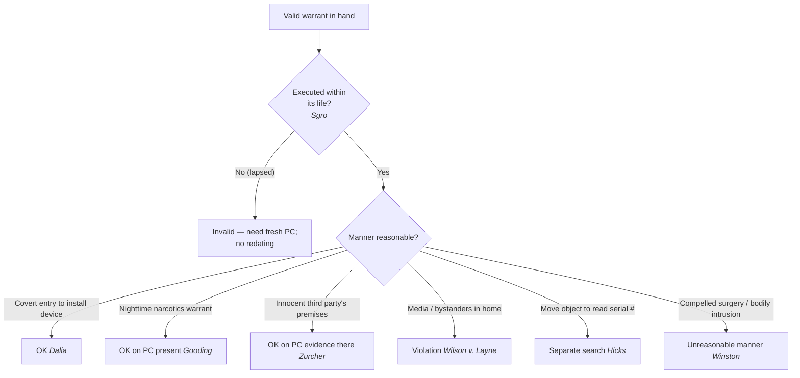

# Scope, Manner & Related Issues

*This page is about **how** a valid warrant may be carried out: timing, manner, place, third parties, and the outer limits on the intrusion. For announcement at the door, see [[Knock-and-Announce]]; for the people present, see [[Detention and Search of Persons at the Scene]].*

> [!rule] Black-letter rule
> **A valid warrant authorizes the search it describes, but the manner of execution has its own reasonableness rules.** A warrant **need not specify its manner of execution**, and a surveillance order implicitly authorizes the covert entry needed to carry it out. *[[Dalia v. United States#^pin-257|Dalia v. United States]]*, 441 U.S. 238, 257 (1979). It must be executed **within its life**: a stale or lapsed warrant cannot be revived by redating, but requires a fresh probable-cause finding. *[[Sgro v. United States#^pin-211|Sgro v. United States]]*, 287 U.S. 206, 210–11 (1932). A warrant may search an **innocent third party's** premises where there is probable cause that evidence is there. *[[Zurcher v. Stanford Daily#^pin-556|Zurcher v. Stanford Daily]]*, 436 U.S. 547, 556 (1978). And even **with** a warrant, the **manner** can be unreasonable — compelled surgery to recover evidence is the classic example. *[[Winston v. Lee|Winston v. Lee]]*, 470 U.S. 753, 759 (1985).
> ^rule-scope-manner

## The Brief

**Field-decisive question: I have a valid warrant — is the way I am carrying it out still reasonable?** A valid warrant answers the *whether*; it does not write a blank check on the *how*. Timing, manner, place, and who comes along each carry their own limits, and any of them can make an otherwise-authorized search unreasonable.

**Manner is generally left to the officers, and covert entry is implicit where needed.** A warrant "need not . . . include a specification of the precise manner in which [it is] to be executed"; the details are "generally left to the discretion of the executing officers." *[[Dalia v. United States#^pin-257|Dalia v. United States]]*, 441 U.S. 238, 257 (1979). Where the warrant authorizes electronic surveillance, it implicitly authorizes the covert entry needed to install the device: "The Fourth Amendment does not prohibit *per se* a covert entry performed for the purpose of installing otherwise legal electronic bugging equipment." *Id.* at 248.

**Timing: a warrant must be executed within its life.** A warrant that has gone stale or lapsed cannot be brought back by simply redating it; reissuance is "essentially a new proceeding which must have adequate support," resting on "a proper finding . . . that probable cause then exists." *[[Sgro v. United States#^pin-211|Sgro v. United States]]*, 287 U.S. 206, 211 (1932). "The purpose of the statute would be thwarted if by the simple expedient of redating . . . the time for the execution of a warrant could be extended." *Id.* (This is the execution-side cousin of affidavit [[Probable Cause in the Affidavit|staleness]].)

**Timing: nighttime execution needs no special showing beyond probable cause.** For a narcotics warrant, executing at night requires "no special showing . . . other than a showing that the contraband is likely to be on the property or person to be searched at that time." *[[Gooding v. United States#^pin-458|Gooding v. United States]]*, 416 U.S. 430, 458 (1974). Probable cause that the contraband is present at that hour is enough.

**Place: whose premises may be searched does not turn on suspicion of the owner.** A warrant may search the premises of an **innocent third party** (even a newspaper) so long as there is probable cause that the evidence is there. "The critical element in a reasonable search is not that the owner of the property is suspected of crime but that there is reasonable cause to believe that the specific 'things' to be searched for and seized are located on the property to which entry is sought." *[[Zurcher v. Stanford Daily#^pin-556|Zurcher v. Stanford Daily]]*, 436 U.S. 547, 556 (1978). (Entering a third party's **home to arrest** the subject of an arrest warrant is the separate *[[Arrest in the Home|Steagald]]* problem, which needs a search warrant for the home.)

**Third parties along for the ride: media in the home violates the Fourth Amendment.** Bringing "members of the media or other third parties into a home during the execution of a warrant," where their presence "was not in aid of the execution of the warrant," violates the Fourth Amendment. *[[Wilson v. Layne|Wilson v. Layne]]*, 526 U.S. 603, 614 (1999).

**Scope of examination: do not develop probable cause by rummaging.** The warrant defines what officers may examine. Moving an object to look for hidden identifying marks is a **new search** that the warrant did not authorize unless the incriminating nature was already **immediately apparent**; the plain-view doctrine "may not be used to extend a general exploratory search from one object to another until something incriminating at last emerges." *[[Arizona v. Hicks|Arizona v. Hicks]]*, 480 U.S. 321 (1987) (treated in full at [[Plain View & Plain Feel]]). Likewise, once officers realize the warrant is overbroad or they are in the wrong unit, they must stop (the execution side of *[[Particularity|Garrison]]*).

**Manner can be unreasonable even with a warrant and probable cause.** A court order and probable cause do not make every intrusion reasonable. Compelled **surgery** under anesthesia to recover a bullet is an unreasonable search where the bodily-integrity intrusion outweighs the State's need: "A compelled surgical intrusion into an individual's body for evidence . . . implicates expectations of privacy and security of such magnitude that the intrusion may be 'unreasonable' even if likely to produce evidence of a crime." *[[Winston v. Lee|Winston v. Lee]]*, 470 U.S. 753, 759 (1985). And excessive or unnecessary **property destruction** during a search can itself violate the Fourth Amendment, even where the entry is lawful (*[[United States v. Ramirez|Ramirez]]*; see [[Knock-and-Announce]]).

**Burden, standard of review, and remedy.** The government must justify the reasonableness of how a warrant was carried out; whether the manner, timing, or scope was reasonable is reviewed [[Common Legal Terms#de-novo|de novo]] on the historical facts. A search that exceeds the warrant's scope, or an unreasonable manner of execution, can lead to suppression of what the excess produced, and, as with knock-and-announce and media ride-alongs, may also give rise to civil liability independent of suppression.

**Common pitfalls.**

- **Reviving a stale warrant by redating it.** A lapsed warrant is dead; you need a fresh probable-cause finding (*[[Sgro v. United States|Sgro]]*).
- **Assuming a warrant makes any intrusion reasonable.** The manner can still be unconstitutional — surgery is the classic example (*[[Winston v. Lee|Winston]]*).
- **Bringing the press or other bystanders into a home.** Media ride-alongs not in aid of the warrant violate the Fourth Amendment (*[[Wilson v. Layne|Wilson v. Layne]]*).
- **Moving objects to develop probable cause.** Turning over a stereo to read its serial number is a separate search the warrant did not authorize (*[[Arizona v. Hicks|Hicks]]*).

## Key cases

| Case | Holding | Opinion |
|---|---|---|
| *[[Dalia v. United States]]*, 441 U.S. 238 (1979) | **Manner.** A warrant need not specify its manner of execution; a surveillance order implicitly authorizes the covert entry needed to install the device. | [opinion](https://www.courtlistener.com/opinion/110061/dalia-v-united-states/) |
| *[[Sgro v. United States]]*, 287 U.S. 206 (1932) | **Staleness / life of the warrant.** A warrant not executed within its life cannot be revived by redating; reissuance needs a fresh, contemporaneous probable-cause finding. | [opinion](https://www.courtlistener.com/opinion/101970/sgro-v-united-states/) |
| *[[Gooding v. United States]]*, 416 U.S. 430 (1974) | **Nighttime.** Nighttime execution of a narcotics warrant requires no special showing beyond probable cause that the contraband is present at that time. | [opinion](https://www.courtlistener.com/opinion/109017/gooding-v-united-states/) |
| *[[Zurcher v. Stanford Daily]]*, 436 U.S. 547 (1978) | **Third-party premises.** A warrant may search an innocent third party's premises, even a newspaper, wherever there is probable cause that evidence is located there. | [opinion](https://www.courtlistener.com/opinion/109876/zurcher-v-stanford-daily/) |
| *[[Winston v. Lee]]*, 470 U.S. 753 (1985) | **Manner limit.** Even with probable cause and a court order, the manner of intrusion can be unreasonable; compelled surgery to recover a bullet fails the balance. | [opinion](https://www.courtlistener.com/opinion/111380/winston-v-lee/) |

## Related cases across doctrines

These cases are treated in full elsewhere but bear on the scope and manner of executing a warrant, framed here for it.

| Case | Relevance here | Primary home | Opinion |
|---|---|---|---|
| *[[United States v. Ramirez]]*, 523 U.S. 65 (1998) | ***Destruction.*** Property damage does not raise the no-knock standard, but excessive or unnecessary destruction can independently violate the Fourth Amendment. | [[Knock-and-Announce]] | [opinion](https://www.courtlistener.com/opinion/118180/united-states-v-ramirez/) |
| *[[Maryland v. Garrison]]*, 480 U.S. 79 (1987) | ***Stop at the mistake.*** Once officers realize the warrant is overbroad or they are in the wrong unit, they must stop; the execution side of the particularity rule. | [[Particularity]] | [opinion](https://www.courtlistener.com/opinion/111823/maryland-v-garrison/) |
| *[[Wilson v. Layne]]*, 526 U.S. 603 (1999) | ***Third parties.*** Bringing media or other third parties into a home during execution, when not in aid of the warrant, violates the Fourth Amendment. | [[Section 1983 Liability and Qualified Immunity]] | [opinion](https://www.courtlistener.com/opinion/118289/wilson-v-layne/) |
| *[[Arizona v. Hicks]]*, 480 U.S. 321 (1987) | ***Scope.*** Moving an object to find hidden marks is a new search beyond the warrant unless the incriminating nature was already immediately apparent. | [[Plain View & Plain Feel]] | [opinion](https://www.courtlistener.com/opinion/111834/arizona-v-hicks/) |

## Visual

## Sources

- [*Dalia v. United States*, 441 U.S. 238 (1979)](https://www.courtlistener.com/opinion/110061/dalia-v-united-states/) (pinpoints: 248, 257)
- [*Sgro v. United States*, 287 U.S. 206 (1932)](https://www.courtlistener.com/opinion/101970/sgro-v-united-states/) (pinpoints: 210, 211)
- [*Gooding v. United States*, 416 U.S. 430 (1974)](https://www.courtlistener.com/opinion/109017/gooding-v-united-states/) (pinpoints: 439, 458)
- [*Zurcher v. Stanford Daily*, 436 U.S. 547 (1978)](https://www.courtlistener.com/opinion/109876/zurcher-v-stanford-daily/) (pinpoints: 556, 564)
- [*Winston v. Lee*, 470 U.S. 753 (1985)](https://www.courtlistener.com/opinion/111380/winston-v-lee/) (pinpoints: 759, 760, 767)
- [*United States v. Ramirez*, 523 U.S. 65 (1998)](https://www.courtlistener.com/opinion/118180/united-states-v-ramirez/) (pinpoint: 71)
- [*Maryland v. Garrison*, 480 U.S. 79 (1987)](https://www.courtlistener.com/opinion/111823/maryland-v-garrison/) (pinpoint: 88)
- [*Wilson v. Layne*, 526 U.S. 603 (1999)](https://www.courtlistener.com/opinion/118289/wilson-v-layne/) (pinpoint: 614)
- [*Arizona v. Hicks*, 480 U.S. 321 (1987)](https://www.courtlistener.com/opinion/111834/arizona-v-hicks/)
