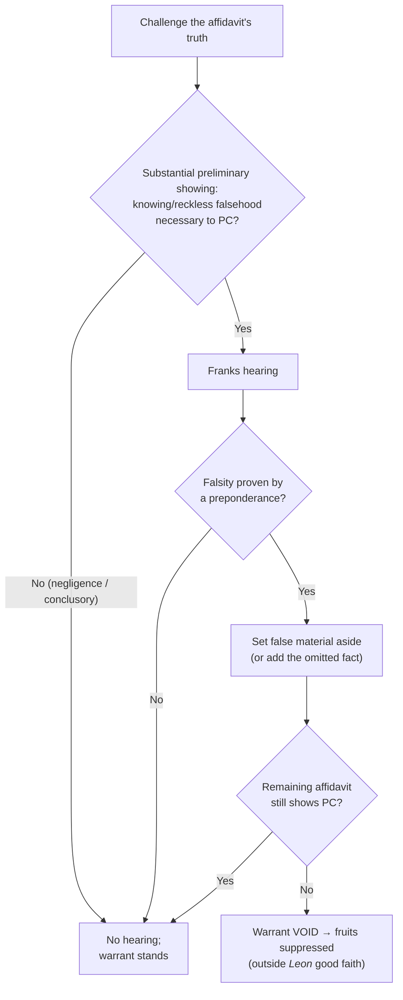

# Franks Challenges

*This page is about attacking the **truthfulness** of a warrant affidavit. For what the affidavit must show in the first place, see [[Probable Cause in the Affidavit]]; for the good-faith consequence, see [[The Exclusionary Rule]].*

> [!rule] Black-letter rule
> **A defendant may attack a facially sufficient warrant by showing the affidavit was deliberately or recklessly false.** On a **substantial preliminary showing** that the affiant included a **knowing or intentional, or reckless, falsehood** that was **necessary to the finding of probable cause**, the defendant is entitled to a **hearing**. *[[Franks v. Delaware#^pin-155|Franks v. Delaware]]*, 438 U.S. 154, 155–56 (1978). If, at that hearing, he proves the falsity **by a preponderance** and the affidavit's remaining content, with the false material set aside, "is insufficient to establish probable cause, the search warrant must be voided and the fruits of the search excluded." *Id.* at 156. *Franks* is also the **first floor** of *[[United States v. Leon|Leon]]* good faith: you cannot rely in good faith on a warrant you lied to get.
> ^rule-franks

## The Brief

**Field-decisive question: was the affidavit that got this warrant honest, and does it still show probable cause once the lies come out?** A warrant is presumed valid, and normally a court will not look behind the affidavit. *Franks* is the narrow exception that lets a defendant do exactly that, but only on a real showing and only for falsity that mattered.

**The two-step structure.** *Franks* builds a gate, then a merits test. First, the defendant must make a **substantial preliminary showing**: he must point to specific alleged falsehoods, show they were made "knowingly and intentionally, or with reckless disregard for the truth," and show they were "necessary to the finding of probable cause." *[[Franks v. Delaware#^pin-155|Franks v. Delaware]]*, 438 U.S. 154, 155–56 (1978). Allegations of mere negligence or innocent mistake, and conclusory attacks, do not open the door. Second, if that showing is made, the court holds a **hearing** at which the defendant must prove the deliberate or reckless falsity **by a preponderance of the evidence**. *Id.* at 156.

**The materiality filter is what decides the case.** Even a proven lie does not automatically void the warrant. The court **sets the false material to one side** and asks whether the affidavit's **remaining content** still establishes probable cause. If it does, the warrant stands and the evidence comes in; only if the affidavit **without** the falsehood is "insufficient to establish probable cause" is the warrant voided and the fruits excluded. *[[Franks v. Delaware#^pin-156|Franks]]*, 438 U.S. at 156. This is why an affiant's stray exaggeration rarely wins: it has to be load-bearing.

**Falsehoods and omissions.** *Franks* itself involved a false statement **included** in the affidavit. Its logic applies with equal force to a **material omission**: a fact the affiant deliberately or recklessly left out, where including it would have defeated probable cause, is analyzed under the same standard, with the reviewing court asking whether the affidavit as it **should** have read still shows probable cause. The mental-state bar is the same: deliberate or reckless, never merely negligent.

**Reckless disregard is the mens-rea line.** *Franks* does not punish honest error. The affiant must have either known the statement was false or entertained serious doubts about its truth and included it anyway. Getting a fact wrong is not a *Franks* violation; putting a fact in the affidavit while recklessly indifferent to whether it is true is.

**Burden, standard of review, and remedy.** The warrant's **presumption of validity** places the whole burden on the **defendant** — first the substantial preliminary showing, then proof by a preponderance. On appeal, the district court's historical findings (what the affiant knew, whether he was reckless) are reviewed for [[Common Legal Terms#clear-error|clear error]], and the ultimate probable-cause question on the corrected affidavit [[Common Legal Terms#de-novo|de novo]]. The remedy is suppression of the fruits, and because the violation is a deliberate or reckless lie, it sits **outside** *Leon* good faith: reliance on a warrant "the magistrate . . . was misled by information in an affidavit that the affiant knew was false or would have known was false except for his reckless disregard of the truth" is not objectively reasonable. *[[United States v. Leon#^pin-923|United States v. Leon]]*, 468 U.S. 897, 923 (1984).

**The civil mirror.** The same duty of candor is enforced in damages. An officer who seeks a warrant on an affidavit "so lacking in indicia of probable cause" that "no reasonably competent officer would have concluded that a warrant should issue" loses qualified immunity. *[[Malley v. Briggs|Malley v. Briggs]]*, 475 U.S. 335, 341 (1986). That is a **high** threshold, though: reasonable reliance on a magistrate's approval of even an overbroad warrant usually keeps immunity. *[[Messerschmidt v. Millender|Messerschmidt v. Millender]]*, 565 U.S. 535, 547 (2012).

**Common pitfalls.**

- **Confusing negligence with recklessness.** An honest mistake is not a *Franks* violation; the affiant must have lied knowingly or recklessly.
- **Skipping the materiality step.** A proven falsehood wins only if the affidavit **without** it fails for probable cause; a non-material lie leaves the warrant standing.
- **Forgetting omissions count.** A deliberately or recklessly omitted fact that would have defeated probable cause is attacked the same way as an affirmative falsehood.
- **Expecting a hearing for the asking.** The substantial-preliminary-showing gate is real; conclusory or negligence-only allegations do not earn a *Franks* hearing.

## Key cases

| Case | Holding | Opinion |
|---|---|---|
| *[[Franks v. Delaware]]*, 438 U.S. 154 (1978) | **Anchor.** On a substantial preliminary showing of a knowing or reckless falsehood material to probable cause, the defendant gets a hearing; proven by a preponderance, with the false material set aside, if the remainder fails for probable cause the warrant is voided and the fruits excluded. | [opinion](https://www.courtlistener.com/opinion/109925/franks-v-delaware/) |

## Related cases across doctrines

These cases are treated in full elsewhere but bear on the *Franks* challenge, framed here for it.

| Case | Relevance here | Primary home | Opinion |
|---|---|---|---|
| *[[United States v. Leon]]*, 468 U.S. 897 (1984) | ***Good-faith floor.*** A *Franks* falsehood is the first of *Leon*'s own exceptions: reliance on a warrant the affiant knew or recklessly should have known was false is not objectively reasonable. | [[The Exclusionary Rule]] | [opinion](https://www.courtlistener.com/opinion/111262/united-states-v-leon/) |
| *[[Massachusetts v. Sheppard]]*, 468 U.S. 981 (1984) | ***Good-faith companion.*** By contrast, an officer misled by a judge's assurance that a mis-worded warrant was valid may still be in good faith; the affiant's honesty is what separates the cases. | [[The Exclusionary Rule]] | [opinion](https://www.courtlistener.com/opinion/111263/massachusetts-v-sheppard/) |
| *[[Malley v. Briggs]]*, 475 U.S. 335 (1986) | ***Civil mirror.*** An officer who applies on an affidavit no reasonably competent officer would present loses qualified immunity, the outer bound of reasonable reliance. | [[Section 1983 Liability and Qualified Immunity]] | [opinion](https://www.courtlistener.com/opinion/111611/malley-v-briggs/) |
| *[[Messerschmidt v. Millender]]*, 565 U.S. 535 (2012) | ***High threshold.*** Reasonable reliance on a magistrate's approval of even an overbroad warrant usually keeps qualified immunity; *Malley* liability is the exception. | [[Section 1983 Liability and Qualified Immunity]] | [opinion](https://www.courtlistener.com/opinion/623242/messerschmidt-v-millender/) |

## Visual

## Sources

- [*Franks v. Delaware*, 438 U.S. 154 (1978)](https://www.courtlistener.com/opinion/109925/franks-v-delaware/) (pinpoints: 155, 156)
- [*United States v. Leon*, 468 U.S. 897 (1984)](https://www.courtlistener.com/opinion/111262/united-states-v-leon/) (pinpoint: 923)
- [*Massachusetts v. Sheppard*, 468 U.S. 981 (1984)](https://www.courtlistener.com/opinion/111263/massachusetts-v-sheppard/) (pinpoint: 989)
- [*Malley v. Briggs*, 475 U.S. 335 (1986)](https://www.courtlistener.com/opinion/111611/malley-v-briggs/) (pinpoints: 341, 345)
- [*Messerschmidt v. Millender*, 565 U.S. 535 (2012)](https://www.courtlistener.com/opinion/623242/messerschmidt-v-millender/) (pinpoint: 547)
