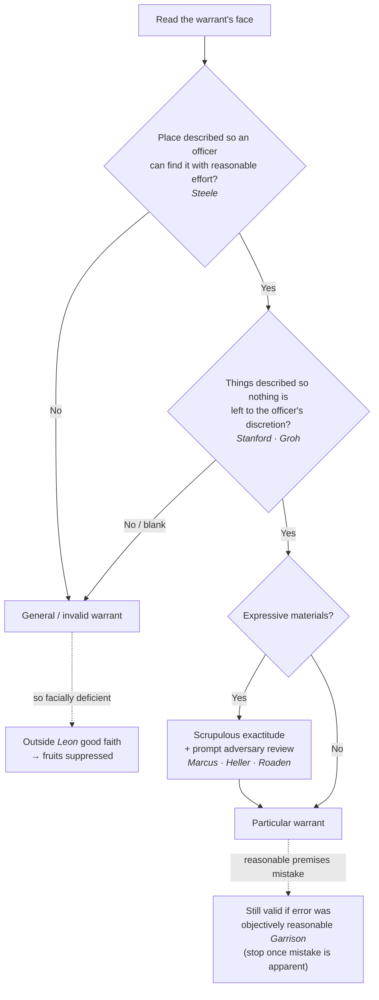

# Particularity

*This page is about what the warrant must say **on its own face**. For the showing behind it, see [[Probable Cause in the Affidavit]]; for how far officers may look while executing it, see [[Scope Manner and Related Issues]].*

> [!rule] Black-letter rule
> **The warrant must, on its own face, particularly describe the place to be searched and the persons or things to be seized.** For the **place**, the description suffices if the executing officer "can with reasonable effort ascertain and identify the place intended." *[[Steele v. United States|Steele v. United States]]*, 267 U.S. 498, 503 (1925). For the **things**, generality is the vice: a warrant that leaves "nothing . . . to the discretion of the officer executing the warrant" satisfies the clause, and one that does not is a forbidden **general warrant**. *[[Stanford v. Texas|Stanford v. Texas]]*, 379 U.S. 476, 485 (1965). Particularity lives **in the warrant, not in the supporting documents**: a detailed affidavit cannot rescue a warrant that fails to describe the things to be seized. *[[Groh v. Ramirez#^pin-557|Groh v. Ramirez]]*, 540 U.S. 551, 557–58 (2004).
> ^rule-particularity

## The Brief

**Field-decisive question: does the warrant itself tell the officer exactly where to search and exactly what to seize?** Particularity is the Fourth Amendment's answer to the general warrant, the open-ended writ the Framers despised (the *[[Entick v. Carrington|Entick]]* and *[[Wilkes v. Wood|Wilkes]]* line; see [[Common Law Origins]]). It has two objects, place and things, and both must be described **on the warrant** with enough precision to confine the search and leave no roving discretion in the field.

**Place: reasonable-effort identification.** The description of the place need not be perfect, only sufficient to steer the executing officer to the right premises. "It is enough if the description is such that the officer with a search warrant can with reasonable effort ascertain and identify the place intended." *[[Steele v. United States|Steele v. United States]]*, 267 U.S. 498, 503 (1925).

**Things: no discretion left to the officer.** For what may be seized, generality is exactly the evil the clause was written against. Where the target is described so broadly that the officer chooses in the field what is covered, the warrant is general and void; a valid warrant leaves "nothing . . . to the discretion of the officer executing the warrant." *[[Stanford v. Texas|Stanford v. Texas]]*, 379 U.S. 476, 485 (1965).

**The blank warrant: a great affidavit cannot cure it.** This is the pivotal rule, and the one most often misunderstood. Particularity is a requirement **of the warrant itself**, so a warrant that fails to describe the things to be seized is **facially invalid even when the supporting affidavit is meticulous**. "The fact that the application adequately described the 'things to be seized' does not save the warrant from its facial invalidity. The Fourth Amendment by its terms requires particularity in the warrant, not in the supporting documents." *[[Groh v. Ramirez#^pin-557|Groh v. Ramirez]]*, 540 U.S. 551, 557 (2004). A warrant that "did not describe the items to be seized at all" is "so obviously deficient" that the search is treated as warrantless. *Id.* at 558.

**A reasonable mistake about the premises does not void the warrant.** Particularity is judged on what the officers reasonably knew when they applied, not on facts that surface later. Where officers reasonably but wrongly believed a third-floor apartment filled the whole floor, the warrant and the search conducted before the mistake became apparent were valid: validity turns on "whether the officers' failure to realize the overbreadth of the warrant was objectively understandable and reasonable." *[[Maryland v. Garrison#^pin-88|Maryland v. Garrison]]*, 480 U.S. 79, 88 (1987). The corollary is an **execution** limit: once officers realize they are in the wrong place, they must stop (treated at [[Scope Manner and Related Issues]]).

**A particular warrant for records raises no Fifth Amendment problem.** A warrant that particularly describes **business records** and their seizure does not compel the accused to do anything, so it does not offend the privilege against self-incrimination: the records "contained statements that petitioner had voluntarily committed to writing," and "petitioner was not asked to say or to do anything." *[[Andresen v. Maryland|Andresen v. Maryland]]*, 427 U.S. 463, 473 (1976). A broad-looking catch-all phrase can still satisfy particularity when read as limited by the crime under investigation; the *Andresen* warrant's phrase was saved because it authorized seizure only of evidence relating to "the crime of false pretenses with respect to Lot 13T." *Id.* at 480.

**Expressive materials demand the most scrupulous exactitude.** When the "things" are books, films, or other expressive material, the particularity command tightens, because an overbroad seizure is also a prior restraint on speech. The strand runs through several cases and is best held as a list:

- **Scrupulous exactitude.** Where "the 'things' are books, and the basis for their seizure is the ideas which they contain," particularity "is to be accorded the most scrupulous exactitude." *[[Stanford v. Texas|Stanford v. Texas]]*, 379 U.S. at 485.
- **No officer's-eye obscenity call.** A warrant that merely tracks the obscenity statute and lets each officer decide which magazines are "obscene" gives "the broadest discretion to the executing officers" and is a general warrant. *[[Marcus v. Search Warrant#^pin-732|Marcus v. Search Warrant]]*, 367 U.S. 717, 732 (1961).
- **A hearing before mass seizure.** Seizing a bookstore's stock without first affording an adversary hearing on the materials is "constitutionally deficient." *[[A Quantity of Copies of Books v. Kansas#^pin-211|A Quantity of Copies of Books v. Kansas]]*, 378 U.S. 205, 211 (1964).
- **Warrant plus prompt adversary review.** A single copy may be seized as evidence "pursuant to a warrant, issued after a determination of probable cause by a neutral magistrate," so long as "a prompt judicial determination of the obscenity issue in an adversary proceeding is available." *[[Heller v. New York#^pin-492|Heller v. New York]]*, 413 U.S. 483, 492 (1973).
- **No warrantless film seizure.** Taking a film out of circulation "without the authority of a constitutionally sufficient warrant" is "a form of prior restraint" and "calls for a higher hurdle in the evaluation of reasonableness." *[[Roaden v. Kentucky#^pin-504|Roaden v. Kentucky]]*, 413 U.S. 496, 504 (1973).

For these warrants the probable-cause showing is still ordinary *Gates* fair probability; what tightens is **particularity** and the need for **prompt adversary review** before expressive stock is taken out of circulation (*Fort Wayne Books, Inc. v. Indiana*; *Lee Art Theatre, Inc. v. Virginia*).

**The digital frontier.** The hardest particularity fights now are over **geofence ("reverse-location") warrants** and **computer searches**, where the question is whether a warrant for a place-and-time window, or for an entire device, is a modern general warrant. Those battles, and the Supreme Court's resolution of the threshold "is it a search" question for geofence data, are treated at [[Reverse-Keyword and Geofence Warrants]]; the particularity issue is the live one there [[Reading and Citing Cases#on-remand|on remand]].

**Burden, standard of review, and remedy.** The warrant is presumed valid and the challenger bears the burden. Particularity is a legal question the court reviews [[Common Legal Terms#de-novo|de novo]] on the face of the warrant. A general or blank warrant is void and its fruits are suppressed, subject only to *Leon* good faith — which does **not** rescue a warrant "so facially deficient . . . that the executing officers cannot reasonably presume it to be valid." *See* [[Franks Challenges]]; [[The Exclusionary Rule]].

**Common pitfalls.**

- **Thinking a great affidavit cures a blank warrant.** It does not; particularity lives on the face of the warrant (*[[Groh v. Ramirez|Groh]]*).
- **Drafting "all records relating to" clauses.** A standardless catch-all is a general warrant unless cabined by the specific crime (*[[Stanford v. Texas|Stanford]]*; *[[Andresen v. Maryland|Andresen]]*).
- **Treating a reasonable premises mistake as fatal.** It is not, if the error was objectively reasonable when officers applied (*[[Maryland v. Garrison|Garrison]]*); but once the mistake is apparent, stop.
- **Handling expressive materials like ordinary contraband.** Books and films demand scrupulous exactitude and, for stock, a prompt adversary hearing (*[[Marcus v. Search Warrant|Marcus]]*; *[[Roaden v. Kentucky|Roaden]]*).

## Lower-court developments

The particularity core is settled; the recurring circuit work is policing "catch-all" descriptions and applying the general-warrant bar to new media. A circuit decision is **Binding in-circuit** within its own circuit and **Persuasive (outside circuit)** elsewhere.

- **United States v. Leary (10th Cir. 1988).** *role: applies the general-warrant bar.* A warrant authorizing seizure of business records "relating to" violations of the export laws "offer[ed] no such guidelines" and left officers "to their own discretion"; it was "so facially deficient in its description of the items to be seized that the executing officers could not reasonably rely on it," so even good faith did not save the evidence. *[[United States v. Leary#^pin-609|Leary]]*, 846 F.2d 592, 609 (10th Cir. 1988). **Binding in-circuit — 10th Cir.; Persuasive (outside circuit).** [opinion](https://www.courtlistener.com/opinion/505922/united-states-v-richard-j-leary-and-fl-kleinberg-co/)

## Key cases

| Case | Holding | Opinion |
|---|---|---|
| *[[Groh v. Ramirez]]*, 540 U.S. 551 (2004) | **Anchor.** A warrant that fails to describe the things to be seized is facially invalid; a particular affidavit cannot cure a blank warrant, because particularity is required in the warrant itself. | [opinion](https://www.courtlistener.com/opinion/131161/groh-v-ramirez/) |
| *[[Stanford v. Texas]]*, 379 U.S. 476 (1965) | **General-warrant bar.** Nothing may be left to the officer's discretion; where expressive materials are targeted, particularity applies with the most scrupulous exactitude. | [opinion](https://www.courtlistener.com/opinion/106964/stanford-v-texas/) |
| *[[Steele v. United States]]*, 267 U.S. 498 (1925) | **Place.** Particularity of place is satisfied if the officer can, with reasonable effort, ascertain and identify the place intended. | [opinion](https://www.courtlistener.com/opinion/100621/steele-v-united-states-no-1/) |
| *[[Maryland v. Garrison]]*, 480 U.S. 79 (1987) | **Reasonable mistake.** Validity is judged on what officers reasonably knew when they applied; an objectively reasonable wrong-apartment error does not void the search. | [opinion](https://www.courtlistener.com/opinion/111823/maryland-v-garrison/) |
| *[[Andresen v. Maryland]]*, 427 U.S. 463 (1976) | **Records.** A particular warrant for business records offends no Fifth Amendment privilege; a catch-all phrase is saved when limited to the crime under investigation. | [opinion](https://www.courtlistener.com/opinion/109522/andresen-v-maryland/) |
| *[[Marcus v. Search Warrant]]*, 367 U.S. 717 (1961) | **Expressive materials.** A warrant that lets each officer decide what is "obscene" gives the broadest discretion and is a general warrant. | [opinion](https://www.courtlistener.com/opinion/106287/marcus-v-search-warrant-of-property/) |
| *[[Roaden v. Kentucky]]*, 413 U.S. 496 (1973) | **Prior restraint.** A warrantless seizure of a film is a form of prior restraint and calls for a higher hurdle of reasonableness. | [opinion](https://www.courtlistener.com/opinion/108854/roaden-v-kentucky/) |
| *[[Heller v. New York]]*, 413 U.S. 483 (1973) | **Warrant plus review.** A copy may be seized on a warrant issued by a neutral magistrate if a prompt adversary hearing on obscenity is then available. | [opinion](https://www.courtlistener.com/opinion/108853/heller-v-new-york/) |
| *[[A Quantity of Copies of Books v. Kansas]]*, 378 U.S. 205 (1964) | **Hearing first.** Seizing a bookseller's stock without a prior adversary hearing on the materials is constitutionally deficient. | [opinion](https://www.courtlistener.com/opinion/106878/a-quantity-of-copies-of-books-v-kansas/) |

## Related cases across doctrines

These cases are treated in full elsewhere but bear on particularity, framed here for it.

| Case | Relevance here | Primary home | Opinion |
|---|---|---|---|
| *[[Arizona v. Hicks]]*, 480 U.S. 321 (1987) | ***Seizure on sight.*** Items not described in the warrant come in, if at all, under plain view, and their incriminating nature must be immediately apparent with no further searching. | [[Plain View & Plain Feel]] | [opinion](https://www.courtlistener.com/opinion/111834/arizona-v-hicks/) |

## Visual

## Sources

- [*Groh v. Ramirez*, 540 U.S. 551 (2004)](https://www.courtlistener.com/opinion/131161/groh-v-ramirez/) (pinpoints: 557, 558)
- [*Stanford v. Texas*, 379 U.S. 476 (1965)](https://www.courtlistener.com/opinion/106964/stanford-v-texas/) (pinpoint: 485)
- [*Steele v. United States*, 267 U.S. 498 (1925)](https://www.courtlistener.com/opinion/100621/steele-v-united-states-no-1/) (pinpoint: 503)
- [*Maryland v. Garrison*, 480 U.S. 79 (1987)](https://www.courtlistener.com/opinion/111823/maryland-v-garrison/) (pinpoints: 85, 88)
- [*Andresen v. Maryland*, 427 U.S. 463 (1976)](https://www.courtlistener.com/opinion/109522/andresen-v-maryland/) (pinpoints: 473, 477, 480)
- [*Marcus v. Search Warrant*, 367 U.S. 717 (1961)](https://www.courtlistener.com/opinion/106287/marcus-v-search-warrant-of-property/) (pinpoint: 732)
- [*Roaden v. Kentucky*, 413 U.S. 496 (1973)](https://www.courtlistener.com/opinion/108854/roaden-v-kentucky/) (pinpoint: 504)
- [*Heller v. New York*, 413 U.S. 483 (1973)](https://www.courtlistener.com/opinion/108853/heller-v-new-york/) (pinpoint: 492)
- [*A Quantity of Copies of Books v. Kansas*, 378 U.S. 205 (1964)](https://www.courtlistener.com/opinion/106878/a-quantity-of-copies-of-books-v-kansas/) (pinpoint: 211)
- [*United States v. Leary*, 846 F.2d 592 (10th Cir. 1988)](https://www.courtlistener.com/opinion/505922/united-states-v-richard-j-leary-and-fl-kleinberg-co/) (pinpoints: 600, 609)
- [*Arizona v. Hicks*, 480 U.S. 321 (1987)](https://www.courtlistener.com/opinion/111834/arizona-v-hicks/)
