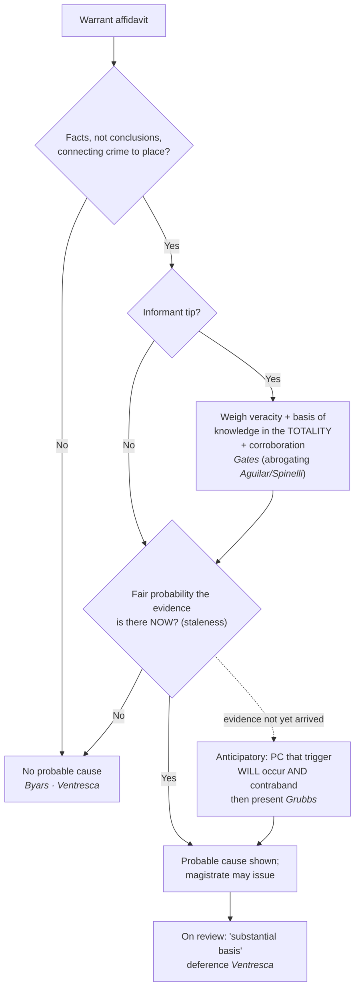

# Probable Cause in the Affidavit

*This page is about the **showing** a warrant affidavit must make. For the quantum of probable cause itself, see [[Probable Cause]]; for attacks on a false affidavit, see [[Franks Challenges]].*

> [!rule] Black-letter rule
> **A search warrant issues only on probable cause, and probable cause is judged on the four corners of the sworn affidavit.** The magistrate makes "a practical, common-sense decision whether, given all the circumstances set forth in the affidavit," there is a **fair probability** that evidence of a crime will be found in the place described, weighing the **veracity** and **basis of knowledge** of any informant under the **totality of the circumstances**. *[[Illinois v. Gates#^pin-238a|Illinois v. Gates]]*, 462 U.S. 213, 238 (1983). On review the affidavit gets a **deferential** look: a court does not decide probable cause anew but asks only whether the magistrate had a **"substantial basis"** for the finding, reading the affidavit "in a commonsense and realistic fashion," not hypertechnically. *[[United States v. Ventresca|United States v. Ventresca]]*, 380 U.S. 102, 108–09 (1965).
> ^rule-pc-affidavit

## The Brief

**Field-decisive question: does my affidavit, on its own words, show a fair probability that evidence of this crime is in this place?** Probable cause for a warrant is decided by the magistrate from the sworn affidavit, so the affidavit has to carry the whole load. The governing test is *[[Illinois v. Gates|Gates]]*: "The task of the issuing magistrate is simply to make a practical, common-sense decision whether, given all the circumstances set forth in the affidavit before him, including the 'veracity' and 'basis of knowledge' of persons supplying hearsay information, there is a fair probability that contraband or evidence of a crime will be found in a particular place." *[[Illinois v. Gates#^pin-238a|Gates]]*, 462 U.S. at 238. This is the same quantum treated at [[Probable Cause]]; the point here is that it must appear **inside the affidavit**.

**Totality replaced the rigid two-prong test.** Before 1983 an informant's tip was measured by the two independent prongs of *[[Aguilar v. Texas#^pin-114|Aguilar v. Texas]]*, 378 U.S. 108 (1964), sharpened in *[[Spinelli v. United States#^pin-415|Spinelli v. United States]]*, 393 U.S. 410 (1969): the affidavit had to show both the informant's **basis of knowledge** (how he knew) and his **veracity or reliability** (why to believe him), each satisfied on its own. *[[Illinois v. Gates|Gates]]* **abandoned** that rigid structure, keeping the two prongs as "relevant considerations in the totality-of-the-circumstances analysis," not as separate hurdles, so a strong showing on one can compensate for a weaker showing on the other, and independent **police corroboration** of an informant's predictive detail can supply what the tip lacks. *[[Illinois v. Gates|Gates]]*, 462 U.S. at 233. Treat the *[[Aguilar v. Texas|Aguilar]]*/*[[Spinelli v. United States|Spinelli]]* prongs as the checklist of what still makes a tip persuasive, not as a test that must be passed prong-by-prong.

**Some sources carry their own credibility.** A statement **against the informant's penal interest** is itself a reason to credit him: "Admissions of crime, like admissions against proprietary interests, carry their own indicia of credibility — sufficient at least to support a finding of probable cause to search." *[[United States v. Harris (1971)|United States v. Harris]]*, 403 U.S. 573, 583 (1971). The affidavit should still lay out the underlying facts; a **bare, conclusory** affidavit that states only the affiant's belief has never been enough. *[[Byars v. United States|Byars v. United States]]*, 273 U.S. 28 (1927); see *[[United States v. Ventresca|Ventresca]]*, 380 U.S. at 108–09 (a "purely conclusory" affidavit fails, while detailed circumstances plus a stated reason for crediting the source do not).

**Deference is the field's friend, so draft for the warrant.** Affidavits "must be tested and interpreted by magistrates and courts in a commonsense and realistic fashion," because "[t]hey are normally drafted by nonlawyers in the midst and haste of a criminal investigation." *[[United States v. Ventresca|Ventresca]]*, 380 U.S. at 108. A reviewing court gives the magistrate's finding **great deference** and asks only whether there was a "substantial basis for . . . concluding" that probable cause existed, and "the resolution of doubtful or marginal cases in this area should be largely determined by the preference to be accorded to warrants." *Id.* at 109. That preference is exactly why a warrant, imperfect as the affidavit may be, is the safer path than acting on the same facts without one.

**Anticipatory warrants: probable cause on a double finding.** A warrant may issue before the evidence has arrived, keyed to a future **triggering condition** (typically a controlled delivery that is accepted and taken inside). It is valid so long as the magistrate finds it presently probable **both** that the triggering condition will occur **and** that, once it does, contraband will be at the place to be searched. "Anticipatory warrants are . . . no different in principle from ordinary warrants. They require the magistrate to determine (1) that it is *now probable* that (2) contraband, evidence of a crime, or a fugitive *will be* on the described premises (3) when the warrant is executed." *[[United States v. Grubbs#^pin-96|United States v. Grubbs]]*, 547 U.S. 90, 96 (2006). The triggering condition is part of the probable-cause showing in the affidavit; it "need [not] be set forth in the warrant itself." *Id.* at 99.

**Staleness: probable cause is a snapshot that decays.** The affidavit must show that the evidence is **probably there now**, not that it was there once. Information grows stale with time, but there is no fixed clock: staleness turns on the nature of the crime, the item sought, and whether the activity is ongoing. Continuing conduct such as an ongoing drug operation or a collection of images stays fresh far longer than a single, disposable transaction. State the dates in the affidavit and tie them to a present probability.

**Burden and standard of review.** A warrant carries a **presumption of validity**, and the challenger bears the burden of overcoming it. On appeal the magistrate's probable-cause finding gets the deferential **"substantial basis"** look (*[[Illinois v. Gates|Gates]]*); historical facts are reviewed for [[Common Legal Terms#clear-error|clear error]] and the ultimate legal questions [[Common Legal Terms#de-novo|de novo]]. Because a warrant application is judged on what the affidavit says, evidence outside its four corners generally cannot prop up a thin affidavit after the fact.

**Apply it.** Building or reading a warrant affidavit:

1. **Name the crime and the place**, and state facts, not conclusions, connecting the two.
2. **For each informant**, put both prongs on the page: how he knows (basis of knowledge) and why to believe him (veracity, whether from a track record, a statement against penal interest, or corroboration).
3. **Corroborate** the tip's predictive detail with independent police work, and say so.
4. **Date everything**, and tie the facts to a present probability that the evidence is there **now**.
5. **If the evidence has not arrived yet**, draft it as an anticipatory warrant: state the triggering condition and the facts making both its occurrence and the resulting presence of contraband presently probable.

**Common pitfalls.**

- **Writing a conclusory affidavit.** "I have probable cause to believe" is not probable cause; the magistrate needs the underlying facts (*[[Byars v. United States|Byars]]*; *[[United States v. Ventresca|Ventresca]]*).
- **Treating the *[[Aguilar v. Texas|Aguilar]]*/*[[Spinelli v. United States|Spinelli]]* prongs as a pass/fail gate.** After *[[Illinois v. Gates|Gates]]* they are weighed in the totality; a shortfall on one can be made up by the other or by corroboration.
- **Letting the information go stale.** Old facts do not show present probability; date the affidavit and match the staleness window to the crime.
- **Assuming an anticipatory warrant is suspect.** It is valid on the *[[United States v. Grubbs|Grubbs]]* double finding; the triggering condition belongs in the affidavit, and need not appear on the warrant's face.

## Key cases

| Case | Holding | Opinion |
|---|---|---|
| *[[United States v. Ventresca]]*, 380 U.S. 102 (1965) | **Deferential review.** Affidavits are read commonsensically, not hypertechnically; the magistrate's finding gets "substantial basis" deference, and doubtful cases favor the warrant. | [opinion](https://www.courtlistener.com/opinion/106990/united-states-v-ventresca/) |
| *[[United States v. Grubbs]]*, 547 U.S. 90 (2006) | **Anticipatory warrants.** Valid where the magistrate finds it presently probable both that the triggering condition will occur and that contraband will then be present; the condition need not be on the warrant's face. | [opinion](https://www.courtlistener.com/opinion/145670/united-states-v-grubbs/) |

## Related cases across doctrines

These cases are treated in full on other pages but supply the affidavit's probable-cause showing, framed here for it.

| Case | Relevance here | Primary home | Opinion |
|---|---|---|---|
| *[[Illinois v. Gates]]*, 462 U.S. 213 (1983) | ***The test.*** Probable cause is a "fair probability" judged on the totality of the affidavit, weighing an informant's veracity and basis of knowledge; corroboration can cure a weak tip. | [[Probable Cause]] | [opinion](https://www.courtlistener.com/opinion/110959/illinois-v-gates/) |
| *[[Aguilar v. Texas]]*, 378 U.S. 108 (1964) | ***Two-prong origin.*** An informant affidavit had to show basis of knowledge and veracity; the rigid version was abrogated by *[[Illinois v. Gates|Gates]]*, but the prongs survive as totality factors. | [[Probable Cause]] | [opinion](https://www.courtlistener.com/opinion/106865/aguilar-v-texas/) |
| *[[Spinelli v. United States]]*, 393 U.S. 410 (1969) | ***Two-prong refinement.*** Sharpened *[[Aguilar v. Texas|Aguilar]]* on how corroboration counts; the historical backbone of the affidavit inquiry, abrogated by *[[Illinois v. Gates|Gates]]*. | [[Probable Cause]] | [opinion](https://www.courtlistener.com/opinion/107831/spinelli-v-united-states/) |
| *[[United States v. Harris (1971)]]*, 403 U.S. 573 (1971) | ***Self-verifying tip.*** A statement against the informant's penal interest carries its own indicia of credibility supporting probable cause. | [[Probable Cause]] | [opinion](https://www.courtlistener.com/opinion/108379/united-states-v-harris/) |
| *[[Byars v. United States]]*, 273 U.S. 28 (1927) | ***Bare affidavit.*** A conclusory affidavit stating only the affiant's belief cannot support a warrant; the underlying facts must appear. | [[The Exclusionary Rule]] | [opinion](https://www.courtlistener.com/opinion/100980/byars-v-united-states/) |

## Visual

## Sources

- [*Illinois v. Gates*, 462 U.S. 213 (1983)](https://www.courtlistener.com/opinion/110959/illinois-v-gates/) (pinpoints: 233, 238)
- [*United States v. Ventresca*, 380 U.S. 102 (1965)](https://www.courtlistener.com/opinion/106990/united-states-v-ventresca/) (pinpoints: 106, 108, 109)
- [*United States v. Grubbs*, 547 U.S. 90 (2006)](https://www.courtlistener.com/opinion/145670/united-states-v-grubbs/) (pinpoints: 96, 99)
- [*Aguilar v. Texas*, 378 U.S. 108 (1964)](https://www.courtlistener.com/opinion/106865/aguilar-v-texas/) (pinpoint: 114)
- [*Spinelli v. United States*, 393 U.S. 410 (1969)](https://www.courtlistener.com/opinion/107831/spinelli-v-united-states/) (pinpoints: 415, 418)
- [*United States v. Harris*, 403 U.S. 573 (1971)](https://www.courtlistener.com/opinion/108379/united-states-v-harris/) (pinpoint: 583)
- [*Byars v. United States*, 273 U.S. 28 (1927)](https://www.courtlistener.com/opinion/100980/byars-v-united-states/) (pinpoint: 29)
