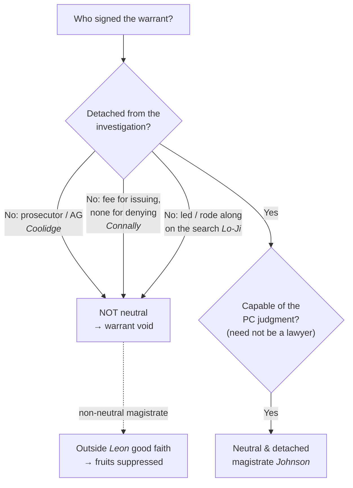

# The Neutral & Detached Magistrate

*This page is about **who** may issue a warrant. For what the affidavit must show, see [[Probable Cause in the Affidavit]]; for the good-faith consequence when a non-neutral magistrate signs, see [[Franks Challenges]] and [[The Exclusionary Rule]].*

> [!rule] Black-letter rule
> **The probable-cause inference must be drawn by a neutral and detached magistrate, not by the officer hunting the evidence.** The Fourth Amendment's protection "consists in requiring that those inferences be drawn by a neutral and detached magistrate instead of being judged by the officer engaged in the often competitive enterprise of ferreting out crime." *[[Johnson v. United States#^pin-13|Johnson v. United States]]*, 333 U.S. 10, [13–14](https://www.courtlistener.com/opinion/104504/johnson-v-united-states/) (1948). The issuer loses that status two ways: by **joining the operation** (leading or riding along on the search — *[[Lo-Ji Sales, Inc. v. New York#^pin-327|Lo-Ji Sales]]*), or by **having a stake** in the outcome (a prosecutor, or a magistrate paid a fee for issuing but nothing for denying — *[[Connally v. Georgia|Connally]]*, *[[Coolidge v. New Hampshire|Coolidge]]*). The issuer need not be a lawyer or a judge, but must be neutral and capable of the probable-cause judgment.
> ^rule-neutral-magistrate

## The Brief

**Field-decisive question: is the person signing this warrant genuinely detached from the investigation?** The whole point of the warrant process is to move the probable-cause judgment out of the hands of the officer and into the hands of someone with no stake in the hunt. As *[[Johnson v. United States|Johnson]]* put it, the Amendment "does not deny law enforcement the support of the usual inferences which reasonable men draw from evidence[;] [i]ts protection consists in requiring that those inferences be drawn by a neutral and detached magistrate instead of being judged by the officer engaged in the often competitive enterprise of ferreting out crime." *[[Johnson v. United States#^pin-13|Johnson v. United States]]*, 333 U.S. 10, [13–14](https://www.courtlistener.com/opinion/104504/johnson-v-united-states/) (1948). Strip away neutrality and the warrant is worth no more than the officer's own say-so.

**Failure mode one: the magistrate joins the search.** A judge who leaves the bench to run the operation has stopped being a magistrate. In *[[Lo-Ji Sales, Inc. v. New York|Lo-Ji]]* the town justice issued an open-ended warrant, then personally led officers through an adult bookstore deciding item-by-item what to seize: he "did not manifest that neutrality and detachment demanded of a judicial officer," and instead "allowed himself to become a member, if not the leader, of the search party . . . he was not acting as a judicial officer but as an adjunct law enforcement officer." *[[Lo-Ji Sales, Inc. v. New York#^pin-327|Lo-Ji Sales, Inc. v. New York]]*, 442 U.S. 319, [326–27](https://www.courtlistener.com/opinion/110100/lo-ji-sales-inc-v-new-york/) (1979). The lesson runs the other way too: the officer must not let the issuing judge ride along and make the seizure calls in the field.

**Failure mode two: the magistrate has a stake.** Neutrality fails when the issuer stands to gain from saying yes. Two clear cases mark the line. A **prosecutor** cannot issue: a warrant "signed by the State Attorney General," the State's chief investigator and prosecutor, is invalid because he is "not the neutral and detached magistrate" the Constitution requires. *[[Coolidge v. New Hampshire|Coolidge v. New Hampshire]]*, 403 U.S. 443 (1971). And a **financial** stake disqualifies: an unsalaried justice of the peace paid a fee for issuing a warrant but nothing for denying one has "a direct, personal, substantial, pecuniary interest" in the outcome, so his issuance "effected a violation" of the Fourth and Fourteenth Amendments. *[[Connally v. Georgia|Connally v. Georgia]]*, 429 U.S. 245, [250–51](https://www.courtlistener.com/opinion/109572/connally-v-georgia/) (1977). The test is not corruption in fact but the structural temptation: an interest "[that] might lead him not to hold the balance nice, clear and true between the State and the accused." *Id.* at 250.

**What neutrality does not require.** The issuer need not be a lawyer or a judge. What matters is that the person is severed from the investigation and able to make the probable-cause determination; a court clerk or other non-lawyer officer can qualify so long as neutrality and capability are present. The requirement is detachment, not a law degree.

**Burden, standard of review, and remedy.** A duly issued warrant is presumed valid, and the challenger must show the disqualifying interest or conduct. Whether the issuer was neutral and detached is a legal question reviewed [[Common Legal Terms#de-novo|de novo]] on the historical facts. The remedy is the important twist: a warrant issued by a non-neutral magistrate is void, and (unlike a facially close call) it is **outside** the [[The Good-Faith Exception|good-faith exception]], because "the issuing magistrate wholly abandoned his judicial role" is one of *[[United States v. Leon|Leon]]*'s own exceptions. *See* [[Franks Challenges]]; [[The Exclusionary Rule]]. You cannot save the evidence by pointing to reasonable reliance on a magistrate who was never acting as one.

**Common pitfalls.**

- **Acting as your own magistrate.** Drawing the probable-cause inference yourself defeats the entire purpose of the warrant (*[[Johnson v. United States|Johnson]]*).
- **Letting the issuing judge run the search.** A magistrate who joins the operation becomes "an adjunct law enforcement officer," and the warrant collapses into a general one (*[[Lo-Ji Sales, Inc. v. New York|Lo-Ji]]*).
- **Overlooking a stake.** A prosecutor (*[[Coolidge v. New Hampshire|Coolidge]]*) or a fee-paid, deny-nothing magistrate (*[[Connally v. Georgia|Connally]]*) is not neutral, however honest.
- **Assuming good faith will rescue it.** Reliance on a non-neutral magistrate is one of the express floors of *[[United States v. Leon|Leon]]* good faith; the evidence is not saved.

## Key cases

| Case | Holding | Opinion |
|---|---|---|
| *[[Johnson v. United States]]*, 333 U.S. 10 (1948) | **Anchor.** The probable-cause inference must be drawn by a neutral and detached magistrate, not the officer "engaged in the often competitive enterprise of ferreting out crime." | [opinion](https://www.courtlistener.com/opinion/104504/johnson-v-united-states/) |
| *[[Lo-Ji Sales, Inc. v. New York]]*, 442 U.S. 319 (1979) | **Joining the search.** A magistrate who leads officers through a store deciding what to seize is "an adjunct law enforcement officer," and the open-ended warrant is a forbidden general warrant. | [opinion](https://www.courtlistener.com/opinion/110100/lo-ji-sales-inc-v-new-york/) |
| *[[Connally v. Georgia]]*, 429 U.S. 245 (1977) | **Financial stake.** A magistrate paid a fee for issuing but nothing for denying a warrant has a direct pecuniary interest and is not neutral and detached. | [opinion](https://www.courtlistener.com/opinion/109572/connally-v-georgia/) |

## Related cases across doctrines

These cases are treated in full elsewhere but bear on who may issue a warrant, framed here for this doctrine.

| Case | Relevance here | Primary home | Opinion |
|---|---|---|---|
| *[[Coolidge v. New Hampshire]]*, 403 U.S. 443 (1971) | ***Prosecutor as magistrate.*** A warrant signed by the State Attorney General, the chief investigator and prosecutor, is invalid: he is not a neutral and detached magistrate. | [[Plain View & Plain Feel]] | [opinion](https://www.courtlistener.com/opinion/108377/coolidge-v-new-hampshire/) |
| *[[United States v. Leon]]*, 468 U.S. 897 (1984) | ***Good-faith floor.*** Reliance on a warrant is not objectively reasonable where the issuing magistrate "wholly abandoned his judicial role," so a non-neutral magistrate is outside good faith. | [[The Exclusionary Rule]] | [opinion](https://www.courtlistener.com/opinion/111262/united-states-v-leon/) |

## Visual

## Sources

- [*Johnson v. United States*, 333 U.S. 10 (1948)](https://www.courtlistener.com/opinion/104504/johnson-v-united-states/) (pinpoints: 13–14)
- [*Lo-Ji Sales, Inc. v. New York*, 442 U.S. 319 (1979)](https://www.courtlistener.com/opinion/110100/lo-ji-sales-inc-v-new-york/) (pinpoints: 326, 327)
- [*Connally v. Georgia*, 429 U.S. 245 (1977)](https://www.courtlistener.com/opinion/109572/connally-v-georgia/) (pinpoints: 250, 251)
- [*Coolidge v. New Hampshire*, 403 U.S. 443 (1971)](https://www.courtlistener.com/opinion/108377/coolidge-v-new-hampshire/)
- [*United States v. Leon*, 468 U.S. 897 (1984)](https://www.courtlistener.com/opinion/111262/united-states-v-leon/) (pinpoint: 923)
