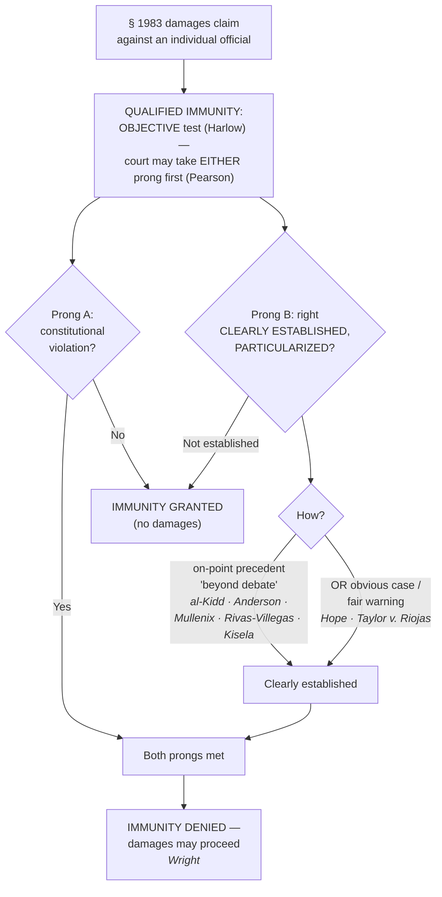

# Qualified Immunity

*Even if the conduct was unconstitutional, was the right so clearly established that every reasonable officer would have known it?*

> [!rule] Black-letter rule
> **Qualified immunity** shields a government official sued for **damages** unless the conduct **violated a clearly established statutory or constitutional right of which a reasonable person would have known**. The test is **objective** (the officer's good faith is irrelevant), and it has **two prongs** — (1) a **violation** of a right, and (2) that the right was **clearly established** — which a court may take in **either order**. "Clearly established" means **existing precedent placed the question "beyond debate"**, defined at a **high degree of specificity**, not as a broad principle. *[[Harlow v. Fitzgerald|Harlow v. Fitzgerald]]*, 457 U.S. 800 (1982); *[[Pearson v. Callahan|Pearson v. Callahan]]*, 555 U.S. 223 (2009); *[[Ashcroft v. al-Kidd|Ashcroft v. al-Kidd]]*, 563 U.S. 731 (2011).
> ^rule-qualified-immunity

## The Brief

**What qualified immunity is.** Qualified immunity is the individual officer's **shield** against § 1983 **damages** (see [[Section 1983 Liability and Qualified Immunity]]). It is an **immunity from suit**, not merely a defense to liability, so a denial that turns on a legal question is **immediately appealable**. It decides nothing about suppression (that is [[The Exclusionary Rule]]) and nothing about what the Constitution requires on the merits; it asks only whether **this officer** can be made to pay.

**The objective standard — *[[Harlow v. Fitzgerald|Harlow]]* killed the good-faith inquiry.** Officials "are shielded from liability for civil damages insofar as their conduct does not violate clearly established statutory or constitutional rights of which a reasonable person would have known." *[[Harlow v. Fitzgerald|Harlow]]*, 457 U.S. at [818](https://www.courtlistener.com/opinion/110763/harlow-v-fitzgerald/). *[[Harlow v. Fitzgerald|Harlow]]* **abandoned the subjective good-faith/malice prong**: the question is not whether the officer meant well, but whether the **law was clearly established at the time**. A well-meaning officer who crosses a clearly established line loses immunity; a malicious officer whose conduct violated no clearly established right keeps it.

**The two prongs, in either order (*[[Pearson v. Callahan|Pearson]]*).** Immunity turns on two questions: (a) did the conduct **violate a constitutional right**, and (b) was that right **clearly established**? *[[Saucier v. Katz|Saucier v. Katz]]*, 533 U.S. 194 (2001), once made the sequence mandatory. *[[Pearson v. Callahan|Pearson]]* made it **discretionary**: "while the sequence set forth there is often appropriate, it should no longer be regarded as mandatory." *[[Pearson v. Callahan|Pearson]]*, 555 U.S. at [236](https://www.courtlistener.com/opinion/145918/pearson-v-callahan/). A court may grant immunity on "not clearly established" **without deciding** whether a right was violated — a practice critics say freezes the law by never announcing the underlying rule.

**"Clearly established" is particularized: the heart of modern QI.** A right is clearly established only where "existing precedent [has] placed the ... question beyond debate." *[[Ashcroft v. al-Kidd|al-Kidd]]*, 563 U.S. at [741](https://www.courtlistener.com/opinion/7344719/ashcroft-v-al-kidd/). The inquiry is **particularized to the facts**: *[[Anderson v. Creighton|Anderson v. Creighton]]*, 483 U.S. 635 (1987), fixed the frame — the **contours** of the right must be specific enough that a reasonable officer understood **what he was doing** violated it, so the question is never "was there a Fourth Amendment right" in the abstract but whether **this conduct** was clearly unlawful. The dispositive question is "whether the violative nature of **particular conduct** is clearly established," *[[Mullenix v. Luna|Mullenix v. Luna]]*, [577 U.S. 7](https://www.courtlistener.com/opinion/3153112/mullenix-v-luna/) (2015) (per curiam), "in light of the specific context of the case, not as a broad general proposition." The plaintiff must **identify a case** that put the officer on notice that his **specific conduct** was unlawful. *[[Rivas-Villegas v. Cortesluna|Rivas-Villegas v. Cortesluna]]*, 595 U.S. 1 (2021) (per curiam). Courts are "repeatedly told ... not to define clearly established law at too high a level of generality," and immunity protects "all but the plainly incompetent or those who knowingly violate the law." *[[City of Tahlequah v. Bond|City of Tahlequah v. Bond]]*, 595 U.S. 9 (2021) (per curiam) (quoting *[[District of Columbia v. Wesby|Wesby]]*, 583 U.S. 48 (2018), quoting *[[Malley v. Briggs|Malley]]*, 475 U.S. at [341](https://www.courtlistener.com/opinion/111611/malley-v-briggs/)).

**Strictest of all in the force setting.** Because *[[Graham v. Connor|Graham]]* and *[[Tennessee v. Garner|Garner]]* are "cast at a high level of generality," they "do not by themselves create clearly established law outside an 'obvious case.'" *[[White v. Pauly|White v. Pauly]]*, 580 U.S. 73 (2017) (per curiam). Officers keep immunity "unless existing precedent 'squarely governs' the specific facts at issue," and fact-specific shootings fall in the "hazy border between excessive and acceptable force." *[[Kisela v. Hughes|Kisela v. Hughes]]*, 584 U.S. 100 (2018) (per curiam); *[[Brosseau v. Haugen|Brosseau v. Haugen]]*, 543 U.S. 194 (2004) (per curiam). This is why so many excessive-force claims are lost at the **second** prong even when the force may have been unreasonable (see [[Use of Force]]).

**The counterweight — the "obvious case" needs no precedent on point.** A right can be clearly established **without a case on all fours**: "officials can still be on notice that their conduct violates established law even in novel factual circumstances." *[[Hope v. Pelzer|Hope v. Pelzer]]*, 536 U.S. 730, [741](https://www.courtlistener.com/opinion/121169/hope-v-pelzer/) (2002). The Court revived that route in *[[Taylor v. Riojas|Taylor v. Riojas]]*, 592 U.S. 7 (2020) (per curiam), **denying immunity without a case on point** because any reasonable officer should have realized that confining an inmate for days in shockingly unsanitary cells was unconstitutional. Read the lines together: **particularized precedent *or* an obvious case defeats immunity.**

**Qualified immunity in the warrant setting.** Applying for a warrant earns **qualified, not absolute, immunity**, lost only where "no reasonably competent officer would have concluded that a warrant should issue." *[[Malley v. Briggs|Malley v. Briggs]]*, 475 U.S. 335, [341](https://www.courtlistener.com/opinion/111611/malley-v-briggs/) (1986). The magistrate's approval is strong but not conclusive, yet "the threshold for establishing this exception is a high one." *[[Messerschmidt v. Millender|Messerschmidt v. Millender]]*, [565 U.S. 535](https://www.courtlistener.com/opinion/623242/messerschmidt-v-millender/) (2012). Bringing **media into a home** during a warrant's execution violates the Fourth Amendment, but the officers had immunity because in 1992 the right was not clearly established. *[[Wilson v. Layne|Wilson v. Layne]]*, 526 U.S. 603 (1999); *[[Hanlon v. Berger|Hanlon v. Berger]]*, 526 U.S. 808 (1999).

**The doctrine under internal criticism.** Individual Justices have questioned qualified immunity from opposite directions in **statements respecting the denial of [[Reading and Citing Cases#certiorari-cert|certiorari]]** (not holdings, but signals worth knowing). *Baxter v. Bracey* drew a statement questioning whether the modern doctrine has any grounding in the 1871 statute; *Cope v. Cogdill* and *Johnson v. Prentice* drew statements protesting immunity grants on egregious facts. The Court itself, however, continues to enforce the high-specificity rule and to **summarily reverse** circuits that frame the right too generally — most recently in *Zorn v. Linton* (2026) (per curiam), reversing a qualified-immunity denial where circuit precedent had not clearly established the specific conduct's unlawfulness. The teaching point is stable even as the debate continues: **plead and prove particularized, on-point precedent.**

**Burden, standard of review, and remedy.** Qualified immunity is an **[[Common Legal Terms#affirmative-defense|affirmative defense]]** the official pleads; once raised, the **plaintiff** bears the burden of showing the right was **clearly established**. Its application is a **question of law**, reviewed **[[Common Legal Terms#de-novo|de novo]]**, and (because it is an **immunity from suit**) a denial resting on a legal question is **immediately appealable** by interlocutory appeal. The consequence of a grant is simple: **no damages** against that official (the constitutional merits may still be decided, or left open). **Municipalities have no qualified immunity** (*[[Owen v. City of Independence|Owen]]*, on [[Section 1983 Liability and Qualified Immunity]]); **prosecutors, judges, and witnesses** get **absolute** immunity for their protected functions (see [[Absolute Immunity]]); and the federal-officer analog, with *[[Bivens v. Six Unknown Named Agents|Bivens]]* now all but closed, lives on [[Suing Federal Officers]].

**Apply it.** For the individual officer, work the two prongs:
1. **Prong A — was a constitutional right violated** on the plaintiff's version of the facts? (A court may skip to Prong B under *[[Pearson v. Callahan|Pearson]]*.)
2. **Prong B — was the right clearly established** at the time, **particularized** to this conduct? Identify a **prior case** (binding precedent, or a robust consensus of persuasive authority) that put a reasonable officer on notice that **this specific conduct** was unlawful (*[[Ashcroft v. al-Kidd|al-Kidd]]*; *[[Mullenix v. Luna|Mullenix]]*; *[[Rivas-Villegas v. Cortesluna|Rivas-Villegas]]*).
3. **Or invoke the obvious case** — some conduct is so plainly unlawful that no prior case is needed (*[[Hope v. Pelzer|Hope]]*; *[[Taylor v. Riojas|Taylor]]*).
4. **Do not argue at the wrong altitude.** "Freedom from excessive force" is too general; "shooting a non-threatening, non-fleeing suspect" is the level that governs.
5. **Separate immunity from the merits.** Even a found violation is not payable if the right was not clearly established — and immunity never touches suppression.

**Common pitfalls.**
- **Defining the right too generally.** Vague rights rarely overcome immunity; precedent must be **particularized** and "beyond debate" (*[[Ashcroft v. al-Kidd|al-Kidd]]*; *[[Mullenix v. Luna|Mullenix]]*; *[[City of Tahlequah v. Bond|Tahlequah]]*).
- **Assuming *any* precedent suffices — or that *only* an identical case does.** Both extremes are wrong: precedent must be particularized, **but** an obvious case needs none (*[[Hope v. Pelzer|Hope]]*; *[[Taylor v. Riojas|Taylor]]*).
- **Relying on subjective intent.** *[[Harlow v. Fitzgerald|Harlow]]* made it **objective**; a good motive does not save clearly unlawful conduct, and a bad motive does not defeat immunity where the right was not clearly established.
- **Confusing qualified immunity with the *[[United States v. Leon|Leon]]* [[The Good-Faith Exception|good-faith exception]].** Immunity is a **civil** defense to **damages**; *[[The Good-Faith Exception|Leon]]* good faith is a **criminal-side** suppression doctrine.
- **Thinking immunity affects suppression.** It never decides whether evidence comes in or out — only civil damages.
- **Forgetting the municipality and the absolute-immunity actors.** Cities have **no** qualified immunity (*[[Owen v. City of Independence|Owen]]*); prosecutors and witnesses may have **absolute** immunity (see [[Absolute Immunity]]).

## Lower-court developments

The Supreme Court supplies the specificity rule; the circuits do the day-to-day line-drawing, and the modern battleground is the **wrong-house / wrong-target raid**, where courts divide over whether *[[Maryland v. Garrison|Maryland v. Garrison]]*'s duty to identify the place to be searched clearly establishes a specific address-verification duty. Each decision below binds only in its own circuit.

- **[[Wright v. City of Euclid]] (6th Cir. 2020)** — *illustrative denial.* Reversed summary judgment and **denied** qualified immunity on excessive force and related claims: it was clearly established that "drawing a weapon on a suspect who was not fleeing or posing a safety risk and tasering a suspect who was not actively resisting arrest constituted excessive force." 962 F.3d 852, 868. The concrete-facts model of what **defeats** immunity. **Binding in-circuit — 6th Cir.** · good. [opinion](https://www.courtlistener.com/opinion/4762133/lamar-wright-v-city-of-euclid/)
- **[[Jimerson v. Lewis]] (5th Cir. 2024)** — *narrowing application / split.* A divided panel **granted** immunity to officers who raided the **wrong house**, reading *[[Maryland v. Garrison|Garrison]]* as only a "general principle" that did not clearly establish a specific duty to verify the address; the [[Common Legal Terms#dissenting-opinion|dissent]] read *[[Maryland v. Garrison|Garrison]]* plus circuit precedent to clearly establish it. A live **circuit divide** on the wrong-house-raid question; cert. denied. **Binding in-circuit — 5th Cir.** · good. [opinion](https://www.courtlistener.com/opinion/9471275/jimerson-v-lewis/)

## Key cases

| Case | Holding | Opinion |
|---|---|---|
| *[[Harlow v. Fitzgerald]]*, 457 U.S. 800 (1982) | **Anchor.** Reformulated immunity as a purely **objective** test; shielded unless conduct violated **clearly established** law a reasonable person would have known; abandoned the subjective good-faith prong. | [opinion](https://www.courtlistener.com/opinion/110763/harlow-v-fitzgerald/) |
| *[[Anderson v. Creighton]]*, 483 U.S. 635 (1987) | **[[Particularity]] frame.** The **contours** of the right must be sufficiently clear that a reasonable officer understands his specific conduct is unlawful; clearly-established law is judged at a fact-specific level, not in the abstract. | [opinion](https://www.courtlistener.com/opinion/111953/anderson-v-creighton/) |
| *[[Saucier v. Katz]]*, 533 U.S. 194 (2001) | **Two-step (now optional).** Set the sequence (violation first, clearly-established second) later made **discretionary** by *[[Pearson v. Callahan\|Pearson]]*. | [opinion](https://www.courtlistener.com/opinion/118449/saucier-v-katz/) |
| *[[Pearson v. Callahan]]*, 555 U.S. 223 (2009) | **Refinement.** The *Saucier* sequence "should no longer be regarded as mandatory"; courts may decide either prong first. | [opinion](https://www.courtlistener.com/opinion/145918/pearson-v-callahan/) |
| *[[Ashcroft v. al-Kidd]]*, 563 U.S. 731 (2011) | **Standard.** "Clearly established" requires existing precedent placing the question **"beyond debate"**; subjective intent is irrelevant to Fourth Amendment reasonableness. | [opinion](https://www.courtlistener.com/opinion/217703/ashcroft-v-al-kidd/) |
| *[[Mullenix v. Luna]]*, 577 U.S. 7 (2015) | **Standard.** Immunity turns on "whether the **violative nature of particular conduct** is clearly established"; particularized, not a broad proposition. | [opinion](https://www.courtlistener.com/opinion/3153112/mullenix-v-luna/) |
| *[[Rivas-Villegas v. Cortesluna]]*, 595 U.S. 1 (2021) | **Standard.** The plaintiff must **identify a case** that put the officer on notice his specific conduct was unlawful, judged in the specific context. | [opinion](https://www.courtlistener.com/opinion/5290447/rivas-villegas-v-cortesluna/) |
| *[[City of Tahlequah v. Bond]]*, 595 U.S. 9 (2021) | **Standard.** "Do not define clearly established law at too high a level of generality"; immunity protects "all but the plainly incompetent or those who knowingly violate the law." | [opinion](https://www.courtlistener.com/opinion/5290448/city-of-tahlequah-v-bond/) |
| *[[White v. Pauly]]*, 580 U.S. 73 (2017) | **Force-setting.** *[[Tennessee v. Garner\|Garner]]* and *[[Graham v. Connor\|Graham]]* "do not by themselves create clearly established law outside an 'obvious case'"; clearly-established law must be particularized to the facts. | [opinion](https://www.courtlistener.com/opinion/4374579/white-v-pauly/) |
| *[[Kisela v. Hughes]]*, 584 U.S. 100 (2018) | **Force-setting.** Officers keep immunity unless existing precedent **"squarely governs"** the specific facts; fact-specific shootings fall in the "hazy border." | [opinion](https://www.courtlistener.com/opinion/4482892/kisela-v-hughes/) |
| *[[Malley v. Briggs]]*, 475 U.S. 335 (1986) | **Warrant-setting.** A **warrant-applying** officer gets **qualified**, not absolute, immunity, lost only where no reasonably competent officer would have sought the warrant; source of the "plainly incompetent" formula. | [opinion](https://www.courtlistener.com/opinion/111611/malley-v-briggs/) |
| *[[Messerschmidt v. Millender]]*, 565 U.S. 535 (2012) | **Warrant-setting.** Officers retain immunity for a facially overbroad warrant where reliance on the magistrate's approval was objectively reasonable; the *[[Malley v. Briggs\|Malley]]* exception is a **high** threshold. | [opinion](https://www.courtlistener.com/opinion/623242/messerschmidt-v-millender/) |
| *[[Wilson v. Layne]]*, 526 U.S. 603 (1999) | **Warrant-setting.** Bringing **media into a home** during a warrant's execution violates the Fourth Amendment; but the officers had immunity (right not clearly established in 1992). | [opinion](https://www.courtlistener.com/opinion/118289/wilson-v-layne/) |
| *[[Hanlon v. Berger]]*, 526 U.S. 808 (1999) | **Warrant-setting.** Same-day companion to *[[Wilson v. Layne\|Wilson]]*: a media ride-along during a search warrant violated the Fourth Amendment, but the officers were entitled to immunity. | [opinion](https://www.courtlistener.com/opinion/1087699/hanlon-v-berger/) |
| *[[Hope v. Pelzer]]*, 536 U.S. 730 (2002) | **Counterweight.** A right can be clearly established **without a factually identical case**; in an "obvious case," officials have **fair warning** even in novel circumstances. | [opinion](https://www.courtlistener.com/opinion/121169/hope-v-pelzer/) |
| *[[Taylor v. Riojas]]*, 592 U.S. 7 (2020) | **Counterweight.** Revived the *[[Hope v. Pelzer\|Hope]]* route: immunity **denied without a case on point** where days in shockingly unsanitary cells were **obviously** unconstitutional. | [opinion](https://www.courtlistener.com/opinion/4802501/taylor-v-riojas/) |

## Related cases across doctrines

| Case | Relevance here | Primary home | Opinion |
|---|---|---|---|
| *[[District of Columbia v. Wesby]]*, 583 U.S. 48 (2018) | Restates the "settled law" / "beyond debate" standard and warns against high-generality framing. | [[Probable Cause]] | [opinion](https://www.courtlistener.com/opinion/4460854/district-of-columbia-v-wesby/) |
| *[[Ryburn v. Huff]]*, 565 U.S. 469 (2012) | A warrantless home entry on an objectively reasonable fear of imminent violence was reasonable; officers had immunity. | [[Emergency Aid]] | [opinion](https://www.courtlistener.com/opinion/622303/ryburn-v-huff/) |
| *[[Los Angeles County v. Rettele]]*, 550 U.S. 609 (2007) | Officers executing a valid warrant may briefly detain occupants (even unclothed) to secure the room; a recurring immunity setting. | [[Securing the Scene]] | [opinion](https://www.courtlistener.com/opinion/145728/los-angeles-county-california-v-rettele/) |
| *[[Safford Unified School District v. Redding]]*, 557 U.S. 364 (2009) | A student strip search was unreasonable, **but** officials had immunity because the right was not clearly established. | [[Special Needs and Administrative Searches]] | [opinion](https://www.courtlistener.com/opinion/145852/safford-unified-school-district-1-v-redding/) |

## Visual

## Sources
- *Harlow v. Fitzgerald*, 457 U.S. 800 (1982) (pinpoint 818) — https://www.courtlistener.com/opinion/110763/harlow-v-fitzgerald/
- *Anderson v. Creighton*, 483 U.S. 635 (1987) — https://www.courtlistener.com/opinion/111953/anderson-v-creighton/
- *Saucier v. Katz*, 533 U.S. 194 (2001) (pinpoint 201) — https://www.courtlistener.com/opinion/118449/saucier-v-katz/
- *Pearson v. Callahan*, 555 U.S. 223 (2009) (pinpoint 236) — https://www.courtlistener.com/opinion/145918/pearson-v-callahan/
- *Ashcroft v. al-Kidd*, 563 U.S. 731 (2011) (pinpoints 736, 741) — https://www.courtlistener.com/opinion/217703/ashcroft-v-al-kidd/
- *Mullenix v. Luna*, 577 U.S. 7 (2015) (per curiam) (pinpoint 12) — https://www.courtlistener.com/opinion/3153112/mullenix-v-luna/
- *Rivas-Villegas v. Cortesluna*, 595 U.S. 1 (2021) (per curiam) — https://www.courtlistener.com/opinion/5290447/rivas-villegas-v-cortesluna/
- *City of Tahlequah v. Bond*, 595 U.S. 9 (2021) (per curiam) — https://www.courtlistener.com/opinion/5290448/city-of-tahlequah-v-bond/
- *District of Columbia v. Wesby*, 583 U.S. 48 (2018) (pinpoint 63) — https://www.courtlistener.com/opinion/4460854/district-of-columbia-v-wesby/
- *White v. Pauly*, 580 U.S. 73 (2017) (per curiam) — https://www.courtlistener.com/opinion/4374579/white-v-pauly/
- *Kisela v. Hughes*, 584 U.S. 100 (2018) (per curiam) (138 S. Ct. at 1153) — https://www.courtlistener.com/opinion/4482892/kisela-v-hughes/
- *Malley v. Briggs*, 475 U.S. 335 (1986) (pinpoint 341) — https://www.courtlistener.com/opinion/111611/malley-v-briggs/
- *Messerschmidt v. Millender*, 565 U.S. 535 (2012) (pinpoint 547) — https://www.courtlistener.com/opinion/623242/messerschmidt-v-millender/
- *Wilson v. Layne*, 526 U.S. 603 (1999) (pinpoints 614–615) — https://www.courtlistener.com/opinion/118289/wilson-v-layne/
- *Hanlon v. Berger*, 526 U.S. 808 (1999) — https://www.courtlistener.com/opinion/1087699/hanlon-v-berger/
- *Hope v. Pelzer*, 536 U.S. 730 (2002) (pinpoint 741) — https://www.courtlistener.com/opinion/121169/hope-v-pelzer/
- *Taylor v. Riojas*, 592 U.S. 7 (2020) (per curiam) — https://www.courtlistener.com/opinion/4802501/taylor-v-riojas/
- *Brosseau v. Haugen*, 543 U.S. 194 (2004) (per curiam) — https://www.courtlistener.com/opinion/137736/brosseau-v-haugen/
- *Ryburn v. Huff*, 565 U.S. 469 (2012) (per curiam) — https://www.courtlistener.com/opinion/622303/ryburn-v-huff/
- *Los Angeles County v. Rettele*, 550 U.S. 609 (2007) (per curiam) — https://www.courtlistener.com/opinion/145728/los-angeles-county-california-v-rettele/
- *Safford Unified School District v. Redding*, 557 U.S. 364 (2009) — https://www.courtlistener.com/opinion/145852/safford-unified-school-district-1-v-redding/
- *Wright v. City of Euclid*, 962 F.3d 852 (6th Cir. 2020) (pinpoint 868) — https://www.courtlistener.com/opinion/4762133/lamar-wright-v-city-of-euclid/
- *Jimerson v. Lewis*, 116 F.4th 407 (5th Cir. 2024) — https://www.courtlistener.com/opinion/9471275/jimerson-v-lewis/
- *Zorn v. Linton*, No. 25-297 (U.S. 2026) (per curiam) (slip opinion; per-curiam summary reversal of a qualified-immunity denial (reaffirming the high-specificity rule)) — https://www.supremecourt.gov/opinions/25pdf/25-297_bqm2.pdf
