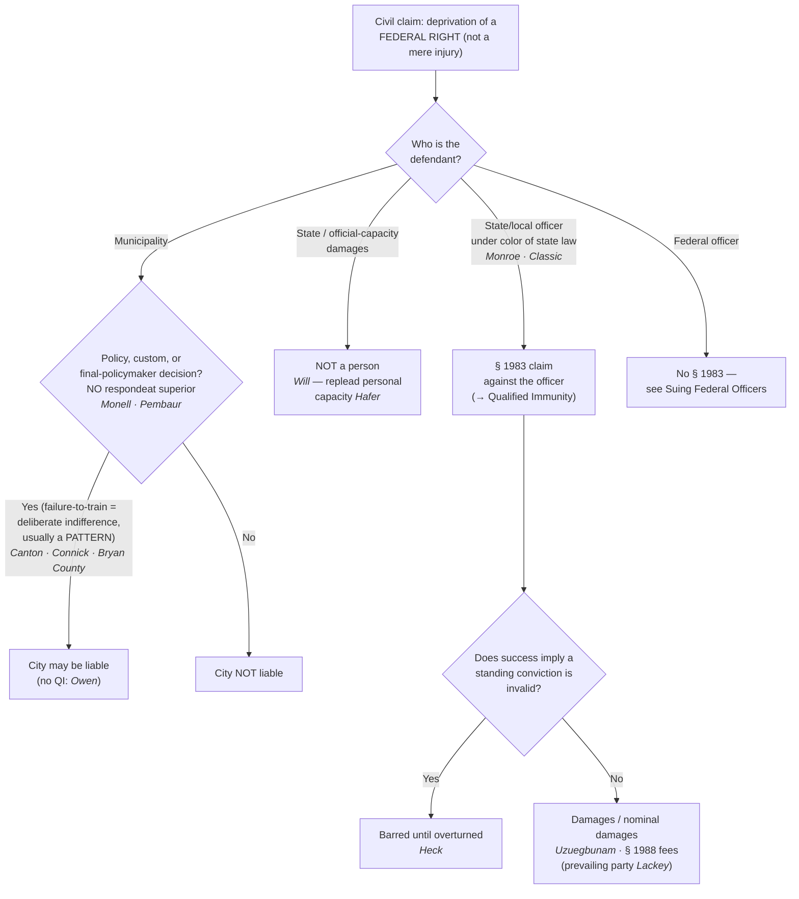

# Section 1983 & Municipal Liability

*Who can be sued for a constitutional violation under color of state law, and when is the government itself on the hook?*

> [!rule] Black-letter rule
> **42 U.S.C. § 1983** creates a civil action against any **person** who, **under color of** state law, deprives another of a **right secured by the Constitution or federal law**. Two elements: (1) conduct **under color of state law**, and (2) **deprivation of a federal right** (not a mere injury). A **municipality** is a "person" but is liable **only** where the deprivation is caused by its own official **policy or custom** — **never on [[Common Legal Terms#respondeat-superior|respondeat superior]]**. *[[Monroe v. Pape|Monroe v. Pape]]*, 365 U.S. 167 (1961); *[[Monell v. Department of Social Services|Monell v. Dep't of Soc. Servs.]]*, 436 U.S. 658 (1978).
> ^rule-section-1983

## The Brief

**What § 1983 is, and what it is not.** Section 1983 is the **engine of civil accountability** for constitutional violations by state and local officials. It creates no rights of its own; it supplies a **remedy** (damages or injunctive relief) for the deprivation of rights secured elsewhere. This page is about **who may be sued and when** the government entity answers. It is not about suppression (that is [[The Exclusionary Rule]]), not about the immunity defense the individual officer raises (that is [[Qualified Immunity]]), and not about suing a **federal** officer (that is [[Suing Federal Officers]]).

**The two elements: color of law and a federal right.** A § 1983 claim requires (1) a person acting **under color of** state law who (2) **deprives** the plaintiff of a **federal right**. "Under color of" reaches an officer's **misuse** of state-conferred authority even when the conduct violates state law, and no exhaustion of state remedies is required. *[[Monroe v. Pape|Monroe v. Pape]]*, 365 U.S. at [184](https://www.courtlistener.com/opinion/106170/monroe-v-pape/). The definition traces to *[[United States v. Classic|Classic]]*: "Misuse of power, possessed by virtue of state law and made possible only because the wrongdoer is clothed with the authority of state law, is action taken 'under color of' state law." *[[United States v. Classic|United States v. Classic]]*, [313 U.S. 299](https://www.courtlistener.com/opinion/103531/united-states-v-classic/) (1941). The badge is what makes an otherwise-private wrong actionable. Prevailing plaintiffs may recover **reasonable attorney's fees** in the court's discretion. 42 U.S.C. § 1988(b). The **criminal** analog is **18 U.S.C. § 242**, which punishes a **willful** (specific-intent) deprivation of rights under color of law; the steep willfulness burden is why § 242 charges are reserved for the most egregious cases. *[[Screws v. United States|Screws v. United States]]*, 325 U.S. 91 (1945) (construing "willfully").

**Section 1983 protects rights, not injuries — and not every constitutional-adjacent wrong is a claim.** A violation of the *[[Miranda v. Arizona|Miranda]]* prophylactic rules is **not itself** a constitutional violation and "does not provide a basis for a § 1983 claim." *[[Vega v. Tekoh|Vega v. Tekoh]]*, 597 U.S. 134 (2022). The Self-Incrimination Clause is a **trial right**: coercive questioning that produces no statement used against the suspect in a criminal case is not, by itself, a completed Fifth Amendment violation, so it cannot ground a self-incrimination claim. *[[Chavez v. Martinez|Chavez v. Martinez]]*, [538 U.S. 760](https://www.courtlistener.com/opinion/127927/chavez-v-martinez/) (2003) (plurality) (leaving open a separate substantive-due-process "shocks the conscience" theory).

**Who counts as a "person": the State does not, its officials in their personal capacity do.** A **State** (and a state official sued in an **official** capacity for damages) is **not** a "person" under § 1983. *[[Will v. Michigan Department of State Police|Will v. Michigan Dep't of State Police]]*, 491 U.S. 58 (1989). But the same official sued in a **personal** (individual) capacity **is** a person and may be held personally liable. *[[Hafer v. Melo|Hafer v. Melo]]*, 502 U.S. 21 (1991). The distinction is not a pleading formality: an official-capacity suit "is only another way of pleading an action against an entity of which an officer is an agent," so it runs against the government, while a personal-capacity suit seeks to impose liability on the individual. *Kentucky v. Graham*, 473 U.S. 159 (1985).

**Reaching the local government (*[[Monell v. Department of Social Services|Monell]]*): policy or custom, never [[Common Legal Terms#respondeat-superior|respondeat superior]].** Municipalities and local governing bodies are "persons," but are liable **only** for injuries inflicted by their own official **policy or custom**: "a municipality cannot be held liable under § 1983 on a *respondeat superior* theory." *[[Monell v. Department of Social Services|Monell]]*, 436 U.S. at [691](https://www.courtlistener.com/opinion/109881/monell-v-new-york-city-dept-of-social-servs/). Liability attaches only when "execution of a government's policy or custom" inflicts the injury. *[[Monell v. Department of Social Services|Monell]]*, 436 U.S. at [694](https://www.courtlistener.com/opinion/109881/monell-v-new-york-city-dept-of-social-servs/). Three routes reach the entity: an official **policy**; a widespread **custom**; or a **single decision by an official with final policymaking authority**. *[[Pembaur v. City of Cincinnati|Pembaur v. City of Cincinnati]]*, 475 U.S. 469, [483–484](https://www.courtlistener.com/opinion/111615/pembaur-v-city-of-cincinnati/) (1986). Because the wrong must be the municipality's own, the entity has **no [[Qualified Immunity|qualified immunity]]** — unlike the individual officer, a city cannot invoke good faith. *[[Owen v. City of Independence|Owen v. City of Independence]]*, 445 U.S. 622 (1980).

**The hardest municipal routes: failure-to-train and single-incident liability.**
- Inadequate training is a "policy" only where the failure amounts to **deliberate indifference** to the rights of those the police encounter. *[[City of Canton v. Harris|City of Canton v. Harris]]*, 489 U.S. 378, [388](https://www.courtlistener.com/opinion/112209/city-of-canton-v-harris/) (1989).
- And a **pattern** of similar violations is "ordinarily necessary" to prove that indifference: a single incident almost never suffices. *[[Connick v. Thompson|Connick v. Thompson]]*, 563 U.S. 51, [62](https://www.courtlistener.com/opinion/7343085/connick-v-thompson/) (2011) (a lone *[[Brady v. Maryland|Brady]]* nondisclosure did not support municipal liability — cross-reference [[Brady and Giglio]]).
- The Court has policed the "single hiring decision" theory just as strictly, requiring that the plaintiff show the specific injury was a **plainly obvious** consequence of the decision. *[[Board of County Commissioners of Bryan County v. Brown|Bd. of Cnty. Comm'rs of Bryan Cnty. v. Brown]]*, 520 U.S. 397 (1997).
- *[[Monell v. Department of Social Services|Monell]]* liability is real but genuinely hard to prove.

**Remedies and the *[[Heck v. Humphrey|Heck]]* bar.** A § 1983 plaintiff may recover **compensatory** and, against individuals, **punitive** damages; **injunctive and declaratory** relief; and **§ 1988(b) attorney's fees** as a **prevailing party**. A completed constitutional violation supports at least **nominal damages** even without proof of compensable harm, which keeps a live case from becoming moot. *[[Uzuegbunam v. Preczewski|Uzuegbunam v. Preczewski]]*, 592 U.S. 279 (2021). But a plaintiff who wins only a **preliminary injunction** and never a final judgment is **not** a "prevailing party" for fees. *[[Lackey v. Stinnie|Lackey v. Stinnie]]*, 604 U.S. 192 (2025). And a damages action that "would necessarily imply the invalidity of" a **standing conviction or sentence** is **not cognizable** until that conviction is set aside. *[[Heck v. Humphrey|Heck v. Humphrey]]*, 512 U.S. 477, [486–487](https://www.courtlistener.com/opinion/117864/heck-v-humphrey/) (1994). A defendant convicted on challenged evidence generally cannot pursue a parallel § 1983 suit attacking the same search while the conviction stands.

**Burden, standard of review, and remedy.** The **plaintiff** bears the burden on both elements. Whether a **defendant is a "person," whether conduct was under color of law,** and **whether a municipal policy caused the injury** are the litigated fronts; municipal liability turns on **causation** (the policy must be the "moving force"). Compensatory relief is measured by **actual injury** (a constitutional violation is not itself a damages measure). The § 1983 civil track sits alongside the **§ 242 criminal** track and, for **federal** officers, the *[[Bivens v. Six Unknown Named Agents|Bivens]]* and **FTCA** tracks on [[Suing Federal Officers]].

**Apply it.** Work the defendant and the theory in order:
1. **Who is the defendant?** A **state or local officer** → § 1983 against the individual (personal capacity, or official capacity for **injunctive** relief). A **State** or a state officer sued for **damages in official capacity** → **not a person** (*[[Will v. Michigan Department of State Police|Will]]*); replead in **personal capacity** if the individual is the target (*[[Hafer v. Melo|Hafer]]*). A **federal** officer → not § 1983 at all; see [[Suing Federal Officers]].
2. **Was a *federal right* actually deprived** — not merely an injury, and not a bare *[[Miranda v. Arizona|Miranda]]* lapse (*[[Vega v. Tekoh|Vega]]*)?
3. **If the target is the municipality**, identify a **policy, custom, or final-policymaker decision** (*[[Pembaur v. City of Cincinnati|Pembaur]]*); a **failure-to-train** theory needs **deliberate indifference**, ordinarily shown by a **pattern** (*[[City of Canton v. Harris|Canton]]*; *[[Connick v. Thompson|Connick]]*) — a lone bad act by one employee is not enough.
4. **Is a conviction in the way?** If success would necessarily imply its invalidity, *[[Heck v. Humphrey|Heck]]* bars the suit until the conviction is overturned.
5. **Separate the individual officer's immunity** — the **clearly-established** question lives on [[Qualified Immunity]], and it does not change what § 1983 or the Fourth Amendment requires.

**Common pitfalls.**
- **Suing the city as if [[Common Legal Terms#respondeat-superior|respondeat superior]] applied.** *[[Monell v. Department of Social Services|Monell]]* forecloses it: find a **policy, custom, or final-policymaker decision**, not merely a bad employee.
- **Treating one bad incident as failure-to-train.** *[[Connick v. Thompson|Connick]]* ordinarily requires a **pattern** to show deliberate indifference; a single incident almost never suffices.
- **Suing a State (or a state officer for official-capacity damages).** Neither is a "person" (*[[Will v. Michigan Department of State Police|Will]]*); the individual must be sued in **personal** capacity (*[[Hafer v. Melo|Hafer]]*).
- **Confusing § 1983 with a *[[Bivens v. Six Unknown Named Agents|Bivens]]* claim.** Section 1983 reaches **state and local** actors only; a **federal** officer requires *[[Bivens v. Six Unknown Named Agents|Bivens]]*, now nearly foreclosed (see [[Suing Federal Officers]]).
- **Filing a Miranda-only claim.** A *[[Miranda v. Arizona|Miranda]]* violation is not itself actionable under § 1983 (*[[Vega v. Tekoh|Vega]]*).
- **Attacking a standing conviction.** *[[Heck v. Humphrey|Heck]]* bars a suit whose success would necessarily imply the conviction's invalidity.
- **Assuming a preliminary-injunction win earns fees.** It does not without a final judgment (*[[Lackey v. Stinnie|Lackey]]*).
- **Treating § 1983 and § 242 as interchangeable.** Civil (damages, preponderance, no willfulness) versus criminal (prosecution, [[Common Legal Terms#beyond-a-reasonable-doubt|beyond a reasonable doubt]], a **willful** deprivation — *[[Screws v. United States|Screws]]*).

## Key cases

| Case | Holding | Opinion |
|---|---|---|
| *[[Monroe v. Pape]]*, 365 U.S. 167 (1961) | **Anchor.** "Under color of" law reaches an officer's **misuse** of state-conferred authority, even when it violates state law; no exhaustion of state remedies required. Its municipal-immunity holding was later overruled by *[[Monell v. Department of Social Services\|Monell]]*. | [opinion](https://www.courtlistener.com/opinion/106170/monroe-v-pape/) |
| *[[United States v. Classic]]*, 313 U.S. 299 (1941) | **Definition.** Misuse of power possessed by virtue of state law, made possible only because the actor is clothed with state authority, is action "under color of" state law. | [opinion](https://www.courtlistener.com/opinion/103531/united-states-v-classic/) |
| *[[Monell v. Department of Social Services]]*, 436 U.S. 658 (1978) | **Anchor.** Municipalities are § 1983 "persons," but liable **only** for injuries caused by an official **policy or custom**; **no [[Common Legal Terms#respondeat-superior\|respondeat superior]]**. | [opinion](https://www.courtlistener.com/opinion/109881/monell-v-new-york-city-dept-of-social-servs/) |
| *[[Pembaur v. City of Cincinnati]]*, 475 U.S. 469 (1986) | **Refinement.** A **single decision by an official with final policymaking authority** for the subject matter is an "official policy" that triggers *[[Monell v. Department of Social Services\|Monell]]* liability. | [opinion](https://www.courtlistener.com/opinion/111615/pembaur-v-city-of-cincinnati/) |
| *[[City of Canton v. Harris]]*, 489 U.S. 378 (1989) | **Refinement.** **Failure-to-train** grounds municipal liability **only** where the inadequacy amounts to **deliberate indifference** to the rights of those the police encounter. | [opinion](https://www.courtlistener.com/opinion/112209/city-of-canton-v-harris/) |
| *[[Connick v. Thompson]]*, 563 U.S. 51 (2011) | **Refinement.** A **pattern** of similar violations is "ordinarily necessary" to show deliberate indifference; a **single** *[[Brady v. Maryland\|Brady]]* nondisclosure does not support *[[Monell v. Department of Social Services\|Monell]]* liability. | [opinion](https://www.courtlistener.com/opinion/213505/connick-v-thompson/) |
| *[[Board of County Commissioners of Bryan County v. Brown]]*, 520 U.S. 397 (1997) | **Refinement.** A **single hiring decision** grounds municipal liability only where the specific injury was a **plainly obvious** consequence of the decision; a strict culpability-and-causation bar. | [opinion](https://www.courtlistener.com/opinion/118104/board-of-the-county-commissioners-of-bryan-county-v-brown/) |
| *[[Owen v. City of Independence]]*, 445 U.S. 622 (1980) | **Refinement.** A **municipality has no [[Qualified Immunity\|qualified immunity]]**; it cannot assert the good-faith defense available to its individual officers. | [opinion](https://www.courtlistener.com/opinion/110236/owen-v-city-of-independence/) |
| *[[Will v. Michigan Department of State Police]]*, 491 U.S. 58 (1989) | **Boundary.** A **State** (and a state official sued for damages in **official** capacity) is **not a "person"** under § 1983. | [opinion](https://www.courtlistener.com/opinion/112293/will-v-michigan-department-of-state-police/) |
| *[[Hafer v. Melo]]*, 502 U.S. 21 (1991) | **Boundary.** A state official sued in a **personal (individual)** capacity **is** a "person" and may be personally liable for acts taken under color of state law. | [opinion](https://www.courtlistener.com/opinion/112657/hafer-v-melo/) |
| *[[Uzuegbunam v. Preczewski]]*, 592 U.S. 279 (2021) | **Remedy.** A completed constitutional violation supports at least **nominal damages**, which keep a live controversy from becoming moot. | [opinion](https://www.courtlistener.com/opinion/4861817/uzuegbunam-v-preczewski/) |
| *[[Lackey v. Stinnie]]*, 604 U.S. 192 (2025) | **Remedy.** A plaintiff who wins only a **preliminary injunction**, with no final judgment on the merits, is **not** a "prevailing party" entitled to § 1988 fees. | [opinion](https://www.courtlistener.com/opinion/10776869/lackey-v-stinnie/) |
| *[[Vega v. Tekoh]]*, 597 U.S. 134 (2022) | **Boundary.** A **Miranda** violation is not itself a Fifth Amendment violation and **does not** provide a basis for a § 1983 damages claim against the officer. | [opinion](https://www.courtlistener.com/opinion/6480695/vega-v-tekoh/) |
| *[[Chavez v. Martinez]]*, 538 U.S. 760 (2003) | **Boundary.** The Self-Incrimination Clause is a **trial right**: coercive questioning not used against the suspect in a criminal case is not, by itself, a completed violation grounding § 1983. | [opinion](https://www.courtlistener.com/opinion/127927/chavez-v-martinez/) |
| *[[Heck v. Humphrey]]*, 512 U.S. 477 (1994) | **Bar.** A § 1983 claim that would **necessarily imply the invalidity** of a standing conviction is barred until the conviction is overturned (favorable-termination rule). | [opinion](https://www.courtlistener.com/opinion/117864/heck-v-humphrey/) |
| *[[Screws v. United States]]*, 325 U.S. 91 (1945) | **Criminal analog.** 18 U.S.C. § 242 requires a **willful** (specific-intent) deprivation of rights under color of law; the reason § 242 charges are rare. | [opinion](https://www.courtlistener.com/opinion/104135/screws-v-united-states/) |

## Related cases across doctrines

| Case | Relevance here | Primary home | Opinion |
|---|---|---|---|
| *[[Graham v. Connor]]*, 490 U.S. 386 (1989) | The merits standard most § 1983 force claims run on: Fourth Amendment **objective reasonableness**, not "malice" or "sadism." | [[Use of Force]] | [opinion](https://www.courtlistener.com/opinion/112257/graham-v-connor/) |
| *[[Devenpeck v. Alford]]*, 543 U.S. 146 (2004) | Defeats a § 1983 **false-arrest** claim: an arrest is lawful if the known facts give probable cause for **some** offense, even if not the one invoked. | [[Probable Cause]] | [opinion](https://www.courtlistener.com/opinion/137733/devenpeck-v-alford/) |
| *[[Heien v. North Carolina]]*, 574 U.S. 54 (2014) | An **objectively reasonable mistake of law or fact** is no Fourth Amendment violation, blunting § 1983 exposure for good-faith errors. | [[Traffic Stops]] | [opinion](https://www.courtlistener.com/opinion/2760668/heien-v-north-carolina/) |
| *[[Bivens v. Six Unknown Named Agents]]*, 403 U.S. 388 (1971) | The § 1983 analog for **federal** officers; an implied damages remedy, now sharply cabined for new contexts. | [[Suing Federal Officers]] | [opinion](https://www.courtlistener.com/opinion/108375/bivens-v-six-unknown-named-agents-of-federal-bureau-of-narcotics/) |

## Visual

## Sources
- *Monroe v. Pape*, 365 U.S. 167 (1961) (pinpoint 184) — https://www.courtlistener.com/opinion/106170/monroe-v-pape/
- *United States v. Classic*, 313 U.S. 299 (1941) (pinpoint 326) — https://www.courtlistener.com/opinion/103531/united-states-v-classic/
- *Monell v. Department of Social Services*, 436 U.S. 658 (1978) (pinpoints 691, 694) — https://www.courtlistener.com/opinion/109881/monell-v-new-york-city-dept-of-social-servs/
- *Pembaur v. City of Cincinnati*, 475 U.S. 469 (1986) (pinpoints 483–484) — https://www.courtlistener.com/opinion/111615/pembaur-v-city-of-cincinnati/
- *City of Canton v. Harris*, 489 U.S. 378 (1989) (pinpoint 388) — https://www.courtlistener.com/opinion/112209/city-of-canton-v-harris/
- *Connick v. Thompson*, 563 U.S. 51 (2011) (pinpoint 62) — https://www.courtlistener.com/opinion/213505/connick-v-thompson/ *(a single Brady nondisclosure is not a pattern; cross-reference [[Brady and Giglio]])*
- *Board of County Commissioners of Bryan County v. Brown*, 520 U.S. 397 (1997) — https://www.courtlistener.com/opinion/118104/board-of-the-county-commissioners-of-bryan-county-v-brown/
- *Owen v. City of Independence*, 445 U.S. 622 (1980) — https://www.courtlistener.com/opinion/110236/owen-v-city-of-independence/
- *Will v. Michigan Department of State Police*, 491 U.S. 58 (1989) — https://www.courtlistener.com/opinion/112293/will-v-michigan-department-of-state-police/
- *Hafer v. Melo*, 502 U.S. 21 (1991) — https://www.courtlistener.com/opinion/112657/hafer-v-melo/
- *Kentucky v. Graham*, 473 U.S. 159 (1985) — https://www.courtlistener.com/opinion/111500/kentucky-v-graham/
- *Uzuegbunam v. Preczewski*, 592 U.S. 279 (2021) — https://www.courtlistener.com/opinion/4861817/uzuegbunam-v-preczewski/
- *Lackey v. Stinnie*, 604 U.S. 192 (2025) — https://www.courtlistener.com/opinion/10776869/lackey-v-stinnie/
- *Vega v. Tekoh*, 597 U.S. 134 (2022) — https://www.courtlistener.com/opinion/6480695/vega-v-tekoh/
- *Chavez v. Martinez*, 538 U.S. 760 (2003) (pinpoint 767) — https://www.courtlistener.com/opinion/127927/chavez-v-martinez/
- *Heck v. Humphrey*, 512 U.S. 477 (1994) (pinpoints 486–487) — https://www.courtlistener.com/opinion/117864/heck-v-humphrey/
- *Screws v. United States*, 325 U.S. 91 (1945) — https://www.courtlistener.com/opinion/104135/screws-v-united-states/
- *Graham v. Connor*, 490 U.S. 386 (1989) — https://www.courtlistener.com/opinion/112257/graham-v-connor/ *(objective-reasonableness merits; home [[Use of Force]])*
- *Devenpeck v. Alford*, 543 U.S. 146 (2004) — https://www.courtlistener.com/opinion/137733/devenpeck-v-alford/
- *Heien v. North Carolina*, 574 U.S. 54 (2014) — https://www.courtlistener.com/opinion/2760668/heien-v-north-carolina/
- *Bivens v. Six Unknown Named Agents*, 403 U.S. 388 (1971) — https://www.courtlistener.com/opinion/108375/bivens-v-six-unknown-named-agents-of-federal-bureau-of-narcotics/ *(home [[Suing Federal Officers]])*
