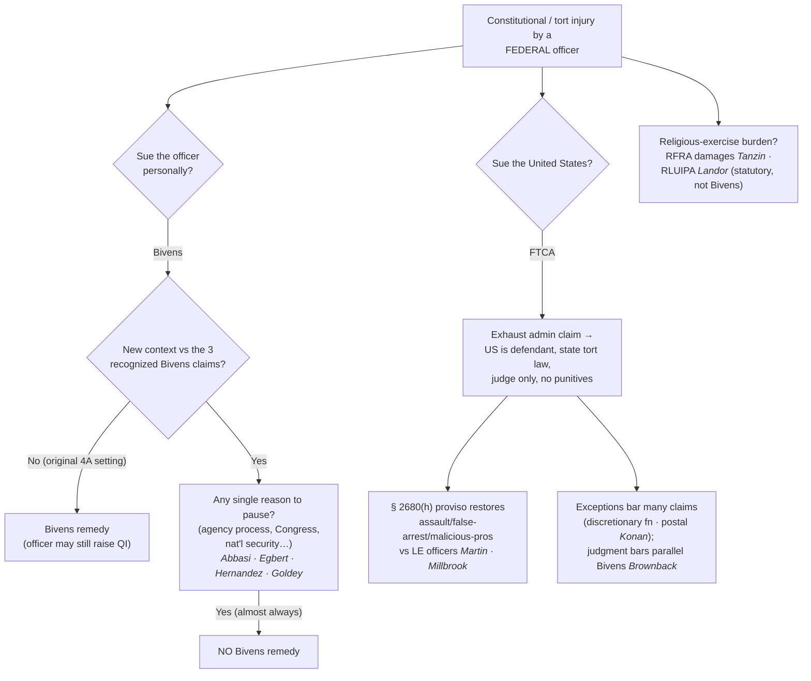

# Suing Federal Officers

*The officer was federal, not state — so § 1983 does not apply. Is there any damages remedy at all?*

> [!rule] Black-letter rule
> **§ 1983 reaches only state and local actors.** A **federal** officer who violates the Constitution may be sued for damages only under *[[Bivens v. Six Unknown Named Agents|Bivens]]*, which implied a Fourth Amendment damages remedy in 1971 — but the Court has since made extending *[[Bivens v. Six Unknown Named Agents|Bivens]]* to any **new context** a **"disfavored judicial activity,"** and "**if there is even a single reason to pause** before applying *Bivens* in a new context, a court may not recognize a *Bivens* remedy." The separate **Federal Tort Claims Act** waives the United States' immunity for many torts by federal employees, subject to exceptions. *[[Bivens v. Six Unknown Named Agents|Bivens]]*, 403 U.S. 388 (1971); *[[Ziglar v. Abbasi|Ziglar v. Abbasi]]*, 582 U.S. 120 (2017); *[[Egbert v. Boule|Egbert v. Boule]]*, 596 U.S. 482 (2022).
> ^rule-federal-officer-suits

## The Brief

**Two doors, both narrow.** Because § 1983 reaches only action under color of **state** law (see [[Section 1983 Liability and Qualified Immunity]]), a plaintiff injured by a **federal** agent (FBI, DEA, CBP, BOP) has two possible routes: a *[[Bivens v. Six Unknown Named Agents|Bivens]]* action against the **officer personally**, or a **Federal Tort Claims Act** suit against the **United States**. The first is nearly closed; the second is a limited, exception-riddled waiver. Both are worth knowing because officers on federal task forces, and their state partners, live at the seam between the two liability systems.

**Bivens: the implied remedy, then the retreat.** *[[Bivens v. Six Unknown Named Agents|Bivens]]* held that a Fourth Amendment violation by federal narcotics agents supports an **implied damages remedy** even though no statute created one. 403 U.S. at 397. The Court later recognized *[[Bivens v. Six Unknown Named Agents|Bivens]]* claims in only two more settings (a Fifth Amendment gender-discrimination claim and an Eighth Amendment failure-to-treat claim) and has recognized **none since 1980**. The modern doctrine treats any extension as presumptively improper.

**The special-factors test (*Abbasi* and *[[Egbert v. Boule|Egbert]]*).** Creating a damages remedy is "a **disfavored judicial activity.**" *[[Ziglar v. Abbasi|Ziglar v. Abbasi]]*, 582 U.S. 120 (2017). A court first asks whether the case presents a **new context** (any meaningful difference from the three recognized *[[Bivens v. Six Unknown Named Agents|Bivens]]* claims); if so, it asks whether **special factors** counsel hesitation, and Congress (not the courts) should usually decide whether to create a remedy. *[[Egbert v. Boule|Egbert v. Boule]]* collapsed the inquiry to a single question and set the bar at the floor: "**If there is even a single reason to pause** before applying *Bivens* in a new context, a court may not recognize a *Bivens* remedy." 596 U.S. at 491–492. It also treated the availability of an **agency grievance process** as an adequate alternative that defeats the claim. After *[[Egbert v. Boule|Egbert]]*, virtually every claim outside *[[Bivens v. Six Unknown Named Agents|Bivens]]*'s original facts is a "new context" with a "reason to pause."

**Where the door has closed.** *[[Hernandez v. Mesa|Hernandez v. Mesa]]*, 589 U.S. 93 (2020), refused a *[[Bivens v. Six Unknown Named Agents|Bivens]]* remedy for a **cross-border shooting** (a Border Patrol agent on U.S. soil killed a boy on the Mexican side), citing foreign-relations and national-security factors. *[[Egbert v. Boule|Egbert]]* refused claims arising from a border-area encounter and a First Amendment retaliation theory. And the Court continues to **summarily reverse** lower courts that recognize new *[[Bivens v. Six Unknown Named Agents|Bivens]]* claims, declining, for example, to extend *[[Bivens v. Six Unknown Named Agents|Bivens]]* to a federal prisoner's excessive-force claim. *[[Goldey v. Fields|Goldey v. Fields]]*, 606 U.S. 942 (2025) (per curiam). Separately, *[[FBI v. Fazaga|FBI v. Fazaga]]*, 595 U.S. 344 (2022), held that the Foreign Intelligence Surveillance Act's procedures (50 U.S.C. § 1806(f)) do **not** displace the **state-secrets privilege** — a reminder that suits against federal surveillance run into evidentiary walls even where a cause of action exists.

**The FTCA path — suing the United States, not the officer.** The **Federal Tort Claims Act** waives sovereign immunity for torts committed by federal employees within the scope of employment, making the **United States** the defendant under the law of the place where the act occurred. 28 U.S.C. §§ 1346(b), 2674. Two features matter most in law-enforcement cases:
- **The law-enforcement proviso.** The FTCA generally excludes intentional torts, but § 2680(h) restores claims for **assault, battery, false arrest, false imprisonment, abuse of process, and malicious prosecution** committed by **investigative or law-enforcement officers**. That proviso is not limited to conduct during a search, seizure, or arrest. *Millbrook v. United States*, 569 U.S. 50 (2013). It supplied the remedy for a **wrong-house raid**, and the Supremacy Clause is no defense to FTCA liability. *[[Martin v. United States|Martin v. United States]]*, 605 U.S. 395 (2025).
- **The judgment bar.** A judgment **on an FTCA claim** bars a related *[[Bivens v. Six Unknown Named Agents|Bivens]]* claim against the individual employees for the same conduct (§ 2676), a trap for plaintiffs who plead both. *[[Brownback v. King|Brownback v. King]]*, 592 U.S. 209 (2021). The FTCA's many **exceptions** (discretionary function, intentional torts outside the proviso, the postal-matter exception) frequently defeat suits; the scope of the **postal-matter exception** was before the Court in *[[Postal Service v. Konan|Postal Service v. Konan]]*, No. 24-351 (2026).

**Two statutory cousins: RFRA and RLUIPA, not § 1983 and not *[[Bivens v. Six Unknown Named Agents|Bivens]]*.** Where the federal government substantially burdens religious exercise, the **Religious Freedom Restoration Act** supplies its own damages remedy: "appropriate relief against a government" **includes money damages against federal officials sued in their individual capacities.** *[[Tanzin v. Tanvir|Tanzin v. Tanvir]]*, 592 U.S. 43 (2020). The companion question (whether the **Religious Land Use and Institutionalized Persons Act** likewise authorizes individual-capacity damages) reached the Court in *[[Landor v. Louisiana Dept. of Corrections|Landor v. Louisiana Dep't of Corrections]]*, No. 23-1197 (2026). Teach these honestly as **statutory** remedies: they are neither § 1983 nor *[[Bivens v. Six Unknown Named Agents|Bivens]]*, and they exist only because Congress wrote the cause of action *[[Bivens v. Six Unknown Named Agents|Bivens]]* plaintiffs now lack.

**Burden, standard of review, and remedy.** In a *[[Bivens v. Six Unknown Named Agents|Bivens]]* action the court decides the **threshold legal question** (new context and special factors) before the merits, and dismissal is the norm outside the original settings; where a claim does proceed, the officer may still assert **[[Qualified Immunity|qualified immunity]]** (see [[Qualified Immunity]]). Under the FTCA the plaintiff must first exhaust an **administrative claim**, sue the **United States** (individual employees are dismissed and substituted), and try the case to a **judge** under state tort law with **no jury and no punitive damages**. The practical lesson: for a federal officer, the constitutional-tort door is mostly shut, and the realistic remedy is usually the **FTCA**, if an exception does not bar it.

**Common pitfalls.**
- **Filing a § 1983 claim against a federal officer.** Section 1983 requires action under color of **state** law; a federal agent needs *[[Bivens v. Six Unknown Named Agents|Bivens]]* (or the FTCA).
- **Assuming *[[Bivens v. Six Unknown Named Agents|Bivens]]* extends to new facts.** After *[[Egbert v. Boule|Egbert]]*, a single "reason to pause" defeats the claim, and almost everything outside *[[Bivens v. Six Unknown Named Agents|Bivens]]*'s original Fourth Amendment setting is a "new context."
- **Overlooking the FTCA judgment bar.** Litigating the FTCA claim to judgment can **extinguish** the parallel *[[Bivens v. Six Unknown Named Agents|Bivens]]* claim (*[[Brownback v. King|Brownback]]*).
- **Forgetting the FTCA's exceptions.** The discretionary-function and postal-matter exceptions and the intentional-tort bar (outside the § 2680(h) proviso) defeat many suits.
- **Confusing RFRA/RLUIPA damages with a constitutional-tort remedy.** They are **statutory** (*[[Tanzin v. Tanvir|Tanzin]]*), not § 1983 or *[[Bivens v. Six Unknown Named Agents|Bivens]]*.
- **Treating the state task-force partner like the federal agent.** The state officer may still be a § 1983 defendant even where the federal agent is *[[Bivens v. Six Unknown Named Agents|Bivens]]*-immune in practice.

## Key cases

| Case | Holding | Opinion |
|---|---|---|
| *[[Bivens v. Six Unknown Named Agents]]*, 403 U.S. 388 (1971) | **Anchor.** Recognized an **implied damages remedy** against federal officers for a Fourth Amendment violation; the § 1983 analog for federal agents. | [opinion](https://www.courtlistener.com/opinion/108375/bivens-v-six-unknown-named-agents-of-federal-bureau-of-narcotics/) |
| *[[Ziglar v. Abbasi]]*, 582 U.S. 120 (2017) | **Retrenchment.** Extending *[[Bivens v. Six Unknown Named Agents\|Bivens]]* to a **new context** is a "disfavored judicial activity"; courts ask whether special factors counsel leaving the remedy to Congress. | [opinion](https://www.courtlistener.com/opinion/4403804/ziglar-v-abbasi/) |
| *[[Hernandez v. Mesa]]*, 589 U.S. 93 (2020) | **Boundary.** No *[[Bivens v. Six Unknown Named Agents\|Bivens]]* remedy for a **cross-border shooting**; foreign-relations and national-security factors counsel hesitation. | [opinion](https://www.courtlistener.com/opinion/9231296/hernandez-v-mesa/) |
| *[[Egbert v. Boule]]*, 596 U.S. 482 (2022) | **Near-closure.** A **single "reason to pause"** bars a new *[[Bivens v. Six Unknown Named Agents\|Bivens]]* remedy; an agency grievance process counts as an adequate alternative; the door is all but shut. | [opinion](https://www.courtlistener.com/opinion/6475794/egbert-v-boule/) |
| *[[Goldey v. Fields]]*, 606 U.S. 942 (2025) | **Reaffirmation.** Summarily declined to extend *[[Bivens v. Six Unknown Named Agents\|Bivens]]* to a federal prisoner's excessive-force claim; the pattern of refusal continues. | [opinion](https://www.courtlistener.com/opinion/10776815/goldey-v-fields/) |
| *[[FBI v. Fazaga]]*, 595 U.S. 344 (2022) | **Evidentiary wall.** FISA's § 1806(f) procedures do **not** displace the **state-secrets privilege** in a surveillance suit against federal agents. | [opinion](https://www.courtlistener.com/opinion/6448059/fbi-v-fazaga/) |
| *[[Brownback v. King]]*, 592 U.S. 209 (2021) | **FTCA judgment bar.** A judgment on an FTCA claim can **bar** a related *[[Bivens v. Six Unknown Named Agents\|Bivens]]* claim against the employees for the same conduct (§ 2676). | [opinion](https://www.courtlistener.com/opinion/4858987/brownback-v-king/) |
| *[[Martin v. United States]]*, 605 U.S. 395 (2025) | **FTCA proviso.** The § 2680(h) law-enforcement proviso reaches a **wrong-house raid**, and the Supremacy Clause is no defense to FTCA liability. | [opinion](https://www.courtlistener.com/opinion/10776839/martin-v-united-states/) |
| *[[Postal Service v. Konan]]*, No. 24-351 (2026) | **FTCA exception.** Addresses the scope of the FTCA's **postal-matter exception** (§ 2680(b)) for a claim of intentional non-delivery of mail. | [opinion](https://www.courtlistener.com/opinion/10799651/postal-service-v-konan/) |
| *[[Tanzin v. Tanvir]]*, 592 U.S. 43 (2020) | **Statutory cousin.** RFRA's "appropriate relief against a government" **includes money damages** against federal officials in their **individual** capacities. | [opinion](https://www.courtlistener.com/opinion/4837663/tanzin-v-tanvir/) |
| *[[Landor v. Louisiana Dept. of Corrections]]*, No. 23-1197 (2026) | **Statutory cousin.** Presents the RLUIPA companion to *[[Tanzin v. Tanvir\|Tanzin]]*; whether that statute authorizes **individual-capacity damages**. | [opinion](https://www.courtlistener.com/opinion/10878535/landor-v-louisiana-dept-of-corrections-and-public-safety/) |

## Visual

## Sources
- *Bivens v. Six Unknown Named Agents*, 403 U.S. 388 (1971) (pinpoint 397) — https://www.courtlistener.com/opinion/108375/bivens-v-six-unknown-named-agents-of-federal-bureau-of-narcotics/
- *Ziglar v. Abbasi*, 582 U.S. 120 (2017) — https://www.courtlistener.com/opinion/4403804/ziglar-v-abbasi/
- *Hernandez v. Mesa*, 589 U.S. 93 (2020) — https://www.courtlistener.com/opinion/9231296/hernandez-v-mesa/
- *Egbert v. Boule*, 596 U.S. 482 (2022) (pinpoints 491–492) — https://www.courtlistener.com/opinion/6475794/egbert-v-boule/
- *Goldey v. Fields*, 606 U.S. 942 (2025) (per curiam) — https://www.courtlistener.com/opinion/10776815/goldey-v-fields/
- *FBI v. Fazaga*, 595 U.S. 344 (2022) — https://www.courtlistener.com/opinion/6448059/fbi-v-fazaga/
- *Brownback v. King*, 592 U.S. 209 (2021) — https://www.courtlistener.com/opinion/4858987/brownback-v-king/
- *Martin v. United States*, 605 U.S. 395 (2025) — https://www.courtlistener.com/opinion/10776839/martin-v-united-states/
- *Postal Service v. Konan*, No. 24-351 (U.S. decided Feb. 24, 2026) (slip opinion) — https://www.courtlistener.com/opinion/10799651/postal-service-v-konan/
- *Millbrook v. United States*, 569 U.S. 50 (2013) — https://www.courtlistener.com/opinion/856345/millbrook-v-united-states/
- *Tanzin v. Tanvir*, 592 U.S. 43 (2020) — https://www.courtlistener.com/opinion/4837663/tanzin-v-tanvir/
- *Landor v. Louisiana Dept. of Corrections and Public Safety*, No. 23-1197 (U.S. decided June 23, 2026) (slip opinion) — https://www.courtlistener.com/opinion/10878535/landor-v-louisiana-dept-of-corrections-and-public-safety/
