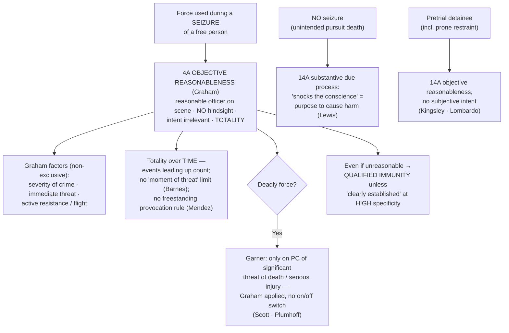

# Use of Force

*Was this force objectively reasonable under the [[Common Legal Terms#totality-of-the-circumstances|totality of the circumstances]] — judged from the perspective of a reasonable officer on the scene, not with 20/20 hindsight?*

> [!rule] Black-letter rule
> Force used to make an arrest, an investigatory stop, or any other **seizure of a free person** is a Fourth Amendment event, judged by the Amendment's **objective-reasonableness** standard — **not** substantive due process. Reasonableness is measured "from the perspective of a reasonable officer on the scene," **without regard to intent**, on the **totality of the circumstances**, guided by three **non-exclusive** factors: **severity of the crime · immediate threat · active resistance or flight**. *[[Graham v. Connor|Graham v. Connor]]*, 490 U.S. 386, [395–397](https://www.courtlistener.com/opinion/112257/graham-v-connor/) (1989). **Deadly force** requires **probable cause** that the suspect poses a significant threat of death or serious physical injury. *[[Tennessee v. Garner|Tennessee v. Garner]]*, 471 U.S. 1, [3](https://www.courtlistener.com/opinion/111397/tennessee-v-garner/) (1985).
> ^rule-use-of-force

## The Brief

**Force during a seizure is a Fourth Amendment question, measured objectively.** When an officer uses force to make an arrest, an investigatory stop, or any other **seizure of a free person**, the force is itself a Fourth Amendment event judged by the Amendment's **objective-reasonableness** standard, not by substantive due process. "[A]ll claims that law enforcement officers have used excessive force ... in the course of an arrest, investigatory stop, or other 'seizure' of a free citizen should be analyzed under the Fourth Amendment and its 'reasonableness' standard." *[[Graham v. Connor|Graham v. Connor]]*, 490 U.S. 386, [395](https://www.courtlistener.com/opinion/112257/graham-v-connor/) (1989). The test is **purely objective**, judged "from the perspective of a reasonable officer on the scene, rather than with the 20/20 vision of hindsight." *[[Graham v. Connor|Graham]]*, 490 U.S. at [396](https://www.courtlistener.com/opinion/112257/graham-v-connor/). Intent is irrelevant on both sides: an officer's "evil intentions will not make a Fourth Amendment violation out of an objectively reasonable use of force," and good intentions will not save objectively unreasonable force. *Id.* at 397. The standard "must embody allowance for the fact that police officers are often forced to make split-second judgments ... about the amount of force that is necessary." *Id.* at 396–397.

**The *[[Graham v. Connor|Graham]]* factors, plus everything else.** Reasonableness "requires careful attention to the facts and circumstances of each particular case, **including** the severity of the crime at issue, whether the suspect poses an immediate threat to the safety of the officers or others, and whether he is actively resisting arrest or attempting to evade arrest by flight." *[[Graham v. Connor|Graham]]*, 490 U.S. at [396](https://www.courtlistener.com/opinion/112257/graham-v-connor/). Those three named factors (**severity of the crime · immediate threat · active resistance or flight**) are **non-exclusive** (the word is "including"); force is judged on the **totality of the circumstances**, so the factors are the starting point, not a closed checklist. This is where the articulation habit pays off: name every fact that made the force reasonable ([[Three Golden Rules]]).

**Deadly force is the same standard at its sharpest.** Apprehension by deadly force is a seizure, and deadly force against a fleeing suspect "may not be used unless it is necessary to prevent the escape and the officer has **probable cause to believe that the suspect poses a significant threat of death or serious physical injury** to the officer or others." *[[Tennessee v. Garner|Tennessee v. Garner]]*, 471 U.S. 1, [3](https://www.courtlistener.com/opinion/111397/tennessee-v-garner/) (1985). So "[a] police officer may not seize an unarmed, nondangerous suspect by shooting him dead." *[[Tennessee v. Garner|Garner]]*, 471 U.S. at [11](https://www.courtlistener.com/opinion/111397/tennessee-v-garner/). But *[[Tennessee v. Garner|Garner]]* is **not a rigid on/off switch**: it "did not establish a magical on/off switch that triggers rigid preconditions whenever an officer's actions constitute 'deadly force,'" it "was simply an application of the Fourth Amendment's 'reasonableness' test." *[[Scott v. Harris|Scott v. Harris]]*, 550 U.S. 372 (2007). *[[Tennessee v. Garner|Garner]]*'s factors therefore **inform** reasonableness; they are not a separate two-prong gate.

**Vehicle pursuits are the paradigmatic dangerous-flight case.** "A police officer's attempt to terminate a dangerous high-speed car chase that threatens the lives of innocent bystanders does not violate the Fourth Amendment, even when it places the fleeing motorist at risk of serious injury or death." *[[Scott v. Harris|Scott]]*, 550 U.S. at [386](https://www.courtlistener.com/opinion/145738/scott-v-harris/) (ramming a recklessly fleeing motorist was reasonable). *[[Plumhoff v. Rickard#^pin-777b|Plumhoff v. Rickard]]*, 572 U.S. 765, [777](https://www.courtlistener.com/opinion/2675750/plumhoff-v-rickard/#:~:text=if%20police%20officers%20are%20justified) (2014), applied that rule to shots fired to end a 100-mph chase and added that "if police officers are justified in firing at a suspect in order to end a severe threat to public safety, the officers need not stop shooting until the threat has ended."

**Totality, not a single frozen instant.** In *[[Barnes v. Felix|Barnes v. Felix]]*, 605 U.S. 73 (2025), a unanimous Court rejected the Fifth Circuit's "moment-of-threat" rule and held that reasonableness is judged on **all** the relevant circumstances, **including the facts and events leading up to the climactic moment**. A court "cannot review the totality of the circumstances if it has put on chronological blinders." *[[Barnes v. Felix|Barnes]]*, 605 U.S. 73. The totality inquiry has **no time limit**: the reason for the stop and the officer's own approach are part of the picture. *[[Barnes v. Felix|Barnes]]* **vacated and remanded** without itself deciding whether the force was reasonable, and it expressly **left open the "officer-created danger" question** (the lower-court developments below).

**No freestanding "provocation" rule.** A separate, earlier Fourth Amendment violation does not automatically make later force unreasonable. The Court rejected the Ninth Circuit's "provocation rule," which had made an otherwise-reasonable use of force actionable whenever the officer's own prior constitutional violation "provoked" the confrontation. *[[County of Los Angeles v. Mendez|County of Los Angeles v. Mendez]]*, 581 U.S. 420 (2017). Excessive-force reasonableness runs through *[[Graham v. Connor|Graham]]*; a distinct unlawful entry is litigated as its **own** Fourth Amendment claim, with damages limited to what that violation **proximately caused**. *[[County of Los Angeles v. Mendez|Mendez]]* did not resolve whether an officer's reckless pre-seizure conduct can bear on the reasonableness of the force itself — the question *[[Barnes v. Felix|Barnes]]* also left open.

**Pretrial detainees are judged objectively too — under the Fourteenth Amendment.** A convicted prisoner's excessive-force claim (Eighth Amendment) turns on whether force was applied "maliciously and sadistically"; a **pretrial detainee's** claim does not. "[A] pretrial detainee must show only that the force purposely or knowingly used against him was **objectively unreasonable**." *[[Kingsley v. Hendrickson|Kingsley v. Hendrickson]]*, 576 U.S. 389, [396–397](https://www.courtlistener.com/opinion/2811847/kingsley-v-hendrickson/) (2015). The force must be deliberate, but its reasonableness is objective. That objective standard controls **prone-restraint** cases: a court may not treat precedent as making the prone restraint of a handcuffed, resisting detainee **per se** constitutional; it must weigh the specific facts (duration, pressure on the back, the risk of positional asphyxia). *[[Lombardo v. City of St. Louis|Lombardo v. City of St. Louis]]*, 594 U.S. 464 (2021) (per curiam).

**When there is no seizure, the Fourth Amendment does not apply at all.** A person killed by a pursuit the police did not intend to stop him with is not "seized" — a seizure requires "termination of freedom of movement **through means intentionally applied**." *[[Brower v. County of Inyo|Brower v. County of Inyo]]*, 489 U.S. 593, [596–597](https://www.courtlistener.com/opinion/112218/brower-ex-rel-estate-of-caldwell-v-county-of-inyo/) (1989). Such a death is judged under **Fourteenth Amendment substantive due process**, which in the pursuit setting is satisfied only by conduct that "shocks the conscience," meaning "a **purpose to cause harm** unrelated to the legitimate object of arrest"; deliberate or reckless indifference is not enough in a high-speed chase. *[[County of Sacramento v. Lewis|County of Sacramento v. Lewis]]*, 523 U.S. 833, [836](https://www.courtlistener.com/opinion/118214/county-of-sacramento-v-lewis/), 854 (1998). Keep the two tracks straight: an intentional seizure runs through *[[Graham v. Connor|Graham]]*; an unintended pursuit death runs through *[[County of Sacramento v. Lewis|Lewis]]*.

**The qualified-immunity overlay — where most force cases are actually won and lost.** Even where force may have been unreasonable, an officer sued under § 1983 is immune unless the illegality was **clearly established** at a **high level of specificity**. The general standards of *[[Graham v. Connor|Graham]]* and *[[Tennessee v. Garner|Garner]]* "do not by themselves create clearly established law outside an 'obvious case,'" so officers keep immunity unless precedent "squarely governs" the specific facts. The full doctrine, with the recurring criticism that immunity shields fatal force on hard facts (as in the [[Reading and Citing Cases#certiorari-cert|certiorari]] statements in *Ramirez v. Guadarrama*, *N.S. v. Kansas City Board of Police Commissioners*, and *McCoy v. Alamu*), lives on [[Qualified Immunity]]. The field point: the **reasonableness** question and the **clearly-established** question are distinct, and force claims often turn on the second.

**Documentation and body-worn cameras.** Because reasonableness is measured on the whole scene, **contemporaneous documentation** is decisive at summary judgment, where the historical facts are taken in the plaintiff's favor and the ultimate reasonableness question is one of law. **Body-worn-camera** footage is now central proof, and it cuts both ways: it can corroborate the articulated threat or contradict it. Recording, activation, and retention are **agency-policy and evidence-practice** matters, not a distinct Fourth Amendment doctrine (there is no separate constitutional "camera rule"), but a gap in the footage, or a failure to activate, is a fact the totality will weigh. The safest posture is the one the standard rewards: reasonable force, **well-articulated** and documented.

**Apply it.** For any use of force:
1. **Was there a seizure of a free person?** If yes → Fourth Amendment *[[Graham v. Connor|Graham]]* reasonableness. If the harm came from an **unintended** act (a pursuit the officer did not mean to stop the person with) → no seizure → Fourteenth Amendment *[[County of Sacramento v. Lewis|Lewis]]* shocks-the-conscience.
2. **Whose claim is it?** Free person → 4A *[[Graham v. Connor|Graham]]*; **pretrial detainee** → 14A *[[Kingsley v. Hendrickson|Kingsley]]* (objective); convicted prisoner → 8A malicious-and-sadistic.
3. **Run the totality**, not just the final second: name the severity of the crime, the immediate threat, active resistance or flight, **and** the events leading up (*[[Barnes v. Felix|Barnes]]*).
4. **If deadly force**, articulate the **probable cause** of a significant threat of death or serious injury (*[[Tennessee v. Garner|Garner]]*), remembering it is *[[Graham v. Connor|Graham]]* applied, not a rigid gate (*[[Scott v. Harris|Scott]]*).
5. **Document it** — articulate every fact contemporaneously; treat body-camera footage as the record the totality will be judged against.

**Common pitfalls.**
- **Treating the three factors as a closed test.** *[[Graham v. Connor|Graham]]* says "including" — severity, threat, and resistance are illustrative. Judge the totality.
- **Judging with hindsight.** The question is what a reasonable officer on the scene perceived in a tense, rapidly evolving moment.
- **Smuggling in intent.** A "good faith" or "malicious/sadistic" inquiry misstates the standard; *[[Graham v. Connor|Graham]]* rejected the *[[Johnson v. Glick]]* good-faith test.
- **Reading *[[Tennessee v. Garner|Garner]]* as a rigid two-part precondition.** *[[Scott v. Harris|Scott]]* corrects this: no on/off switch; a dangerous fleeing driver is a different totality than the unarmed, non-dangerous burglar in *[[Tennessee v. Garner|Garner]]*.
- **Compressing the scene to the final second.** After *[[Barnes v. Felix|Barnes]]*, ignoring the events leading up to the force is reversible error.
- **Confusing the standard with liability.** *[[Graham v. Connor|Graham]]* fixes the constitutional force standard; [[Qualified Immunity|qualified immunity]] and § 1983 damages are separate questions (see [[Qualified Immunity]]; [[Section 1983 Liability and Qualified Immunity]]).
- **Applying the wrong amendment.** Free-person seizure → 4A *[[Graham v. Connor|Graham]]*; pretrial detainee → 14A *[[Kingsley v. Hendrickson|Kingsley]]*; convicted prisoner → 8A; unintended pursuit death (no seizure) → 14A *[[County of Sacramento v. Lewis|Lewis]]*.

## Lower-court developments

The Supreme Court supplies the governing force standard; the circuits do the day-to-day line-drawing on the *[[Graham v. Connor|Graham]]* factors, and each decision below binds only in its own circuit. The open frontier is the **officer-created-danger** question that *[[Barnes v. Felix|Barnes]]* expressly reserved and *[[County of Los Angeles v. Mendez|Mendez]]* declined to reach through a "provocation" rule: **can an officer's own reckless pre-seizure conduct, which created the need for force, bear on the reasonableness of that force (or independently support liability)?** The circuits divide.

- **Broad reading (recognizing pre-seizure conduct)** — *the majority position, persuasive outside each circuit.* Several circuits (including the **1st, 7th, 9th, and 10th**) hold that an officer's own **reckless conduct that provoked or created** the dangerous confrontation can be part of the reasonableness inquiry or can independently support a claim. *Role: broad reading / plaintiff-favorable.*
- **Narrow reading (moment-of-threat focus)** — *the minority position, persuasive outside each circuit.* Other circuits (the **2d and 4th**) confine the inquiry to the **moment force was used** and reject officer-created-danger as an independent Fourth Amendment theory. *Role: narrow reading / defense-favorable.*
- **Application of the *[[Graham v. Connor|Graham]]* factors — *[[Wright v. City of Euclid]]* (6th Cir. 2020).** A published decision reversing summary judgment and denying qualified immunity: taking the plaintiff's account as true, drawing a weapon on a non-fleeing, non-threatening suspect and tasering a non-resisting one was excessive force, and clearly established. A worked example of the factors cutting against the force used. *Role: application / illustrative denial.* **Binding in-circuit — 6th Cir.** [opinion](https://www.courtlistener.com/opinion/4762133/lamar-wright-v-city-of-euclid/)

**Synthesis.** Until the Court answers the reserved *[[Barnes v. Felix|Barnes]]* question, the practical rule is jurisdiction-specific: in the broad-reading circuits, the plaintiff can put the officer's own set-up before the factfinder; in the narrow-reading circuits, the inquiry snaps to the moment of the threat. Everywhere, *[[County of Los Angeles v. Mendez|Mendez]]* forecloses treating a separate prior violation as an automatic multiplier of force liability — the entry claim and the force claim stay distinct.

## Key cases

| Case | Holding | Opinion |
|---|---|---|
| *[[Graham v. Connor]]*, 490 U.S. 386 (1989) | **Anchor.** Excessive force during any seizure of a free person is judged under the Fourth Amendment's **objective-reasonableness** standard (on-scene perspective, no hindsight, intent irrelevant), guided by three non-exclusive factors; not substantive due process. | [opinion](https://www.courtlistener.com/opinion/112257/graham-v-connor/) |
| *[[Tennessee v. Garner]]*, 471 U.S. 1 (1985) | **Deadly force.** Deadly force against an apparently unarmed, non-dangerous fleeing suspect is an unreasonable seizure; it requires **probable cause** the suspect poses a significant threat of death or serious injury. | [opinion](https://www.courtlistener.com/opinion/111397/tennessee-v-garner/) |
| *[[Scott v. Harris]]*, 550 U.S. 372 (2007) | **No on/off switch.** *[[Tennessee v. Garner\|Garner]]* is "simply an application" of *[[Graham v. Connor\|Graham]]* reasonableness; no "magical on/off switch"; ramming a recklessly fleeing motorist who endangered the public was reasonable. | [opinion](https://www.courtlistener.com/opinion/145738/scott-v-harris/) |
| *[[Plumhoff v. Rickard]]*, 572 U.S. 765 (2014) | **Pursuit.** Deadly force to end a dangerous high-speed chase is reasonable, and officers "need not stop shooting until the threat has ended." | [opinion](https://www.courtlistener.com/opinion/2675750/plumhoff-v-rickard/) |
| *[[Barnes v. Felix]]*, 605 U.S. 73 (2025) | **Totality over time.** Reasonableness is judged on the **totality of the circumstances**, which has **no time limit**; the "moment-of-threat" rule is rejected (vacated & remanded, unanimous). Leaves the officer-created-danger question open. | [opinion](https://www.courtlistener.com/opinion/10584846/barnes-v-felix/) |
| *[[County of Los Angeles v. Mendez]]*, 581 U.S. 420 (2017) | **No provocation rule.** There is no freestanding "provocation" rule; a separate Fourth Amendment violation does not make otherwise-reasonable force unreasonable, though it may support damages it proximately caused. | [opinion](https://www.courtlistener.com/opinion/4395246/county-of-los-angeles-v-mendez/) |
| *[[Kingsley v. Hendrickson]]*, 576 U.S. 389 (2015) | **Pretrial detainee.** A pretrial detainee's Fourteenth Amendment excessive-force claim requires only that the deliberate force was **objectively unreasonable**; no subjective awareness need be shown. | [opinion](https://www.courtlistener.com/opinion/2811847/kingsley-v-hendrickson/) |
| *[[Lombardo v. City of St. Louis]]*, 594 U.S. 464 (2021) | **Prone restraint.** Precedent does not make prone restraint of a handcuffed, resisting detainee **[[Common Legal Terms#per-se\|per se]]** constitutional; the specific facts (duration, pressure, positional-asphyxia risk) must be weighed under *[[Kingsley v. Hendrickson\|Kingsley]]*. | [opinion](https://www.courtlistener.com/opinion/4895266/lombardo-v-st-louis/) |
| *[[County of Sacramento v. Lewis]]*, 523 U.S. 833 (1998) | **No seizure.** A pursuit death **without a seizure** is judged under Fourteenth Amendment substantive due process; only a **purpose to cause harm** unrelated to arrest "shocks the conscience." | [opinion](https://www.courtlistener.com/opinion/118214/county-of-sacramento-v-lewis/) |

## Related cases across doctrines

| Case | Relevance here | Primary home | Opinion |
|---|---|---|---|
| *[[Brower v. County of Inyo]]*, 489 U.S. 593 (1989) | Defines when force effects a **seizure** at all: only "termination of freedom of movement through means intentionally applied"; the threshold separating a *[[Graham v. Connor\|Graham]]* claim from the *[[County of Sacramento v. Lewis\|Lewis]]* substantive-due-process track. | [[Seizure of the Person]] | [opinion](https://www.courtlistener.com/opinion/112218/brower-ex-rel-estate-of-caldwell-v-county-of-inyo/) |
| *[[Kisela v. Hughes]]*, 584 U.S. 100 (2018) | The specificity demand in force cases: officers keep immunity unless precedent "squarely governs" the specific facts. | [[Qualified Immunity]] | [opinion](https://www.courtlistener.com/opinion/4482892/kisela-v-hughes/) |
| *[[Brosseau v. Haugen]]*, 543 U.S. 194 (2004) | Immunity for shooting a fleeing driver: *[[Tennessee v. Garner\|Garner]]*/*[[Graham v. Connor\|Graham]]* are cast too generally, putting the conduct in the "hazy border between excessive and acceptable force." | [[Qualified Immunity]] | [opinion](https://www.courtlistener.com/opinion/137736/brosseau-v-haugen/) |
| *[[White v. Pauly]]*, 580 U.S. 73 (2017) | Clearly-established law must be "particularized"; *[[Graham v. Connor\|Graham]]*/*[[Tennessee v. Garner\|Garner]]* alone do not create it outside an obvious case. | [[Qualified Immunity]] | [opinion](https://www.courtlistener.com/opinion/4374579/white-v-pauly/) |
| *[[Mullenix v. Luna]]*, 577 U.S. 7 (2015) | Immunity for shooting a fleeing, intoxicated suspect who threatened officers: "clearly established" is judged at the specific-conduct level. | [[Qualified Immunity]] | [opinion](https://www.courtlistener.com/opinion/3153112/mullenix-v-luna/) |
| *[[Rivas-Villegas v. Cortesluna]]*, 595 U.S. 1 (2021) | A brief knee-to-the-back during a serious domestic-violence call was immune; the plaintiff must identify a case on the specific facts. | [[Qualified Immunity]] | [opinion](https://www.courtlistener.com/opinion/5290447/rivas-villegas-v-cortesluna/) |
| *[[City and County of San Francisco v. Sheehan]]*, 575 U.S. 600 (2015) | Officers who used force against an armed, mentally ill suspect after re-entering her room had immunity; the ADA-accommodation question was left open. | [[Qualified Immunity]] | [opinion](https://www.courtlistener.com/opinion/2801435/city-and-county-of-san-francisco-v-sheehan/) |

## Visual

## Sources
- *Graham v. Connor*, 490 U.S. 386 (1989) — https://www.courtlistener.com/opinion/112257/graham-v-connor/ (pinpoints: 395, 396, 396–397, 397).
- *Tennessee v. Garner*, 471 U.S. 1 (1985) — https://www.courtlistener.com/opinion/111397/tennessee-v-garner/ (pinpoints: 3, 11).
- *Scott v. Harris*, 550 U.S. 372 (2007) — https://www.courtlistener.com/opinion/145738/scott-v-harris/ (pinpoint: 386).
- *Plumhoff v. Rickard*, 572 U.S. 765 (2014) — https://www.courtlistener.com/opinion/2675750/plumhoff-v-rickard/ (pinpoint: 777).
- *Barnes v. Felix*, 605 U.S. 73 (2025) — https://www.courtlistener.com/opinion/10584846/barnes-v-felix/ (pinpoint: 605 U.S. 73).
- *County of Los Angeles v. Mendez*, 581 U.S. 420 (2017) — https://www.courtlistener.com/opinion/4395246/county-of-los-angeles-v-mendez/
- *Kingsley v. Hendrickson*, 576 U.S. 389 (2015) — https://www.courtlistener.com/opinion/2811847/kingsley-v-hendrickson/ (pinpoints: 396–397).
- *Lombardo v. City of St. Louis*, 594 U.S. 464 (2021) (per curiam) — https://www.courtlistener.com/opinion/4895266/lombardo-v-st-louis/
- *County of Sacramento v. Lewis*, 523 U.S. 833 (1998) — https://www.courtlistener.com/opinion/118214/county-of-sacramento-v-lewis/ (pinpoints: 836, 854).
- *Brower v. County of Inyo*, 489 U.S. 593 (1989) — https://www.courtlistener.com/opinion/112218/brower-ex-rel-estate-of-caldwell-v-county-of-inyo/ (pinpoints: 596–597).
- *Kisela v. Hughes*, 584 U.S. 100 (2018) (per curiam) — https://www.courtlistener.com/opinion/4482892/kisela-v-hughes/
- *Brosseau v. Haugen*, 543 U.S. 194 (2004) (per curiam) — https://www.courtlistener.com/opinion/137736/brosseau-v-haugen/
- *White v. Pauly*, 580 U.S. 73 (2017) (per curiam) — https://www.courtlistener.com/opinion/4374579/white-v-pauly/
- *Mullenix v. Luna*, 577 U.S. 7 (2015) (per curiam) — https://www.courtlistener.com/opinion/3153112/mullenix-v-luna/
- *Rivas-Villegas v. Cortesluna*, 595 U.S. 1 (2021) (per curiam) — https://www.courtlistener.com/opinion/5290447/rivas-villegas-v-cortesluna/
- *City and County of San Francisco v. Sheehan*, 575 U.S. 600 (2015) — https://www.courtlistener.com/opinion/2801435/city-and-county-of-san-francisco-v-sheehan/
- *Wright v. City of Euclid*, 962 F.3d 852 (6th Cir. 2020) — https://www.courtlistener.com/opinion/4762133/lamar-wright-v-city-of-euclid/ (pinpoint: 868).
