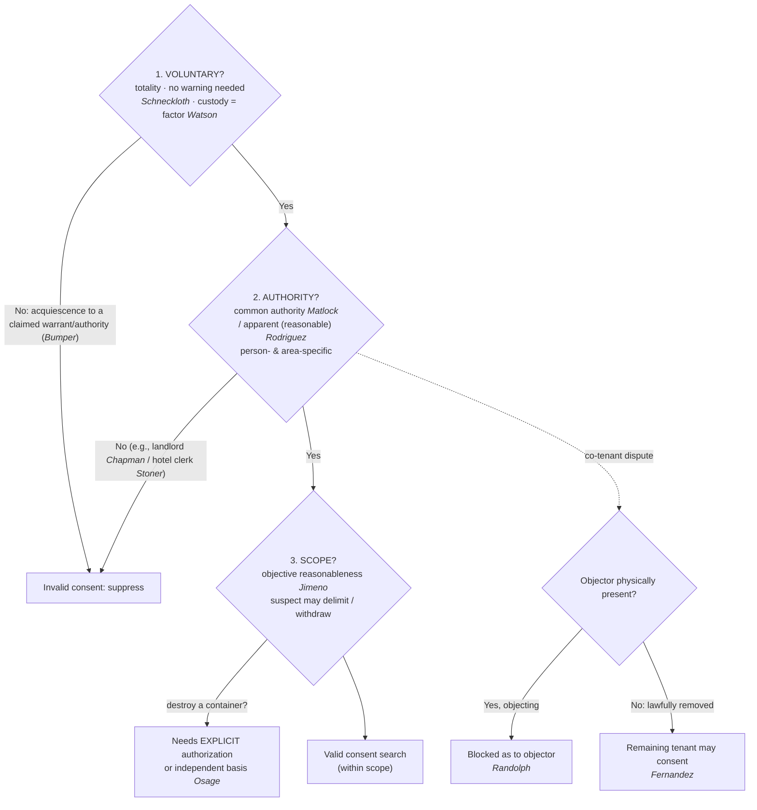

# Consent Searches

*Do I have valid consent: from someone who can give it, and does the search stay inside what they agreed to?*

> [!rule] Black-letter rule
> A warrantless search is valid on consent only where the government proves, by a preponderance and on the [[Common Legal Terms#totality-of-the-circumstances|totality of the circumstances]], three things: **(1)** the consent was **voluntary**; **(2)** it came from someone with **actual or apparent authority** over the place or effects searched; and **(3)** the search stayed within the **scope** a reasonable person would understand the exchange to authorize. That burden "cannot be discharged by showing no more than acquiescence to a claim of lawful authority." *[[Bumper v. North Carolina|Bumper]]*, 391 U.S. 543, [548–549](https://www.courtlistener.com/opinion/107716/bumper-v-north-carolina/) (1968); see *[[Schneckloth v. Bustamonte|Schneckloth]]*, 412 U.S. 218, [227](https://www.courtlistener.com/opinion/108800/schneckloth-v-bustamonte/) (1973); *[[United States v. Matlock|Matlock]]*, 415 U.S. 164, [171](https://www.courtlistener.com/opinion/108967/united-states-v-matlock/) (1974); *[[Florida v. Jimeno|Jimeno]]*, 500 U.S. 248, [251](https://www.courtlistener.com/opinion/112595/florida-v-jimeno/) (1991).
> ^rule-consent

## The Brief

**What it is, and is not.** Consent is the "C" of [[CREW]]: a recognized, warrant-free justification for a search that needs **no warrant and no probable cause**. It is not a magic word. A consent search is lawful only when all three prongs line up, and on every prong the **government** carries the burden. Consent also does not enlarge police authority beyond what was given; it is measured by what a reasonable person would understand, so a "yes" to one thing is not a "yes" to everything.

**The test up front.** A consent search is valid only if the government proves each of three prongs:
1. **Voluntariness** — the choice was free, judged on the **[[Common Legal Terms#totality-of-the-circumstances|totality of the circumstances]]**, with no requirement that the person be warned of the right to refuse (*[[Schneckloth v. Bustamonte|Schneckloth]]*). The floor: mere **acquiescence to a claim of lawful authority** is not consent (*[[Bumper v. North Carolina|Bumper]]*).
2. **Authority** — the consenter had **actual common authority** (mutual use, not title) over the place or effects (*[[United States v. Matlock|Matlock]]*), **or apparent authority** a reasonable officer would credit (*[[Illinois v. Rodriguez|Rodriguez]]*).
3. **Scope** — the search went no further than what a reasonable person would understand the exchange to authorize (*[[Florida v. Jimeno|Jimeno]]*), and the suspect may narrow or withdraw it.

**Prong 1 — voluntariness, and no warning is required.** Whether consent was "voluntary" or "the product of duress or coercion, express or implied, is a question of fact to be determined from the totality of all the circumstances." *[[Schneckloth v. Bustamonte|Schneckloth]]*, 412 U.S. 218, [227](https://www.courtlistener.com/opinion/108800/schneckloth-v-bustamonte/) (1973):
- Knowledge of the right to refuse is one factor, never the decisive one: the government "need not establish such knowledge as the *sine qua non* of an effective consent." *Id.*
- Unlike *[[Miranda v. Arizona|Miranda]]*, there is **no consent-search warning**. The Court "rejected in specific terms the suggestion that police officers must always inform citizens of their right to refuse when seeking permission to conduct a warrantless consent search." *[[United States v. Drayton#^pin-206|Drayton]]*, 536 U.S. 194, [206](https://www.courtlistener.com/opinion/121153/united-states-v-drayton/#:~:text=The%20Court%20has%20rejected%20in) (2002).
- The same holds for a stopped motorist; it is "unrealistic to require police officers to always inform detainees that they are free to go before a consent to search may be deemed voluntary." *[[Ohio v. Robinette|Robinette]]*, 519 U.S. 33, [39–40](https://www.courtlistener.com/opinion/118066/ohio-v-robinette/) (1996).

(*[[Ohio v. Robinette|Robinette]]* arises in the stop context, so see [[Traffic Stops]]; for when an encounter is consensual rather than a seizure, see [[Seizure of the Person]] and [[Terry Stops and Reasonable Suspicion]].)

**But there is a floor: acquiescence to claimed authority is not consent.** When the government relies on consent it "has the burden of proving that the consent was, in fact, freely and voluntarily given," and that "burden cannot be discharged by showing no more than acquiescence to a claim of lawful authority." *[[Bumper v. North Carolina|Bumper]]*, 391 U.S. 543, [548–549](https://www.courtlistener.com/opinion/107716/bumper-v-north-carolina/) (1968):
- An officer who claims a warrant "announces in effect that the occupant has no right to resist the search," a situation "instinct with coercion" where "there cannot be consent." *Id.* at 550.
- Prong one is therefore a spectrum: no warning is required (*[[Schneckloth v. Bustamonte|Schneckloth]]* / *[[United States v. Drayton|Drayton]]* / *[[Ohio v. Robinette|Robinette]]*).
- But a false or bare assertion of authority converts a "yes" into mere submission (*[[Bumper v. North Carolina|Bumper]]*).

**Custody is a factor, not a veto.** Detained, even handcuffed, people can consent. In *[[United States v. Watson|Watson]]* the suspect "had been arrested and was in custody, but his consent was given while on a public street," and "the fact of custody alone has never been enough in itself to demonstrate a coerced consent to search." *[[United States v. Watson|Watson]]*, 423 U.S. 411, [424](https://www.courtlistener.com/opinion/109352/united-states-v-watson/) (1976). Ignorance of the right to refuse "may be a factor," but "is not to be given controlling significance." *Id.* One caveat rides the setting: *[[United States v. Watson|Watson]]*'s consent arose on a public street, and consent obtained at the station is a question *[[Schneckloth v. Bustamonte|Schneckloth]]* expressly reserved (412 U.S. at 240–241 & n.29). The more custodial and coercive the setting, the heavier the government's burden on the totality.

**Prong 2 — authority means actual common authority, or a reasonable belief in it.** Common authority "rests . . . on mutual use of the property by persons generally having joint access or control for most purposes, so that it is reasonable to recognize that any of the co-inhabitants has the right to permit the inspection in his own right and that the others have assumed the risk that one of their number might permit the common area to be searched." *[[United States v. Matlock|Matlock]]*, 415 U.S. 164, [171](https://www.courtlistener.com/opinion/108967/united-states-v-matlock/) n.7 (1974). It turns on mutual use, not property title, so "[t]he consent of one who possesses common authority over premises or effects is valid as against the absent, nonconsenting person with whom that authority is shared." *Id.* at 170. (The assumption-of-risk logic predates *[[United States v. Matlock|Matlock]]*; in *[[Frazier v. Cupp|Frazier v. Cupp]]* a joint user of a duffel bag was taken to have assumed the risk his co-user would let police look inside.)

**Authority is person- and area-specific.** Because authority flows from what the consenter actually shares, a driver's general consent to search "the car" does not automatically reach a **passenger's personal bag** the driver has no common authority over. Frame it as objective reasonableness plus common authority: would a reasonable officer understand the consent, and the consenter's authority, to extend to that item?

**Apparent authority must be objectively reasonable.** *[[Illinois v. Rodriguez|Rodriguez]]* validates a warrantless entry on the consent of a third party the police reasonably believe has common authority, even if in fact he does not, judged "against an objective standard: would the facts available to the officer at the moment . . . 'warrant a man of reasonable caution in the belief' that the consenting party had authority over the premises?" *[[Illinois v. Rodriguez|Rodriguez]]*, 497 U.S. 177, [188](https://www.courtlistener.com/opinion/112475/illinois-v-rodriguez/) (1990). Where a reasonable officer would doubt the authority, "warrantless entry without further inquiry is unlawful"; ambiguity triggers a **duty to inquire further**. *Id.* at 188–189.

**Third-party limits: the classic "cannot consent" cases.** Apparent authority does not rescue consent from someone the officer has no basis to think is authorized. A **landlord cannot** consent to a search of premises currently leased to a tenant; to hold otherwise "would reduce the [Fourth] Amendment to a nullity and leave [tenants'] homes secure only in the discretion of [landlords]." *[[Chapman v. United States (1961)|Chapman]]*, 365 U.S. 610, 616–617 (1961). Likewise a **hotel desk clerk cannot** consent to a search of a current guest's room, because "the rights protected by the Fourth Amendment are not to be eroded by strained applications of the law of agency or by unrealistic doctrines of 'apparent authority.'" *[[Stoner v. California|Stoner]]*, 376 U.S. 483, [488](https://www.courtlistener.com/opinion/106777/stoner-v-california/) (1964). Both survive *[[Illinois v. Rodriguez|Rodriguez]]*: apparent authority still needs facts warranting a reasonable officer's belief, and a landlord's or clerk's bare say-so is not enough.

**Co-occupants: present objector wins, removed objector loses the veto.** When co-tenants disagree, "a warrantless search of a shared dwelling for evidence over the express refusal of consent by a physically present resident cannot be justified as reasonable as to him on the basis of consent given to the police by another resident." *[[Georgia v. Randolph|Randolph]]*, 547 U.S. 103, [120](https://www.courtlistener.com/opinion/145669/georgia-v-randolph/) (2006). That rule operates only while the objector is physically present: "an occupant who is absent due to a lawful detention or arrest stands in the same shoes as an occupant who is absent for any other reason," so once he is lawfully gone the remaining occupant may validly consent. *[[Fernandez v. California|Fernandez]]*, 571 U.S. 292, [303](https://www.courtlistener.com/opinion/2654534/fernandez-v-california/) (2014). A **lawful** arrest is fine; a **staged** removal engineered to manufacture a "yes" is not, and the test is whether the removal was objectively reasonable, not the officers' subjective motive.

**Prong 3 — scope is objective, and the suspect controls it.** "The standard for measuring the scope of a suspect's consent under the Fourth Amendment is that of 'objective' reasonableness: what would the typical reasonable person have understood by the exchange between the officer and the suspect?" *[[Florida v. Jimeno|Jimeno]]*, 500 U.S. 248, [251](https://www.courtlistener.com/opinion/112595/florida-v-jimeno/) (1991). "The scope of a search is generally defined by its expressed object," so a general consent to search a car **for drugs** reasonably reaches closed containers inside that might hold drugs. *Id.* But the consenter sets the limits: "[a] suspect may of course delimit as he chooses the scope of the search to which he consents." *Id.* at 252.

**Scope has a hard outer edge: general consent does not authorize destruction.** *[[Florida v. Jimeno|Jimeno]]*'s rule cuts both ways, and the Court drew the line by illustration: a general consent reaches a closed paper bag that might hold the drugs, but a reasonable person would not understand it to authorize breaking open a locked briefcase inside. Building on that distinction, *[[United States v. Osage|Osage]]* set the bright line for containers an officer would ruin. General consent reaches containers that might hold contraband, "[h]owever, we do not read that authority to permit the destruction of such containers." *[[United States v. Osage|Osage]]*, 235 F.3d 518, 521 (10th Cir. 2000). The rule: "before an officer may actually destroy or render completely useless a container which would otherwise be within the scope of a permissive search, the officer must obtain explicit authorization, or have some other, lawful, basis upon which to proceed." *Id.* at 522. Cutting open a sealed can was "more like breaking open a locked briefcase than opening the folds of a paper bag" and exceeded the consent. The field application: a general "sure, search the car" lets an officer look inside containers that could hold the object, but slashing a seat, prying open a welded compartment, or destroying a sealed container needs explicit authorization or an independent basis such as probable cause or a warrant.

**Scope also bounds duration, manner, and digital devices.** A voluntary consent can support a prolonged search and a canine sniff so long as a reasonable person would understand it to reach that far and the suspect does not unambiguously withdraw or narrow it (see *[[United States v. Carlton Williams]]* under **Lower-court developments**). Scope is also object- and place-specific in the digital age: an on-the-spot consent to "preview" a phone or laptop does not necessarily authorize a later off-site, comprehensive **forensic** examination, which is a different search in kind and degree needing its own justification (see *[[United States v. Lewis]]* under **Lower-court developments**).

**The right to limit, and to withdraw, consent.** The right to **limit** scope at the outset is settled SCOTUS law (*[[Florida v. Jimeno|Jimeno]]*'s "delimit as he chooses," 500 U.S. at 252). Federal circuits broadly recognize the corollary that consent, once given, may be **withdrawn** before the search concludes, at which point the officer must stop absent an independent justification. Two operational rules travel with it: the withdrawal (or mid-search narrowing) must be **unequivocal**, measured by the same *[[Florida v. Jimeno|Jimeno]]* reasonable-person standard, so an ambiguous grumble or nervous question is generally not effective; and withdrawal is **prospective**, so it does not retroactively taint what officers already lawfully found. Flag this as a **circuit-developed, persuasive** principle anchored in *[[Florida v. Jimeno|Jimeno]]*'s scope-control language, not a SCOTUS holding.

**Consent to *enter and transact* is not consent to *search*.** A person who invites an undercover officer in to do business assumes the risk of misplaced trust, so an invited undercover entry to buy contraband is no Fourth Amendment search at all (*[[Lewis v. United States (1966)|Lewis v. United States]]*), and an undercover over-the-counter purchase of publicly displayed wares is neither a search nor a seizure (*[[Maryland v. Macon|Macon]]*). But the invitation is bounded: it "does not mean that . . . an agent is authorized to conduct a general search for incriminating materials." *[[Lewis v. United States (1966)|Lewis]]*, 385 U.S. 206, 211 (1966). The agent may do only what the occupant invited, the same scope logic as *[[Florida v. Jimeno|Jimeno]]* applied to an invitation.

**Burden, standard of review, remedy.** On all three prongs the **government** bears the burden of proving valid consent by a **[[Common Legal Terms#preponderance-of-the-evidence|preponderance of the evidence]]**, judged on the [[Common Legal Terms#totality-of-the-circumstances|totality of the circumstances]]. Voluntariness (and the historical facts under every prong) is a **question of fact** reviewed for [[Common Legal Terms#clear-error|clear error]], with the ultimate reasonableness reviewed [[Common Legal Terms#de-novo|de novo]]. The **remedy** for a search that exceeds valid consent is **suppression** of the evidence and its fruits under [[The Exclusionary Rule]].

**Apply it.**
1. **Get a real "yes," and read the room.** No warning is required, but voluntariness is scored on the totality. Do not lean on a claimed warrant or a bare assertion of a right to search; that turns consent into submission (*[[Bumper v. North Carolina|Bumper]]*).
2. **Confirm who is consenting, and over what.** Does this person share **actual** use and access (*[[United States v. Matlock|Matlock]]*), or would a reasonable officer credit **apparent** authority (*[[Illinois v. Rodriguez|Rodriguez]]*)? If the facts are ambiguous, inquire before entering. A landlord (*[[Chapman v. United States (1961)|Chapman]]*) or hotel clerk (*[[Stoner v. California|Stoner]]*) cannot consent for a tenant or guest.
3. **Check for a present objector.** A physically present, objecting co-tenant defeats another's consent (*[[Georgia v. Randolph|Randolph]]*); once he is lawfully removed for a reason independent of getting consent, the remaining occupant may consent (*[[Fernandez v. California|Fernandez]]*).
4. **Stay inside the object and the words.** Search only where the stated object could be, and only what a reasonable person would understand was authorized (*[[Florida v. Jimeno|Jimeno]]*). To **destroy** a container or the vehicle, get explicit authorization or an independent basis (*[[United States v. Osage|Osage]]*).
5. **Stop when consent stops.** If the suspect unequivocally withdraws or narrows consent, stop unless you have an independent justification for continuing.

**Common pitfalls.**
- **Thinking you must Mirandize or warn before asking.** No warning is required, but the totality still governs (*[[Schneckloth v. Bustamonte|Schneckloth]]*; *[[United States v. Drayton|Drayton]]* / *[[Ohio v. Robinette|Robinette]]*).
- **Claiming a warrant to pressure a "yes."** Acquiescence to claimed authority is invalid (*[[Bumper v. North Carolina|Bumper]]*).
- **Assuming handcuffs or arrest void consent.** Custody is a factor, not [[Common Legal Terms#per-se|per se]] coercion (*[[United States v. Watson|Watson]]*).
- **Treating every closed container as off-limits, or the reverse.** A general car-for-drugs consent reaches containers that might hold drugs unless the suspect limited it, but it never authorizes destroying them (*[[Florida v. Jimeno|Jimeno]]*; *[[United States v. Osage|Osage]]*).
- **Letting a driver consent away a passenger's effects.** Authority is person- and area-specific (*[[United States v. Matlock|Matlock]]*).
- **Relying on "apparent authority" a reasonable officer would doubt, or searching over a present co-tenant's "no."** Inquire first (*[[Illinois v. Rodriguez|Rodriguez]]*); the present objector controls (*[[Georgia v. Randolph|Randolph]]*), and removal must be genuine, not staged (*[[Fernandez v. California|Fernandez]]*).

## Lower-court developments

The federal courts of appeals have applied the SCOTUS consent framework, especially *[[Florida v. Jimeno|Jimeno]]*'s objective-scope rule, to new settings including digital devices and prolonged vehicle searches. Each binds only within its own circuit and is persuasive elsewhere; none states nationwide law, and no SCOTUS consent-search case is currently pending.

- ***[[United States v. Lewis|United States v. Lewis]]* (6th Cir. 2023)** — *scope, applied to digital devices.* A suspect's in-home consent to an on-the-spot "preview" of his laptop and phone did not extend to the later off-site seizure and comprehensive forensic examination of those devices; the forensic exam exceeded the scope of consent and needed an independent Fourth Amendment justification, and the court rejected a plain-view rationale for opening the seized devices. **Binding in-circuit — 6th Cir.** (This 6th Circuit consent-scope case is distinct from *[[Lewis v. United States (1966)]]*, the SCOTUS undercover-entry case in the Related table below.)
- ***[[United States v. Carlton Williams|United States v. Carlton Williams]]* (3d Cir. 2018)** — *scope duration and withdrawal.* A voluntary consent to search a car authorized a roughly 71-minute search and a canine sniff; the suspect's statements did not unambiguously withdraw or limit the consent, so suppression was properly denied. 898 F.3d 323. **Binding in-circuit — 3d Cir.**

The through-line: circuits apply *[[Florida v. Jimeno|Jimeno]]*'s reasonable-person standard to both dimensions of scope, how far the search may reach (containers, duration, a device's data) and when a suspect has effectively pulled the consent back.

## Key cases

| Case | Holding | Opinion |
|---|---|---|
| *[[Schneckloth v. Bustamonte]]*, 412 U.S. 218 (1973) | **Voluntariness anchor.** Consent voluntariness is a totality-of-the-circumstances question of fact; the government need not prove the person knew of the right to refuse, and no *[[Miranda v. Arizona\|Miranda]]*-style warning is required. | [opinion](https://www.courtlistener.com/opinion/108800/schneckloth-v-bustamonte/) |
| *[[Bumper v. North Carolina]]*, 391 U.S. 543 (1968) | **Voluntariness floor.** Consent that is mere acquiescence to a claim of lawful authority (an officer asserting a warrant) is invalid; the government cannot carry its burden by showing submission to claimed authority. | [opinion](https://www.courtlistener.com/opinion/107716/bumper-v-north-carolina/) |
| *[[United States v. Watson]]*, 423 U.S. 411 (1976) | **Custody is a factor.** Being under arrest is one factor in the voluntariness totality, not [[Common Legal Terms#per-se\|per se]] coercion; custody alone never demonstrates coerced consent. | [opinion](https://www.courtlistener.com/opinion/109352/united-states-v-watson/) |
| *[[United States v. Drayton]]*, 536 U.S. 194 (2002) | **No-warning rule.** Officers need not advise of the right to refuse a search for consent to be voluntary; the totality controls. | [opinion](https://www.courtlistener.com/opinion/121153/united-states-v-drayton/) |
| *[[Ohio v. Robinette]]*, 519 U.S. 33 (1996) | **No "free to go" advisory.** A lawfully stopped motorist need not be told he is free to leave before his consent to search is voluntary. | [opinion](https://www.courtlistener.com/opinion/118066/ohio-v-robinette/) |
| *[[United States v. Matlock]]*, 415 U.S. 164 (1974) | **Common-authority anchor.** Mutual use and joint access, not property title, let a co-occupant consent against an absent co-occupant who assumed the risk. | [opinion](https://www.courtlistener.com/opinion/108967/united-states-v-matlock/) |
| *[[Illinois v. Rodriguez]]*, 497 U.S. 177 (1990) | **Apparent authority.** A reasonable, even if mistaken, belief that the consenter had common authority validates the entry, judged objectively; ambiguity triggers a duty to inquire. | [opinion](https://www.courtlistener.com/opinion/112475/illinois-v-rodriguez/) |
| *[[Chapman v. United States (1961)]]*, 365 U.S. 610 (1961) | **Third-party limit.** A landlord cannot consent to a search of premises currently leased to and occupied by a tenant. | [opinion](https://www.courtlistener.com/opinion/106197/chapman-v-united-states/) |
| *[[Stoner v. California]]*, 376 U.S. 483 (1964) | **Third-party limit.** A hotel clerk cannot consent to a search of a current guest's room; apparent authority cannot be conjured from agency law absent a basis to believe the consenter was authorized. | [opinion](https://www.courtlistener.com/opinion/106777/stoner-v-california/) |
| *[[Georgia v. Randolph]]*, 547 U.S. 103 (2006) | **Present objector.** A physically present, expressly objecting co-occupant's refusal prevails over another tenant's consent and is invalid as to the objector. | [opinion](https://www.courtlistener.com/opinion/145669/georgia-v-randolph/) |
| *[[Fernandez v. California]]*, 571 U.S. 292 (2014) | **Removed objector.** *[[Georgia v. Randolph\|Randolph]]* applies only while the objector is present; once he is objectively-reasonably removed (e.g., arrested), the remaining occupant may validly consent. | [opinion](https://www.courtlistener.com/opinion/2654534/fernandez-v-california/) |
| *[[Florida v. Jimeno]]*, 500 U.S. 248 (1991) | **Scope anchor.** Consent scope is objective reasonableness measured by the expressed object; a general car-for-drugs consent reaches containers that could hold drugs, and the suspect may delimit it. | [opinion](https://www.courtlistener.com/opinion/112595/florida-v-jimeno/) |
| *[[United States v. Osage]]*, 235 F.3d 518 (10th Cir. 2000) | **Scope limit, no destruction.** General consent does not authorize destroying a container; before rendering one useless the officer must get explicit authorization or another lawful basis. Cabins *[[Florida v. Jimeno\|Jimeno]]*. | [opinion](https://www.courtlistener.com/opinion/160502/united-states-v-osage/) |

## Related cases across doctrines

These are treated in full elsewhere but bear directly on consent, framed for it here.

| Case | Relevance here | Primary home | Opinion |
|---|---|---|---|
| *[[Frazier v. Cupp]]*, 394 U.S. 731 (1969) | ***Assumption-of-risk root.*** A joint user of an effect may consent against the absent co-user: the defendant who let his cousin use and store the duffel bag assumed the risk the cousin would let police look inside, the pre-*[[United States v. Matlock\|Matlock]]* root of common-authority consent. | [[Due-Process Voluntariness of Confessions]] | [opinion](https://www.courtlistener.com/opinion/107913/frazier-v-cupp/) |
| *[[United States v. Conner]]*, 127 F.3d 663 (8th Cir. 1997) | ***Bumper applied.*** Where police under color of authority demand that occupants open a motel-room door and an occupant opens it in submission rather than free choice, that is mere acquiescence to claimed authority, not valid consent. | [[Securing the Scene]] | [opinion](https://www.courtlistener.com/opinion/747208/united-states-v-larry-duane-conner-united-states-of-america-v-john/) |
| *[[Florida v. Bostick]]*, 501 U.S. 429 (1991) | ***Consent-encounter boundary.*** Bus-sweep consent can be voluntary even where the passenger is not free to leave; voluntariness turns on whether a reasonable person would feel free to decline the officers' requests, the totality test that requires no "free to refuse" advisory. | [[Knock and Talk]] | [opinion](https://www.courtlistener.com/opinion/112631/florida-v-bostick/) |
| *[[Lewis v. United States (1966)]]*, 385 U.S. 206 (1966) | ***Consent-to-transact.*** An occupant who invites an undercover agent in to buy contraband suffers no Fourth Amendment search, but the invitation does not license a "general search for incriminating materials"; the *[[Florida v. Jimeno\|Jimeno]]* scope logic applied to an invitation. | [[Reasonable Expectation of Privacy]] | [opinion](https://www.courtlistener.com/opinion/107312/lewis-v-united-states/) |
| *[[Maryland v. Macon]]*, 472 U.S. 463 (1985) | ***Public-marketplace edge.*** An undercover purchase of publicly displayed wares is neither a search nor a seizure: no [[Reasonable Expectation of Privacy\|reasonable expectation of privacy]] in goods exposed for public sale, and the seller voluntarily transfers possession. | [[Reasonable Expectation of Privacy]] | [opinion](https://www.courtlistener.com/opinion/111477/maryland-v-macon/) |

## Visual

## Sources
- [*Schneckloth v. Bustamonte*, 412 U.S. 218 (1973)](https://www.courtlistener.com/opinion/108800/schneckloth-v-bustamonte/) (pinpoints: 227, 240–241 & n.29)
- [*Bumper v. North Carolina*, 391 U.S. 543 (1968)](https://www.courtlistener.com/opinion/107716/bumper-v-north-carolina/) (pinpoints: 548–549, 550)
- [*United States v. Watson*, 423 U.S. 411 (1976)](https://www.courtlistener.com/opinion/109352/united-states-v-watson/) (pinpoint: 424)
- [*United States v. Drayton*, 536 U.S. 194 (2002)](https://www.courtlistener.com/opinion/121153/united-states-v-drayton/) (pinpoint: 206)
- [*Ohio v. Robinette*, 519 U.S. 33 (1996)](https://www.courtlistener.com/opinion/118066/ohio-v-robinette/) (pinpoints: 39–40)
- [*United States v. Matlock*, 415 U.S. 164 (1974)](https://www.courtlistener.com/opinion/108967/united-states-v-matlock/) (pinpoints: 170, 171 n.7)
- [*Illinois v. Rodriguez*, 497 U.S. 177 (1990)](https://www.courtlistener.com/opinion/112475/illinois-v-rodriguez/) (pinpoints: 188, 188–189)
- [*Chapman v. United States*, 365 U.S. 610 (1961)](https://www.courtlistener.com/opinion/106197/chapman-v-united-states/) (pinpoints: 616–617)
- [*Stoner v. California*, 376 U.S. 483 (1964)](https://www.courtlistener.com/opinion/106777/stoner-v-california/) (pinpoint: 488)
- [*Georgia v. Randolph*, 547 U.S. 103 (2006)](https://www.courtlistener.com/opinion/145669/georgia-v-randolph/) (pinpoint: 120)
- [*Fernandez v. California*, 571 U.S. 292 (2014)](https://www.courtlistener.com/opinion/2654534/fernandez-v-california/) (pinpoint: 303)
- [*Florida v. Jimeno*, 500 U.S. 248 (1991)](https://www.courtlistener.com/opinion/112595/florida-v-jimeno/) (pinpoints: 251, 252)
- [*United States v. Osage*, 235 F.3d 518 (10th Cir. 2000)](https://www.courtlistener.com/opinion/160502/united-states-v-osage/) (pinpoints: 521, 522) (Binding in-circuit — 10th Cir.)
- [*Frazier v. Cupp*, 394 U.S. 731 (1969)](https://www.courtlistener.com/opinion/107913/frazier-v-cupp/) (pinpoint: 740; home = [[Due-Process Voluntariness of Confessions]])
- [*United States v. Conner*, 127 F.3d 663 (8th Cir. 1997)](https://www.courtlistener.com/opinion/747208/united-states-v-larry-duane-conner-united-states-of-america-v-john/) (pinpoint: 666; home = [[Securing the Scene]])
- [*Florida v. Bostick*, 501 U.S. 429 (1991)](https://www.courtlistener.com/opinion/112631/florida-v-bostick/) (pinpoints: 436, 439; home = [[Knock and Talk]])
- [*Lewis v. United States*, 385 U.S. 206 (1966)](https://www.courtlistener.com/opinion/107312/lewis-v-united-states/) (pinpoint: 211; home = [[Reasonable Expectation of Privacy]])
- [*Maryland v. Macon*, 472 U.S. 463 (1985)](https://www.courtlistener.com/opinion/111477/maryland-v-macon/) (pinpoint: 469; home = [[Reasonable Expectation of Privacy]])
- [*United States v. Lewis*, 6th Cir. 2023](https://www.courtlistener.com/opinion/9424185/united-states-v-edward-leonidas-lewis/) (Binding in-circuit — 6th Cir.)
- [*United States v. Carlton Williams*, 898 F.3d 323 (3d Cir. 2018)](https://www.courtlistener.com/opinion/4522771/united-states-v-carlton-williams/) (Binding in-circuit — 3d Cir.)
