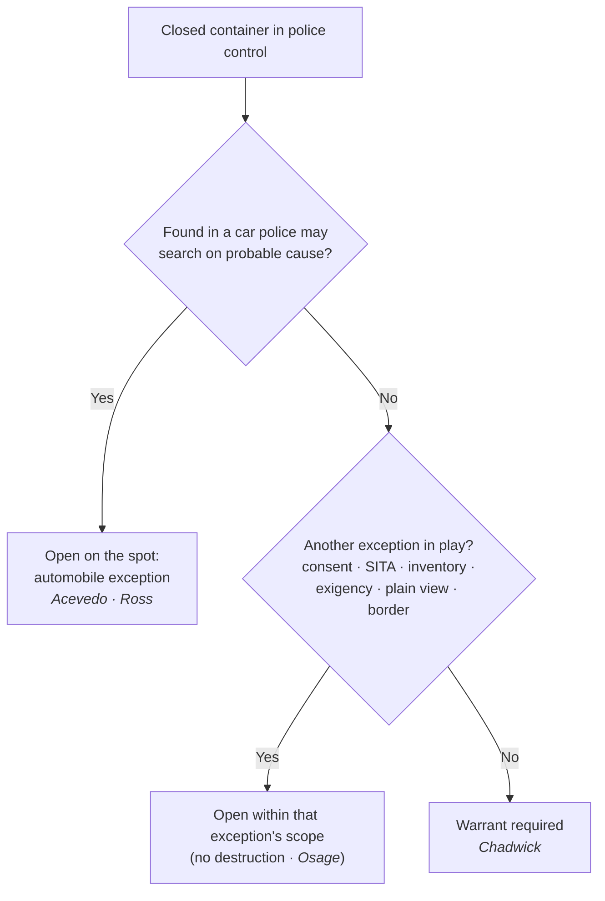

# Searching Effects & Containers

*This closed container or piece of luggage is in my control. May I open it without a warrant, and does it change anything that I found it in a car?*

> [!rule] Black-letter rule
> A closed container or piece of luggage carries a full Fourth Amendment expectation of privacy, so once it is in police control, opening it requires a **warrant** unless a recognized exception applies (consent, search incident to arrest, inventory, exigency, plain view, or the border). The high-privacy footlocker rule of *[[United States v. Chadwick|Chadwick]]* remains good law for a container searched on its own, but *[[California v. Acevedo|Acevedo]]* collapsed the old container/vehicle distinction for a container found **in a car**: there, probable cause supports an on-the-spot search under the [[Automobile Exception|automobile exception]]. *[[United States v. Chadwick|Chadwick]]*, 433 U.S. 1, 13 (1977); *[[California v. Acevedo|Acevedo]]*, 500 U.S. 565, 580 (1991).
> ^rule-containers

## The Brief

**What it is, and is not.** "Effects" is the Fourth Amendment's own word for a person's belongings, and a closed container is the paradigm: a suitcase, a footlocker, a backpack, a sealed package. The rule for opening one is a default plus a list of exits. The default is a warrant, because a container is a place where a person keeps things private. The exits are the recognized warrant exceptions, and the one that changes the analysis most is the [[Automobile Exception|automobile exception]]. This page owns the story of how the container rule and the vehicle rule were reconciled; the vehicle-scope rule itself lives on [[Automobile Exception]], and a person's own effects on their body belong to the search-incident and stop-and-frisk pages.

**The question up front.** For any closed container in police hands, work the sequence:
1. **Is the container in police control with no exception in play?** Then a warrant is required before opening it (*[[United States v. Chadwick|Chadwick]]*).
2. **Was the container found in a car police may search on probable cause?** Then it may be opened on the spot under the automobile exception (*[[California v. Acevedo|Acevedo]]*; *[[United States v. Ross|Ross]]*).
3. **Does another exception reach it?** Consent, a [[Search Incident to Arrest|search incident to arrest]], a standardized inventory, [[Exigent Circumstances and Hot Pursuit|exigency]], plain view, or the border can each independently authorize opening a container on their own terms.

**Chadwick: a container is not a vehicle.** Federal agents had probable cause that a double-locked footlocker held marijuana. They arrested its owners as it was loaded into a car's trunk, seized it, and searched it later at their offices without a warrant. The Court suppressed the contents: "a person's expectations of privacy in personal luggage are substantially greater than in an automobile." *[[United States v. Chadwick|Chadwick]]*, 433 U.S. 1, 13 (1977). Once the footlocker was in exclusive police control with no exigency, neither the arrest nor the car nearby justified a warrantless search. The lesson is that luggage carries its own high privacy interest that does not evaporate merely because it was near a vehicle.

**The unification story: Sanders and Robbins fall, Ross and Acevedo settle it.** *[[United States v. Chadwick|Chadwick]]* produced a decade of line-drawing. *[[Arkansas v. Sanders|Sanders]]* extended *[[United States v. Chadwick|Chadwick]]* to luggage taken from a car, requiring a warrant to open a suitcase seized from a taxi, and *[[Robbins v. California|Robbins]]* said the same of a closed opaque package found during a car search. Then the Court changed course. *[[United States v. Ross|Ross]]* held that when probable cause justifies searching the *vehicle*, it justifies searching "every part of the vehicle and its contents that may conceal the object of the search," 456 U.S. 798, 825 (1982), overruling *[[Robbins v. California|Robbins]]*. *[[California v. Acevedo|Acevedo]]* finished the job for containers, adopting one rule to govern all automobile searches: police may search a container in a car where they have probable cause to believe it holds contraband, whether the probable cause runs to the whole car or to the container alone. 500 U.S. 565, 580 (1991). *[[California v. Acevedo|Acevedo]]* overruled *[[Arkansas v. Sanders|Sanders]]*.

**Keep Chadwick's two points apart (its treatment varies by point).** After *[[California v. Acevedo|Acevedo]]*, *[[United States v. Chadwick|Chadwick]]* still says two things, and only one was cut. As to a container searched **on its own**, away from the vehicle context, its high-privacy rule is **good law**: a warrant is the default. As to a container found **in a car**, *[[United States v. Chadwick|Chadwick]]*'s warrant rule is **limited by *[[California v. Acevedo|Acevedo]]***, which supplies the probable-cause, on-the-spot rule. The practical dividing line is not the container's type but its setting: the same locked briefcase that needs a warrant on an airport bench may be opened on probable cause when it is riding in a car police may lawfully search.

**Other exits that reach a container.** The warrant default yields to several exceptions besides the automobile rule. **Consent** reaches a container within the object and scope a reasonable person would understand, though it never licenses destroying the container (*[[United States v. Osage|Osage]]*; see [[Consent Searches]]). A **[[Search Incident to Arrest|search incident to arrest]]** reaches containers immediately associated with the person, and a standardized **inventory** may open containers under a policy that cabins discretion (*[[Colorado v. Bertine|Bertine]]*; see [[Inventory Searches]]). **[[Exigent Circumstances and Hot Pursuit|Exigency]]**, **plain view**, and the sovereign's **border** authority each supply their own basis. Name the exception you are relying on; "it was a container" is not itself a justification.

**Manipulating and reopening a container.** Two edges bound the analysis. Physically **manipulating** a closed bag can itself be a search: an officer's exploratory squeezing of a bus passenger's soft luggage invaded a [[Reasonable Expectation of Privacy|reasonable expectation of privacy]] (*[[Bond v. United States|Bond]]*; the tactile-privacy point lives on [[Reasonable Expectation of Privacy]]). And **reopening** a container a private party already opened is measured by how far the government exceeds the private search, not by the container's status (*[[United States v. Jacobsen|Jacobsen]]*; the private-search doctrine lives on [[Private and Foreign Searches]]). A prolonged **detention** of luggage to investigate is a distinct seizure question, judged by *[[Terry v. Ohio|Terry]]* limits (*[[United States v. Place|Place]]*; see [[Reasonable Expectation of Privacy]] and [[Terry Stops and Reasonable Suspicion]]).

**Burden, standard of review, remedy.** Because opening a container without a warrant is a warrantless search, the **government** bears the burden of placing it within an exception. Historical facts are reviewed for [[Common Legal Terms#clear-error|clear error]] and the ultimate reasonableness [[Common Legal Terms#de-novo|de novo]]; the **remedy** for opening a container outside any exception is suppression of the contents and their fruits under [[The Exclusionary Rule]].

**Apply it.**
1. **Start from the warrant default.** A closed container in your control is presumptively warrant-protected (*[[United States v. Chadwick|Chadwick]]*).
2. **Ask where you found it.** If it is in a car you may search on probable cause, open it on the spot under the automobile exception (*[[California v. Acevedo|Acevedo]]* / *[[United States v. Ross|Ross]]*).
3. **Otherwise, name your exception.** Consent, a [[Search Incident to Arrest|search incident to arrest]], a policy-driven inventory, [[Exigent Circumstances and Hot Pursuit|exigency]], plain view, or the border each has its own trigger and scope.
4. **Do not destroy to search.** Even a valid consent or search does not authorize ruining the container without explicit authorization or an independent basis (*[[United States v. Osage|Osage]]*).

**Common pitfalls.**
- **Treating "it was a container" as a justification.** The container's status is the question, not the answer; you still need a warrant or a specific exception.
- **Reading *[[United States v. Chadwick|Chadwick]]* as dead.** It is limited only for containers in a car; a container searched on its own still starts from the warrant default (*[[California v. Acevedo|Acevedo]]*).
- **Assuming the car cures everything.** The automobile exception reaches a container in the car only to the extent probable cause reaches the object; probable cause as to one bag is not license to dismantle the vehicle.
- **Squeezing or manipulating a bag as if it were free.** Exploratory tactile inspection can itself be a search (*[[Bond v. United States|Bond]]*).

## Lower-court developments

The Supreme Court framework (*[[United States v. Chadwick|Chadwick]]* to *[[United States v. Ross|Ross]]* to *[[California v. Acevedo|Acevedo]]*) is settled, so the live circuit questions are not about physical containers but about their modern analogues and the edges of the exceptions. Two edges recur: whether a **digital container** (a phone or laptop) can be opened on the theories that reach a physical one, a question *[[Riley v. California|Riley]]* answers with a warrant requirement for device data (see [[SIA Cell Phones]]); and how far a **consent** to search a container goes before it becomes destruction, the line drawn in *[[United States v. Osage|Osage]]* (see [[Consent Searches]]). Both edges apply the settled container rule rather than unsettle it.

## Key cases

| Case | Holding | Opinion |
|---|---|---|
| *[[United States v. Chadwick]]*, 433 U.S. 1 (1977) | **Anchor.** Personal luggage carries a high expectation of privacy; a footlocker reduced to exclusive police control with no [[Exigent Circumstances and Hot Pursuit\|exigency]] may not be searched without a warrant, and its nearness to a car does not change that. | [opinion](https://www.courtlistener.com/opinion/109714/united-states-v-chadwick/) |
| *[[United States v. Ross]]*, 456 U.S. 798 (1982) | **Bridge.** Probable cause to search a vehicle justifies searching every part of it and every container within that may conceal the object; overruled *[[Robbins v. California|Robbins]]*'s closed-container rule. | [opinion](https://www.courtlistener.com/opinion/110719/united-states-v-ross/) |
| *[[California v. Acevedo]]*, 500 U.S. 565 (1991) | **Unification.** One rule governs all automobile searches: a container found in a car may be searched on probable cause it holds contraband, whether the probable cause runs to the car or the container; overruled *[[Arkansas v. Sanders|Sanders]]*. | [opinion](https://www.courtlistener.com/opinion/112608/california-v-acevedo/) |

## Related cases across doctrines

These are treated in full elsewhere but bear on searching effects and containers, framed here.

| Case | Relevance here | Primary home | Opinion |
|---|---|---|---|
| *[[Colorado v. Bertine]]*, 479 U.S. 367 (1987) | ***Inventory route.*** A standardized inventory of an impounded vehicle may open closed containers under criteria that cabin discretion, a no-probable-cause path to a container. | [[Inventory Searches]] | [opinion](https://www.courtlistener.com/opinion/111788/colorado-v-bertine/) |
| *[[Bond v. United States]]*, 529 U.S. 334 (2000) | ***Tactile search.*** An officer's exploratory physical manipulation of a bus passenger's soft luggage is itself a Fourth Amendment search, more intrusive than mere visual observation. | [[Reasonable Expectation of Privacy]] | [opinion](https://www.courtlistener.com/opinion/118354/bond-v-united-states/) |
| *[[United States v. Place]]*, 462 U.S. 696 (1983) | ***Luggage detention.*** A dog sniff of luggage in public is not a search, but a 90-minute investigative seizure of the luggage exceeded *[[Terry v. Ohio|Terry]]* limits, the detention question distinct from opening the bag. | [[Reasonable Expectation of Privacy]] | [opinion](https://www.courtlistener.com/opinion/110979/united-states-v-place/) |
| *[[United States v. Jacobsen]]*, 466 U.S. 109 (1984) | ***Reopening.*** After a private party opens a package and exposes its contents, a government re-inspection is measured by how far it exceeds the private search, not by the container's status. | [[Private and Foreign Searches]] | [opinion](https://www.courtlistener.com/opinion/111143/united-states-v-jacobsen/) |
| *[[Riley v. California]]*, 573 U.S. 373 (2014) | ***Digital container.*** A cell phone is not an ordinary container; its data implicates privacy far beyond physical effects, so a warrant is required to search it even incident to arrest. | [[SIA Cell Phones]] | [opinion](https://www.courtlistener.com/opinion/2680439/riley-v-cal-united-states/) |

## Visual

## Sources
- [*United States v. Chadwick*, 433 U.S. 1 (1977)](https://www.courtlistener.com/opinion/109714/united-states-v-chadwick/) (pinpoints: 11, 13) (treatment: limited by *California v. Acevedo* for containers in a car)
- [*United States v. Ross*, 456 U.S. 798 (1982)](https://www.courtlistener.com/opinion/110719/united-states-v-ross/) (pinpoint: 825; vehicle-scope home = [[Automobile Exception]])
- [*California v. Acevedo*, 500 U.S. 565 (1991)](https://www.courtlistener.com/opinion/112608/california-v-acevedo/) (pinpoint: 580)
- [*Arkansas v. Sanders*, 442 U.S. 753 (1979)](https://www.courtlistener.com/opinion/110119/arkansas-v-sanders/) (overruled by *California v. Acevedo*; home = [[Automobile Exception]])
- [*Robbins v. California*, 453 U.S. 420 (1981)](https://www.courtlistener.com/opinion/110558/robbins-v-california/) (overruled by *United States v. Ross*; home = [[Automobile Exception]])
- [*Colorado v. Bertine*, 479 U.S. 367 (1987)](https://www.courtlistener.com/opinion/111788/colorado-v-bertine/) (home = [[Inventory Searches]])
- [*Bond v. United States*, 529 U.S. 334 (2000)](https://www.courtlistener.com/opinion/118354/bond-v-united-states/) (pinpoint: 338; home = [[Reasonable Expectation of Privacy]])
- [*United States v. Place*, 462 U.S. 696 (1983)](https://www.courtlistener.com/opinion/110979/united-states-v-place/) (pinpoint: 709; home = [[Reasonable Expectation of Privacy]])
- [*United States v. Jacobsen*, 466 U.S. 109 (1984)](https://www.courtlistener.com/opinion/111143/united-states-v-jacobsen/) (pinpoint: 115; home = [[Private and Foreign Searches]])
- [*Riley v. California*, 573 U.S. 373 (2014)](https://www.courtlistener.com/opinion/2680439/riley-v-cal-united-states/) (home = [[SIA Cell Phones]])
- [*United States v. Osage*, 235 F.3d 518 (10th Cir. 2000)](https://www.courtlistener.com/opinion/160502/united-states-v-osage/) (container-destruction limit; home = [[Consent Searches]])
