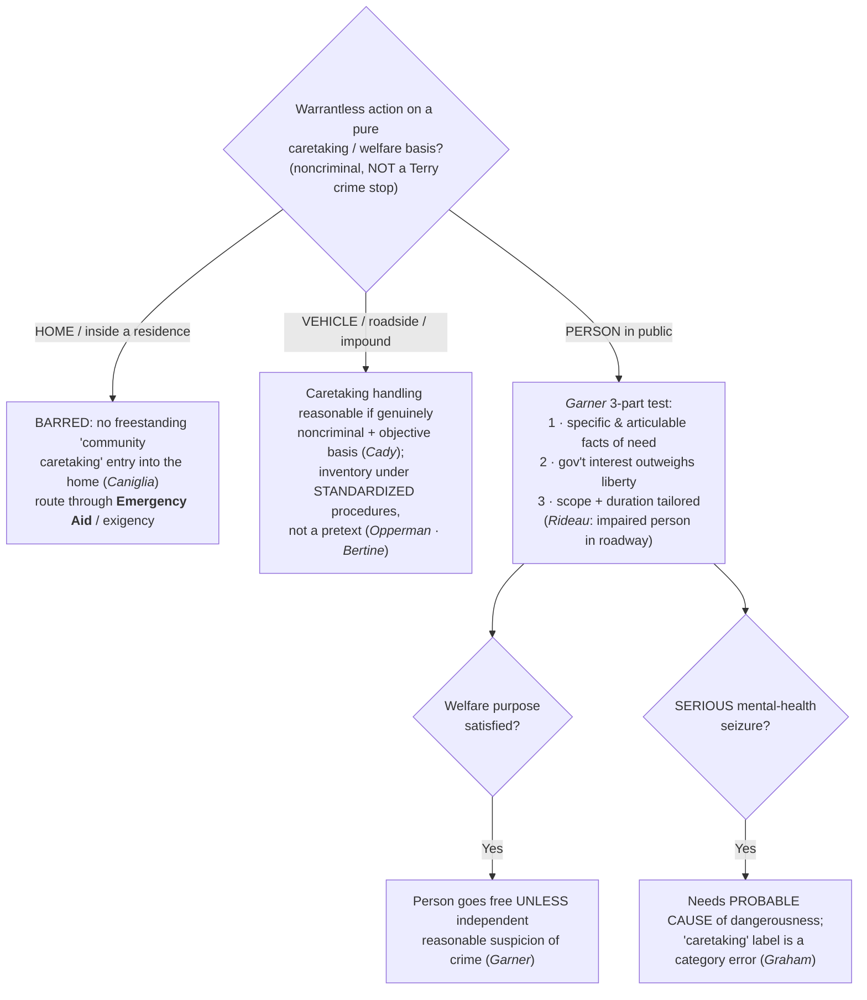

# Community Caretaking

*This is not a crime stop and I am not entering a home. May I act on a pure safety or welfare basis: handle this disabled or impounded vehicle, or briefly stop and check on this person in public?*

> [!rule] Black-letter rule
> **Community caretaking is a NON-HOME doctrine.** It describes the noncriminal, public-safety functions police perform "totally divorced from the detection, investigation, or acquisition of evidence relating to the violation of a criminal statute." *[[Cady v. Dombrowski#^pin-441|Cady v. Dombrowski]]*, 413 U.S. 433, 441 (1973). It reaches two things and stops there: **(a)** vehicles at the roadside or in impound (*Cady*), and **(b)** in the circuits, brief welfare seizures of **persons in public** (*Garner* / *Rideau*). It supplies **no** freestanding authority to enter a **home** — a welfare or safety entry of a residence is not a caretaking question at all and routes through [[Emergency Aid]] or a genuine exigency. *[[Caniglia v. Strom#^pin-op3|Caniglia v. Strom]]*, 593 U.S. 194 (2021).
> ^rule-community-caretaking

## The Brief

**What it is, and what it is not.** Community caretaking is the cluster of noncriminal, public-safety functions police perform apart from investigating crime. These are caretaking-justified actions **placed by holding**; they are **not** crime-suspicion *[[Terry v. Ohio|Terry]]* stops. The justification is safety or welfare, not articulable suspicion of crime, and the two are kept distinct on [[Seizure of the Person]], where caretaking seizures sit beside (and apart from) the *[[Terry v. Ohio|Terry]]*/probable-cause continuum. The doctrine has a hard outer wall: it never crosses a home's threshold. Read the page as a triage in three directions: **vehicle**, **person in public**, and **home** (barred).

### Vehicles, roadside, and impound

Community caretaking was **born in the vehicle**. Local police "frequently investigate vehicle accidents in which there is no claim of criminal liability and engage in what, for want of a better term, may be described as **community caretaking functions**, totally divorced from the detection, investigation, or acquisition of evidence relating to the violation of a criminal statute." *[[Cady v. Dombrowski#^pin-441|Cady]]*, 413 U.S. at 441. On the facts, a warrantless caretaking search of a disabled, towed car's trunk for the off-duty officer's service revolver (undertaken to keep the gun from the wrong hands, not to investigate crime) was reasonable where "the trunk of an automobile, which the officer reasonably believed to contain a gun, was vulnerable to intrusion by vandals." *[[Cady v. Dombrowski#^pin-448|Id.]]* at 448. The doctrine grew out of the **ambulatory character of vehicles** and their lesser expectation of privacy, the very "constitutional difference" between a car and a home that later kept caretaking out of the house.

The downstream of *[[Cady v. Dombrowski|Cady]]*'s vehicle rationale is the **inventory** line: caretaking handling of a lawfully impounded car under **standardized procedures**, not as an investigatory pretext. A routine inventory is reasonable where there is "no suggestion whatever that this standard procedure . . . was a pretext concealing an investigatory police motive." *[[South Dakota v. Opperman|South Dakota v. Opperman]]*, 428 U.S. 364, 376 (1976). Police may even open closed containers, but only where discretion is cabined: "reasonable police regulations relating to inventory procedures administered in good faith satisfy the Fourth Amendment," and discretion is allowed "so long as that discretion is exercised according to standard criteria and on the basis of something other than suspicion of evidence of criminal activity." *[[Colorado v. Bertine#^pin-374|Colorado v. Bertine]]*, 479 U.S. 367, 374–75 (1987). The inventory doctrine is treated in full as an administrative/booking search (cross-link [[Special Needs and Administrative Searches]] and [[Search Incident to Arrest]]).

### Seizing people for non-investigative purposes (public)

**State the scope honestly: this strand is circuit law.** There is **no Supreme Court holding** squarely governing a caretaking **seizure of a person** in public. The doctrine is developed by the circuits, binding in their own and persuasive elsewhere, and the circuits are named below.

**The controlling test up front is the *[[United States v. Garner|Garner]]* (10th Cir.) three-part caretaking-detention test.** An officer exercising community-caretaking functions "may . . . properly detain a person," subject to three requirements:

1. **Articulable need.** The detention "must be based upon 'specific and articulable facts which . . . reasonably warrant [an] intrusion' into the individual's liberty." *[[United States v. Garner|United States v. Garner]]*, 416 F.3d 1208, 1213 (10th Cir. 2005).
2. **Interest-balancing.** "[T]he government's interest must outweigh the individual's interest in being free from arbitrary governmental interference." *[[United States v. Garner|Id.]]*
3. **Tailoring (scope and duration).** "[T]he detention must last no longer than is necessary to effectuate its purpose, and its scope must be carefully tailored to its underlying justification." *[[United States v. Garner|Id.]]*

The **independent-justification backstop** closes the test: once the caretaking purpose is satisfied, the welfare concern can no longer hold the person. "[O]nce the officer has completed the inquiry necessary to satisfy the purpose of the initial detention, he or she must allow the person to proceed **unless the officer has a reasonable suspicion of criminal conduct**." *[[United States v. Garner|Id.]]* (Applied: officers could direct a man reported unconscious in a field for hours to return for a fire-department check; when that exam ended, his continuing evasive, nervous conduct supplied independent reasonable suspicion to extend the stop.)

***[[United States v. Rideau|Rideau]]* (5th Cir., en banc) supplies the paradigm: the impaired person in the roadway.** Caring for an apparently impaired person on the public streets is a recognized public-welfare function. "Police have long served the public welfare by removing intoxicated people from the public streets, where they pose a hazard to themselves and others," so an officer "was warranted in stopping to investigate the situation and check on the man's condition." *[[United States v. Rideau|United States v. Rideau]]*, 969 F.2d 1572, 1574 (5th Cir. 1992) (en banc). A lawful caretaking detention is **not** a license to frisk; a protective patdown still needs "specific and articulable facts indicating that their safety is in danger," *[[United States v. Rideau#^pin-1576|id.]]* at 1576, though on these facts (a man stumbling in a roadway at night who backed away when asked his name) the single, tailored touch of the front pocket was reasonable.

**A serious mental-health seizure ratchets up to probable cause of dangerousness (*[[Graham v. Barnette|Graham]]*, 8th Cir.), and the label is contested.** Decided on remand in light of *[[Caniglia v. Strom|Caniglia]]*, the Eighth Circuit treated the "community caretaking" **label** as a poor fit for a psychiatric seizure, reasoning that after *Caniglia* made clear there is no overarching community-caretaking doctrine, using that label for such a seizure "seems to be a category error." *[[Graham v. Barnette|Graham v. Barnette]]*, 5 F.4th 872 (8th Cir. 2021). The governing measure is higher than a brief caretaking detention: the court held that "**probable cause of dangerousness** is the standard that must be met for a warrantless mental-health seizure to be reasonable under the Fourth Amendment," *[[Graham v. Barnette|id.]]*, and reported that a broad set of its sister circuits require probable cause that a person is mentally ill and dangerous for an emergency mental-health seizure. So a *brief* welfare detention of an impaired person (*[[United States v. Garner|Garner]]* / *[[United States v. Rideau|Rideau]]*) and a *serious psychiatric seizure* (*[[Graham v. Barnette|Graham]]*) are different objects: the former rides the *Garner* test; the latter climbs to **PC of dangerousness**.

***[[Caniglia v. Strom|Caniglia]]* polices the label, not the underlying power, and Alito flagged what is left open.** *Caniglia* held there is no *freestanding* community-caretaking exception for the **home** and expressly declined to address the standards for emergency psychiatric seizures, so its holding is **home-limited** and does **not** disturb *Garner*'s or *Rideau*'s rule for caretaking detentions of persons **in public**. Justice Alito, concurring, wrote separately to highlight several important questions the Court did not decide, identifying at least three categories: short-term seizures to prevent a suicide or for psychiatric evaluation, where the Court's precedents do not supply the governing Fourth Amendment standard; "red flag" firearm-seizure laws, which he noted may be challenged under the Fourth Amendment in cases yet to come; and warrantless entries to check on an incapacitated resident who cannot summon help, which current precedents do not address. *[[Caniglia v. Strom|Caniglia v. Strom]]*, 593 U.S. 194 (2021) (Alito, J., concurring). The takeaway: caretaking of persons in public survives *Caniglia* as a bounded, circuit-developed power; the **label** is contested; and for serious mental-health seizures the operative standard is probable cause of dangerousness.

### The home is barred (tombstone)

There is **no freestanding "community caretaking" exception** authorizing a warrantless entry into the **home**. *[[Caniglia v. Strom#^pin-op3|Caniglia]]* rejected exactly that, holding that the lower court's caretaking rule went beyond anything the Court had previously recognized because *[[Cady v. Dombrowski|Cady]]*'s rationale was vehicle-specific. A welfare or safety **entry of a residence** is not a caretaking question at all: to cross a threshold you need consent, a warrant, or a genuine emergency, and the emergency analysis lives on **[[Emergency Aid]]** (the *[[Brigham City v. Stuart|Brigham City]]* objective-reasonableness standard, now confirmed by *[[Case v. Montana]]* to apply "without further gloss"). The caretaking label is for the **car at the roadside** and the **person in public**, never the front door.

**Burden · standard of review · remedy.** A warrantless caretaking action is justified only if the **government** carries it: for a **vehicle**, that the handling was genuinely noncriminal and reasonable on objective facts (*[[Cady v. Dombrowski|Cady]]*), and for an inventory that it followed **standardized criteria** and was not an investigatory pretext (*[[South Dakota v. Opperman|Opperman]]*; *[[Colorado v. Bertine|Bertine]]*); for a **person**, that the *[[United States v. Garner|Garner]]* three-part test is met and, once the welfare purpose is spent, that **independent reasonable suspicion** supports any further detention; for a **serious mental-health seizure**, **probable cause of dangerousness** (*[[Graham v. Barnette|Graham]]*). Historical facts are reviewed for [[Common Legal Terms#clear-error|clear error]] and the ultimate reasonableness [[Common Legal Terms#de-novo|de novo]]. The **remedy** for an action that flunks the applicable measure, or a "caretaking" entry of a **home**, is **suppression** under [[The Exclusionary Rule]].

**Apply it.**
1. Ask first: is this a **crime** stop? If you have suspicion of crime, you are in *[[Terry v. Ohio|Terry]]*/PC territory, not caretaking.
2. **Vehicle?** Handle it on an objective, noncriminal basis (*Cady*); an impound inventory must follow a **standardized policy** and never be a rummage (*Opperman* · *Bertine*).
3. **Person in public?** Run the *Garner* three parts: articulable need, interest-balance, tailored scope and duration. When the welfare purpose is met, let the person go **unless** independent reasonable suspicion has arisen.
4. **Serious mental-health seizure?** The measure is **probable cause of dangerousness** (*Graham*), not "caretaking."
5. **Home?** Stop. There is no caretaking entry. Get consent or a warrant, or articulate a *[[Brigham City v. Stuart|Brigham City]]* emergency and route through [[Emergency Aid]].

**Common pitfalls.**
- **Using "community caretaking" to enter a home.** Barred; caretaking justifies handling a car at the roadside or a person in public, not walking into a house (*[[Caniglia v. Strom]]*; [[Emergency Aid]]).
- **Labeling a serious psychiatric seizure "community caretaking."** Post-*Caniglia* the label is contested; a serious mental-health seizure needs **probable cause of dangerousness** (*[[Graham v. Barnette]]*).
- **Treating a caretaking stop as a license to investigate crime.** Once the welfare concern is resolved, the person goes free unless you have independent reasonable suspicion (*[[United States v. Garner]]*).
- **Confusing a caretaking seizure with a *[[Terry v. Ohio|Terry]]* stop.** Different justification (safety/welfare, not crime suspicion); placed by holding on [[Seizure of the Person]].
- **Treating a caretaking detention as an automatic frisk.** A patdown still needs specific, articulable safety facts (*[[United States v. Rideau]]*).
- **Letting a vehicle inventory become a rummage.** It must follow standardized criteria and rest on something other than suspicion of evidence (*[[South Dakota v. Opperman]]*; *[[Colorado v. Bertine]]*).

## Lower-court developments

Role-based circuit/state developments only (**no SCOTUS**; any Supreme Court holding, including *[[Caniglia v. Strom]]*, homes to Key cases regardless of date). The persons-in-public strand **is** circuit law, so the live movement is at that level.

- **Post-*[[Caniglia v. Strom|Caniglia]]* re-labeling (8th Cir.).** *[[Graham v. Barnette|Graham v. Barnette]]* (8th Cir. 2021), on remand from the Supreme Court, recast warrantless **psychiatric seizures** away from the "community caretaking" label and onto **probable cause of dangerousness**. *Role: narrows / re-frames.* It reports a broad circuit agreement requiring probable cause that a person is mentally ill and dangerous for an emergency mental-health seizure, a still-circuit-level convergence with **no Supreme Court holding** squarely adopting it. ⚖ Caretaking *label* contested; PC-of-dangerousness standard converging.
- **Function-cabining even where caretaking applies (6th Cir. 2023).** In *United States v. Morgan*, 71 F.4th 540 (6th Cir. 2023), an officer responding to a welfare dispatch opened the car door of a sleeping driver without first trying lights, a knock, or a call-out; the Sixth Circuit suppressed, holding that community-caretaking actions "are permitted when reasonable but only when reasonable" and that "the intrusion must reasonably match the problem at hand." *Role: narrows / cabins the function.* The doctrine's scope is set by its caretaking purpose, not by the label, so the least-intrusive-fit question does real work even in the vehicle setting where caretaking survives.
- **The persons-in-public caretaking detention remains circuit-developed.** *[[United States v. Garner|Garner]]* (10th Cir.) and *[[United States v. Rideau|Rideau]]* (5th Cir., en banc) are the in-circuit-controlling anchors for a brief caretaking detention of a person. The Supreme Court has not decided the question, so outside those circuits the test is persuasive, and the precise contours (when a welfare check ripens into a seizure; how far the *Garner* tailoring prong reaches) are worked out fact-by-fact.

## Key cases

| Case | Holding | Opinion |
|---|---|---|
| *[[Cady v. Dombrowski]]*, 413 U.S. 433 (1973) | **Anchor (vehicles).** Coins "community caretaking functions" in the vehicle context; a warrantless caretaking search of an impounded car for a firearm, divorced from criminal investigation, was reasonable (the car/home distinction). | [opinion](https://www.courtlistener.com/opinion/108850/cady-v-dombrowski/) |
| *[[United States v. Garner]]*, 416 F.3d 1208 (10th Cir. 2005) | **Anchor (persons).** A community-caretaking detention of a person is valid under a three-part test (articulable facts; interest-balance; scope/duration tailored); once the caretaking purpose is met, further detention needs independent reasonable suspicion. | [opinion](https://www.courtlistener.com/opinion/166206/united-states-v-garner/) |
| *[[United States v. Rideau]]*, 969 F.2d 1572 (5th Cir. 1992) (en banc) | Removing an apparently intoxicated person from the public streets is a public-welfare function warranting a stop to check on him; a protective patdown still needs specific, articulable safety facts. | [opinion](https://www.courtlistener.com/opinion/587275/united-states-v-izeal-rideau-jr/) |
| *[[Graham v. Barnette]]*, 5 F.4th 872 (8th Cir. 2021) | **Progeny / Limit.** Post-*[[Caniglia v. Strom|Caniglia]]* the "community caretaking" label for psychiatric seizures is a category error; a warrantless serious mental-health seizure is reasonable only on probable cause of dangerousness. | [opinion](https://www.courtlistener.com/opinion/4900401/teresa-graham-v-shannon-barnette/) |
| *[[Caniglia v. Strom]]*, 593 U.S. 194 (2021) | **Limit.** There is no freestanding "community caretaking" exception for the home; *[[Cady v. Dombrowski|Cady]]*'s rationale was vehicle-specific. Home-limited; does not disturb caretaking of persons in public (Alito, J., concurring, flags psychiatric-seizure, red-flag, and elder-welfare questions as open). | [opinion](https://www.courtlistener.com/opinion/4883694/caniglia-v-strom/) |

## Related cases across doctrines

These are treated in full elsewhere but bear on the vehicle-caretaking / inventory strand, framed for it here.

| Case | Relevance here | Primary home | Opinion |
|---|---|---|---|
| *[[South Dakota v. Opperman]]*, 428 U.S. 364 (1976) | ***Inventory.*** The vehicle-inventory case downstream of *[[Cady v. Dombrowski|Cady]]*'s caretaking rationale: a standardized inventory of a lawfully impounded car, not as an investigatory pretext, is reasonable. | [[Special Needs and Administrative Searches]] | [opinion](https://www.courtlistener.com/opinion/109537/south-dakota-v-opperman/) |
| *[[Colorado v. Bertine]]*, 479 U.S. 367 (1987) | ***Containers on inventory.*** Extends the *Cady*/*Opperman* line: police may open closed containers during an impound inventory when discretion is cabined by standardized criteria. | [[Special Needs and Administrative Searches]] | [opinion](https://www.courtlistener.com/opinion/111788/colorado-v-bertine/) |
| *[[Brigham City v. Stuart]]*, 547 U.S. 398 (2006) | ***Where the home goes.*** A warrantless welfare or safety entry of a residence is not a caretaking question; it must satisfy the emergency-aid standard or a genuine exigency (the tombstone route off this page). | [[Emergency Aid]] | [opinion](https://www.courtlistener.com/opinion/145654/brigham-city-v-stuart/) |

## Visual

## Sources

- [*Cady v. Dombrowski*, 413 U.S. 433 (1973)](https://www.courtlistener.com/opinion/108850/cady-v-dombrowski/) (pinpoints: 441, 448)
- [*United States v. Garner*, 416 F.3d 1208 (10th Cir. 2005)](https://www.courtlistener.com/opinion/166206/united-states-v-garner/) (pinpoint: 1213)
- [*United States v. Rideau*, 969 F.2d 1572 (5th Cir. 1992) (en banc)](https://www.courtlistener.com/opinion/587275/united-states-v-izeal-rideau-jr/) (pinpoints: 1574, 1576)
- *United States v. Morgan*, 71 F.4th 540 (6th Cir. 2023) — https://www.courtlistener.com/opinion/9409483/united-states-v-jaron-howard-morgan/ (function-cabining quotes verified against opinion 9404959 at the S7 repair lane; brief-mention coverage terminal, S7-RL-DISPOSITIONS)
- [*Graham v. Barnette*, 5 F.4th 872 (8th Cir. 2021)](https://www.courtlistener.com/opinion/4900401/teresa-graham-v-shannon-barnette/) (probable-cause-of-dangerousness holding paraphrased; F.4th reporter cite, post-2020 slip pins downgraded per S7 R5)
- [*Caniglia v. Strom*, 593 U.S. 194 (2021)](https://www.courtlistener.com/opinion/4883694/caniglia-v-strom/) (home-bar holding + Alito, J., concurring, open-questions flag; 2021 slip pins downgraded to case cite per S7 R5)
- [*South Dakota v. Opperman*, 428 U.S. 364 (1976)](https://www.courtlistener.com/opinion/109537/south-dakota-v-opperman/) (pinpoint: 376)
- [*Colorado v. Bertine*, 479 U.S. 367 (1987)](https://www.courtlistener.com/opinion/111788/colorado-v-bertine/) (pinpoints: 374, 375)
</content>
</invoke>
