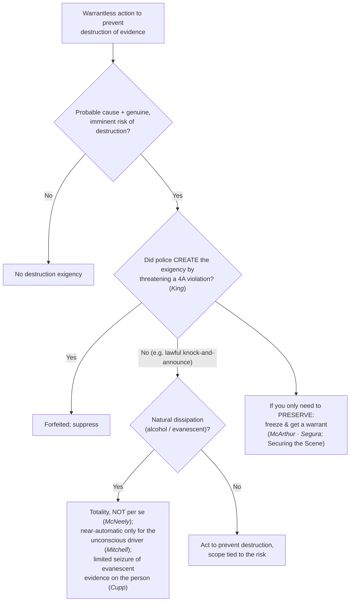

# Exigent Circumstances — Destruction of Evidence

*Evidence is about to be destroyed. May I act now without a warrant, and did my own conduct forfeit the [[Exigent Circumstances and Hot Pursuit|exigency]]?*

> [!rule] Black-letter rule
> The **imminent destruction of evidence** is a recognized exigency: with **probable cause**, officers may enter and act without a warrant to prevent evidence from being destroyed. But the exigency is **not automatic** (natural dissipation alone is judged on the totality, not per se — *[[Missouri v. McNeely|McNeely]]*), and it is **forfeited** where the police created it "by engaging or threatening to engage in conduct that violates the Fourth Amendment." *[[Kentucky v. King|Kentucky v. King]]*, 563 U.S. 452, [462](https://www.courtlistener.com/opinion/216733/kentucky-v-king/) (2011). Where the need is only to **preserve**, the measured response is to **freeze** the scene and get a warrant (*[[Illinois v. McArthur|McArthur]]*), not to search now.
> ^rule-destruction

## The Brief

**What it is.** This page is the **evidence-destruction** branch of the exigent-circumstances family (framework and the pursuit branch on [[Exigent Circumstances and Hot Pursuit]]; the life-safety branch on [[Emergency Aid]]). The [[Exigent Circumstances and Hot Pursuit|exigency]] lets officers with probable cause act without a warrant when there is a genuine risk that evidence will be destroyed or lost before a warrant can be obtained. It carries the family's two outer limits, and it has its own recurring proving ground in the dissipating-alcohol DUI cases.

**The anchor: no police-created exigency (*[[Kentucky v. King|King]]*).** The evidence-destruction exigency is real, but officers cannot manufacture it. "Where . . . the police did not create the exigency by engaging or threatening to engage in conduct that violates the Fourth Amendment, warrantless entry to prevent the destruction of evidence is reasonable and thus allowed." *[[Kentucky v. King|Kentucky v. King]]*, 563 U.S. 452, [462](https://www.courtlistener.com/opinion/216733/kentucky-v-king/) (2011). So when officers smell marijuana at an apartment door, knock and announce their presence, and then hear sounds suggesting evidence is being destroyed, the ensuing warrantless entry is lawful: a lawful knock-and-announce is conduct any private citizen may do, so it does **not** forfeit the exception even though it prompted the destruction. What forfeits the exception is creating the emergency through an actual or threatened **constitutional violation** (for example, announcing an imminent unlawful entry to provoke destruction). The lawful knock at the door is the [[Knock and Talk]] approach.

**The dissipating-evidence line: *[[Schmerber v. California|Schmerber]]* and its limits.** The classic destruction case is the metabolizing intoxicant. A warrantless blood draw on probable cause is reasonable where dissipating alcohol and time already lost leave "no time to seek out a magistrate and secure a warrant." *[[Schmerber v. California#^pin-770|Schmerber v. California]]*, 384 U.S. 757, [770–71](https://www.courtlistener.com/opinion/107262/schmerber-v-california/#:~:text=there%20was%20no%20time%20to) (1966). But dissipation is **not automatic**. *[[Missouri v. McNeely|McNeely]]* rejects a per-se rule: "the natural dissipation of alcohol in the bloodstream does not constitute an exigency in every case sufficient to justify . . . a blood test without a warrant"; the totality controls. *[[Missouri v. McNeely|Missouri v. McNeely]]*, 569 U.S. 141, [156](https://www.courtlistener.com/opinion/858288/missouri-v-mcneely/) (2013). *[[Mitchell v. Wisconsin|Mitchell]]* (a **plurality**) carves out the unconscious-driver scenario: when an unconscious or stuporous DUI suspect must be hospitalized before a breath test, officers "may almost always order a warrantless blood test . . . without offending the Fourth Amendment," subject to the defendant's chance to show his was the unusual case. *[[Mitchell v. Wisconsin|Mitchell v. Wisconsin]]*, 588 U.S. 840 (2019) (plurality), 139 S. Ct. 2525, 2539.

**The dissipation branch reaches the person, not just the home.** It is not limited to blood in the veins. *[[Cupp v. Murphy|Cupp v. Murphy]]* upheld the "very limited search necessary to preserve . . . highly evanescent evidence" (fingernail scrapings taken over the suspect's objection) on probable cause even without a formal arrest, on a narrowed *[[Chimel v. California|Chimel]]* rationale, while expressly declining to authorize a full search. *[[Cupp v. Murphy#^pin-296|Cupp v. Murphy]]*, 412 U.S. 291, [296](https://www.courtlistener.com/opinion/108801/cupp-v-murphy/) (1973). The point is transferable: where evidence on or about the person is genuinely about to vanish, a **narrow** preservation seizure on probable cause can be reasonable, but the scope stays tied to the evanescent thing.

**Cross-doctrine wrinkle: after *[[Birchfield v. North Dakota|Birchfield]]*, a warrantless blood draw must rest on exigency or a warrant.** A warrantless **blood** draw can no longer be justified as a search incident to a DUI arrest; only a **breath** test can. *[[Birchfield v. North Dakota|Birchfield v. North Dakota]]*, 579 U.S. 438 (2016). So post-*[[Birchfield v. North Dakota|Birchfield]]*, a warrantless blood draw must rest on this **destruction/dissipation exigency** (the *[[Schmerber v. California|Schmerber]]* / *[[Missouri v. McNeely|McNeely]]* / *[[Mitchell v. Wisconsin|Mitchell]]* line) or a warrant. The search-incident theory is developed on [[SIA Alcohol Tests]].

**The measured alternative: freeze and get a warrant.** Where the need is only to **preserve** evidence rather than search now, the reasonable response is the **less-intrusive freeze**. With probable cause a home holds contraband and a genuine risk of destruction, officers may temporarily restrain a resident from re-entering, or secure the premises from within, while they diligently obtain a warrant. *[[Illinois v. McArthur|Illinois v. McArthur]]*, 531 U.S. 326 (2001); *[[Segura v. United States|Segura v. United States]]*, 468 U.S. 796 (1984). This is a temporary seizure, not a search, and it is developed on [[Securing the Scene]].

**Burden · standard of review · remedy.** Because a warrantless home entry is presumptively unreasonable, the **government bears the burden** of proving a genuine destruction [[Exigent Circumstances and Hot Pursuit|exigency]] and that the police did not create it by threatening a Fourth Amendment violation. Historical facts are reviewed for [[Common Legal Terms#clear-error|clear error]] and the ultimate reasonableness [[Common Legal Terms#de-novo|de novo]]. The **remedy** for an unjustified entry, or one resting on a police-created [[Exigent Circumstances and Hot Pursuit|exigency]], is **suppression** of the evidence and its fruits under [[The Exclusionary Rule]].

**Apply it.**
1. Confirm **probable cause** and a **genuine, imminent** risk of destruction; do not treat mere possibility as [[Exigent Circumstances and Hot Pursuit|exigency]].
2. For dissipating-substance cases, build the **totality** (*[[Missouri v. McNeely|McNeely]]*); confine the near-automatic rule to *[[Mitchell v. Wisconsin|Mitchell]]*'s unconscious-driver facts.
3. Ask whether your own conduct **created** the [[Exigent Circumstances and Hot Pursuit|exigency]] by threatening a Fourth Amendment violation; a lawful [[Knock-and-Announce|knock-and-announce]] does not forfeit the exception (*[[Kentucky v. King|King]]*).
4. Keep the **scope** tied to the evanescent evidence (*[[Cupp v. Murphy|Cupp]]*); do not convert a preservation seizure into a general search.
5. If you only need to **preserve**, prefer the **freeze**: restrain re-entry and get a warrant (*[[Illinois v. McArthur|McArthur]]* · *[[Segura v. United States|Segura]]*; [[Securing the Scene]]).

**Common pitfalls.**
- **Assuming dissipation alone is exigent.** *[[Missouri v. McNeely|McNeely]]* forecloses a reflexive assumption that dissipating alcohol alone always justifies a warrantless draw.
- **Manufacturing the [[Exigent Circumstances and Hot Pursuit|exigency]].** An [[Exigent Circumstances and Hot Pursuit|exigency]] created by threatening to breach the Fourth Amendment cannot justify the entry; lawful [[Knock-and-Announce|knock-and-announce]] can (*[[Kentucky v. King|King]]*).
- **Justifying a warrantless blood draw as a [[Search Incident to Arrest|search incident to arrest]].** Post-*[[Birchfield v. North Dakota|Birchfield]]* that theory reaches breath, not blood; a blood draw needs a warrant or a real [[Exigent Circumstances and Hot Pursuit|exigency]] (*[[Birchfield v. North Dakota|Birchfield]]*; [[SIA Alcohol Tests]]).
- **Searching when you only needed to preserve.** The proportionate move is the *[[Illinois v. McArthur|McArthur]]* freeze plus a warrant, not a full warrantless search.

## Lower-court developments

Role-based, circuit/state only (**no SCOTUS**; a Supreme Court holding belongs in Key cases regardless of date). The cases below are **Binding in-circuit** within their own circuit and **Persuasive (outside circuit)** elsewhere. Recent circuit law applies *[[Kentucky v. King|King]]*'s no-manufactured-[[Exigent Circumstances and Hot Pursuit|exigency]] rule on a fact-specific basis.

- ***[[United States v. Meyer|United States v. Meyer]]* (8th Cir. 2021)** — *applies *King* (no police-created exigency) in the knock-and-talk setting.* When a suspect's evasive conduct during a consensual knock-and-talk (a stated "need to clean up" and to "check my email") created a risk of evidence destruction, officers did **not** impermissibly manufacture the exigency: asking tough questions and closely scrutinizing the answers, even where that prompts a suspect to begin destroying evidence, is not conduct that "creates" the exigency for *[[Kentucky v. King|King]]* purposes. Warrantless entry and seizure of devices upheld. **Binding in-circuit — 8th Cir.**; **Persuasive (outside circuit)** · good. [opinion](https://www.courtlistener.com/opinion/5302394/united-states-v-william-meyer/)

## Key cases

| Case | Holding | Opinion |
|---|---|---|
| *[[Kentucky v. King]]*, 563 U.S. 452 (2011) | **Anchor.** Police may rely on a self-created [[Exigent Circumstances and Hot Pursuit\|exigency]] (evidence destruction after a lawful [[Knock-and-Announce\|knock-and-announce]]) unless they created it by engaging or threatening conduct that itself violates the Fourth Amendment. | [opinion](https://www.courtlistener.com/opinion/216733/kentucky-v-king/) |
| *[[Schmerber v. California]]*, 384 U.S. 757 (1966) | **Dissipation anchor.** A warrantless blood draw on probable cause is reasonable where dissipating alcohol plus time lost left no time to get a warrant. | [opinion](https://www.courtlistener.com/opinion/107262/schmerber-v-california/) |
| *[[Missouri v. McNeely]]*, 569 U.S. 141 (2013) | **No per-se rule.** Natural metabolization of alcohol is not a per-se [[Exigent Circumstances and Hot Pursuit\|exigency]] for a warrantless DUI blood draw; decide case-by-case on the totality. | [opinion](https://www.courtlistener.com/opinion/858288/missouri-v-mcneely/) |
| *[[Mitchell v. Wisconsin]]*, 588 U.S. 840 (2019) (plurality) | **Unconscious driver.** Where a DUI driver's unconsciousness forces hospitalization, police may almost always order a warrantless blood draw under [[Exigent Circumstances and Hot Pursuit\|exigency]] (defendant may rebut). | [opinion](https://www.courtlistener.com/opinion/9231242/mitchell-v-wisconsin/) |
| *[[Cupp v. Murphy]]*, 412 U.S. 291 (1973) | **Evanescent evidence on the person.** A limited warrantless seizure of highly destructible evidence (fingernail scrapings) on probable cause is reasonable even without a formal arrest; not a full search. | [opinion](https://www.courtlistener.com/opinion/108801/cupp-v-murphy/) |

## Related cases across doctrines

These cases are treated in full elsewhere but bear on the destruction-of-evidence [[Exigent Circumstances and Hot Pursuit|exigency]], framed here for it.

| Case | Relevance here | Primary home | Opinion |
|---|---|---|---|
| *[[Birchfield v. North Dakota]]*, 579 U.S. 438 (2016) | ***Blood needs [[Exigent Circumstances and Hot Pursuit\|exigency]] or a warrant.*** After *[[Birchfield v. North Dakota\|Birchfield]]* a warrantless blood draw is not a search incident to a DUI arrest (a breath test is), so it must rest on this dissipation [[Exigent Circumstances and Hot Pursuit\|exigency]] or a warrant. | [[SIA Alcohol Tests]] | [opinion](https://www.courtlistener.com/opinion/3216497/birchfield-v-north-dakota/) |
| *[[Illinois v. McArthur]]*, 531 U.S. 326 (2001) | ***Freeze, not search.*** With probable cause and a risk of destruction, officers may temporarily restrain a resident from re-entering while they obtain a warrant, the proportionate response to the destruction [[Exigent Circumstances and Hot Pursuit\|exigency]]. | [[Securing the Scene]] | [opinion](https://www.courtlistener.com/opinion/118405/illinois-v-mcarthur/) |
| *[[Segura v. United States]]*, 468 U.S. 796 (1984) | ***Secure premises pending a warrant.*** Officers may secure premises from within where evidence may be destroyed or removed, justifying a temporary freeze rather than an immediate full search. | [[Securing the Scene]] | [opinion](https://www.courtlistener.com/opinion/111259/segura-v-united-states/) |
| *[[Mincey v. Arizona]]*, 437 U.S. 385 (1978) | ***Scope stays tied to the emergency.*** No "seriousness" exception: warrantless activity is strictly circumscribed by the emergency, and a general evidentiary search needs a warrant. | [[Emergency Aid]] | [opinion](https://www.courtlistener.com/opinion/109905/mincey-v-arizona/) |

## Visual

## Sources

- [*Kentucky v. King*, 563 U.S. 452 (2011)](https://www.courtlistener.com/opinion/216733/kentucky-v-king/) (pinpoint: 462 — CAP star page verified, S7 R5 T1)
- [*Schmerber v. California*, 384 U.S. 757 (1966)](https://www.courtlistener.com/opinion/107262/schmerber-v-california/) (pinpoints: 770–71)
- [*Missouri v. McNeely*, 569 U.S. 141 (2013)](https://www.courtlistener.com/opinion/858288/missouri-v-mcneely/) (pinpoint: 156)
- [*Mitchell v. Wisconsin*, 588 U.S. 840 (2019) (plurality)](https://www.courtlistener.com/opinion/9231242/mitchell-v-wisconsin/) (pinpoint: 139 S. Ct. 2539)
- [*Cupp v. Murphy*, 412 U.S. 291 (1973)](https://www.courtlistener.com/opinion/108801/cupp-v-murphy/) (pinpoint: 296)
- [*Birchfield v. North Dakota*, 579 U.S. 438 (2016)](https://www.courtlistener.com/opinion/3216497/birchfield-v-north-dakota/)
- [*Illinois v. McArthur*, 531 U.S. 326 (2001)](https://www.courtlistener.com/opinion/118405/illinois-v-mcarthur/)
- [*Segura v. United States*, 468 U.S. 796 (1984)](https://www.courtlistener.com/opinion/111259/segura-v-united-states/)
- [*Mincey v. Arizona*, 437 U.S. 385 (1978)](https://www.courtlistener.com/opinion/109905/mincey-v-arizona/)
- [*United States v. Meyer*, 8th Cir. 2021](https://www.courtlistener.com/opinion/5302394/united-states-v-william-meyer/)
</content>
