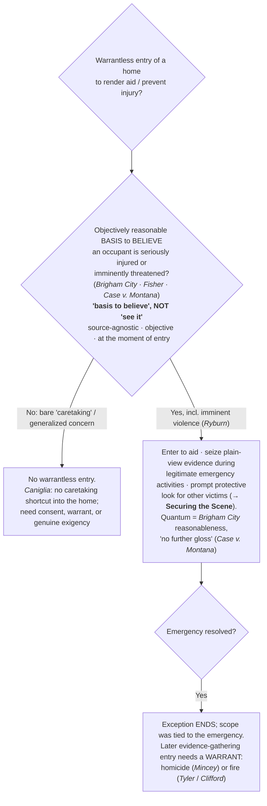

# Exigent Circumstances — Emergency Aid

*Someone inside may be hurt. May I enter?*

> [!rule] Black-letter rule
> Police "may enter a home without a warrant when they have an **objectively reasonable basis** for believing that an occupant is seriously injured or imminently threatened with such injury." *[[Brigham City v. Stuart#^pin-400|Brigham City v. Stuart]]*, 547 U.S. 398, [400](https://www.courtlistener.com/opinion/145654/brigham-city-v-stuart/) (2006). The standard is **purely objective** — the officer's subjective motive is irrelevant — judged at the **moment of entry**, and it applies "with no further gloss": it is **not** lowered to reasonable suspicion and **not** raised to probable cause. *[[Case v. Montana#^pin-slip7|Case v. Montana]]*, 607 U.S. ___ (2026) (slip op., at 7–8). The entry is **scope-limited** to the emergency; there is no "community caretaking" shortcut into the home and no "murder-scene" exception.
> ^rule-emergency-aid

## The Brief

**What it is.** This page governs the warrantless **entry of a home** (or other protected premises) to render **emergency aid** or head off imminent injury. It does not ask whether a crime is afoot; the entry is a noncriminal, life-safety justification judged by its own objective-reasonableness measure. It is one branch of the broader exigent-circumstances family ([[Exigent Circumstances and Hot Pursuit]]), pulled out here because it has its own quantum and its own scope rule.

**The test up front: an objectively reasonable basis to believe.** The trigger is an objectively reasonable **basis to believe** an occupant is seriously injured or imminently threatened, and the officer's purpose is beside the point: "An action is 'reasonable' under the Fourth Amendment, regardless of the individual officer's state of mind . . . . The officer's subjective motivation is irrelevant." *[[Brigham City v. Stuart#^pin-404|Brigham City]]*, 547 U.S. at [404](https://www.courtlistener.com/opinion/145654/brigham-city-v-stuart/). A bad or mixed motive does not defeat an objectively reasonable entry, and a pure good-faith hunch with no objective basis does not create one.

**Read the standard exactly: "basis to believe," not "see it."** The trigger is source-agnostic. A 911 hang-up, a credible report of a suicide in progress, the sounds of a violent struggle, or blood glimpsed through a window can each supply the objective basis. The rule is **not** narrowed to "the officer must *see* the injury"; the Court imposed no visual-observation requirement, and shrinking "basis to believe" into "see it" would rewrite a source-agnostic standard into one the Court never wrote.

**No ironclad proof; judged at the moment of entry.** Officers "do not need ironclad proof of 'a likely serious, life-threatening' injury to invoke the emergency aid exception." *[[Michigan v. Fisher|Michigan v. Fisher]]*, 558 U.S. 45, [48](https://www.courtlistener.com/opinion/1755/michigan-v-fisher/) (2009) ([[Common Legal Terms#per-curiam|per curiam]]). The inquiry is the objective reasonableness of the belief at the moment of entry, not the officer's certainty about what is happening inside and not a hindsight test of whether the officer turned out to be right. A residence in chaos (a wrecked truck, broken windows, fresh blood, a man screaming and hurling objects) gave an objectively reasonable basis even though the blood was "mere drops" and the occupant seemed able to tend to himself.

**Imminent violence is an emergency too, judged from the on-scene perspective.** The exception is not limited to a victim already bleeding; an objectively reasonable basis to fear imminent violence supports entry. "[T]he Fourth Amendment permits an officer to enter a residence if the officer has a reasonable basis for concluding that there is an imminent threat of violence." *[[Ryburn v. Huff#^pin-476|Ryburn v. Huff]]*, 565 U.S. 469, [476](https://www.courtlistener.com/opinion/622303/ryburn-v-huff/) (2012) (per curiam). Reasonableness is judged from a reasonable officer's on-scene perspective, not with hindsight, and "a combination of events each of which is mundane when viewed in isolation may paint an alarming picture": where a mother fled back into the house after refusing to say whether there were guns inside, entry on an "objectively reasonable basis for fearing that violence was imminent" was reasonable. *[[Ryburn v. Huff#^pin-477|Id.]]* at 477.

**The quantum is *[[Brigham City v. Stuart|Brigham City]]* reasonableness, confirmed "without further gloss."** The Supreme Court has now held that the emergency-aid standard applies "with no further gloss." It is **not lowered** to *[[Terry v. Ohio|Terry]]* reasonable suspicion: "*Brigham City* did not adopt *Terry*'s reasonable-suspicion standard for home entries. . . . Rather, *Brigham City* formulated its own standard for dealing with household emergencies." *[[Case v. Montana#^pin-slip7|Case v. Montana]]*, 607 U.S. ___ (2026) (slip op., at 7). And it is **not raised** to probable cause: "We decline Case's invitation to put a new probable-cause spin onto *Brigham City*. . . . [W]e asked simply whether an officer had 'an objectively reasonable basis for believing' that his entry was direly needed to prevent or deal with serious harm." *[[Case v. Montana#^pin-slip8|Id.]]* (slip op., at 8). Probable cause "is rooted in, and derives its meaning from, the criminal context, and we decline to transplant it to this different one." The entry is also **scope-limited**: "an emergency-aid entry provides no basis to search the premises beyond what is reasonably needed to deal with the emergency while maintaining the officers' safety," assessed "on its own terms." *[[Case v. Montana#^pin-slip9|Id.]]* (slip op., at 9).

**No "murder-scene exception"; the scope is tied to the emergency.** The seriousness of a suspected crime does not by itself create [[Exigent Circumstances and Hot Pursuit|exigency]]: "the Fourth Amendment does not bar police officers from making warrantless entries and searches when they reasonably believe that a person within is in need of immediate aid," *[[Mincey v. Arizona|Mincey v. Arizona]]*, 437 U.S. 385, [392](https://www.courtlistener.com/opinion/109905/mincey-v-arizona/) (1978), and "the police may seize any evidence that is in plain view during the course of their legitimate emergency activities," *[[Mincey v. Arizona|id.]]* at 393. But the warrantless activity must be **strictly circumscribed by the emergency that justifies it**. *[[Mincey v. Arizona|Mincey]]* rejected a four-day warrantless search of a homicide scene on exactly that ground: once the injured are aided and the danger resolved, continued searching needs its own justification. The affirmative side of the same limit is the **prompt protective look for other victims or a perpetrator still on scene**; the scope limit forbids a general crime-scene search, not the immediate rescue or [[Securing the Scene|protective sweep]] itself (the sweep mechanics live on [[Securing the Scene]]).

**No caretaking shortcut into the home (and where caretaking of persons does live).** A welfare-check or safety entry must route through emergency aid or a genuine [[Exigent Circumstances and Hot Pursuit|exigency]]; it may not rest on a freestanding "community caretaking" theory. The lower court's caretaking rule "goes beyond anything this Court has recognized" because *[[Cady v. Dombrowski|Cady]]*'s rationale was vehicle-specific, a "constitutional difference" the opinion repeatedly stressed. *[[Caniglia v. Strom#^pin-op3|Caniglia v. Strom]]*, 593 U.S. 194 (2021). *[[Caniglia v. Strom|Caniglia]]* **cabins** caretaking to the vehicle and **leaves the emergency-aid and [[Exigent Circumstances and Hot Pursuit|exigency]] home-entry exceptions intact**: it polices the *label*, not the underlying emergency power. Operationally, the move *[[Caniglia v. Strom|Caniglia]]* forecloses is invoking "caretaking" at the front door; the move it preserves is articulating a *[[Brigham City v. Stuart|Brigham City]]* emergency. The non-home caretaking doctrine (vehicles, and welfare seizures of **persons in public**) lives on [[Community Caretaking]] under its *Seizing people for non-investigative purposes (public)* section.

**The dissipation rule is general; fire scenes show it too.** The principle that "the emergency-entry justification ends when the emergency ends" is not homicide-only. "A burning building clearly presents an exigency of sufficient proportions to render a warrantless entry 'reasonable,'" and officials may "remain in a building for a reasonable time to investigate the cause of a blaze after it has been extinguished," but "[t]hereafter, additional entries to investigate the cause of the fire must be made pursuant to the warrant procedures governing administrative searches." *[[Michigan v. Tyler#^pin-509|Michigan v. Tyler]]*, 436 U.S. 499, [509–11](https://www.courtlistener.com/opinion/109874/michigan-v-tyler/) (1978). Where reasonable privacy interests remain, the later search needs a warrant: administrative to determine cause and origin, **criminal on probable cause** where "the primary object of the search is to gather evidence of criminal activity." *[[Michigan v. Clifford#^pin-294|Michigan v. Clifford]]*, 464 U.S. 287, [294](https://www.courtlistener.com/opinion/111057/michigan-v-clifford/) (1984) (plurality). Whether the scene is a homicide (*[[Mincey v. Arizona|Mincey]]*) or a fire (*[[Michigan v. Tyler|Tyler]]* / *[[Michigan v. Clifford|Clifford]]*), a lawful initial emergency entry does not bless a later evidence-gathering one. (The fire authorities are developed on [[Fire-Scene Entries]].)

**Burden · standard of review · remedy.** A warrantless entry of a home is presumptively unreasonable, so the **government** bears the burden of establishing that the emergency-aid exception justified it. The substantive inquiry is objective and totality-based, fixed at the moment of entry; the reasonableness of the limited entry is assessed "on its own terms," not through the investigative-probable-cause lens. *[[Case v. Montana#^pin-slip9|Case v. Montana]]* (slip op., at 9). Historical facts are reviewed for [[Common Legal Terms#clear-error|clear error]] and the ultimate reasonableness [[Common Legal Terms#de-novo|de novo]]. The **remedy** for an entry (or a search exceeding the emergency's scope) that flunks the test is **suppression** of the evidence and its fruits under [[The Exclusionary Rule]].

**Apply it.**
1. Name the **objective basis**: what report, call, sound, or observation makes it reasonable to believe someone inside is seriously hurt or in imminent danger? You need a basis to *believe*, not to *see*.
2. Do not grade your motive. A mixed motive does not defeat an objectively reasonable entry, and good intentions do not supply one.
3. Enter only to the **scope of the emergency**: aid the occupant, do a prompt protective look for other victims, and seize plain-view evidence found during those legitimate activities.
4. When the emergency ends, **stop**. Further evidence-gathering needs a warrant (homicide scene, *[[Mincey v. Arizona|Mincey]]*; fire scene, *[[Michigan v. Tyler|Tyler]]* / *[[Michigan v. Clifford|Clifford]]*).
5. Do not label a bare wellness concern "community caretaking" at the door. Articulate a *Brigham City* emergency, or get consent or a warrant.

**Common pitfalls.**
- **Narrowing "basis to believe" into "see it."** The standard is source-agnostic; do not tell the field they must visually confirm an injury (*[[Brigham City v. Stuart]]*).
- **Invoking "community caretaking" at the front door.** Post-*[[Caniglia v. Strom|Caniglia]]* this is the headline error; articulate a *Brigham City* emergency (*[[Caniglia v. Strom]]*).
- **Reading *[[Caniglia v. Strom|Caniglia]]* as abolishing emergency-aid entries.** It rejects only a *freestanding* caretaking exception for the home.
- **Treating a serious crime as automatic [[Exigent Circumstances and Hot Pursuit|exigency]].** No murder-scene exception (*[[Mincey v. Arizona]]*).
- **Overstaying the emergency.** The exception ends when the emergency ends; later evidence-gathering needs a warrant, and that dissipation rule reaches fire scenes too (*[[Mincey v. Arizona]]*; *[[Michigan v. Tyler]]* / *[[Michigan v. Clifford]]*).
- **Relying on good intentions or grading in hindsight.** The test is objective and judged at the moment of entry (*[[Brigham City v. Stuart]]*; *[[Michigan v. Fisher]]*).

## Lower-court developments

Role-based circuit/state developments only (**no SCOTUS**; the controlling Supreme Court cases, including the 2026 decision in *[[Case v. Montana]]*, home to Key cases regardless of date). The principal recent movement was a **circuit split over whether courts could graft a probable-cause gloss onto emergency-aid entries**: the Second, Eleventh, and D.C. Circuits had read in a probable-cause requirement, while the First and Eighth Circuits had not. ⚖ **Circuit split (now resolved).** *[[Case v. Montana]]* (2026) settled it **against** the probable-cause gloss, holding *[[Brigham City v. Stuart|Brigham City]]*'s reasonableness standard applies "with no further gloss." With the quantum question settled, the open line-drawing concerns the **articulable, objective basis** a welfare-check entry must show and the **scope** of the post-entry protective look once aid is rendered.

- **Applying the emergency-aid standard to a welfare check (7th Cir.): *[[Gaetjens v. Winnebago County|Gaetjens v. Winnebago County]]* (2021).** *Applies / illustrates.* Officers who had an objectively reasonable basis to believe a missing woman was suffering a medical emergency could enter her home without a warrant under the emergency-aid exception, an entry analyzed under the objective-reasonableness standard rather than any freestanding caretaking theory. **Binding in-circuit — 7th Cir.** · good. [opinion](https://www.courtlistener.com/opinion/4899427/sally-gaetjens-v-winnebago-county-illinois/)

## Key cases

| Case | Holding | Opinion |
|---|---|---|
| *[[Brigham City v. Stuart]]*, 547 U.S. 398 (2006) | **Anchor.** Emergency-aid entry of a home is lawful on an objectively reasonable basis to believe an occupant is seriously injured or imminently threatened; the officer's subjective motivation is irrelevant. | [opinion](https://www.courtlistener.com/opinion/145654/brigham-city-v-stuart/) |
| *[[Case v. Montana]]*, 607 U.S. ___ (2026) | **Quantum, settled.** *[[Brigham City v. Stuart\|Brigham City]]*'s objective-reasonableness standard governs "with no further gloss": neither lowered to reasonable suspicion nor raised to probable cause, and the entry is scope-limited to the emergency. | [opinion](https://www.courtlistener.com/opinion/10774335/case-v-montana/) |
| *[[Michigan v. Fisher]]*, 558 U.S. 45 (2009) (per curiam) | Applies *[[Brigham City v. Stuart\|Brigham City]]*: officers need no ironclad proof of serious injury and need not be right in hindsight; the test is objective reasonableness at the moment of entry. | [opinion](https://www.courtlistener.com/opinion/1755/michigan-v-fisher/) |
| *[[Ryburn v. Huff]]*, 565 U.S. 469 (2012) (per curiam) | An objectively reasonable basis to fear imminent violence supports a warrantless home entry, judged from the reasonable officer's on-scene perspective, where individually mundane events can paint an alarming picture. | [opinion](https://www.courtlistener.com/opinion/622303/ryburn-v-huff/) |
| *[[Mincey v. Arizona]]*, 437 U.S. 385 (1978) | **No "murder-scene" exception.** Seriousness alone is not [[Exigent Circumstances and Hot Pursuit\|exigency]]; warrantless entry to render immediate aid (and seize plain-view evidence during legitimate emergency activities) is allowed, but is strictly circumscribed by the emergency. | [opinion](https://www.courtlistener.com/opinion/109905/mincey-v-arizona/) |
| *[[Caniglia v. Strom]]*, 593 U.S. 194 (2021) | **Limit.** No freestanding "community caretaking" exception authorizing warrantless entry into the home; welfare/safety entries must route through emergency aid or a genuine [[Exigent Circumstances and Hot Pursuit\|exigency]]. Cabins *[[Cady v. Dombrowski\|Cady]]* to vehicles; leaves emergency aid intact. | [opinion](https://www.courtlistener.com/opinion/4883694/caniglia-v-strom/) |

## Related cases across doctrines

These are treated in full elsewhere but bear on the emergency-aid scope/dissipation line, framed for it here.

| Case | Relevance here | Primary home | Opinion |
|---|---|---|---|
| *[[Michigan v. Tyler]]*, 436 U.S. 499 (1978) | ***Dissipation outside homicide.*** A burning building is an [[Exigent Circumstances and Hot Pursuit\|exigency]] needing no warrant, and officials may remain a reasonable time to investigate cause; later investigative entries, once the [[Exigent Circumstances and Hot Pursuit\|exigency]] has ended, need a warrant. | [[Fire-Scene Entries]] | [opinion](https://www.courtlistener.com/opinion/109874/michigan-v-tyler/) |
| *[[Michigan v. Clifford]]*, 464 U.S. 287 (1984) (plurality) | ***Fire scene, refined.*** Where reasonable privacy interests remain in fire-damaged property, a post-fire search needs a warrant: administrative for cause/origin, criminal on probable cause if the object is evidence of crime. | [[Fire-Scene Entries]] | [opinion](https://www.courtlistener.com/opinion/111057/michigan-v-clifford/) |
| *[[Cady v. Dombrowski]]*, 413 U.S. 433 (1973) | ***Where caretaking of persons lives.*** The vehicle-and-persons-in-public caretaking power (kept out of the home by *[[Caniglia v. Strom\|Caniglia]]*) is developed on the caretaking page's non-investigative-persons section, not here. | [[Community Caretaking]] | [opinion](https://www.courtlistener.com/opinion/108850/cady-v-dombrowski/) |

## Visual

## Sources

- [*Brigham City v. Stuart*, 547 U.S. 398 (2006)](https://www.courtlistener.com/opinion/145654/brigham-city-v-stuart/) (pinpoints: 400, 404)
- [*Case v. Montana*, 607 U.S. ___ (2026) (No. 24-624)](https://www.courtlistener.com/opinion/10774335/case-v-montana/) (pinpoints: slip op. at 7, 8, 9 — current-Term slip pins stand)
- [*Michigan v. Fisher*, 558 U.S. 45 (2009) (per curiam)](https://www.courtlistener.com/opinion/1755/michigan-v-fisher/) (pinpoint: 48)
- [*Ryburn v. Huff*, 565 U.S. 469 (2012) (per curiam)](https://www.courtlistener.com/opinion/622303/ryburn-v-huff/) (pinpoints: 476, 477)
- [*Mincey v. Arizona*, 437 U.S. 385 (1978)](https://www.courtlistener.com/opinion/109905/mincey-v-arizona/) (pinpoints: 392, 393)
- [*Caniglia v. Strom*, 593 U.S. 194 (2021)](https://www.courtlistener.com/opinion/4883694/caniglia-v-strom/) (home-bar holding paraphrased; 2021 slip pins downgraded to case cite)
- [*Michigan v. Tyler*, 436 U.S. 499 (1978)](https://www.courtlistener.com/opinion/109874/michigan-v-tyler/) (pinpoints: 509, 510, 511)
- [*Michigan v. Clifford*, 464 U.S. 287 (1984) (plurality)](https://www.courtlistener.com/opinion/111057/michigan-v-clifford/) (pinpoint: 294)
- [*Gaetjens v. Winnebago County*, 4 F.4th 487 (7th Cir. 2021)](https://www.courtlistener.com/opinion/4899427/sally-gaetjens-v-winnebago-county-illinois/) (F.4th reporter cite; post-2020 slip pins paraphrased rather than page-cited)
</content>
