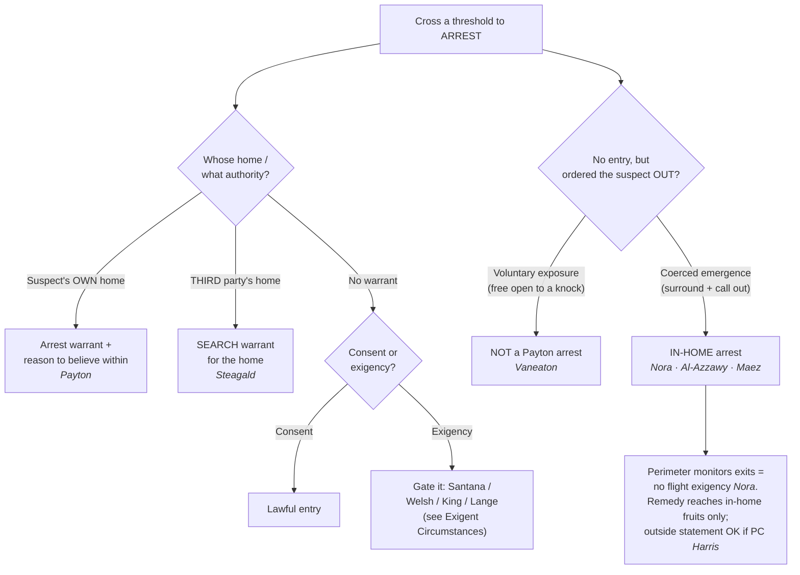

# Entry to Arrest

*May police cross a home's threshold to make an arrest, and does forcing a suspect out from the outside count as an entry? This page fixes the entry authority; the reasonableness of the arrest itself lives on the pages it points to.*

> [!rule] Black-letter rule
> **Match the warrant to the home, and remember that a threshold can be crossed by force as well as by foot.** For the suspect's **own** dwelling, "an arrest warrant founded on probable cause implicitly carries with it the limited authority to enter a dwelling in which the suspect lives when there is reason to believe the suspect is within." *[[Payton v. New York]]*, 445 U.S. 573, [603](https://www.courtlistener.com/opinion/110235/payton-v-new-york/) (1980). To arrest that suspect inside a **third party's** home, officers need a **search warrant** for the home. *[[Steagald v. United States#^pin-205|Steagald v. United States]]*, 451 U.S. 204, [205–06](https://www.courtlistener.com/opinion/110464/steagald-v-united-states/) (1981). Absent a warrant the entry survives only on **consent** or a genuine **[[Exigent Circumstances and Hot Pursuit|exigency]]**. Whether staying outside the doorway defeats that protection is **unsettled — the Supreme Court has never decided it and the circuits divide** (see **Lower-court developments** below). In the **recognizing circuits**, police who mount a coercive show of force to draw a suspect out of a surrounded home effect a warrantless arrest "in the home" that *[[Payton v. New York|Payton]]* forbids, because it is the arrestee's location, not the officers', that fixes where the arrest occurs; **other circuits reject that constructive-entry theory**, keeping only the officer's body, not his voice, outside the threshold.
> ^rule-entry-to-arrest

## The Brief

**Two homes, two warrants.** Entry to arrest turns first on whose home the officer means to cross into. For the suspect's **own** dwelling, *[[Payton v. New York#^pin-590|Payton]]* draws "a firm line at the entrance to the house," and "[a]bsent exigent circumstances, that threshold may not reasonably be crossed without a warrant." 445 U.S. at 590. An **arrest warrant** for the suspect carries the limited authority to enter his own home to serve it "when there is reason to believe the suspect is within." *Id.* at 603. That "reason to believe" quantum loads two predicates (the suspect **resides** there and is **presently home**) and divides the circuits; it is treated in full at [[Arrest in the Home]].

**A third party's home takes a search warrant.** An arrest warrant protects the person named in it, not the householder, so to look for the suspect inside **someone else's** home the officers need a **search warrant** for that home. *[[Steagald v. United States#^pin-205|Steagald v. United States]]*, 451 U.S. 204, [205–06](https://www.courtlistener.com/opinion/110464/steagald-v-united-states/) (1981). Two protected interests then run at once: the homeowner's (*[[Steagald v. United States|Steagald]]*) and, if the suspect is an overnight guest, his own (*[[Minnesota v. Olson]]*; see [[Standing to Challenge a Search]]).

**No warrant means consent or a real [[Exigent Circumstances and Hot Pursuit|exigency]].** When officers have neither warrant, the entry stands only on **consent** or a genuine emergency (escape, imminent destruction of evidence, or danger), and the [[Exigent Circumstances and Hot Pursuit|exigency]] is gated by *[[United States v. Santana#^pin-43|Santana]]* (the doorway is public and [[Exigent Circumstances and Hot Pursuit|hot pursuit]] crosses it), *[[Welsh v. Wisconsin#^pin-753|Welsh]]* (a minor offense rarely justifies a home entry), *[[Kentucky v. King]]* (lawful police-created [[Exigent Circumstances and Hot Pursuit|exigency]] is fine, an unlawfully manufactured one is not), and *[[Lange v. California]]* (misdemeanor pursuit is case-by-case, not categorical). The full [[Exigent Circumstances and Hot Pursuit|exigency]] analysis lives at [[Exigent Circumstances and Hot Pursuit]].

**The surround-and-call-out problem.** The hard modern question is whether officers who never step across the threshold can still make an "in-home" arrest by coercing the suspect out. They can. The Ninth Circuit's spine case is *[[United States v. Nora#^pin-1054|United States v. Nora]]*, 765 F.3d 1049 (9th Cir. 2014): 20 to 30 officers surrounded a house with weapons drawn and a helicopter overhead, then ordered the occupant out over a public-address system. Because a suspect summoned from a surrounded home "is treated as arrested inside it unless he voluntarily exposed himself," the government had to justify a warrantless in-home arrest, and it could not. 765 F.3d at 1054.

**The containment-versus-exit-command line.** Whether an emergence is an in-home arrest turns on coercion, and the two poles are drawn by a matched pair. On the coerced-emergence side, *[[United States v. Al-Azzawy#^pin-894|Al-Azzawy]]* holds that where officers "completely surrounded appellee's trailer with their weapons drawn and ordered him through a bullhorn to leave," a suspect who "did not voluntarily expose himself ... but only emerged under circumstances of extreme coercion" was "arrested while he was still inside his trailer." 784 F.2d 890, 894–95 (9th Cir. 1986). On the voluntary-exposure side, *[[United States v. Vaneaton#^pin-1426|Vaneaton]]* holds that a suspect who freely opens his door to a "noncoercive knock" and is arrested at the open doorway has "voluntarily exposed himself to warrantless arrest," so *[[Payton v. New York|Payton]]* is not offended. 49 F.3d 1423, 1426–27 (9th Cir. 1995). The question is never the suspect's exact inches from the sill; it is whether the exit was commanded or chosen.

**The perimeter defeats the flight [[Exigent Circumstances and Hot Pursuit|exigency]].** The tactic that makes a surround-and-call-out powerful is also what disarms the government's usual excuse. In *[[United States v. Nora|Nora]]* the court found no danger to others and held that "the officers had no reason to believe Nora might pose a danger to the public by attempting to flee, since they had the house completely surrounded and could monitor all exit points." 765 F.3d at 1055. A complete perimeter with monitored exits forecloses escape, so the containment the officers rely on to justify skipping the warrant is the very fact that negates a flight-based [[Exigent Circumstances and Hot Pursuit|exigency]]. A **present, articulated danger** is different: *[[United States v. Al-Azzawy|Al-Azzawy]]* itself reversed suppression because reported grenades and threats to blow up the trailer park supplied a real [[Exigent Circumstances and Hot Pursuit|exigency]] that excused the warrantless in-home arrest. 784 F.2d at 895.

**The remedy is bounded to the home.** A *[[Payton v. New York|Payton]]* violation suppresses only what the unlawful entry produced **inside** the home. Where officers had **probable cause** to arrest, the violation does not bar a statement the suspect later makes **outside**: "the exclusionary rule does not bar the State's use of a statement made by the defendant outside of his home, even though the statement is taken after an arrest made in the home in violation of *Payton*." *[[New York v. Harris#^pin-21|New York v. Harris]]*, 495 U.S. 14, [21](https://www.courtlistener.com/opinion/112413/new-york-v-harris/) (1990). A later, properly-Mirandized station-house statement in lawful custody is not the fruit of "having been arrested in the home rather than someplace else." *Id.* at 19.

**Common pitfalls.**
- **Thinking the officer's body must cross the line before *[[Payton v. New York|Payton]]* applies.** A surround-and-call-out that coerces the suspect out is an in-home arrest even though no officer steps inside; the arrestee's location controls. *[[United States v. Nora]]*; *[[United States v. Maez]]*.
- **Reading a doorway arrest as automatically lawful.** A suspect who **voluntarily** opens to a noncoercive knock exposes himself (*[[United States v. Vaneaton]]*), but one who emerges under an overwhelming show of force does not (*[[United States v. Al-Azzawy]]*). The line is coercion, not the threshold.
- **Using the perimeter as the [[Exigent Circumstances and Hot Pursuit|exigency]].** A completely surrounded house with monitored exits *removes* the flight risk; officers cannot invoke the containment they created as the emergency that excuses the warrant. *[[United States v. Nora]]*.
- **Using an arrest warrant to enter a third party's home.** That is a *[[Steagald v. United States|Steagald]]* violation; the home needs its own **search warrant**.
- **Assuming a *[[Payton v. New York|Payton]]* violation suppresses everything.** Under *[[New York v. Harris]]* a station-house statement made on probable cause survives; the remedy reaches only the in-home fruits.

## Lower-court developments

The Supreme Court has never decided whether coercing a suspect out of a surrounded home is a *[[Payton v. New York|Payton]]* in-home arrest, and the circuits divide. The decisions below are **Binding in-circuit** within their own circuits and **Persuasive (outside circuit)** elsewhere; the split is real, so never state one circuit's rule as national law.

- **Recognizing side (coerced emergence is a *[[Payton v. New York|Payton]]* in-home arrest).** The **Ninth Circuit** anchors it (*[[United States v. Nora|Nora]]*, *[[United States v. Al-Azzawy|Al-Azzawy]]*, with *[[United States v. Vaneaton|Vaneaton]]* marking the voluntary-exposure limit) and the **Tenth Circuit** joins (*[[United States v. Maez|Maez]]*, 872 F.2d 1444, 1451: a SWAT team's loudspeaker order to come out was a warrantless in-home arrest even though no officer went to the door). The **Second Circuit** is in accord: officers who summon a suspect to his door "may not effect a warrantless 'across the threshold' arrest in the absence of exigent circumstances." *United States v. Allen*, 813 F.3d 76, 84–86 (2d Cir. 2016). The **Sixth Circuit** aligns as well (its representative decision is not mapped in this build).
- **Narrow side (the officer's body, not his voice, must cross the threshold).** The **Eleventh Circuit** holds that "*Payton* keeps the officer's body outside the threshold, not his voice," so an officer may tell a suspect to step outside and then arrest him without a warrant. *[[Knight v. Jacobson|Knight v. Jacobson]]*, 300 F.3d 1272, 1277 (11th Cir. 2002). The **Seventh Circuit** draws the same voice-versus-entry line, validating an announced-from-outside doorway surrender but condemning a warrantless entry made *before* the arrest, and remanding to find which occurred. *[[United States v. Berkowitz|United States v. Berkowitz]]*, 927 F.2d 1376, 1386 (7th Cir. 1991). The **Fifth Circuit** is generally grouped on this side (its representative decision is not mapped in this build).
- **Unmapped.** The **First, Third, Fourth, and Eighth Circuits** have no representative constructive-entry decision mapped in this build; do not assume how they come out.
- **[[Exigent Circumstances and Hot Pursuit|Exigency]] counterpoint.** An armed standoff can supply the [[Exigent Circumstances and Hot Pursuit|exigency]] a bare perimeter cannot: the Ninth Circuit, [[Reading and Citing Cases#en-banc|en banc]], treated an armed suspect's refusal to surrender as an exigent circumstance in *Fisher v. City of San Jose*, 558 F.3d 1069, 1074–79 (9th Cir. 2009) (en banc). It refines rather than contradicts *[[United States v. Nora|Nora]]*, which turned on the **absence** of any present danger.

## Key cases

| Case | Holding | Opinion |
|---|---|---|
| *[[Payton v. New York]]*, 445 U.S. 573 (1980) | **Anchor.** The Fourth Amendment draws a firm line at the entrance to the house; a warrantless, nonconsensual entry to make a routine felony arrest is presumptively unreasonable, but an arrest warrant carries limited authority to enter the suspect's own home when there is reason to believe he is within. | [opinion](https://www.courtlistener.com/opinion/110235/payton-v-new-york/) |
| *[[Steagald v. United States]]*, 451 U.S. 204 (1981) | To arrest the subject of an arrest warrant inside a **third party's** home, officers need a **search warrant** for that home, absent [[Exigent Circumstances and Hot Pursuit\|exigency]] or consent. | [opinion](https://www.courtlistener.com/opinion/110464/steagald-v-united-states/) |
| *[[United States v. Nora]]*, 765 F.3d 1049 (9th Cir. 2014) | **Anchor (constructive entry).** A suspect summoned out of a surrounded home under an overwhelming show of force is arrested inside it; a complete perimeter with monitored exits defeats any flight-based [[Exigent Circumstances and Hot Pursuit\|exigency]]. | [opinion](https://www.courtlistener.com/opinion/2722177/united-states-v-nora/) |
| *[[United States v. Al-Azzawy]]*, 784 F.2d 890 (9th Cir. 1986) | Coerced-emergence pole: a suspect ordered out of a surrounded trailer at gunpoint who emerges "under circumstances of extreme coercion" is arrested inside the home (though a present armed threat supplied [[Exigent Circumstances and Hot Pursuit\|exigency]] here). | [opinion](https://www.courtlistener.com/opinion/465254/united-states-v-riad-abed-al-azzawy/) |
| *[[United States v. Vaneaton]]*, 49 F.3d 1423 (9th Cir. 1995) | Voluntary-exposure pole: a suspect who freely opens his door to a noncoercive knock and is arrested at the doorway has exposed himself to a warrantless arrest; *[[Payton v. New York\|Payton]]* is not offended. | [opinion](https://www.courtlistener.com/opinion/691388/united-states-v-vaneaton/) |
| *[[United States v. Maez]]*, 872 F.2d 1444 (10th Cir. 1989) | Tenth Circuit constructive entry: a SWAT loudspeaker order to leave a surrounded home is a warrantless in-home arrest even though no officer crosses the threshold. | [opinion](https://www.courtlistener.com/opinion/521939/united-states-v-arthur-maez/) |
| *[[United States v. Berkowitz]]*, 927 F.2d 1376 (7th Cir. 1991) | Narrow side: *[[Payton v. New York\|Payton]]* bars a warrantless entry, not a policeman's voice conveying an arrest from outside; a doorway surrender to an announced arrest is valid, but an entry made before the arrest is not. | [opinion](https://www.courtlistener.com/opinion/557342/united-states-v-marvin-berkowitz/) |
| *[[Knight v. Jacobson]]*, 300 F.3d 1272 (11th Cir. 2002) | Narrow side: *[[Payton v. New York\|Payton]]* keeps the officer's body, not his voice, outside the threshold; an officer may order a suspect to step outside and arrest him without a warrant. | [opinion](https://www.courtlistener.com/opinion/778847/arthur-knight-v-jacobson-officer-badge-3359-individual/) |
| *[[New York v. Harris]]*, 495 U.S. 14 (1990) | **Limiting.** With probable cause to arrest, a *[[Payton v. New York\|Payton]]* violation does not bar a statement made **outside** the home; the exclusionary remedy reaches only the in-home fruits. | [opinion](https://www.courtlistener.com/opinion/112413/new-york-v-harris/) |

## Related cases across doctrines

These cases are treated in full elsewhere but frame the entry-to-arrest question here.

| Case | Relevance here | Primary home | Opinion |
|---|---|---|---|
| *[[United States v. Watson]]*, 423 U.S. 411 (1976) | ***Baseline.*** A warrantless arrest on probable cause in a public place is reasonable, so the whole entry question arises only because the home is different. | [[Arrest and Arrest Warrants]] | [opinion](https://www.courtlistener.com/opinion/109352/united-states-v-watson/) |
| *[[United States v. Santana]]*, 427 U.S. 38 (1976) | ***Public doorway.*** A suspect in her own doorway is in a public place and cannot defeat a set-in-motion public arrest by retreating inside; [[Exigent Circumstances and Hot Pursuit\|hot pursuit]] follows her across the threshold. | [[Exigent Circumstances and Hot Pursuit]] | [opinion](https://www.courtlistener.com/opinion/109504/united-states-v-santana/) |
| *[[Minnesota v. Olson]]*, 495 U.S. 91 (1990) | ***Guest standing.*** An overnight guest has his own [[Reasonable Expectation of Privacy\|reasonable expectation of privacy]] in the host's home, so even the person arrested may challenge a warrantless entry. | [[Standing to Challenge a Search]] | [opinion](https://www.courtlistener.com/opinion/112416/minnesota-v-olson/) |
| *[[Welsh v. Wisconsin]]*, 466 U.S. 740 (1984) | ***Offense gravity.*** A warrantless home entry for a minor offense should rarely be sanctioned; seriousness cuts against [[Exigent Circumstances and Hot Pursuit\|exigency]]. | [[Exigent Circumstances and Hot Pursuit]] | [opinion](https://www.courtlistener.com/opinion/111173/welsh-v-wisconsin/) |
| *[[Lange v. California]]*, 594 U.S. 295 (2021) | ***Pursuit limit.*** Pursuit of a fleeing misdemeanant is not a categorical [[Exigent Circumstances and Hot Pursuit\|exigency]]; entry is judged case by case. | [[Exigent Circumstances and Hot Pursuit]] | [opinion](https://www.courtlistener.com/opinion/4894407/lange-v-california/) |
| *[[Illinois v. McArthur]]*, 531 U.S. 326 (2001) | ***Less-intrusive path.*** Rather than force entry, officers may bar a resident from re-entering while they get a warrant, a limited seizure reasonable on probable cause plus [[Exigent Circumstances and Hot Pursuit\|exigency]]. | [[Securing the Scene]] | [opinion](https://www.courtlistener.com/opinion/118405/illinois-v-mcarthur/) |

## Visual

## Sources

- [*Payton v. New York*, 445 U.S. 573 (1980)](https://www.courtlistener.com/opinion/110235/payton-v-new-york/) (pinpoints: 590, 603)
- [*Steagald v. United States*, 451 U.S. 204 (1981)](https://www.courtlistener.com/opinion/110464/steagald-v-united-states/) (pinpoints: 205–06)
- [*United States v. Nora*, 765 F.3d 1049 (9th Cir. 2014)](https://www.courtlistener.com/opinion/2722177/united-states-v-nora/) (pinpoints: 1054, 1055)
- [*United States v. Al-Azzawy*, 784 F.2d 890 (9th Cir. 1986)](https://www.courtlistener.com/opinion/465254/united-states-v-riad-abed-al-azzawy/) (pinpoints: 894, 894–95, 895)
- [*United States v. Vaneaton*, 49 F.3d 1423 (9th Cir. 1995)](https://www.courtlistener.com/opinion/691388/united-states-v-vaneaton/) (pinpoints: 1426, 1427)
- [*United States v. Maez*, 872 F.2d 1444 (10th Cir. 1989)](https://www.courtlistener.com/opinion/521939/united-states-v-arthur-maez/) (pinpoint: 1451)
- [*United States v. Berkowitz*, 927 F.2d 1376 (7th Cir. 1991)](https://www.courtlistener.com/opinion/557342/united-states-v-marvin-berkowitz/) (pinpoint: 1386)
- [*Knight v. Jacobson*, 300 F.3d 1272 (11th Cir. 2002)](https://www.courtlistener.com/opinion/778847/arthur-knight-v-jacobson-officer-badge-3359-individual/) (pinpoint: 1277)
- *United States v. Allen*, 813 F.3d 76, 84–86 (2d Cir. 2016) (2d Cir. recognizing-side representative; brief-mention, no page)
- *Fisher v. City of San Jose*, 558 F.3d 1069, 1074–79 (9th Cir. 2009) (en banc) (armed-standoff exigency counterpoint; brief-mention, no page)
- [*New York v. Harris*, 495 U.S. 14 (1990)](https://www.courtlistener.com/opinion/112413/new-york-v-harris/) (pinpoints: 19, 21)
