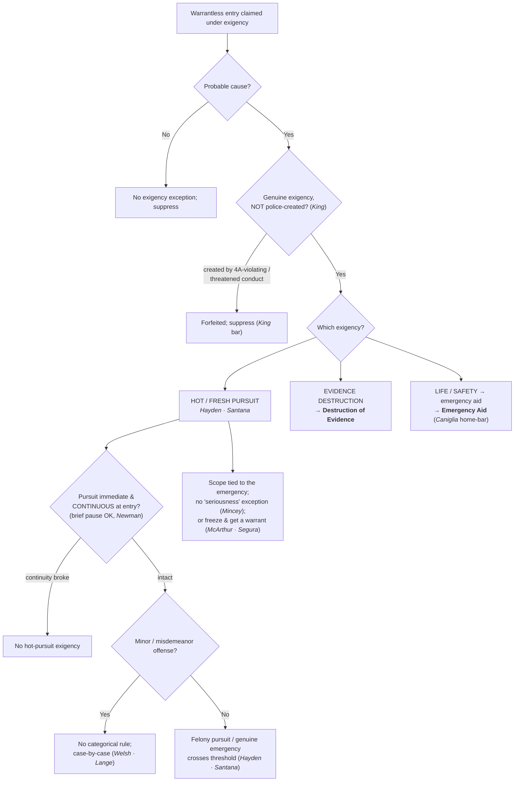

# Exigent Circumstances — Hot Pursuit

*Is there a true emergency that lets me chase a fleeing suspect across a threshold without a warrant, and how far does it go?*

> [!rule] Black-letter rule
> Where police have **probable cause**, a warrantless entry and search is reasonable when "the exigencies of the situation make[] that course imperative." *[[Warden v. Hayden#^pin-298|Warden v. Hayden]]*, 387 U.S. 294, [298](https://www.courtlistener.com/opinion/107465/warden-maryland-penitentiary-v-hayden/) (1967). **Hot (and fresh) pursuit** of a fleeing suspect is one recognized exigency: a suspect cannot defeat an arrest set in motion in a public place by retreating into a home (*[[United States v. Santana#^pin-43|Santana]]*), but pursuit of a fleeing **misdemeanant** is **not** categorical and is judged case-by-case (*[[Lange v. California]]*). Two outer limits run through every exigency at once — the **gravity of the offense** (*[[Welsh v. Wisconsin|Welsh]]*) and the **no-police-created-exigency** rule (*[[Kentucky v. King|King]]*) — and the permissible scope is always tethered to the emergency.
> ^rule-hot-pursuit

## The Brief

**What it is.** Exigent circumstances are a recognized exception to [[The Warrant Requirement]]: with **probable cause**, a warrantless entry and search is reasonable when the emergency makes getting a warrant impracticable. There is no per-se exigency that fires automatically; the exigency must be **genuine**, judged on the [[Common Legal Terms#totality-of-the-circumstances|totality of the circumstances]]. Three exigencies are recognized: **(1) hot (and fresh) pursuit** of a fleeing suspect (this page); **(2) the imminent destruction of evidence** ([[Destruction of Evidence]]); and **(3) a risk to life or safety / the need to render [[Emergency Aid|emergency aid]]** ([[Emergency Aid]]). This page owns the pursuit branch and the framework that governs all three.

**Burden · standard of review.** Because a warrantless home entry is presumptively unreasonable, the **government bears the burden** of proving a recognized exigency justified it; the defendant need not disprove one. That burden is heavy: the police "bear a heavy burden when attempting to demonstrate an urgent need that might justify warrantless searches or arrests." *[[Welsh v. Wisconsin|Welsh v. Wisconsin]]*, 466 U.S. 740, [749–50](https://www.courtlistener.com/opinion/111173/welsh-v-wisconsin/) (1984); *[[Mincey v. Arizona|Mincey v. Arizona]]*, 437 U.S. 385, [390–91](https://www.courtlistener.com/opinion/109905/mincey-v-arizona/) (1978). On appeal, suppression rulings get a mixed standard: historical facts for [[Common Legal Terms#clear-error|clear error]], the ultimate reasonableness/exigency question [[Common Legal Terms#de-novo|de novo]]. The **remedy** for an unjustified warrantless entry is suppression of the evidence and its fruits under [[The Exclusionary Rule]].

**Hot pursuit, and the hot-versus-fresh line.** Hot pursuit of a fleeing suspect into a dwelling is valid where the emergency leaves no time for a warrant. In *[[Warden v. Hayden|Hayden]]* officers entered a house minutes behind an armed robber reported to have just gone in; "neither the entry without warrant to search for the robber, nor the search for him without warrant was invalid," because "the exigencies of the situation made that course imperative," and the Fourth Amendment "does not require police officers to delay . . . if to do so would gravely endanger their lives or the lives of others." *[[Warden v. Hayden#^pin-299|Id.]]* at 298–99. *[[United States v. Santana|Santana]]* extends the principle to a suspect who retreats from her own threshold: a doorway is a "public" place, and "a suspect may not defeat an arrest which has been set in motion in a public place . . . by the expedient of escaping to a private place." *[[United States v. Santana#^pin-43|United States v. Santana]]*, 427 U.S. 38, [43](https://www.courtlistener.com/opinion/109504/united-states-v-santana/) (1976). That the "pursuit here ended almost as soon as it began did not render it any the less a 'hot pursuit.'" *Id.*

**Teaching line (Bandiero): "hot on the tail, fresh on the trail."** The mnemonic keeps a real distinction straight. **Hot pursuit** is an *immediate and continuous* pursuit of a suspect from the scene of the crime, ongoing at the moment of entry (the *[[Warden v. Hayden|Hayden]]* / *[[United States v. Santana|Santana]]* situation). **Fresh pursuit** is a *promptly-resumed* pursuit after a brief interruption (and, in its common-law/statutory cross-jurisdictional sense, a pursuit an officer may carry across jurisdictional lines). The dividing question is **continuity**: a short pause does not necessarily break the chase, as the circuit development below (*[[Newman v. Underhill|Newman]]*) illustrates.

**Santana is point-scoped: good in part, limited by *[[Lange v. California|Lange]]* in part.** *[[United States v. Santana|Santana]]*'s validity **varies by point**. Its doorway-is-public holding and its **felony** hot-pursuit holding stand; what *[[Lange v. California|Lange]]* cut down is the once-common **broad reading** that *any* fleeing-suspect pursuit categorically crosses the threshold.

| Point of law | Status | Controlling authority |
|---|---|---|
| A suspect standing in her own doorway is in a "public place" and cannot defeat a set-in-motion public arrest by retreating inside | **Good law** | *[[United States v. Santana]]*, 427 U.S. 38, [42–43](https://www.courtlistener.com/opinion/109504/united-states-v-santana/) (1976) |
| Hot pursuit of a fleeing **felony** suspect follows across the threshold | **Good law**, with *[[Lange v. California\|Lange]]*'s express reservation of the fleeing-felon question noted | *[[United States v. Santana]]*, 427 U.S. at [43](https://www.courtlistener.com/opinion/109504/united-states-v-santana/); *[[Lange v. California]]* reserved that question, 594 U.S. at 303–04 |
| Broad reading: **any** fleeing-suspect pursuit is a categorical exigency that crosses the threshold | **Limited by *Lange*** | *[[Lange v. California]]*, 594 U.S. 295, [313](https://www.courtlistener.com/opinion/4894407/lange-v-california/) (2021) (misdemeanor flight is not categorical; case-by-case) |

*[[Lange v. California|Lange]]* holds that "pursuit of a fleeing misdemeanor suspect" does not "categorically . . . qualif[y] as an exigent circumstance," and that whether a given misdemeanor chase carries an exigency turns on a **case-by-case** assessment. *[[Lange v. California|Lange v. California]]*, 594 U.S. 295, [313](https://www.courtlistener.com/opinion/4894407/lange-v-california/) (2021). **Why this changes the field call:** before *[[Lange v. California|Lange]]*, *[[United States v. Santana|Santana]]*'s broad fleeing-suspect language was read to take any pursuit across the threshold; after *[[Lange v. California|Lange]]*, a chase into the home behind a fleeing **misdemeanant** is no longer automatically lawful, and the officer must articulate an actual exigency (escape, imminent harm, or evidence loss). *[[United States v. Santana|Santana]]*'s doorway and **felony** hot-pursuit holdings are undisturbed; the automatic-misdemeanor-entry reading is gone. (*[[Lange v. California|Lange]]* left the fleeing-**felon** rule expressly reserved, so it is settled in practice but not squarely decided; see the pending-marker note.)

**The other exigencies, in brief.** The **evidence-destruction** branch (the dissipating-alcohol line and the no-police-created-exigency rule) is developed on [[Destruction of Evidence]]. The **life-safety / emergency-aid** branch is governed by an objective standard:

> [!rule] Black-letter rule — stated on [[Emergency Aid]]
> ![[warrant-exceptions/home-entry-and-search/Emergency Aid#^rule-emergency-aid]]

Develop these on [[Emergency Aid]]; note there is **no** freestanding "community caretaking" power to cross a home's threshold. *[[Caniglia v. Strom|Caniglia v. Strom]]*, 593 U.S. 194 (2021).

**The outer limit on all three: no police-created exigency.** Officers may rely on an exigency their own conduct prompted **unless** the police "create[d] the exigency by engaging or threatening to engage in conduct that violates the Fourth Amendment." *[[Kentucky v. King|Kentucky v. King]]*, 563 U.S. 452, [462](https://www.courtlistener.com/opinion/216733/kentucky-v-king/) (2011). Lawful knock-and-announce, conduct any private citizen may do, does **not** manufacture the exigency, even when it prompts occupants to start destroying evidence; that lawful knock is the [[Knock and Talk]] approach. What forfeits the exception is creating the emergency through an actual or threatened **constitutional violation** (developed with the destruction cases on [[Destruction of Evidence]]).

**The other outer limit: gravity of the offense.** "[A]n important factor . . . is the gravity of the underlying offense," and the exception "should rarely be sanctioned when there is probable cause to believe that only a minor offense . . . has been committed." *[[Welsh v. Wisconsin#^pin-753|Welsh v. Wisconsin]]*, 466 U.S. 740, [753](https://www.courtlistener.com/opinion/111173/welsh-v-wisconsin/) (1984). A warrantless home arrest for such an offense is "clearly prohibited by the special protection afforded the individual in his home." *[[Welsh v. Wisconsin#^pin-755|Id.]]* at 755. A minor offense drags the whole exigency analysis toward *unreasonable* and reinforces *[[Lange v. California|Lange]]*'s caution about misdemeanor pursuits.

**Scope is tethered to the exigency; there is no "seriousness" exception.** The search a true exigency authorizes is bounded by the emergency that justified entering: in *[[Warden v. Hayden|Hayden]]* the search reached only the robber and his weapons. The gravity of the suspected crime never substitutes for a real emergency; there is no "murder scene" exigency exception, so warrantless entry must rest on a genuine emergency and any further search needs a warrant. *[[Mincey v. Arizona|Mincey v. Arizona]]*, 437 U.S. 385 (1978). And where the need is to **preserve** evidence rather than search now, the measured response is the **less-intrusive freeze**: with probable cause and a genuine risk of destruction, officers may temporarily restrain a resident from re-entering, or secure the premises from within, **while they get a warrant**. *[[Illinois v. McArthur|Illinois v. McArthur]]*, 531 U.S. 326 (2001); *[[Segura v. United States|Segura v. United States]]*, 468 U.S. 796 (1984). See [[Securing the Scene]].

**Apply it.**
1. Confirm **probable cause** first; without it there is no exigency exception.
2. Identify the exigency: pursuit (this page), destruction ([[Destruction of Evidence]]), or life-safety ([[Emergency Aid]]).
3. For pursuit, check **continuity**: was the chase immediate and continuous from the scene at the moment of entry?
4. Check the **offense**: for a fleeing misdemeanant there is no categorical entry; articulate a real, case-specific exigency (*[[Lange v. California|Lange]]* · *[[Welsh v. Wisconsin|Welsh]]*).
5. Confirm you did not **manufacture** the exigency by threatening a Fourth Amendment violation (*[[Kentucky v. King|King]]*).
6. Keep the **scope** tied to the emergency; if the need is only to preserve evidence, freeze and get a warrant (*[[Illinois v. McArthur|McArthur]]* · *[[Segura v. United States|Segura]]*; [[Securing the Scene]]).

**Common pitfalls.**
- **Treating any fleeing suspect as automatic entry.** After *[[Lange v. California|Lange]]* and *[[Welsh v. Wisconsin|Welsh]]*, flight (especially for a minor or misdemeanor offense) does not by itself open the door; articulate the specific exigency.
- **Manufacturing the exigency.** Under *[[Kentucky v. King|King]]*, an exigency created by threatening to breach the Fourth Amendment cannot justify the entry; lawful [[Knock-and-Announce|knock-and-announce]] can (*[[Destruction of Evidence]]*).
- **Letting a brief interruption fool you.** Whether a pause **breaks** a pursuit is about continuity (did officers keep a fix on the suspect and keep working?), not a stopwatch (*[[Newman v. Underhill|Newman]]*).
- **Conflating [[Emergency Aid|emergency aid]] with criminal exigency.** Entry to render aid is a noncriminal, objective-reasonableness justification (*[[Brigham City v. Stuart|Brigham City]]*); do not borrow it to justify an arrest entry, and remember the home gets no freestanding caretaking entry (*[[Caniglia v. Strom|Caniglia]]*).
- **Forgetting the boundaries.** Authority to enter to **arrest on a warrant** is *[[Payton v. New York|Payton]]*/*[[Steagald v. United States|Steagald]]* territory ([[Arrest in the Home]]); what officers may do once lawfully inside (sweeps, freezes) is [[Securing the Scene]]; vehicle mobility is the [[Automobile Exception]].

## Lower-court developments

Role-based, circuit/state only (**no SCOTUS**; a Supreme Court holding belongs in Key cases regardless of date). The cases below are **Binding in-circuit** within their own circuit and **Persuasive (outside circuit)** elsewhere; none states nationwide law. Recent circuit law continues to apply the *[[Warden v. Hayden|Hayden]]* / *[[United States v. Santana|Santana]]* continuity requirement on a fact-specific basis.

- ***[[Newman v. Underhill|Newman v. Underhill]]* (9th Cir. 2025)** — *applies / illustrates the continuity-of-pursuit (hot-versus-fresh) requirement.* A roughly nine-minute delay and loss of sight, during which the deputy waited for backup, did **not** break the continuity of an "immediate and continuous" hot pursuit of a felony evader, where the deputy kept a reasonably good idea of the suspect's location and spent the time actively working to find and apprehend him (a delay far shorter than the thirty-minute gap that had broken continuity in circuit precedent). Warrantless entry into the home where the suspect was reasonably believed to be was a valid exigent hot-pursuit entry. Because the offense was a **felony**, *[[Lange v. California|Lange]]*'s misdemeanor limit was not implicated. **Binding in-circuit — 9th Cir.** · good. [opinion](https://www.courtlistener.com/opinion/10382777/newman-v-underhill/)

## Key cases

| Case | Holding | Opinion |
|---|---|---|
| *[[Warden v. Hayden]]*, 387 U.S. 294 (1967) | **Anchor.** Warrantless entry and search of a house in immediate pursuit of a fleeing armed robber is reasonable where the exigencies made that course imperative; scope follows the emergency (suspect + weapons). | [opinion](https://www.courtlistener.com/opinion/107465/warden-maryland-penitentiary-v-hayden/) |
| *[[United States v. Santana]]*, 427 U.S. 38 (1976) | **Doorway + pursuit.** A suspect in her own doorway is in a public place; she cannot defeat a public-place arrest by retreating inside, and hot pursuit justifies the warrantless entry that follows. Point-scoped: broad reading limited by *[[Lange v. California\|Lange]]*. | [opinion](https://www.courtlistener.com/opinion/109504/united-states-v-santana/) |
| *[[Lange v. California]]*, 594 U.S. 295 (2021) | **Pursuit limit.** Pursuit of a fleeing misdemeanor suspect does not categorically justify warrantless home entry; courts apply a case-by-case exigency assessment. The fleeing-felon question is expressly reserved. | [opinion](https://www.courtlistener.com/opinion/4894407/lange-v-california/) |
| *[[Welsh v. Wisconsin]]*, 466 U.S. 740 (1984) | **Gravity.** The gravity of the offense is a key exigency factor; warrantless home entry for a minor, nonjailable offense should rarely be sanctioned. | [opinion](https://www.courtlistener.com/opinion/111173/welsh-v-wisconsin/) |

## Related cases across doctrines

These cases are treated in full elsewhere but bear on the hot-pursuit analysis, framed here for it.

| Case | Relevance here | Primary home | Opinion |
|---|---|---|---|
| *[[Kentucky v. King]]*, 563 U.S. 452 (2011) | ***No police-created exigency.*** Police may rely on a self-created exigency unless they created it by engaging or threatening conduct that itself violates the Fourth Amendment; lawful [[Knock-and-Announce\|knock-and-announce]] does not. The general outer limit on every exigency, developed with the destruction cases. | [[Destruction of Evidence]] | [opinion](https://www.courtlistener.com/opinion/216733/kentucky-v-king/) |
| *[[Brigham City v. Stuart]]*, 547 U.S. 398 (2006) | ***Emergency-aid branch.*** Warrantless home entry is reasonable on an objectively reasonable basis to believe an occupant is seriously injured or imminently threatened; subjective motive is irrelevant. | [[Emergency Aid]] | [opinion](https://www.courtlistener.com/opinion/145654/brigham-city-v-stuart/) |
| *[[Caniglia v. Strom]]*, 593 U.S. 194 (2021) | ***No home caretaking.*** There is no freestanding "community caretaking" exception for the home; safety/welfare entries must be justified, if at all, under the exigency/emergency-aid analysis. | [[Community Caretaking]] | [opinion](https://www.courtlistener.com/opinion/4883694/caniglia-v-strom/) |
| *[[Mincey v. Arizona]]*, 437 U.S. 385 (1978) | ***No "murder scene" exigency.*** Seriousness alone does not create exigency; warrantless entry must rest on a genuine emergency, and any further search needs a warrant. The seriousness-cuts-both-ways companion to *[[Welsh v. Wisconsin\|Welsh]]*. | [[Emergency Aid]] | [opinion](https://www.courtlistener.com/opinion/109905/mincey-v-arizona/) |
| *[[Illinois v. McArthur]]*, 531 U.S. 326 (2001) | ***Freeze, not search.*** With probable cause a home contains contraband and a genuine risk of destruction, police may temporarily restrain a resident from re-entering while they obtain a warrant, a measured alternative to a warrantless entry. | [[Securing the Scene]] | [opinion](https://www.courtlistener.com/opinion/118405/illinois-v-mcarthur/) |
| *[[Payton v. New York]]*, 445 U.S. 573 (1980) | ***The baseline the exigency must overcome.*** Warrantless, nonconsensual entry into a suspect's own home for a routine felony arrest is presumptively unreasonable; absent a warrant, only a genuine exigency (or consent) justifies the entry. | [[Arrest in the Home]] | [opinion](https://www.courtlistener.com/opinion/110235/payton-v-new-york/) |
| *[[Steagald v. United States]]*, 451 U.S. 204 (1981) | ***Third-party home.*** To enter a third party's home to seize the subject of an arrest warrant, police need a search warrant "absent exigent circumstances or consent," the case that expressly carves out exigency as the alternative. | [[Arrest in the Home]] | [opinion](https://www.courtlistener.com/opinion/110464/steagald-v-united-states/) |

## Visual

## Sources

- [*Warden v. Hayden*, 387 U.S. 294 (1967)](https://www.courtlistener.com/opinion/107465/warden-maryland-penitentiary-v-hayden/) (pinpoints: 298, 298–99)
- [*United States v. Santana*, 427 U.S. 38 (1976)](https://www.courtlistener.com/opinion/109504/united-states-v-santana/) (pinpoints: 42, 43)
- [*Lange v. California*, 594 U.S. 295 (2021)](https://www.courtlistener.com/opinion/4894407/lange-v-california/) (pinpoints: 303–04, 313 — bound-volume pins per S7 research annex §11; body holding paraphrased, T3)
- [*Welsh v. Wisconsin*, 466 U.S. 740 (1984)](https://www.courtlistener.com/opinion/111173/welsh-v-wisconsin/) (pinpoints: 749–50, 753, 755)
- [*Kentucky v. King*, 563 U.S. 452 (2011)](https://www.courtlistener.com/opinion/216733/kentucky-v-king/) (pinpoint: 462 — CAP star page verified, S7 R5 T1; full treatment on [[Destruction of Evidence]])
- [*Brigham City v. Stuart*, 547 U.S. 398 (2006)](https://www.courtlistener.com/opinion/145654/brigham-city-v-stuart/) (pinpoints: 400, 404)
- [*Caniglia v. Strom*, 593 U.S. 194 (2021)](https://www.courtlistener.com/opinion/4883694/caniglia-v-strom/)
- [*Mincey v. Arizona*, 437 U.S. 385 (1978)](https://www.courtlistener.com/opinion/109905/mincey-v-arizona/) (pinpoints: 390–91)
- [*Illinois v. McArthur*, 531 U.S. 326 (2001)](https://www.courtlistener.com/opinion/118405/illinois-v-mcarthur/)
- [*Segura v. United States*, 468 U.S. 796 (1984)](https://www.courtlistener.com/opinion/111259/segura-v-united-states/)
- [*Payton v. New York*, 445 U.S. 573 (1980)](https://www.courtlistener.com/opinion/110235/payton-v-new-york/)
- [*Steagald v. United States*, 451 U.S. 204 (1981)](https://www.courtlistener.com/opinion/110464/steagald-v-united-states/)
- [*Newman v. Underhill*, 134 F.4th 1025 (9th Cir. 2025)](https://www.courtlistener.com/opinion/10382777/newman-v-underhill/) (F.4th reporter cite; post-2020 slip pins paraphrased per S7 R5 T3)
</content>
