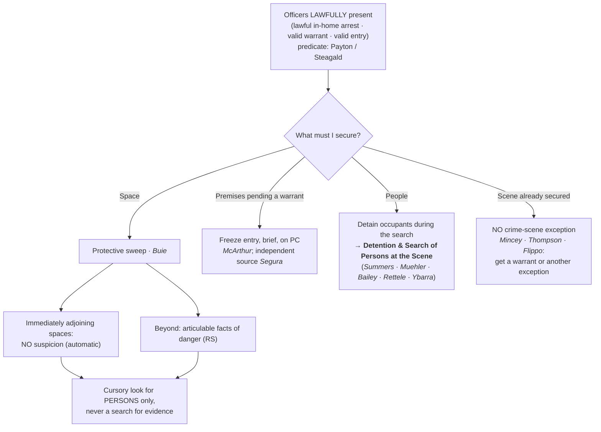

# Protective Sweeps & Securing the Scene

*How may I sweep for a hidden danger and freeze a place once I am lawfully there, without turning it into a search?*

> [!rule] Black-letter rule
> **Incident to a lawful in-home arrest, officers may as a precaution look in spaces immediately adjoining the place of arrest with NO suspicion; a sweep beyond those spaces needs articulable facts that the area harbors an individual posing a danger.** Either way the sweep is only "a cursory inspection of those spaces where a person may be found," never a search for evidence. *[[Maryland v. Buie|Maryland v. Buie]]*, 494 U.S. 325, [334–35](https://www.courtlistener.com/opinion/112384/maryland-v-buie/) (1990). Officers may also **freeze** premises pending a warrant, on probable cause plus a genuine risk of destruction (*[[Illinois v. McArthur|McArthur]]*), and securing premises does not itself taint what is later lawfully seized (*[[Segura v. United States|Segura]]*). Securing a scene is never authority to **search** it.
> ^rule-protective-sweep

## The Brief

**What it is.** This page governs the limited, warrantless authority to **secure a place** once officers are lawfully there: to **sweep** for a hidden danger and to **freeze** premises while a warrant is obtained. Each tool is separately bounded, and **none is a license to search for evidence**. The distinct question of what officers may do with the **people** present when a warrant is executed (whom they may detain, and when they may search or frisk) is developed on [[Detention and Search of Persons at the Scene]]; this page cross-refers to it where the powers overlap.

**Protective sweep: the two tiers of *[[Maryland v. Buie|Buie]]* (stated up front).** Incident to a lawful in-home arrest, officers may, "as a precautionary matter and **without probable cause or reasonable suspicion**, look in closets and other spaces immediately adjoining the place of arrest from which an attack could be immediately launched." *[[Maryland v. Buie#^pin-335|Maryland v. Buie]]*, 494 U.S. 325, [334](https://www.courtlistener.com/opinion/112384/maryland-v-buie/#:~:text=there%20must%20be%20articulable%20facts) (1990). That first-tier look at **immediately adjoining spaces is automatic**. A sweep **beyond** those spaces needs individualized justification: "there must be articulable facts which, taken together with the rational inferences from those facts, would warrant a reasonably prudent officer in believing that the area to be swept harbors an individual posing a danger to those on the arrest scene." *[[Maryland v. Buie|Id.]]* Either way the sweep stays narrow: it "may extend only to a **cursory inspection of those spaces where a person may be found**," not a search for evidence, and it lasts only as long as needed to dispel the danger and no longer than the police are justified in remaining. *[[Maryland v. Buie#^pin-335|Id.]]* at 335.

**Freezing the premises pending a warrant: *[[Illinois v. McArthur|McArthur]]* (and the *[[Segura v. United States|Segura]]* corollary).** With probable cause to believe a home holds contraband, officers may impose a **brief, limited restraint** (barring a resident from entering unaccompanied) while they diligently obtain a warrant. The Court found a two-hour restriction "**reasonable, and hence lawful, in light of** . . . circumstances, which we consider **in combination**": probable cause, a real risk the evidence would be destroyed, a restraint rather than a warrantless search, and a limited duration. *[[Illinois v. McArthur|Illinois v. McArthur]]*, 531 U.S. 326, [331](https://www.courtlistener.com/opinion/118405/illinois-v-mcarthur/) (2001). The freeze is a temporary **seizure, not a search**. And securing premises pending a warrant does not, by itself, taint what is later lawfully seized: where the warrant rests on "**an independent source**," the earlier entry "is **irrelevant to the admissibility** of the challenged evidence." *[[Segura v. United States|Segura v. United States]]*, 468 U.S. 796, [814](https://www.courtlistener.com/opinion/111259/segura-v-united-states/) (1984). (The destruction-[[Exigent Circumstances and Hot Pursuit|exigency]] basis for holding premises is on [[Destruction of Evidence]].)

**Detaining the people present is a separate power, developed elsewhere.**

> [!rule] Black-letter rule — stated on [[Detention and Search of Persons at the Scene]]
> ![[the-warrant/executing-a-warrant/Detention and Search of Persons at the Scene#^rule-detention-scene]]

That detention authority is categorical, enforceable with reasonable force, but spatially confined to the immediate vicinity, and it is **not** authority to search the people present.
- The full treatment (*[[Michigan v. Summers|Summers]]* / *[[Muehler v. Mena|Muehler]]* / *[[Bailey v. United States|Bailey]]* / *[[Los Angeles County v. Rettele|Rettele]]* / *[[Ybarra v. Illinois|Ybarra]]*) lives on [[Detention and Search of Persons at the Scene]].
- The one point to carry here: detaining the people at a scene is **not** searching them, so a protective sweep of the *space* and a detention of the *persons* never collapse into a warrantless search of those persons (*[[Ybarra v. Illinois|Ybarra]]*).

**No crime-scene / murder-scene exception.** Securing a scene never becomes a warrant to search it.
- Warrantless entry to render "immediate aid," and seizure of evidence in plain view "during the course of their legitimate emergency activities," is allowed, but the activity must be **strictly circumscribed by the emergency**. *[[Mincey v. Arizona|Mincey v. Arizona]]*, 437 U.S. 385, [392–93](https://www.courtlistener.com/opinion/109905/mincey-v-arizona/) (1978).
- There is **no** "murder scene" or general "crime-scene" exception: a two-hour warrantless general search of a homicide scene "remains a significant intrusion" and is unreasonable, *[[Thompson v. Louisiana#^pin-21|Thompson v. Louisiana]]*, 469 U.S. 17, [21](https://www.courtlistener.com/opinion/111282/thompson-v-louisiana/) (1984), and a search of an already-secured homicide scene "is invalid unless it falls within one of the narrow and well-delineated exceptions to the warrant requirement," because "*[[Mincey v. Arizona|Mincey]]* controls." *[[Flippo v. West Virginia#^pin-13|Flippo v. West Virginia]]*, 528 U.S. 11, [13–14](https://www.courtlistener.com/opinion/1854815/flippo-v-west-virginia/) (1999).
- The lawful move at a scene is the immediate rescue and the prompt *[[Maryland v. Buie|Buie]]* protective look for other victims or a perpetrator still present, not a general evidentiary search (the entry-to-aid mechanics live on [[Emergency Aid]]).

**The entry predicate: none of this exists until officers are lawfully present.** Every authority above presupposes a **lawful presence**. An arrest warrant plus reason to believe the suspect is home authorizes entry into his **own** dwelling, because the Fourth Amendment "has drawn a firm line at the entrance to the house," *[[Payton v. New York#^pin-590|Payton v. New York]]*, 445 U.S. 573, [590](https://www.courtlistener.com/opinion/110235/payton-v-new-york/#:~:text=In%20terms%20that%20apply%20equally) (1980). Entering a **third party's** home to arrest the warrant's subject requires a **separate search warrant** absent [[Exigent Circumstances and Hot Pursuit|exigency]] or consent, *[[Steagald v. United States#^pin-205|Steagald v. United States]]*, 451 U.S. 204, [205–06](https://www.courtlistener.com/opinion/110464/steagald-v-united-states/) (1981). Where the premises belong to someone other than the arrestee, the search-warrant predicate, not the arrest warrant, governs whether officers may be there at all (see [[Arrest in the Home]]).

**Burden · standard of review · remedy.** Because a protective sweep and a freeze are warrantless intrusions, the **government bears the burden** of justifying them: articulable facts of danger for a beyond-adjoining-spaces *[[Maryland v. Buie|Buie]]* sweep, and probable cause plus reasonable temporariness for a *[[Illinois v. McArthur|McArthur]]* freeze. Historical fact findings are reviewed for [[Common Legal Terms#clear-error|clear error]] and the ultimate reasonableness [[Common Legal Terms#de-novo|de novo]]. The **remedy** for exceeding these bounds is **suppression** of the evidence and its fruits ([[The Exclusionary Rule]]).

**Apply it.**
1. Confirm **lawful presence** first (arrest warrant + reason to believe present for the suspect's own home; a search warrant for a third party's home; or a valid warrantless entry).
2. **Sweep** only for *people*: the immediately adjoining spaces automatically; anything beyond only on articulable facts of danger; a cursory look, never opening drawers for evidence (*[[Maryland v. Buie|Buie]]*).
3. If you need to **preserve** evidence but not search now, **freeze**: restrain re-entry on probable cause and get a warrant (*[[Illinois v. McArthur|McArthur]]* · *[[Segura v. United States|Segura]]*).
4. Detain the people present if a warrant is being executed, but **do not search them** without cause aimed at each person; run that analysis on [[Detention and Search of Persons at the Scene]].
5. Once the danger is dispelled and the scene secured, **stop**: there is no crime-scene exception, so further searching needs a warrant (*[[Mincey v. Arizona|Mincey]]* · *[[Thompson v. Louisiana|Thompson]]* · *[[Flippo v. West Virginia|Flippo]]*).

**Common pitfalls.**
- **Treating a protective sweep as a full search.** A *[[Maryland v. Buie|Buie]]* sweep is a quick look for *people* where a person could hide; opening drawers or "sweeping" for contraband converts it into an unlawful search.
- **Believing a secured scene may be searched.** There is no crime-scene exception; once the injured are aided and the danger resolved, continued searching needs a warrant or another recognized exception (*[[Mincey v. Arizona|Mincey]]* · *[[Thompson v. Louisiana|Thompson]]* · *[[Flippo v. West Virginia|Flippo]]*).
- **Confusing securing the space with searching the people.** Detaining occupants is not searching them; a search or frisk needs cause particularized to the person (*[[Ybarra v. Illinois|Ybarra]]*; [[Detention and Search of Persons at the Scene]]).
- **Mislabeling a forced-door entry as consent.** Commanding occupants to open up under color of authority and treating the opened door as a [[Knock and Talk|knock-and-talk]] consent is a **constructive entry**, not consent (*[[United States v. Conner|Conner]]*, 8th Cir.); its lawfulness turns on the entry rules ([[Arrest in the Home]]), not consent doctrine.
- **Forgetting the entry predicate.** A third party's home needs its own search warrant before officers are lawfully present to detain or sweep at all (*[[Steagald v. United States|Steagald]]*).

## Lower-court developments

Role-based circuit developments only (**no SCOTUS**; the controlling Supreme Court cases home to Key cases regardless of date). Two published circuit decisions stress-test the scene-securing authorities at the margins.

- **Extending the protective sweep beyond the in-home arrest: *[[United States v. August|United States v. August]]* (5th Cir. 2025).** *Doctrinal-extension flag.* The Fifth Circuit articulated a four-part protective-sweep test and, by bracketing "[or curtilage]" into its first prong, applied it to a **non-arrest, investigatory** backyard entry: the sweep is lawful if officers have a legitimate law-enforcement purpose for being in the house or [[Curtilage|curtilage]], reasonable articulable suspicion that the area harbors a dangerous person, a no-more-than-cursory inspection of spaces where a person may be found, and a duration no longer than needed to dispel the danger or to remain lawfully on the premises. *[[United States v. August|August]]*, 136 F.4th 595 (5th Cir. 2025). This pushes *[[Maryland v. Buie|Buie]]*'s officer-safety rationale outward from its in-home-arrest core to [[Curtilage|curtilage]] and investigatory entries. **Binding in-circuit — 5th Cir.** · good. ⚖ Treat as a doctrinal-extension flag (*[[Maryland v. Buie|Buie]]* outside arrest / into [[Curtilage|curtilage]]), not an opinion-recognized circuit split.
- **Constructive entry, a coerced door is not consent: *[[United States v. Conner|United States v. Conner]]* (8th Cir. 1997).** *Applying the entry predicate.* Massing at a door and demanding entry under color of authority is not a consensual encounter: "an unconstitutional search occurs when officers gain visual or physical access to a motel room after an occupant opens the door **not voluntarily, but in response to a demand under color of authority**." *[[United States v. Conner|Conner]]*, 127 F.3d 663, 666 (8th Cir. 1997). The surround-and-call-out maneuver is therefore an **entry** question governed by the warrant rules ([[Arrest in the Home]]), not consent doctrine. **Binding in-circuit — 8th Cir.** · good.

## Key cases

| Case | Holding | Opinion |
|---|---|---|
| *[[Maryland v. Buie]]*, 494 U.S. 325 (1990) | **Anchor: protective sweep.** Incident to an in-home arrest, officers may look in immediately adjoining spaces with no suspicion; a broader sweep needs articulable facts of danger; either way it is only a cursory look for persons, never a search for evidence. | [opinion](https://www.courtlistener.com/opinion/112384/maryland-v-buie/) |
| *[[Illinois v. McArthur]]*, 531 U.S. 326 (2001) | **Anchor: freeze pending a warrant.** With probable cause, officers may impose a brief, limited restraint (barring a resident from entering unaccompanied) to prevent destruction of evidence while they diligently obtain a warrant. | [opinion](https://www.courtlistener.com/opinion/118405/illinois-v-mcarthur/) |
| *[[Segura v. United States]]*, 468 U.S. 796 (1984) | **Anchor: securing premises is not taint.** Securing or occupying premises pending a warrant does not itself require suppression; evidence later seized under a warrant resting on a genuinely [[Inevitable Discovery and Independent Source\|independent source]] is admissible despite a prior illegal entry. | [opinion](https://www.courtlistener.com/opinion/111259/segura-v-united-states/) |

## Related cases across doctrines

These are treated in full on their own pages, but they bear directly on securing the scene and are framed for it here.

| Case | Relevance here | Primary home | Opinion |
|---|---|---|---|
| *[[Michigan v. Summers]]*, 452 U.S. 692 (1981) | ***Detain occupants.*** A premises warrant carries the limited, categorical authority to detain the occupants while the search is conducted; that detention accompanies securing the scene but is a distinct power. | [[Detention and Search of Persons at the Scene]] | [opinion](https://www.courtlistener.com/opinion/110534/michigan-v-summers/) |
| *[[Muehler v. Mena]]*, 544 U.S. 93 (2005) | ***Categorical + force.*** The detention authority is categorical; handcuffs for the search's duration are permissible where justified, and non-prolonging questions are not a separate seizure. | [[Detention and Search of Persons at the Scene]] | [opinion](https://www.courtlistener.com/opinion/142878/muehler-v-mena/) |
| *[[Bailey v. United States]]*, 568 U.S. 186 (2013) | ***Spatial leash.*** The *[[Michigan v. Summers\|Summers]]* detention reaches only the immediate vicinity of the premises; a former occupant stopped a mile away is outside it. | [[Detention and Search of Persons at the Scene]] | [opinion](https://www.courtlistener.com/opinion/820749/bailey-v-united-states/) |
| *[[Los Angeles County v. Rettele]]*, 550 U.S. 609 (2007) | ***Manner.*** Officers may briefly exercise unquestioned command to secure a scene (even ordering unclothed occupants up for a few minutes) so long as the detention is not prolonged. | [[Detention and Search of Persons at the Scene]] | [opinion](https://www.courtlistener.com/opinion/145728/los-angeles-county-california-v-rettele/) |
| *[[Ybarra v. Illinois]]*, 444 U.S. 85 (1979) | ***Detain is not search.*** A premises warrant confers no authority to search or frisk persons merely present; a search needs particularized probable cause, a frisk individualized reasonable suspicion. | [[Detention and Search of Persons at the Scene]] | [opinion](https://www.courtlistener.com/opinion/110158/ybarra-v-illinois/) |
| *[[Payton v. New York]]*, 445 U.S. 573 (1980) | ***Entry predicate.*** An arrest warrant plus reason to believe the suspect is home authorizes entry into his own dwelling, and that lawful in-home arrest is what triggers the *[[Maryland v. Buie\|Buie]]* sweep authority. | [[Arrest in the Home]] | [opinion](https://www.courtlistener.com/opinion/110235/payton-v-new-york/) |
| *[[Steagald v. United States]]*, 451 U.S. 204 (1981) | ***Third-party predicate.*** Where the premises are a third party's home, officers need a search warrant to be lawfully present before they may detain occupants or sweep. | [[Arrest in the Home]] | [opinion](https://www.courtlistener.com/opinion/110464/steagald-v-united-states/) |
| *[[Brigham City v. Stuart]]*, 547 U.S. 398 (2006) | ***Entry predicate (aid).*** A lawful warrantless emergency-aid entry makes officers lawfully present, so they may then secure the scene with a *[[Maryland v. Buie\|Buie]]* sweep; the sweep rides on the lawfulness of the entry, not on an arrest alone. | [[Emergency Aid]] | [opinion](https://www.courtlistener.com/opinion/145654/brigham-city-v-stuart/) |
| *[[Kentucky v. King]]*, 563 U.S. 452 (2011) | ***[[Exigent Circumstances and Hot Pursuit\|Exigency]] to hold premises.*** Police may secure a residence and act on a destruction [[Exigent Circumstances and Hot Pursuit\|exigency]] their own lawful knock precipitated, complementing the *[[Illinois v. McArthur\|McArthur]]* freeze. | [[Destruction of Evidence]] | [opinion](https://www.courtlistener.com/opinion/216733/kentucky-v-king/) |
| *[[Murray v. United States]]*, 487 U.S. 533 (1988) | ***[[Inevitable Discovery and Independent Source\|Independent source]].*** Where officers freeze premises and observe evidence during an unlawful entry, that evidence is still admissible if later seized under a warrant supported by genuinely independent information. | [[The Exclusionary Rule]] | [opinion](https://www.courtlistener.com/opinion/112136/murray-v-united-states/) |
| *[[Michigan v. Long]]*, 463 U.S. 1032 (1983) | ***Vehicular analogue.*** On specific, articulable facts that a suspect is dangerous and may reach weapons, officers may make a limited protective search of the passenger compartment, the *[[Maryland v. Buie\|Buie]]* sweep's car counterpart. | [[Traffic Stops]] | [opinion](https://www.courtlistener.com/opinion/111020/michigan-v-long/) |
| *[[Mincey v. Arizona]]*, 437 U.S. 385 (1978) | ***No murder-scene search.*** Warrantless entry to render immediate aid is allowed but strictly circumscribed by the emergency; no general crime-scene search. | [[Emergency Aid]] | [opinion](https://www.courtlistener.com/opinion/109905/mincey-v-arizona/) |
| *[[Thompson v. Louisiana]]*, 469 U.S. 17 (1984) | ***No crime-scene exception.*** Even a two-hour general search of a homicide scene is unreasonable; brevity does not save it, and a victim's call for help does not diminish the home's privacy. | [[Emergency Aid]] | [opinion](https://www.courtlistener.com/opinion/111282/thompson-v-louisiana/) |
| *[[Flippo v. West Virginia]]*, 528 U.S. 11 (1999) | ***No crime-scene exception.*** A warrantless search of a secured homicide scene is invalid unless a recognized exception applies; "*[[Mincey v. Arizona\|Mincey]]* controls." | [[Emergency Aid]] | [opinion](https://www.courtlistener.com/opinion/1854815/flippo-v-west-virginia/) |

## Visual

## Sources

- [*Maryland v. Buie*, 494 U.S. 325 (1990)](https://www.courtlistener.com/opinion/112384/maryland-v-buie/) (pinpoints: 334, 335)
- [*Illinois v. McArthur*, 531 U.S. 326 (2001)](https://www.courtlistener.com/opinion/118405/illinois-v-mcarthur/) (pinpoints: 331, 334)
- [*Segura v. United States*, 468 U.S. 796 (1984)](https://www.courtlistener.com/opinion/111259/segura-v-united-states/) (pinpoint: 814)
- [*Michigan v. Summers*, 452 U.S. 692 (1981)](https://www.courtlistener.com/opinion/110534/michigan-v-summers/) (full treatment on [[Detention and Search of Persons at the Scene]])
- [*Muehler v. Mena*, 544 U.S. 93 (2005)](https://www.courtlistener.com/opinion/142878/muehler-v-mena/) (full treatment on [[Detention and Search of Persons at the Scene]])
- [*Bailey v. United States*, 568 U.S. 186 (2013)](https://www.courtlistener.com/opinion/820749/bailey-v-united-states/) (full treatment on [[Detention and Search of Persons at the Scene]])
- [*Los Angeles County v. Rettele*, 550 U.S. 609 (2007) (per curiam)](https://www.courtlistener.com/opinion/145728/los-angeles-county-california-v-rettele/) (full treatment on [[Detention and Search of Persons at the Scene]])
- [*Ybarra v. Illinois*, 444 U.S. 85 (1979)](https://www.courtlistener.com/opinion/110158/ybarra-v-illinois/) (full treatment on [[Detention and Search of Persons at the Scene]])
- [*Payton v. New York*, 445 U.S. 573 (1980)](https://www.courtlistener.com/opinion/110235/payton-v-new-york/) (pinpoint: 590; entry predicate, home = [[Arrest in the Home]])
- [*Steagald v. United States*, 451 U.S. 204 (1981)](https://www.courtlistener.com/opinion/110464/steagald-v-united-states/) (pinpoint: 205–206; third-party home = [[Arrest in the Home]])
- [*Brigham City v. Stuart*, 547 U.S. 398 (2006)](https://www.courtlistener.com/opinion/145654/brigham-city-v-stuart/) (lawful-entry predicate; home = [[Emergency Aid]])
- [*Kentucky v. King*, 563 U.S. 452 (2011)](https://www.courtlistener.com/opinion/216733/kentucky-v-king/) (exigency to secure premises; home = [[Destruction of Evidence]])
- [*Murray v. United States*, 487 U.S. 533 (1988)](https://www.courtlistener.com/opinion/112136/murray-v-united-states/) (independent-source companion to *Segura*; home = [[The Exclusionary Rule]])
- [*Michigan v. Long*, 463 U.S. 1032 (1983)](https://www.courtlistener.com/opinion/111020/michigan-v-long/) (vehicular analogue of the *Buie* sweep; home = [[Traffic Stops]])
- [*Mincey v. Arizona*, 437 U.S. 385 (1978)](https://www.courtlistener.com/opinion/109905/mincey-v-arizona/) (pinpoints: 392, 393; no murder-scene exception; home = [[Emergency Aid]])
- [*Thompson v. Louisiana*, 469 U.S. 17 (1984) (per curiam)](https://www.courtlistener.com/opinion/111282/thompson-v-louisiana/) (pinpoint: 21; home = [[Emergency Aid]])
- [*Flippo v. West Virginia*, 528 U.S. 11 (1999) (per curiam)](https://www.courtlistener.com/opinion/1854815/flippo-v-west-virginia/) (pinpoints: 13, 14; home = [[Emergency Aid]])
- [*United States v. August*, 136 F.4th 595 (5th Cir. 2025)](https://www.courtlistener.com/opinion/10574922/united-states-v-august/) (F.4th reporter cite; post-2020 slip pins paraphrased rather than page-cited)
- [*United States v. Conner*, 127 F.3d 663 (8th Cir. 1997)](https://www.courtlistener.com/opinion/747208/united-states-v-larry-duane-conner-united-states-of-america-v-john/) (pinpoint: 666)
</content>
