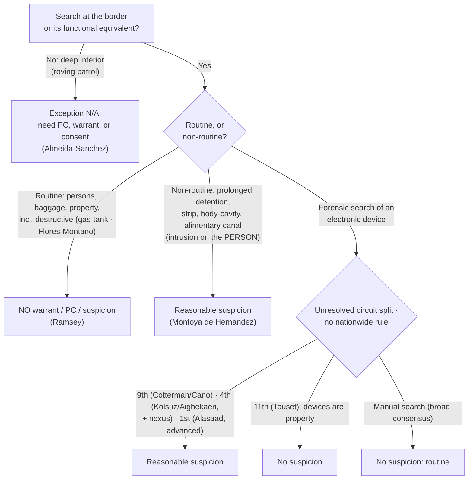

# Border Searches

*Is this a border search, and if so, is it **routine** (no suspicion needed) or **non-routine / highly intrusive** (reasonable suspicion needed)?*

> [!rule] Black-letter rule
> At the international border and its functional equivalent, the sovereign's self-protective interest is at its **zenith**, so searches are "reasonable simply by virtue of the fact that they occur at the border." *[[United States v. Ramsey|Ramsey]]*, 431 U.S. 606, 616 (1977). Reasonableness comes in **two tiers**: **routine** searches of persons, baggage, and property need **no warrant, probable cause, or suspicion**; **non-routine, highly intrusive** intrusions (prolonged detention, strip, body-cavity, alimentary-canal) need **reasonable suspicion**. *[[United States v. Montoya de Hernandez|Montoya de Hernandez]]*, 473 U.S. 531, 541 (1985). The exception is **geographic**, not portable: it does not float into the deep interior. *[[Almeida-Sanchez v. United States|Almeida-Sanchez]]*, 413 U.S. 266, 273 (1973).
> ^rule-border

## The Brief

**What it is, and is not.** The threshold question, whether the government action is a "search" at all, is still the opening move ([[Two Definitions of Search]]); once it is a search, the border-search exception governs the *reasonableness* question. This is a **categorical** exception to [[The Warrant Requirement]] grounded in sovereignty, not a special-needs balance and not the individualized rules of an interior stop. It reaches searches *for* things crossing the border; it is not authority to stop and question people away from the border, which is a separate seizure doctrine.

**The test up front.** Border searches split into two tiers:
1. **Routine.** Searches of persons, baggage, and property require **no warrant, no probable cause, and no individualized suspicion**. *[[United States v. Ramsey|Ramsey]]* extended this to opening incoming international mail. 431 U.S. at 616. *[[United States v. Flores-Montano|Flores-Montano]]* confirms the reach over vehicles: "We hold that the search in question did not require reasonable suspicion," so even removing, disassembling, and reassembling a gas tank is routine. 541 U.S. 149, 150 (2004).
2. **Non-routine, highly intrusive.** Prolonged detention and strip, body-cavity, or alimentary-canal searches require **reasonable suspicion**. *[[United States v. Montoya de Hernandez|Montoya de Hernandez]]* set that floor: a traveler may be detained when agents "reasonably suspect that the traveler is smuggling contraband in her alimentary canal," for "as long as is reasonably necessary" to verify or dispel it. 473 U.S. at 541, 544.

**What bumps a search into the non-routine tier is intrusion on the *person*, not property damage.** The dignity-and-bodily-integrity line, not the value of what is broken, drives the reasonable-suspicion requirement. *[[United States v. Flores-Montano|Flores-Montano]]* is explicit that "[c]omplex balancing tests to determine what is a 'routine' search of a vehicle, as opposed to a more 'intrusive' search of a person, have no place in border searches of vehicles." 541 U.S. at 152. Disassembling the gas tank stayed routine; the Court reserved only that some property searches might be "so destructive as to require a different result," but this was not one.

**The exception is geographic, not portable.** The power applies at the actual border **and its functional equivalents** (an established checkpoint where border roads converge, or an airport receiving a nonstop foreign flight), *[[Almeida-Sanchez v. United States|Almeida-Sanchez]]*, 413 U.S. at 272, but it does **not** reach the deep interior. A roving-patrol *search* well inland, without probable cause or consent, violates the Fourth Amendment: the search of a car "at all points at least 20 miles north of the Mexican border . . . [i]n the absence of probable cause or consent . . . violated the petitioner's Fourth Amendment right." *Id.* at 273.

**Do not conflate the checkpoint *seizure* power with the border *search* power.** Fixed interior immigration checkpoints and roving-patrol stops near the border are **seizure** doctrines, not the border-search power. A roving-patrol **stop** to question occupants needs **reasonable suspicion**, "specific articulable facts, together with rational inferences," and apparent ancestry **alone** is not enough. *[[United States v. Brignoni-Ponce|Brignoni-Ponce]]*, 422 U.S. 873, 884, 886–87 (1975). A brief **stop** at a **fixed, permanent** interior checkpoint is suspicionless. *[[United States v. Martinez-Fuerte|Martinez-Fuerte]]*, 428 U.S. 543, 566 (1976). The outer limit of that checkpoint power is the crime-control bar of *[[City of Indianapolis v. Edmond|Edmond]]*; the programmatic-checkpoint rules are developed on [[Checkpoints and Roadblocks]]. (The holding of *[[United States v. Brignoni-Ponce|Brignoni-Ponce]]* is good law; its treatment of apparent Mexican ancestry as a relevant factor is widely criticized and given little practical weight.)

**The digital-device frontier is an unresolved circuit split, so name the circuits.** What standard governs a search of an **electronic device** at the border is a scope boundary that is an *assertion*, so state it precisely and never announce a nationwide device rule. A broad cross-circuit **consensus** treats a brief, *manual* device search as **routine** (no individualized suspicion). The circuits fracture over *forensic* (Cellebrite-type) searches:
- The **Ninth** and **Fourth** Circuits require **reasonable suspicion** for a forensic search (the Fourth adding a "border nexus" limit) (*[[United States v. Cotterman|Cotterman]]*; *[[United States v. Cano|Cano]]*; *[[United States v. Kolsuz|Kolsuz]]*; *[[United States v. Aigbekaen|Aigbekaen]]*).
- The **Eleventh** Circuit requires **no suspicion at all**, treating devices as property (*[[United States v. Touset|Touset]]*).
- The **First** Circuit requires reasonable suspicion for advanced searches but, splitting from the Ninth, does **not** confine them to digital contraband (*[[Alasaad v. Wolf|Alasaad]]*).

**SCOTUS has not resolved the split, and there is no nationwide device rule.** The full circuit spread is catalogued below. *[[Riley v. California|Riley]]*'s "get a warrant" reasoning about a phone's vast contents is the analytic engine each circuit argues from; the related digital cross-cutting doctrine is treated on [[The Third-Party Doctrine and Digital Surveillance]].

**Burden, standard of review, remedy.** The **government** bears the burden of justifying a warrantless border search; the defendant bears the threshold burden of showing a search and standing. Routine searches need **no individualized suspicion**; non-routine intrusions need **reasonable suspicion**. *[[United States v. Montoya de Hernandez|Montoya de Hernandez]]*, 473 U.S. at 541. On appeal, reasonable suspicion is reviewed [[Common Legal Terms#de-novo|de novo]] and the historical facts for [[Common Legal Terms#clear-error|clear error]]. *[[Ornelas v. United States|Ornelas]]*, 517 U.S. 690, 699 (1996). The **remedy** for an unjustified search is suppression under [[The Exclusionary Rule]].

**Apply it.**
1. **Locate the search.** Is it at the border or a functional equivalent? If it is a roving search in the interior, the exception does not apply; you need probable cause, a warrant, or consent (*[[Almeida-Sanchez v. United States|Almeida-Sanchez]]*).
2. **Classify the intrusion.** Routine (persons, baggage, property, including destructive vehicle searches) needs no suspicion; a strip, body-cavity, alimentary-canal, or prolonged detention needs reasonable suspicion (*[[United States v. Montoya de Hernandez|Montoya de Hernandez]]*).
3. **For a device, label the circuit and the mode.** A manual search is routine almost everywhere; for a forensic search, state your circuit's rule and flag the split. Do not assert a nationwide rule.
4. **Keep the checkpoint power separate.** A suspicionless immigration-checkpoint *stop* is not authority to *search* without suspicion away from the border (*[[United States v. Martinez-Fuerte|Martinez-Fuerte]]*).

**Common pitfalls.**
- **Assuming the exception reaches the deep interior.** A suspicionless roving *search* miles inland is not a border search (*[[Almeida-Sanchez v. United States|Almeida-Sanchez]]*).
- **Stating a nationwide device rule.** There is none; "forensic device searches always need reasonable suspicion" overstates the Ninth and Fourth, and "they never do" overstates the Eleventh. Label the circuit and flag the split.
- **Conflating immigration checkpoints with the search power.** *[[United States v. Martinez-Fuerte|Martinez-Fuerte]]* upholds suspicionless checkpoint *stops*, not suspicionless *searches* away from the border.
- **Treating destructive property searches as non-routine.** Dignity-intrusion on the **person**, not property damage, drives the reasonable-suspicion tier (*[[United States v. Flores-Montano|Flores-Montano]]*).

## Lower-court developments

The live frontier since *[[Riley v. California|Riley]]* (2014) is the standard for searching electronic devices at the border. A broad cross-circuit **consensus** treats a brief, *manual* search as routine and needs no individualized suspicion; the circuits **split** over whether a *forensic* search demands reasonable suspicion and, if so, its scope. SCOTUS has not resolved the device split. Each decision below binds only in its own circuit.

**Reasonable-suspicion camp: a forensic device search is non-routine.**

- ***[[United States v. Cotterman|Cotterman]]* (9th Cir. 2013) (en banc)** — *anchors the split.* A forensic examination of a device seized at the border requires reasonable suspicion, because it is the comprehensive and intrusive nature of a forensic search, not where it occurs, that triggers the requirement. 709 F.3d 952. **Binding in-circuit — 9th Cir.**
- ***[[United States v. Cano|Cano]]* (9th Cir. 2019)** — *clarifies Cotterman.* Manual searches need no suspicion; a forensic search needs reasonable suspicion, and (splitting the scope) that suspicion must be of **digital contraband**, so a border phone search is limited to a search for digital contraband. 934 F.3d 1002. **Binding in-circuit — 9th Cir.**
- ***[[United States v. Kolsuz|Kolsuz]]* (4th Cir. 2018)** — *first post-Riley appellate holding.* After *[[Riley v. California|Riley]]*, a forensic (off-site, weeks-long Cellebrite-type) device search at the border is non-routine and requires individualized suspicion. 890 F.3d 133. **Binding in-circuit — 4th Cir.**
- ***[[United States v. Aigbekaen|Aigbekaen]]* (4th Cir. 2019)** — *adds a border-nexus limit.* Where a border search is intrusive enough to require individualized suspicion, the suspected offense must bear a **nexus** to the border-search exception's purposes (national security, contraband, immigration), not a purely domestic investigation; good-faith saved the evidence. 943 F.3d 713. **Binding in-circuit — 4th Cir.**

**No-suspicion camp: devices are property.**

- ***[[United States v. Touset|Touset]]* (11th Cir. 2018)** — *the outlier.* **No suspicion, not even reasonable suspicion**, is required for a forensic device search; devices are property, and reasonable suspicion is reserved for intrusive searches of the **body**. Declines to follow *[[United States v. Cotterman|Cotterman]]*. 890 F.3d 1227. **Binding in-circuit — 11th Cir.**

**Contra-scope position: advanced searches need reasonable suspicion, but are not confined to contraband.**

- ***[[Alasaad v. Wolf|Alasaad]]* (1st Cir. 2021)** — *expands the scope.* Neither manual ("basic") nor forensic ("advanced") searches require a warrant or probable cause, and advanced searches need only reasonable suspicion; but, expressly splitting from the Ninth, the searches need **not** be limited to digital contraband. 988 F.3d 8. **Binding in-circuit — 1st Cir.**

**Manual-search consensus, reserving the forensic question.**

- ***[[United States v. Mendez|Mendez]]* (7th Cir. 2024)** — *joins the consensus.* A routine, manual cell-phone search needs no individualized suspicion; reserves whether a forensic search requires reasonable suspicion. 103 F.4th 1303. **Binding in-circuit — 7th Cir.**
- ***[[United States v. Castillo|Castillo]]* (5th Cir. 2023)** — *joins the consensus.* No individualized suspicion is required for a routine manual cell-phone search at the border; notes the forensic split without deciding it. 70 F.4th 894. **Binding in-circuit — 5th Cir.**
- ***[[United States v. Xiang|Xiang]]* (8th Cir. 2023)** — *reserves the question.* Affirmed denial of suppression of a forensic border search but expressly declined to decide whether reasonable suspicion is required, assuming the standard and holding it satisfied. 67 F.4th 895. **Binding in-circuit — 8th Cir.**

The synthesis: a **manual** device search is routine across the circuits; the fight is over **forensic** searches, where the Ninth and Fourth require reasonable suspicion (the Ninth confining it to digital contraband, the Fourth adding a border nexus), the First requires reasonable suspicion without the contraband limit, and the Eleventh requires nothing. Absent SCOTUS review, the governing rule is the one your circuit has adopted.

## Key cases

| Case | Holding | Opinion |
|---|---|---|
| *[[United States v. Ramsey]]*, 431 U.S. 606 (1977) | **Anchor.** Routine border searches (here, incoming international mail) need no warrant or probable cause; reasonable simply because they occur at the border. | [opinion](https://www.courtlistener.com/opinion/109675/united-states-v-ramsey/) |
| *[[United States v. Montoya de Hernandez]]*, 473 U.S. 531 (1985) | **Non-routine floor.** Prolonged detention of a suspected alimentary-canal smuggler is reasonable on reasonable suspicion, for as long as needed to verify or dispel it. | [opinion](https://www.courtlistener.com/opinion/111509/united-states-v-montoya-de-hernandez/) |
| *[[United States v. Flores-Montano]]*, 541 U.S. 149 (2004) | **Property is routine.** Suspicionless authority over vehicles includes removing and reassembling a gas tank; intrusiveness balancing is for the person, not vehicles. | [opinion](https://www.courtlistener.com/opinion/134729/united-states-v-flores-montano/) |
| *[[United States v. Martinez-Fuerte]]*, 428 U.S. 543 (1976) | **Checkpoint stops.** Brief stops at fixed interior immigration checkpoints are constitutional without individualized suspicion (a seizure power, distinct from the search power). | [opinion](https://www.courtlistener.com/opinion/109541/united-states-v-martinez-fuerte/) |
| *[[Almeida-Sanchez v. United States]]*, 413 U.S. 266 (1973) | **Geographic limit.** A roving-patrol search well inside the border, without probable cause or consent, violates the Fourth Amendment; introduces the "functional equivalent." | [opinion](https://www.courtlistener.com/opinion/108845/almeida-sanchez-v-united-states/) |
| *[[United States v. Brignoni-Ponce]]*, 422 U.S. 873 (1975) | **Roving stop.** A roving patrol may stop a vehicle near the border only on reasonable suspicion; apparent Mexican ancestry alone is not enough. | [opinion](https://www.courtlistener.com/opinion/109311/united-states-v-brignoni-ponce/) |

## Related cases across doctrines

These are treated in full elsewhere but bear directly on border searches, framed here.

| Case | Relevance here | Primary home | Opinion |
|---|---|---|---|
| *[[Riley v. California]]*, 573 U.S. 373 (2014) | ***Analytic engine.*** A phone's vast digital contents are categorically different ("get a warrant"), the premise every circuit reasons from on device searches at the border. | [[SIA Cell Phones]] | [opinion](https://www.courtlistener.com/opinion/2680439/riley-v-california/) |
| *[[City of Indianapolis v. Edmond]]*, 531 U.S. 32 (2000) | ***Checkpoint limit.*** A fixed checkpoint whose primary purpose is ordinary crime control is unconstitutional; interior crime-control stops cannot ride the border/checkpoint rationale. | [[Checkpoints and Roadblocks]] | [opinion](https://www.courtlistener.com/opinion/118391/city-of-indianapolis-v-edmond/) |
| *[[Ornelas v. United States]]*, 517 U.S. 690 (1996) | ***Standard of review.*** Reasonable suspicion and probable cause are reviewed [[Common Legal Terms#de-novo\|de novo]], historical facts for [[Common Legal Terms#clear-error\|clear error]], the appellate posture for a contested border search. | [[Probable Cause]] | [opinion](https://www.courtlistener.com/opinion/118030/ornelas-v-united-states/) |

## Visual

## Sources
- [*United States v. Ramsey*, 431 U.S. 606 (1977)](https://www.courtlistener.com/opinion/109675/united-states-v-ramsey/) (pinpoints: 612–13, 616)
- [*United States v. Montoya de Hernandez*, 473 U.S. 531 (1985)](https://www.courtlistener.com/opinion/111509/united-states-v-montoya-de-hernandez/) (pinpoints: 541, 544)
- [*United States v. Flores-Montano*, 541 U.S. 149 (2004)](https://www.courtlistener.com/opinion/134729/united-states-v-flores-montano/) (pinpoints: 150, 152–53)
- [*Almeida-Sanchez v. United States*, 413 U.S. 266 (1973)](https://www.courtlistener.com/opinion/108845/almeida-sanchez-v-united-states/) (pinpoints: 272, 273)
- [*United States v. Brignoni-Ponce*, 422 U.S. 873 (1975)](https://www.courtlistener.com/opinion/109311/united-states-v-brignoni-ponce/) (pinpoints: 884, 886–87)
- [*United States v. Martinez-Fuerte*, 428 U.S. 543 (1976)](https://www.courtlistener.com/opinion/109541/united-states-v-martinez-fuerte/) (pinpoint: 566)
- [*Ornelas v. United States*, 517 U.S. 690 (1996)](https://www.courtlistener.com/opinion/118030/ornelas-v-united-states/) (pinpoint: 699; home = [[Probable Cause]])
- [*Riley v. California*, 573 U.S. 373 (2014)](https://www.courtlistener.com/opinion/2680439/riley-v-california/) (home = [[SIA Cell Phones]])
- [*United States v. Cotterman*, 709 F.3d 952 (9th Cir. 2013) (en banc)](https://www.courtlistener.com/opinion/854692/united-states-v-howard-cotterman/) (Binding in-circuit — 9th Cir.)
- [*United States v. Cano*, 934 F.3d 1002 (9th Cir. 2019)](https://www.courtlistener.com/opinion/4649091/united-states-v-miguel-cano/) (Binding in-circuit — 9th Cir.)
- [*United States v. Kolsuz*, 890 F.3d 133 (4th Cir. 2018)](https://www.courtlistener.com/opinion/4499413/united-states-v-hamza-kolsuz/) (Binding in-circuit — 4th Cir.)
- [*United States v. Aigbekaen*, 943 F.3d 713 (4th Cir. 2019)](https://www.courtlistener.com/opinion/4680725/united-states-v-raymond-aigbekaen/) (Binding in-circuit — 4th Cir.)
- [*United States v. Touset*, 890 F.3d 1227 (11th Cir. 2018)](https://www.courtlistener.com/opinion/4500452/united-states-v-karl-touset/) (Binding in-circuit — 11th Cir.)
- [*Alasaad v. Wolf*, 988 F.3d 8 (1st Cir. 2021)](https://www.courtlistener.com/opinion/4855246/alasaad-v-wolf/) (Binding in-circuit — 1st Cir.)
- [*United States v. Mendez*, 103 F.4th 1303 (7th Cir. 2024)](https://www.courtlistener.com/opinion/9524074/united-states-v-marcos-mendez/) (Binding in-circuit — 7th Cir.)
- [*United States v. Castillo*, 70 F.4th 894 (5th Cir. 2023)](https://www.courtlistener.com/opinion/9407477/united-states-v-castillo/) (Binding in-circuit — 5th Cir.)
- [*United States v. Xiang*, 67 F.4th 895 (8th Cir. 2023)](https://www.courtlistener.com/opinion/9397097/united-states-v-haitao-xiang/) (Binding in-circuit — 8th Cir.)
