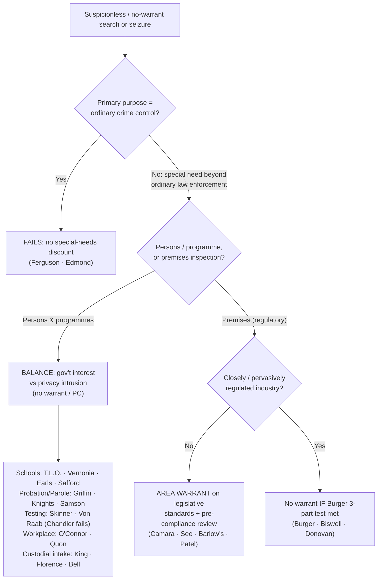

# Special Needs and Administrative Searches

*Does this search serve a special need beyond ordinary law enforcement, so reasonableness is measured by a balance instead of by warrant-and-probable-cause, or is it ordinary crime control dressed up, which gets no discount?*

> [!rule] Black-letter rule
> When a search or seizure serves a **"special need, beyond the normal need for law enforcement,"** the Fourth Amendment is satisfied **not** by a warrant and probable cause but by a **reasonableness balance**: the government's special interest against the individual's privacy intrusion. When the balance favors the programme it can sustain **suspicionless** or **reduced-suspicion** action in defined contexts (schools, probation and parole, government employment, closely regulated industries, drug testing of safety-sensitive roles, custodial intake). The threshold gate comes first: a programme whose **primary purpose is ordinary crime control fails**, however orderly. *[[New Jersey v. T.L.O.|T.L.O.]]*, 469 U.S. 325, [351](https://www.courtlistener.com/opinion/111301/new-jersey-v-t-l-o/) (1985) (Blackmun, J., concurring); *[[Ferguson v. City of Charleston|Ferguson]]*, 532 U.S. 67, [83](https://www.courtlistener.com/opinion/118414/ferguson-v-city-of-charleston/) (2001).
> ^rule-special-needs

## The Brief

**What it is, and is not.** "Special needs" is a **free-standing reasonableness inquiry**, not an ordinary warrant exception. When a recognized special need is present, the court drops the warrant and probable-cause requirements and **balances** the government interest against the privacy intrusion. Do not analyze it as if probable cause were required, and keep it distinct from voluntariness-based [[Consent Searches]] and the sovereignty-based rules of [[Border Searches]]. "Administrative" searches are a related but separate line: inspections of **premises** to enforce a regulatory scheme, where the default is not "no warrant" but a warrant of a special kind.

**The test up front.**
1. **Purpose gate.** Ask what the programme is *for*. If its primary purpose is to detect evidence of ordinary criminal wrongdoing, it **fails**, and no balancing saves it. *[[Ferguson v. City of Charleston|Ferguson]]*, 532 U.S. at [83](https://www.courtlistener.com/opinion/118414/ferguson-v-city-of-charleston/).
2. **Recognized special need.** Identify the government interest beyond ordinary law enforcement (school discipline, supervision of probationers, workplace integrity, transportation safety, custodial security).
3. **Balance.** Weigh that interest, the programme's efficacy, and the degree of intrusion; the balance sets the standard (suspicionless, reduced suspicion, or an area warrant), which follows the box you are in.

**The purpose gate is dispositive.** *[[Ferguson v. City of Charleston|Ferguson]]* applied it off the road: covertly testing pregnant patients was **not** a special need because "the immediate objective of the searches was to generate evidence *for law enforcement purposes*." 532 U.S. at 83. The same gate governs suspicionless vehicle **checkpoints**, where a crime-control primary purpose is fatal (*[[City of Indianapolis v. Edmond|Edmond]]*); the checkpoint application is developed on [[Checkpoints and Roadblocks]].

**Two regimes, kept separate.** The page spans two lines that share a root (reasonableness without a traditional warrant on probable cause) but diverge on **what** is searched and **what substitutes** for the warrant. In the **special-needs** line the court drops warrant and probable cause and balances, which can sustain suspicionless testing; the phrase is Justice Blackmun's *[[New Jersey v. T.L.O.|T.L.O.]]* [[Common Legal Terms#concurring-opinion|concurrence]], "special needs, beyond the normal need for law enforcement," 469 U.S. at 351, **not** the majority (a common miscredit). In the **administrative** line, inspections of premises to enforce a regulatory scheme default to an **area warrant** on neutral, legislatively fixed criteria, with a narrow closely-regulated-industry carve-out.

### Scope by category, each with its standard

State which box you are in first; the standard follows the box.

**Schools.** An ordinary school search runs on the ***[[New Jersey v. T.L.O.|T.L.O.]]* two-part test**: whether the action was "justified at its inception" and "reasonably related in scope to the circumstances which justified the interference in the first place." 469 U.S. at 341. No warrant, no probable cause, reasonable suspicion reasonably scoped. Suspicionless *drug testing* is a narrower line tied to reduced privacy: student **athletes** (*[[Vernonia School District 47J v. Acton|Vernonia]]*, 515 U.S. 646 (1995)) and **extracurricular** participants (*[[Board of Education v. Earls|Earls]]*, 536 U.S. 822 (2002)). But intrusiveness must match the suspicion: *[[Safford Unified School District v. Redding|Safford]]* held a **strip search** of a 13-year-old for common pain relievers unreasonable, though officials had qualified immunity. 557 U.S. 364 (2009).

**Probation and parole, at different floors.** Supervision is itself a special need, but the *[[Griffin v. Wisconsin|Griffin]]* / *[[United States v. Knights|Knights]]* / *[[Samson v. California|Samson]]* line sets **different** minimum suspicion levels, so do not assume parole rules govern probationers or vice versa. *[[Griffin v. Wisconsin|Griffin]]* allows a warrantless search of a **probationer's home** on "reasonable grounds" under a valid regulation, because "the special needs of Wisconsin's probation system make the warrant requirement impracticable." 483 U.S. 868, 873–74, 876 (1987). *[[United States v. Knights|Knights]]* upholds a probation search on **reasonable suspicion** even for an investigatory purpose. 534 U.S. 112, 121–22 (2001). *[[Samson v. California|Samson]]* goes further for **parolees**, who may be searched with **no individualized suspicion** given especially diminished privacy. 547 U.S. 843, 857 (2006).

**Administrative and regulatory inspections, where a warrant is still the default.** For routine code inspections the rule is *[[Camara v. Municipal Court|Camara]]*: a warrant is required, but an **area warrant** on reasonable legislative standards, not individualized probable cause. 387 U.S. 523 (1967). Its companion *[[See v. City of Seattle|See]]* extends the rule to **commercial** premises (387 U.S. 541 (1967)); *[[Marshall v. Barlow's Inc|Barlow's]]* applies it to **OSHA workplace** inspections (436 U.S. 307 (1978)). Modern *[[City of Los Angeles v. Patel|Patel]]* polices the regime: it must allow **pre-compliance review**, and ordinary businesses like **hotels are not "closely regulated."** 576 U.S. 409 (2015). The old warrantless-health-inspection rule of *[[Frank v. Maryland|Frank]]*, 359 U.S. 360 (1959), was **overruled** by *[[Camara v. Municipal Court|Camara]]* and *[[See v. City of Seattle|See]]*; it is history, not law. A separate welfare-administration niche survives: *[[Wyman v. James|Wyman]]*, 400 U.S. 309 (1971), treated a caseworker's home visit as a reasonable condition of benefits rather than a criminal-law "search" (good law, narrow).

*The narrow closely-regulated-industry carve-out is the **[[New York v. Burger|Burger]]** three-part test (the warrant substitute).* A warrantless inspection of a closely regulated business is reasonable **only** if all three are met: a **substantial government interest** informs the scheme; warrantless inspection is **necessary** to further it; and the scheme is "a constitutionally adequate substitute for a warrant," giving the owner notice and limiting inspector discretion in time, place, and scope. 482 U.S. 691, 702–03 (1987). It reaches genuinely pervasively regulated trades: **firearms** dealers (*[[United States v. Biswell|Biswell]]*, 406 U.S. 311 (1972)) and **mines** (*[[Donovan v. Dewey|Donovan]]*, 452 U.S. 594 (1981)), **not** any regulated business at will (*[[Marshall v. Barlow's Inc|Barlow's]]*; *[[City of Los Angeles v. Patel|Patel]]*).

**Drug and alcohol testing of safety-sensitive roles.** Suspicionless testing is reasonable where a concrete safety or integrity interest supports it: railway employees after major accidents or specified rule violations (*[[Skinner v. Railway Labor Executives' Ass'n|Skinner]]*, 489 U.S. 602 (1989)) and Customs employees seeking interdiction or firearm-carrying posts (*[[National Treasury Employees Union v. Von Raab|Von Raab]]*, 489 U.S. 656 (1989)). But the need must be **real and concrete**, not symbolic: *[[Chandler v. Miller|Chandler]]* struck down suspicionless drug testing of candidates for state office, which "diminishes personal privacy for a symbol's sake." 520 U.S. 305, 322 (1997).

**Public-employer workplace searches.** A public employee **can** have a reasonable expectation of privacy in an office, desk, or files, but a public employer's **work-related** search (to retrieve materials or investigate work misconduct) is judged by **reasonableness under all the circumstances**, no warrant or probable cause. *[[O'Connor v. Ortega|O'Connor]]*, 480 U.S. 709 (1987). *[[City of Ontario v. Quon|Quon]]* applied that to an employer's review of **text messages** on an employer-issued pager, reasonable because work-motivated and not excessive in scope (assuming, without deciding, a privacy expectation). 560 U.S. 746 (2010).

**Custodial-intake balancing.** Booking and jail admission are their own custodial balances, not testing programmes. *[[Maryland v. King|King]]* upholds a **buccal DNA cheek-swab** of a serious-offense arrestee held in custody as a reasonable booking procedure. 569 U.S. 435 (2013). *[[Florence v. County of Burlington|Florence]]* upholds a **close visual strip search** of every arrestee admitted to a jail's general population, without individualized suspicion, even for a minor offense, 566 U.S. 318 (2012), applying the institutional-deference balancing of *[[Bell v. Wolfish|Bell]]*, 441 U.S. 520 (1979). (These bodily custodial searches are a different rule from the property-catalog [[Inventory Searches|inventory]] of an arrestee's effects.)

**Backstops and interfaces.** Neighboring doctrines share the special-needs balance but are treated in full elsewhere: suspicionless vehicle **checkpoints** ([[Checkpoints and Roadblocks]]), caretaking **inventories** of impounded vehicles and booked effects ([[Inventory Searches]]), and post-fire **administrative-warrant** entries once the blaze is out (*[[Michigan v. Tyler|Tyler]]*; *[[Michigan v. Clifford|Clifford]]*; see [[Emergency Aid]]).

**Burden, standard of review, remedy.** The **government** must establish that a recognized special-needs or administrative exception applies and that, on balance, its interest outweighs the intrusion. *[[Vernonia School District 47J v. Acton|Vernonia]]*, 515 U.S. at [652–53](https://www.courtlistener.com/opinion/117964/vernonia-school-district-47j-v-acton/). The reasonableness balance is reviewed [[Common Legal Terms#de-novo|de novo]], underlying facts for [[Common Legal Terms#clear-error|clear error]]. The **remedy** for an unjustified search is suppression under [[The Exclusionary Rule]], except that suppression does **not** reach a **parole-revocation** hearing. *[[Pennsylvania Board of Probation and Parole v. Scott|Scott]]*, 524 U.S. 357 (1998).

**Apply it.**
1. **Run the purpose gate first.** If the immediate objective is to gather ordinary criminal evidence, stop: there is no special-needs discount (*[[Ferguson v. City of Charleston|Ferguson]]*).
2. **Name the box.** School, probation, parole, testing of a safety role, regulatory inspection, or custodial intake, each has its own standard.
3. **Match the standard to the box.** Reasonable suspicion (schools, probation), no suspicion (parole, qualifying testing, custodial intake), or an **area warrant** (ordinary regulatory inspections).
4. **Do not stretch the carve-outs.** The closely-regulated exception is narrow (*[[New York v. Burger|Burger]]*); most businesses get a *[[Camara v. Municipal Court|Camara]]* area warrant, and a testing programme needs a real, concrete need (*[[Chandler v. Miller|Chandler]]*).

**Common pitfalls.**
- **Importing probable cause.** Special needs is a **balance**, but reasonableness is not a blank check: *[[Chandler v. Miller|Chandler]]* and *[[Ferguson v. City of Charleston|Ferguson]]* demand a real, non-law-enforcement need.
- **Calling it a warrant exception in the usual sense.** Some sub-areas (administrative inspections under *[[Camara v. Municipal Court|Camara]]*) still require a warrant of a special kind; others (testing, parole searches) require none. Match the rule to the sub-area.
- **Treating the closely-regulated carve-out as the general admin rule.** *[[Marshall v. Barlow's Inc|Barlow's]]* and *[[New York v. Burger|Burger]]* make it narrow; most premises default to a *[[Camara v. Municipal Court|Camara]]* area warrant.
- **Crediting "special needs" to the *[[New Jersey v. T.L.O.|T.L.O.]]* majority.** It is Blackmun's concurrence, 469 U.S. at 351.

## Lower-court developments

The special-needs and supervision-search rules keep being applied and extended in the courts of appeals, especially as the *[[United States v. Knights|Knights]]* / *[[Samson v. California|Samson]]* line meets digital devices and as circuits police how much record support a suspicionless supervised-release condition needs. Each decision below binds only in its own circuit.

- ***[[United States v. Payne|Payne]]* (9th Cir. 2024)** — *extends supervision searches to devices.* A California parolee's cell phone may be searched without individualized cause under a suspicionless parole condition (a *[[Samson v. California|Samson]]* / *[[United States v. Knights|Knights]]* totality), and officers may compel a thumbprint to unlock it as a non-testimonial act. 99 F.4th 495. **Binding in-circuit — 9th Cir.**
- ***[[United States v. Oliveras|Oliveras]]* (2d Cir. 2024)** — *demands record support.* The special-needs doctrine can support a suspicionless supervised-release search condition, but **only when the record justifies it**; the court vacated the condition and remanded for individualized, on-the-record reasons. 96 F.4th 298. **Binding in-circuit — 2d Cir.**

The circuits agree the doctrine reaches supervisees' devices; they diverge on the record-making a suspicionless condition requires, a case-management question left to the sentencing court under *[[Samson v. California|Samson]]* and *[[United States v. Knights|Knights]]*.

## Key cases

| Case | Holding | Opinion |
|---|---|---|
| *[[Ferguson v. City of Charleston]]*, 532 U.S. 67 (2001) | **Purpose gate.** Covertly testing patients to generate evidence for police is not a special need; the immediate law-enforcement objective is dispositive. | [opinion](https://www.courtlistener.com/opinion/118414/ferguson-v-city-of-charleston/) |
| *[[New Jersey v. T.L.O.]]*, 469 U.S. 325 (1985) | **Anchor.** A public-school search runs on reasonableness alone (justified at inception, reasonable in scope), no warrant or probable cause. | [opinion](https://www.courtlistener.com/opinion/111301/new-jersey-v-t-l-o/) |
| *[[Vernonia School District 47J v. Acton]]*, 515 U.S. 646 (1995) | Suspicionless random drug testing of student athletes is reasonable under the special-needs doctrine. | [opinion](https://www.courtlistener.com/opinion/117964/vernonia-school-district-47j-v-acton/) |
| *[[Board of Education v. Earls]]*, 536 U.S. 822 (2002) | Extends *Vernonia*: suspicionless testing of all students in competitive extracurriculars is reasonable. | [opinion](https://www.courtlistener.com/opinion/121171/board-of-education-of-independent-school-district-no-92-of-pottawatomie/) |
| *[[Safford Unified School District v. Redding]]*, 557 U.S. 364 (2009) | A strip search must match intrusiveness to suspicion; strip-searching a 13-year-old for common pain relievers was unreasonable ([[Qualified Immunity\|qualified immunity]] applied). | [opinion](https://www.courtlistener.com/opinion/145852/safford-unified-school-district-1-v-redding/) |
| *[[Griffin v. Wisconsin]]*, 483 U.S. 868 (1987) | A probationer's home may be searched without a warrant, on reasonable grounds, under a valid regulation; probation is a special need. | [opinion](https://www.courtlistener.com/opinion/111959/griffin-v-wisconsin/) |
| *[[United States v. Knights]]*, 534 U.S. 112 (2001) | A probation search on reasonable suspicion, authorized by a search condition, is reasonable even for a law-enforcement purpose. | [opinion](https://www.courtlistener.com/opinion/118468/united-states-v-knights/) |
| *[[Samson v. California]]*, 547 U.S. 843 (2006) | A suspicionless search of a parolee subject to a search condition is reasonable; parolees have severely diminished privacy. | [opinion](https://www.courtlistener.com/opinion/145640/samson-v-california/) |
| *[[Skinner v. Railway Labor Executives' Ass'n]]*, 489 U.S. 602 (1989) | Suspicionless drug/alcohol testing of railway employees after major accidents or rule violations is reasonable (safety special need). | [opinion](https://www.courtlistener.com/opinion/112219/skinner-v-railway-labor-executives-assn/) |
| *[[National Treasury Employees Union v. Von Raab]]*, 489 U.S. 656 (1989) | Suspicionless drug testing of Customs employees seeking interdiction or firearm-carrying posts is reasonable. | [opinion](https://www.courtlistener.com/opinion/112220/national-treasury-employees-union-v-von-raab/) |
| *[[Chandler v. Miller]]*, 520 U.S. 305 (1997) | Symbolic suspicionless drug testing of candidates for state office fails; no concrete special need. | [opinion](https://www.courtlistener.com/opinion/118100/chandler-v-miller/) |
| *[[Camara v. Municipal Court]]*, 387 U.S. 523 (1967) | Administrative code inspections generally need a warrant, but an area warrant on reasonable legislative standards, not individualized probable cause. | [opinion](https://www.courtlistener.com/opinion/107473/camara-v-municipal-court-of-city-and-county-of-san-francisco/) |
| *[[See v. City of Seattle]]*, 387 U.S. 541 (1967) | Extends *[[Camara v. Municipal Court\|Camara]]* to commercial premises: an owner may insist on a warrant before inspection of non-public areas. | [opinion](https://www.courtlistener.com/opinion/107474/see-v-city-of-seattle/) |
| *[[Marshall v. Barlow's Inc]]*, 436 U.S. 307 (1978) | OSHA may not conduct warrantless inspections of business premises; an administrative inspection warrant is required (subject to the closely-regulated carve-out). | [opinion](https://www.courtlistener.com/opinion/109866/marshall-v-barlows-inc/) |
| *[[New York v. Burger]]*, 482 U.S. 691 (1987) | Warrantless inspection of a closely regulated business is reasonable under a three-part test (substantial interest, necessity, adequate warrant substitute). | [opinion](https://www.courtlistener.com/opinion/111927/new-york-v-burger/) |
| *[[United States v. Biswell]]*, 406 U.S. 311 (1972) | Warrantless inspection of a federally licensed firearms dealer is reasonable; a pervasively regulated business where unannounced inspection is essential. | [opinion](https://www.courtlistener.com/opinion/108533/united-states-v-biswell/) |
| *[[Donovan v. Dewey]]*, 452 U.S. 594 (1981) | Warrantless inspection of mines is reasonable where a comprehensive statutory scheme is a constitutionally adequate warrant substitute. | [opinion](https://www.courtlistener.com/opinion/110530/donovan-v-dewey/) |
| *[[City of Los Angeles v. Patel]]*, 576 U.S. 409 (2015) | An admin-inspection regime is facially invalid absent pre-compliance review; hotels are not closely regulated. | [opinion](https://www.courtlistener.com/opinion/2810524/los-angeles-v-patel/) |
| *[[O'Connor v. Ortega]]*, 480 U.S. 709 (1987) | A public employee may have privacy in office, desk, or files, but a public employer's work-related search is judged by reasonableness, no warrant or probable cause. | [opinion](https://www.courtlistener.com/opinion/111851/oconnor-v-ortega/) |
| *[[City of Ontario v. Quon]]*, 560 U.S. 746 (2010) | A government employer's review of an employee's text messages on an employer pager is reasonable where work-motivated and not excessive in scope. | [opinion](https://www.courtlistener.com/opinion/148797/city-of-ontario-v-quon/) |
| *[[Maryland v. King]]*, 569 U.S. 435 (2013) | A buccal DNA cheek-swab of a serious-offense arrestee held in custody is a reasonable booking procedure. | [opinion](https://www.courtlistener.com/opinion/873669/maryland-v-king/) |
| *[[Florence v. County of Burlington]]*, 566 U.S. 318 (2012) | A close visual jail-intake strip search of every arrestee admitted to the general population is reasonable without individualized suspicion, even for a minor offense. | [opinion](https://www.courtlistener.com/opinion/626454/florence-v-board-of-chosen-freeholders-of-county-of-burlington/) |
| *[[Bell v. Wolfish]]*, 441 U.S. 520 (1979) | Institutional-deference reasonableness balancing governs searches of detainees at a custodial facility; the foundation for custodial-intake searches. | [opinion](https://www.courtlistener.com/opinion/110075/bell-v-wolfish/) |
| *[[Wyman v. James]]*, 400 U.S. 309 (1971) | A welfare caseworker's home visit is a reasonable condition of benefits, not a criminal-law search (good law, narrow). | [opinion](https://www.courtlistener.com/opinion/108223/wyman-v-james/) |

## Related cases across doctrines

These are treated in full elsewhere but bear on the special-needs and administrative-search line, framed here.

| Case | Relevance here | Primary home | Opinion |
|---|---|---|---|
| *[[City of Indianapolis v. Edmond]]*, 531 U.S. 32 (2000) | ***Purpose gate (checkpoints).*** A checkpoint whose primary purpose is ordinary crime control is unconstitutional, the road-side sibling of *[[Ferguson v. City of Charleston\|Ferguson]]*'s purpose test. | [[Checkpoints and Roadblocks]] | [opinion](https://www.courtlistener.com/opinion/118391/city-of-indianapolis-v-edmond/) |
| *[[Michigan v. Tyler]]*, 436 U.S. 499 (1978) | ***Administrative-warrant sibling.*** Continued fire-scene investigation after the blaze is out needs an administrative warrant for cause/origin, or a criminal warrant for arson evidence. | [[Emergency Aid]] | [opinion](https://www.courtlistener.com/opinion/109874/michigan-v-tyler/) |
| *[[Michigan v. Clifford]]*, 464 U.S. 287 (1984) | ***Refines Tyler.*** Where privacy interests remain in fire-damaged property, a post-fire search once the scene is secured needs the right kind of warrant. | [[Emergency Aid]] | [opinion](https://www.courtlistener.com/opinion/111057/michigan-v-clifford/) |
| *[[Pennsylvania Board of Probation and Parole v. Scott]]*, 524 U.S. 357 (1998) | ***Remedy limit.*** The exclusionary rule does not apply at a parole-revocation hearing, limiting suppression in the supervision context. | [[The Exclusionary Rule]] | [opinion](https://www.courtlistener.com/opinion/118235/pennsylvania-bd-of-probation-and-parole-v-scott/) |

## Visual

## Sources

- *Ferguson v. City of Charleston*, 532 U.S. 67 (2001) — https://www.courtlistener.com/opinion/118414/ferguson-v-city-of-charleston/ (pinpoint: 83)
- *New Jersey v. T.L.O.*, 469 U.S. 325 (1985) — https://www.courtlistener.com/opinion/111301/new-jersey-v-t-l-o/ (pinpoints: 341, 351 (Blackmun, J., concurring))
- *Vernonia School District 47J v. Acton*, 515 U.S. 646 (1995) — https://www.courtlistener.com/opinion/117964/vernonia-school-district-47j-v-acton/ (pinpoint: 652–53)
- *Board of Education v. Earls*, 536 U.S. 822 (2002) — https://www.courtlistener.com/opinion/121171/board-of-education-of-independent-school-district-no-92-of-pottawatomie/
- *Safford Unified School District v. Redding*, 557 U.S. 364 (2009) — https://www.courtlistener.com/opinion/145852/safford-unified-school-district-1-v-redding/
- *Griffin v. Wisconsin*, 483 U.S. 868 (1987) — https://www.courtlistener.com/opinion/111959/griffin-v-wisconsin/ (pinpoints: 873–74, 876)
- *United States v. Knights*, 534 U.S. 112 (2001) — https://www.courtlistener.com/opinion/118468/united-states-v-knights/ (pinpoints: 121, 122)
- *Samson v. California*, 547 U.S. 843 (2006) — https://www.courtlistener.com/opinion/145640/samson-v-california/ (pinpoint: 857)
- *Skinner v. Railway Labor Executives' Ass'n*, 489 U.S. 602 (1989) — https://www.courtlistener.com/opinion/112219/skinner-v-railway-labor-executives-assn/
- *National Treasury Employees Union v. Von Raab*, 489 U.S. 656 (1989) — https://www.courtlistener.com/opinion/112220/national-treasury-employees-union-v-von-raab/
- *Chandler v. Miller*, 520 U.S. 305 (1997) — https://www.courtlistener.com/opinion/118100/chandler-v-miller/ (pinpoint: 322)
- *Camara v. Municipal Court*, 387 U.S. 523 (1967) — https://www.courtlistener.com/opinion/107473/camara-v-municipal-court-of-city-and-county-of-san-francisco/
- *See v. City of Seattle*, 387 U.S. 541 (1967) — https://www.courtlistener.com/opinion/107474/see-v-city-of-seattle/
- *Marshall v. Barlow's, Inc.*, 436 U.S. 307 (1978) — https://www.courtlistener.com/opinion/109866/marshall-v-barlows-inc/
- *New York v. Burger*, 482 U.S. 691 (1987) — https://www.courtlistener.com/opinion/111927/new-york-v-burger/ (pinpoints: 702, 703)
- *United States v. Biswell*, 406 U.S. 311 (1972) — https://www.courtlistener.com/opinion/108533/united-states-v-biswell/
- *Donovan v. Dewey*, 452 U.S. 594 (1981) — https://www.courtlistener.com/opinion/110530/donovan-v-dewey/
- *City of Los Angeles v. Patel*, 576 U.S. 409 (2015) — https://www.courtlistener.com/opinion/2810524/los-angeles-v-patel/
- *O'Connor v. Ortega*, 480 U.S. 709 (1987) — https://www.courtlistener.com/opinion/111851/oconnor-v-ortega/
- *City of Ontario v. Quon*, 560 U.S. 746 (2010) — https://www.courtlistener.com/opinion/148797/city-of-ontario-v-quon/
- *Maryland v. King*, 569 U.S. 435 (2013) — https://www.courtlistener.com/opinion/873669/maryland-v-king/
- *Florence v. County of Burlington*, 566 U.S. 318 (2012) — https://www.courtlistener.com/opinion/626454/florence-v-board-of-chosen-freeholders-of-county-of-burlington/
- *Bell v. Wolfish*, 441 U.S. 520 (1979) — https://www.courtlistener.com/opinion/110075/bell-v-wolfish/
- *Wyman v. James*, 400 U.S. 309 (1971) — https://www.courtlistener.com/opinion/108223/wyman-v-james/
- *Frank v. Maryland*, 359 U.S. 360 (1959) — https://www.courtlistener.com/opinion/105880/frank-v-maryland/ (overruled by *Camara* / *See*)
- *City of Indianapolis v. Edmond*, 531 U.S. 32 (2000) — https://www.courtlistener.com/opinion/118391/city-of-indianapolis-v-edmond/ (checkpoint purpose gate; home = [[Checkpoints and Roadblocks]])
- *Michigan v. Tyler*, 436 U.S. 499 (1978) — https://www.courtlistener.com/opinion/109874/michigan-v-tyler/ (home = [[Emergency Aid]])
- *Michigan v. Clifford*, 464 U.S. 287 (1984) — https://www.courtlistener.com/opinion/111057/michigan-v-clifford/ (home = [[Emergency Aid]])
- *Pennsylvania Board of Probation and Parole v. Scott*, 524 U.S. 357 (1998) — https://www.courtlistener.com/opinion/118235/pennsylvania-bd-of-probation-and-parole-v-scott/ (home = [[The Exclusionary Rule]])
- *United States v. Payne*, 99 F.4th 495 (9th Cir. 2024) — https://www.courtlistener.com/opinion/9494371/united-states-v-jeremy-payne/
- *United States v. Oliveras*, 96 F.4th 298 (2d Cir. 2024) — https://www.courtlistener.com/opinion/9484364/united-states-v-oliveras/
