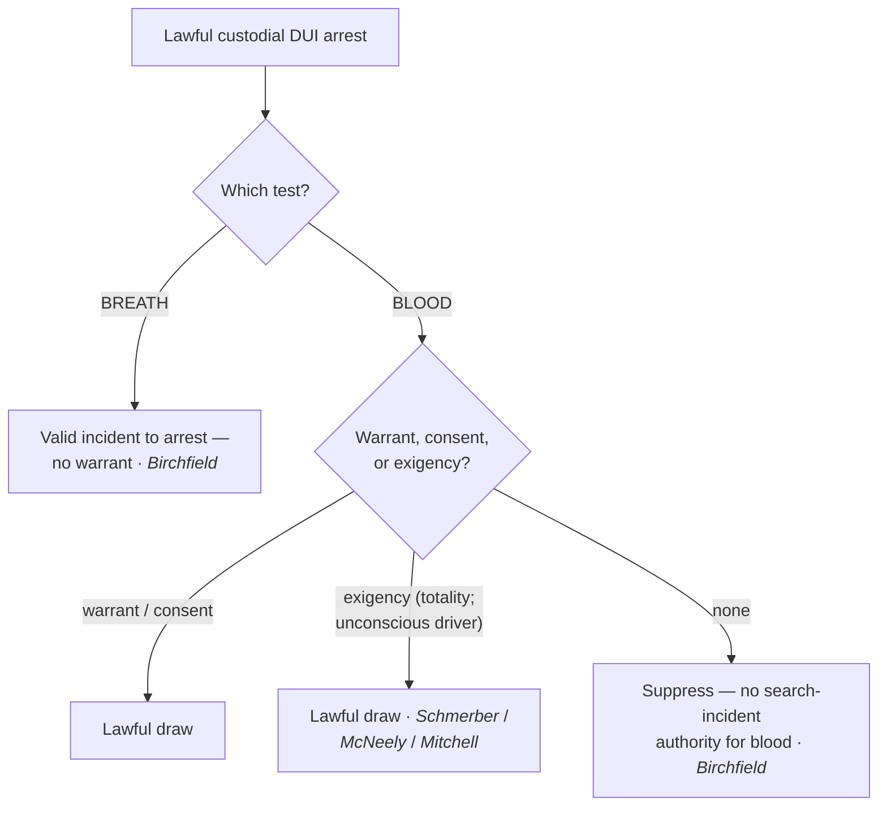

# SIA — Alcohol Tests

*This page states the search-incident rule for chemical testing on a drunk-driving arrest. The dissipating-alcohol [[Exigent Circumstances and Hot Pursuit|exigency]] that fills the gap for blood is developed at [[Exigent Circumstances and Hot Pursuit]].*

> [!rule] Black-letter rule
> "[A] breath test, but not a blood test, may be administered as a search incident to a lawful arrest for drunk driving." *[[Birchfield v. North Dakota#^pin-2185|Birchfield v. North Dakota]]*, 579 U.S. 438, [474](https://www.courtlistener.com/opinion/3216497/birchfield-v-n-dakota-william-robert-bernard/) (2016). A warrantless **breath** test rides the arrest; a warrantless **blood** draw does not — it needs a **warrant**, valid **consent**, or a genuine **exigency** (the dissipating-BAC line of *[[Schmerber v. California#^pin-770|Schmerber]]* / *[[Missouri v. McNeely|McNeely]]* / *[[Mitchell v. Wisconsin#^pin-2539|Mitchell]]*).
> ^rule-sia-alcohol

## The Brief

**Field-decisive question: I arrested a driver for DUI — can I test breath or blood without a warrant?** Breath, yes, on the arrest alone; blood, no, unless a warrant, consent, or [[Exigent Circumstances and Hot Pursuit|exigency]] supplies the authority. The government bears the burden of justifying any warrantless test; the remedy for an unjustified blood draw is suppression under [[The Exclusionary Rule]].

**The two tests are treated differently because the intrusions differ.** *[[Birchfield v. North Dakota|Birchfield]]* weighed the privacy intrusion against the state's interest and split the difference: a **breath** test is minimally intrusive (no piercing of the skin, no lingering biological sample) and "may be administered as a search incident to a lawful arrest for drunk driving." *[[Birchfield v. North Dakota#^pin-2185|Birchfield]]*, 579 U.S. at [474](https://www.courtlistener.com/opinion/3216497/birchfield-v-n-dakota-william-robert-bernard/). A **blood** draw pierces the body and yields a sample the government retains, so it is **not** covered by the search-incident exception and needs its own justification.

**Implied-consent statutes: refusing a breath test can be a crime; refusing a blood test cannot.** Because a warrantless breath test is a valid incident search, a State may make it a **crime** to refuse one. But because a warrantless **blood** draw is not, a State may not impose **criminal** penalties for refusing it — the driver cannot be deemed to have "consented" on pain of a separate crime to a test the Fourth Amendment would otherwise require a warrant for. *[[Birchfield v. North Dakota|Birchfield]]* struck the criminal-refusal penalty as applied to blood while upholding it for breath. Civil consequences (license suspension) are a different question and were not disturbed.

**The blood gap is filled by exigency, not by the arrest.** Where a warrantless blood draw is needed, the theory is the **dissipating-alcohol exigency**, not search incident to arrest. *[[Schmerber v. California#^pin-770|Schmerber]]* upheld a warrantless blood draw on probable cause where the delay to get a warrant threatened the loss of evidence as alcohol metabolized. 384 U.S. 757, 770 (1966). *[[Missouri v. McNeely|McNeely]]* then held the natural dissipation of blood alcohol does **not** create a **per se** exigency in every case; the exigency question is judged on the **totality of the circumstances**. 569 U.S. 141, 156 (2013). *[[Mitchell v. Wisconsin#^pin-2539|Mitchell]]* addressed the recurring **unconscious-driver** case: when a drunk-driving suspect is unconscious and cannot be given a breath test, the exigency doctrine will **almost always** permit a warrantless blood draw. 588 U.S. 840 (2019). The full exigency analysis is at [[Exigent Circumstances and Hot Pursuit]].

**Apply it.**
1. On a lawful **custodial DUI arrest**, a warrantless **breath** test is valid incident to the arrest (*[[Birchfield v. North Dakota|Birchfield]]*).
2. For **blood**, get a **warrant** unless consent or a genuine [[Exigent Circumstances and Hot Pursuit|exigency]] applies (*[[Birchfield v. North Dakota|Birchfield]]*).
3. If you rely on **[[Exigent Circumstances and Hot Pursuit|exigency]]** for blood, articulate the totality — dissipation alone is not automatic (*[[Missouri v. McNeely|McNeely]]*); an **unconscious** driver who cannot blow will "almost always" support it (*[[Mitchell v. Wisconsin|Mitchell]]*).
4. Do not threaten a **crime** for refusing a **blood** test; that penalty is unconstitutional (*[[Birchfield v. North Dakota|Birchfield]]*). Breath-test-refusal penalties are permissible.

**Common pitfalls.**
- **Treating blood like breath.** Only the **breath** test rides the arrest; blood needs a warrant, consent, or [[Exigent Circumstances and Hot Pursuit|exigency]] (*[[Birchfield v. North Dakota|Birchfield]]*).
- **Assuming BAC dissipation is an automatic [[Exigent Circumstances and Hot Pursuit|exigency]].** *[[Missouri v. McNeely|McNeely]]* rejects a per-se rule; judge the totality.
- **Criminalizing refusal of a blood test.** Unconstitutional under *[[Birchfield v. North Dakota|Birchfield]]* (civil license consequences are separate).
- **Calling the blood draw a "search incident to arrest."** It is not; the theory is [[Exigent Circumstances and Hot Pursuit|exigency]] (*[[Schmerber v. California|Schmerber]]* line).

## Lower-court developments

The SCOTUS line (*[[Birchfield v. North Dakota|Birchfield]]* / *[[Missouri v. McNeely|McNeely]]* / *[[Mitchell v. Wisconsin|Mitchell]]*) governs; state courts continue to work out **implied-consent** mechanics — how far *[[Mitchell v. Wisconsin|Mitchell]]*'s unconscious-driver rule reaches, and whether statutory "consent" can substitute for a warrant after *[[Birchfield v. North Dakota|Birchfield]]*. These turn on state statutes and are litigated state by state; no federal circuit rule displaces the SCOTUS framework.

## Key cases

| Case | Holding | Opinion |
|---|---|---|
| *[[Birchfield v. North Dakota]]*, 579 U.S. 438 (2016) | **Anchor.** A warrantless **breath** test is a valid search incident to a DUI arrest; a warrantless **blood** test is not, and criminal penalties for refusing a blood test are unconstitutional. | [opinion](https://www.courtlistener.com/opinion/3216497/birchfield-v-n-dakota-william-robert-bernard/) |

## Related cases across doctrines

These cases are treated in full elsewhere but frame the chemical-testing rule here.

| Case | Relevance here | Primary home | Opinion |
|---|---|---|---|
| *[[Schmerber v. California]]*, 384 U.S. 757 (1966) | ***[[Exigent Circumstances and Hot Pursuit\|Exigency]] baseline.*** A warrantless **blood** draw on probable cause is reasonable where dissipating BAC leaves no time for a warrant; the theory that fills the gap *[[Birchfield v. North Dakota\|Birchfield]]* leaves for blood. | [[Exigent Circumstances and Hot Pursuit]] | [opinion](https://www.courtlistener.com/opinion/107262/schmerber-v-california/) |
| *[[Missouri v. McNeely]]*, 569 U.S. 141 (2013) | ***No per-se [[Exigent Circumstances and Hot Pursuit\|exigency]].*** The natural dissipation of blood alcohol does not create a categorical [[Exigent Circumstances and Hot Pursuit\|exigency]]; the question is judged on the [[Common Legal Terms#totality-of-the-circumstances\|totality of the circumstances]]. | [[Exigent Circumstances and Hot Pursuit]] | [opinion](https://www.courtlistener.com/opinion/882802/missouri-v-mcneely/) |
| *[[Mitchell v. Wisconsin]]*, 588 U.S. 840 (2019) | ***Unconscious driver.*** When a DUI suspect is unconscious and cannot take a breath test, [[Exigent Circumstances and Hot Pursuit\|exigency]] will "almost always" permit a warrantless blood draw. | [[Exigent Circumstances and Hot Pursuit]] | [opinion](https://www.courtlistener.com/opinion/4218101/mitchell-v-wisconsin/) |

## Visual

## Sources
- [*Birchfield v. North Dakota*, 579 U.S. 438 (2016)](https://www.courtlistener.com/opinion/3216497/birchfield-v-n-dakota-william-robert-bernard/) (pinpoint: 474)
- [*Schmerber v. California*, 384 U.S. 757 (1966)](https://www.courtlistener.com/opinion/107262/schmerber-v-california/) (pinpoint: 770)
- [*Missouri v. McNeely*, 569 U.S. 141 (2013)](https://www.courtlistener.com/opinion/882802/missouri-v-mcneely/) (pinpoint: 156)
- [*Mitchell v. Wisconsin*, 588 U.S. 840 (2019)](https://www.courtlistener.com/opinion/4218101/mitchell-v-wisconsin/)
