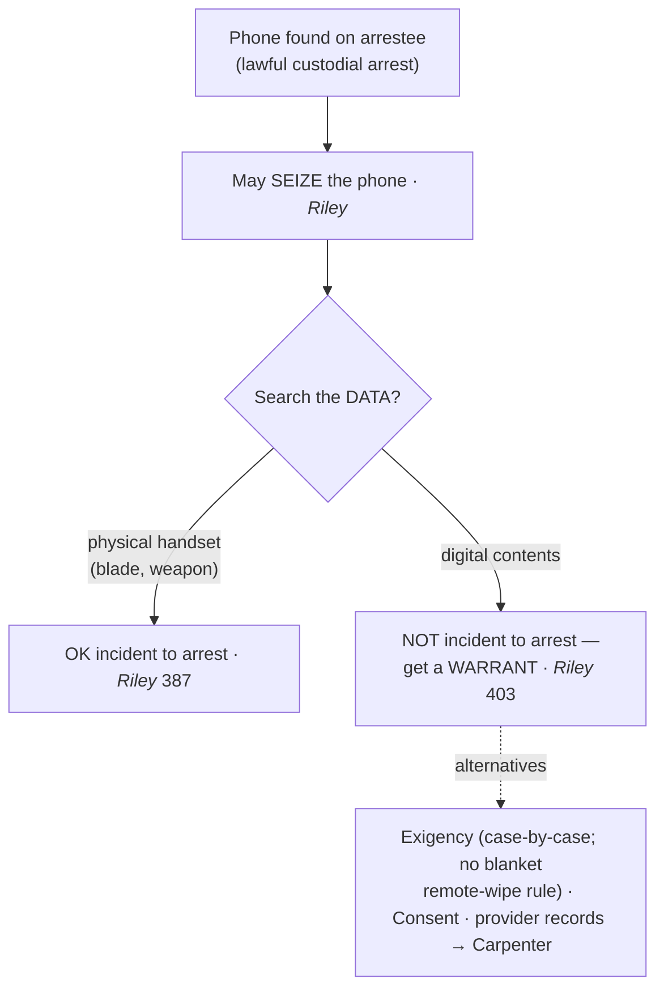

# SIA — Cell Phones

*This page states the one place the bright-line search-of-the-person rule stops: the digital contents of a cell phone. For the person search generally see [[SIA Persons]]; for location and account records held by a provider see [[The Third-Party Doctrine and Digital Surveillance]].*

> [!rule] Black-letter rule
> The search-incident-to-arrest rule does **not** reach the **digital contents** of a cell phone. "Our answer to the question of what police must do before searching a cell phone seized incident to an arrest is accordingly simple — get a warrant." *[[Riley v. California|Riley v. California]]*, 573 U.S. 373, 403 (2014). Officers may **seize** the phone and inspect its **physical** aspects incident to arrest; they may not search the **data** without a warrant or a separate exception.
> ^rule-sia-cellphone

## The Brief

**Field-decisive question: I found a phone on the arrestee — may I go through it?** No. Seizing the handset is fine; browsing its data is a search that needs a warrant. The burden to justify a warrantless data search is the government's; the remedy for browsing without one is suppression under [[The Exclusionary Rule]].

**Why the bright line stops at the data.** The *[[Chimel v. California|Chimel]]* rationales (officer safety and evidence preservation) do not transfer to digital contents. "Digital data stored on a cell phone cannot itself be used as a weapon to harm an arresting officer or to effectuate the arrestee's escape." *[[Riley v. California|Riley]]*, 573 U.S. at 387. A modern phone is not a wallet or a cigarette pack: its immense storage, its capacity to reconstruct a person's whole life, and the way it reaches data stored elsewhere (the cloud) make the *[[United States v. Robinson|Robinson]]* full-search-of-the-person rule a poor fit, so the Court declined to extend it.

**What officers may still do without a warrant.** Two things survive the arrest. First, they may **seize** the phone so it is not lost or destroyed. Second, they may examine the phone's **physical aspects**: officers "remain free to examine the physical aspects of a phone to ensure that it will not be used as a weapon — say, to determine whether there is a razor blade hidden between the phone and its case." *[[Riley v. California|Riley]]*, 573 U.S. at 387. What they may not do on the arrest alone is open the phone and read its data.

**The doctrine interfaces: the ways in without an incident search.** *[[Riley v. California|Riley]]* closed the search-incident door for data but left the ordinary doors open. A **warrant** is the routine answer. A genuine **[[Exigent Circumstances and Hot Pursuit|exigency]]** (imminent remote-wiping or data encryption, a specific threat) can justify a warrantless search case by case, but *[[Riley v. California|Riley]]* was skeptical of remote-wiping as a generic justification and pointed to less-intrusive alternatives (powering down, a Faraday bag). See [[Exigent Circumstances and Hot Pursuit]]. **Consent** to search the phone works if voluntary (see [[Consent Searches]]). And records held by a **provider** (cell-site location, account data) are governed by the third-party and *[[Carpenter v. United States|Carpenter]]* line, not by this rule; see [[The Third-Party Doctrine and Digital Surveillance]].

**Apply it.**
1. **Seize** the phone incident to the arrest so it is preserved.
2. Inspect only the **physical** device (for a weapon or a concealed blade) — not its data (*[[Riley v. California|Riley]]*).
3. To read the **data**, get a **warrant** (the default answer *[[Riley v. California|Riley]]* gives).
4. If you claim **[[Exigent Circumstances and Hot Pursuit|exigency]]** (imminent wiping, encryption, a live threat), articulate the specific facts and consider a Faraday bag or powering down first; *[[Riley v. California|Riley]]* rejects remote-wiping as an automatic justification.
5. For **location or account records** held by a carrier, do not rely on this rule — see the *[[Carpenter v. United States|Carpenter]]* line at [[The Third-Party Doctrine and Digital Surveillance]].

**Common pitfalls.**
- **Treating the phone like everything else in the pockets.** *[[United States v. Robinson|Robinson]]* lets you search the pack of cigarettes; *[[Riley v. California|Riley]]* stops you at the phone's data.
- **Reading the whole phone "for officer safety."** The physical handset can hide a blade; the **data** cannot hurt anyone (*[[Riley v. California|Riley]]*, 573 U.S. at 387).
- **Calling routine remote-wiping risk an [[Exigent Circumstances and Hot Pursuit|exigency]].** *[[Riley v. California|Riley]]* rejects that as a blanket justification; articulate specific facts or secure the device.
- **Conflating the phone's contents with carrier records.** Data on the device is *[[Riley v. California|Riley]]*; historical location and account data held by the provider is the *[[Carpenter v. United States|Carpenter]]* / third-party line.

## Lower-court developments

*[[Riley v. California|Riley]]* is a bright line and has held; the frontier work is at the phone's edges (border-search device inspections, forced decryption, and the scope of a phone warrant) and is treated on the digital-surveillance pages rather than here. No lower-court development narrows the core rule that a warrant is required to search a phone's data incident to arrest.

## Key cases

| Case | Holding | Opinion |
|---|---|---|
| *[[Riley v. California]]*, 573 U.S. 373 (2014) | **Anchor.** The search-incident rule does **not** extend to the **digital data** on a cell phone; seize the phone, then get a warrant to search its contents. | [opinion](https://www.courtlistener.com/opinion/2680439/riley-v-california/) |

## Related cases across doctrines

These cases are treated in full elsewhere but frame the cell-phone rule here.

| Case | Relevance here | Primary home | Opinion |
|---|---|---|---|
| *[[Chimel v. California]]*, 395 U.S. 752 (1969) | ***Rationale.*** Supplies the officer-safety and evidence-preservation rationales that *[[Riley v. California|Riley]]* holds do **not** transfer to digital data. | [[SIA Persons]] | [opinion](https://www.courtlistener.com/opinion/107979/chimel-v-california/) |
| *[[United States v. Robinson]]*, 414 U.S. 218 (1973) | ***Foil.*** The categorical full-search-of-the-person rule *[[Riley v. California|Riley]]* declines to extend to a phone's contents. | [[SIA Persons]] | [opinion](https://www.courtlistener.com/opinion/108893/united-states-v-robinson/) |
| *[[Carpenter v. United States]]*, 585 U.S. 296 (2018) | ***Boundary.*** Records of a phone's past cell-site locations held by a provider need a warrant; the account-records counterpart to *[[Riley v. California|Riley]]*'s on-device rule. | [[The Third-Party Doctrine and Digital Surveillance]] | [opinion](https://www.courtlistener.com/opinion/4510032/carpenter-v-united-states/) |

## Visual

## Sources
- [*Riley v. California*, 573 U.S. 373 (2014)](https://www.courtlistener.com/opinion/2680439/riley-v-california/) (pinpoints: 387, 403)
- [*Chimel v. California*, 395 U.S. 752 (1969)](https://www.courtlistener.com/opinion/107979/chimel-v-california/) (pinpoint: 763)
- [*United States v. Robinson*, 414 U.S. 218 (1973)](https://www.courtlistener.com/opinion/108893/united-states-v-robinson/) (pinpoint: 235)
- [*Carpenter v. United States*, 585 U.S. 296 (2018)](https://www.courtlistener.com/opinion/4510032/carpenter-v-united-states/)
