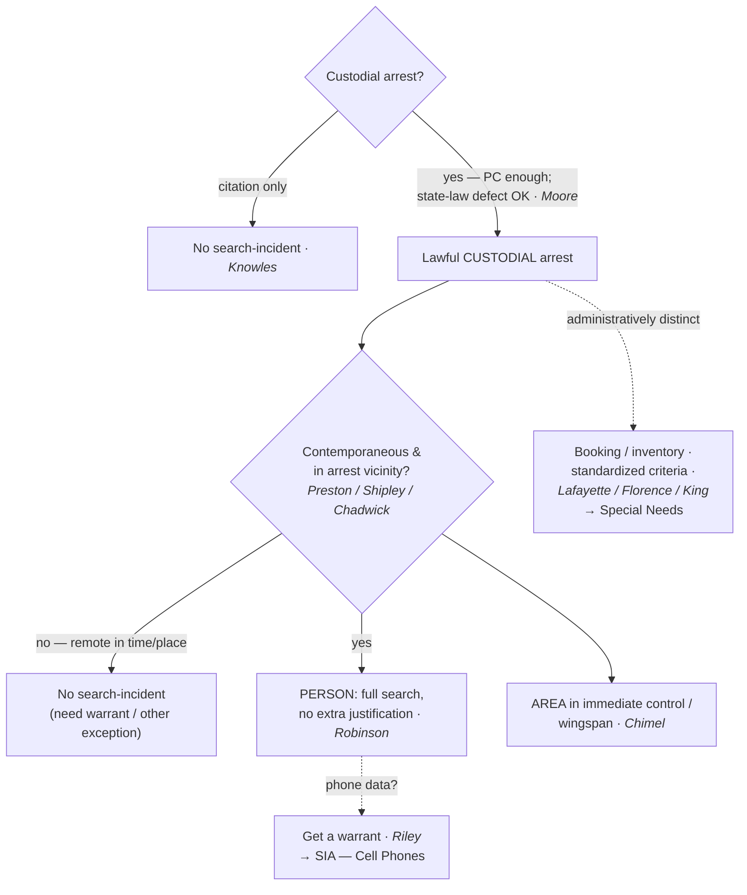

# SIA — Persons

*This page states the search-incident-to-arrest rule as applied to the arrestee's own body and the area within reach. Two specialized lines carry their own pages: the digital contents of a phone (see [[SIA Cell Phones]]) and chemical testing for intoxication (see [[SIA Alcohol Tests]]); the vehicle version is at [[SIA Vehicles]].*

> [!rule] Black-letter rule
> On a lawful **custodial** arrest, an officer may search — without a warrant and without any separate probable cause — **(1)** the **arrestee's person**, a *full* search that needs no case-by-case justification (*[[United States v. Robinson#^pin-235|Robinson]]*, 414 U.S. 218, [235](https://www.courtlistener.com/opinion/108893/united-states-v-robinson/) (1973)), and **(2)** the area within the arrestee's **immediate control**, the "grabbing area" from which he might reach a weapon or destructible evidence (*[[Chimel v. California#^pin-763|Chimel]]*, 395 U.S. 752, [763](https://www.courtlistener.com/opinion/107979/chimel-v-california/) (1969)). The predicate is a *custodial* arrest; the two engines that justify and *cabin* the search are **officer safety** and **evidence preservation**.
> ^rule-sia-persons

## The Brief

**Field-decisive question: I have made a lawful custodial arrest — what may I search on the person, and how far?** The authority is automatic on the arrest itself. Because search incident to arrest is an **exception** to the warrant requirement, the **government bears the burden** of bringing the search within it; on review, historic facts are taken as found and the ultimate reasonableness is a legal question reviewed [[Common Legal Terms#de-novo|de novo]]; the **remedy** for exceeding the exception is suppression under [[The Exclusionary Rule]] (subject to good faith and [[Inevitable Discovery and Independent Source|inevitable discovery]]).

**The predicate is a *custodial* arrest, not a citation.** A ticket in lieu of custody does not trigger the search: there is no "search incident to citation." Once a driver is "stopped for speeding and issued a citation, all the evidence necessary to prosecute that offense had been obtained," so neither officer-safety nor evidence-preservation supports a full search. *[[Knowles v. Iowa|Knowles v. Iowa]]*, 525 U.S. 113, [118–19](https://www.courtlistener.com/opinion/118250/knowles-v-iowa/) (1998).

**The arrest need not be perfect — probable cause is what matters.** An arrest that breaks a *state* arrest statute yet rests on **probable cause** still satisfies the Fourth Amendment, and the incident search is valid, because state law does not define Fourth Amendment reasonableness (*[[Virginia v. Moore|Moore]]*, 553 U.S. 164 (2008)). The offense supplying probable cause need not be the one the officer named (*[[Devenpeck v. Alford|Devenpeck]]*), a reasonable good-faith arrest of the **wrong person** still supports the search (*[[Hill v. California|Hill]]*), and even a **fine-only** misdemeanor arrest, if custodial and probable-cause-backed, carries the authority (*[[Atwater v. City of Lago Vista|Atwater]]*).

**The person is searched in full — no extra showing (*[[United States v. Robinson|Robinson]]*).** "It is the fact of the lawful arrest which establishes the authority to search, and we hold that in the case of a lawful custodial arrest a full search of the person is not only an exception to the warrant requirement of the Fourth Amendment, but is also a 'reasonable' search under that Amendment." *[[United States v. Robinson#^pin-235|Robinson, 414 U.S. at 235]]*. Unlike a *[[Terry v. Ohio|Terry]]* frisk (see [[Terry Stops and Reasonable Suspicion]]), the search of the person needs **no** case-by-case suspicion that weapons or evidence are present; the arrest alone is enough.

**Wingspan is the engine (*[[Chimel v. California|Chimel]]*).** The arrest justifies "a search of the arrestee's person and the area 'within his immediate control' — construing that phrase to mean the area from within which he might gain possession of a weapon or destructible evidence." *[[Chimel v. California#^pin-763|Chimel, 395 U.S. at 763]]*. There is "no comparable justification … for routinely searching any room other than that in which an arrest occurs." *Id.* (*[[Chimel v. California|Chimel]]* itself was a home arrest; see [[Arrest in the Home]] for how wingspan plays out indoors.)

**Scope is the person and the place of arrest, never a separate general search.** The immediate-control limit is the modern successor to the founding-era rule that the search reaches **the person and the place of arrest**, not a "general exploratory search" of separate premises (*[[Agnello v. United States|Agnello]]*; *[[Go-Bart Importing Co. v. United States|Go-Bart]]*). The older, broader premises-search line (*[[Trupiano v. United States|Trupiano]]*, later rejected in *Rabinowitz*) was superseded by *[[Chimel v. California|Chimel]]*'s immediate-control limit; teach the scope through *[[Chimel v. California|Chimel]]*, not the dead pre-*[[Chimel v. California|Chimel]]* cases.

**The search must be roughly contemporaneous and confined to the arrest vicinity.** A search "remote in time or place from the arrest" cannot be justified as incident to it (*[[Preston v. United States|Preston]]*), and a house may not be searched as incident to an arrest made **outside** it, because a street arrest is not its own [[Exigent Circumstances and Hot Pursuit|exigency]] (*[[Shipley v. California|Shipley]]*; *[[Vale v. Louisiana|Vale]]*). Once effects are reduced to **exclusive police control** with no [[Exigent Circumstances and Hot Pursuit|exigency]], the search-incident theory is spent and a warrant is required (*[[United States v. Chadwick|Chadwick]]* — a seized footlocker).

**The one recognized stretch is at the stationhouse (*[[United States v. Edwards|Edwards]]*).** Clothing and effects that were searchable at the moment of arrest may be searched after a reasonable **booking delay** without a fresh warrant. *[[United States v. Edwards#^pin-807|Edwards]]*, 415 U.S. 800, [807–08](https://www.courtlistener.com/opinion/108995/united-states-v-edwards/) (1974). This is a delay in *time*, not a license to expand *scope*.

**Do not confuse the incident search with booking or inventory.** A stationhouse/booking inventory of an arrestee's effects (*[[Illinois v. Lafayette|Lafayette]]*), a jail-intake strip search (*[[Florence v. County of Burlington|Florence]]*), and a booking DNA swab (*King*) ride a separate **administrative** track — justified by a standardized procedure and jail-security reasonableness, not by the arrest. They are taught on [[Special Needs and Administrative Searches]] and are named here only to keep the theories apart; do not let a failed incident search be rescued by an inventory theory unless the predicate impoundment is itself valid.

**Apply it.**
1. Confirm the arrest is **custodial** and rests on **probable cause** (any offense the facts support — *[[Devenpeck v. Alford|Devenpeck]]*). No custody, no search-incident authority (*[[Knowles v. Iowa|Knowles]]*).
2. Search the **person** in full (pockets, clothing, and containers on the body) with no further justification (*[[United States v. Robinson|Robinson]]*).
3. Search the **immediate-control area** the arrestee could reach for a weapon or destructible evidence at the time of the search (*[[Chimel v. California|Chimel]]*); articulate what was within reach.
4. Keep it **contemporaneous** and in the **arrest vicinity** (*[[Preston v. United States|Preston]]*, *[[Shipley v. California|Shipley]]*); do not treat the arrest as authority to search a separate room or the house.
5. Once an item is in **exclusive police control** with no [[Exigent Circumstances and Hot Pursuit|exigency]], stop and get a warrant (*[[United States v. Chadwick|Chadwick]]*) — subject to the stationhouse-effects delay (*[[United States v. Edwards|Edwards]]*).

**Common pitfalls.**
- **Running a "search incident to citation."** No custody, no search (*[[Knowles v. Iowa|Knowles]]*).
- **Arguing suppression on a *state-law* arrest defect alone.** Probable cause satisfies the Fourth Amendment (*[[Virginia v. Moore|Moore]]*).
- **Treating "wingspan" as the whole room or house.** The area is what the arrestee can actually reach (*[[Chimel v. California|Chimel]]*); a street arrest supplies no authority to enter and search a home (*[[Vale v. Louisiana|Vale]]*, *[[Shipley v. California|Shipley]]*).
- **Rummaging an item already secured in the cruiser or evidence room.** Exclusive control with no [[Exigent Circumstances and Hot Pursuit|exigency]] ends the theory (*[[United States v. Chadwick|Chadwick]]*).
- **Rescuing a bad search with an "inventory."** Inventory is a separate, standardized-procedure exception (see [[Special Needs and Administrative Searches]]); it is not a fallback for an over-broad incident search.

## Lower-court developments

The SCOTUS framework (*[[United States v. Robinson|Robinson]]* / *[[Chimel v. California|Chimel]]*) is stable; the live question is whether *[[Arizona v. Gant|Gant]]*'s reaching-distance limit reaches **outside the vehicle** to a secured arrestee's nearby containers — a fight treated in full at [[SIA Vehicles]]. The decisions below bind only in their own circuits and are persuasive elsewhere.

- **Does the reaching-distance limit reach a secured arrestee's bag?** ⚖ **Developing circuit split.** The Fourth Circuit (*[[United States v. Howard Davis|Davis]]*) says a secured arrestee's out-of-reach backpack cannot be searched as incident to arrest, joined in substance by the Third, Ninth, and Tenth Circuits; the First Circuit (*[[United States v. Perez|Perez]]*) declined to extend the limit to a bag already removed and secured. Treat the container question as **unsettled**; the vehicle line is developed at [[SIA Vehicles]].

## Key cases

| Case | Holding | Opinion |
|---|---|---|
| *[[United States v. Robinson]]*, 414 U.S. 218 (1973) | **Anchor.** A lawful custodial arrest categorically permits a **full search of the person**, with no separate showing that weapons or evidence are present. | [opinion](https://www.courtlistener.com/opinion/108893/united-states-v-robinson/) |
| *[[Chimel v. California]]*, 395 U.S. 752 (1969) | **Anchor.** Scope is the person **plus** the "immediate control"/wingspan area; the rationales are officer safety and evidence preservation. | [opinion](https://www.courtlistener.com/opinion/107979/chimel-v-california/) |
| *[[Knowles v. Iowa]]*, 525 U.S. 113 (1998) | **Limiting.** No "search incident to **citation**"; a ticket in lieu of custody does not trigger the authority. | [opinion](https://www.courtlistener.com/opinion/118250/knowles-v-iowa/) |
| *[[United States v. Edwards]]*, 415 U.S. 800 (1974) | The search may extend in **time**: effects searchable at arrest may be examined at the jail after a reasonable booking delay. | [opinion](https://www.courtlistener.com/opinion/108995/united-states-v-edwards/) |
| *[[Preston v. United States]]*, 376 U.S. 364 (1964) | **Contemporaneity.** A search remote in **time or place** from the arrest cannot be justified as incident to it. | [opinion](https://www.courtlistener.com/opinion/106771/preston-v-united-states/) |
| *[[Shipley v. California]]*, 395 U.S. 818 (1969) | **Contemporaneity.** The search must be substantially contemporaneous and confined to the immediate vicinity; no home search on an outside arrest. | [opinion](https://www.courtlistener.com/opinion/107982/shipley-v-california/) |
| *[[Vale v. Louisiana]]*, 399 U.S. 30 (1970) | **Limiting.** A house cannot be searched as incident to an arrest made **outside** it; a street arrest is not its own [[Exigent Circumstances and Hot Pursuit\|exigency]]. | [opinion](https://www.courtlistener.com/opinion/108183/vale-v-louisiana/) |
| *[[Agnello v. United States]]*, 269 U.S. 20 (1925) | **Foundational.** The search reaches the person and place of arrest, not a separate house entered after the suspects are in custody elsewhere. | [opinion](https://www.courtlistener.com/opinion/100711/agnello-v-united-states/) |
| *[[Go-Bart Importing Co. v. United States]]*, 282 U.S. 344 (1931) | **Foundational.** The incident search may not become a **general exploratory search** of the premises. | [opinion](https://www.courtlistener.com/opinion/101643/go-bart-importing-co-v-united-states/) |
| *[[Trupiano v. United States]]*, 334 U.S. 699 (1948) | **Pre-*[[Chimel v. California|Chimel]]* origin.** The old "reasonably practicable warrant" premises rule; rejected in *Rabinowitz* and superseded by *[[Chimel v. California|Chimel]]*'s immediate-control limit (taught as dead-letter background). | [opinion](https://www.courtlistener.com/opinion/104576/trupiano-v-united-states/) |

## Related cases across doctrines

These cases are treated in full elsewhere but bear on the incident search of the person, framed here for this doctrine.

| Case | Relevance here | Primary home | Opinion |
|---|---|---|---|
| *[[Virginia v. Moore]]*, 553 U.S. 164 (2008) | ***Predicate.*** An arrest violating **state law** but on probable cause does not violate the Fourth Amendment; the incident search is valid. | [[Arrest and Arrest Warrants]] | [opinion](https://www.courtlistener.com/opinion/145814/virginia-v-moore/) |
| *[[Atwater v. City of Lago Vista]]*, 532 U.S. 318 (2001) | ***Predicate.*** A custodial arrest for a **fine-only** misdemeanor on probable cause is constitutional, so the search-incident authority attaches even to trivial offenses. | [[Arrest and Arrest Warrants]] | [opinion](https://www.courtlistener.com/opinion/2620702/atwater-v-city-of-lago-vista/) |
| *[[Hill v. California]]*, 401 U.S. 797 (1971) | ***Predicate.*** A reasonable, good-faith arrest of the **wrong person** is valid, and so is the search incident to it. | [[Probable Cause]] | [opinion](https://www.courtlistener.com/opinion/108305/hill-v-california/) |
| *[[United States v. Chadwick]]*, 433 U.S. 1 (1977) | ***Exclusive-control limit.*** Once luggage is seized and in exclusive police control with no [[Exigent Circumstances and Hot Pursuit\|exigency]], it may not be searched as incident to arrest. | [[Automobile Exception]] | [opinion](https://www.courtlistener.com/opinion/109714/united-states-v-chadwick/) |
| *[[Cupp v. Murphy]]*, 412 U.S. 291 (1973) | ***Destructible evidence.*** The very limited preservation of **readily destructible** evidence (fingernail scrapings) is reasonable on the *[[Chimel v. California|Chimel]]* rationale even without a full arrest search. | [[Exigent Circumstances and Hot Pursuit]] | [opinion](https://www.courtlistener.com/opinion/108801/cupp-v-murphy/) |
| *[[Peters v. New York]]*, 392 U.S. 40 (1968) | ***Sequence.*** Where probable cause to arrest existed, the search was valid as incident to arrest even though the formal arrest followed the seizure. | [[Terry Stops and Reasonable Suspicion]] | [opinion](https://www.courtlistener.com/opinion/107730/sibron-v-new-york/) |

## Visual

## Sources
- [*United States v. Robinson*, 414 U.S. 218 (1973)](https://www.courtlistener.com/opinion/108893/united-states-v-robinson/) (pinpoint: 235)
- [*Chimel v. California*, 395 U.S. 752 (1969)](https://www.courtlistener.com/opinion/107979/chimel-v-california/) (pinpoint: 763)
- [*Knowles v. Iowa*, 525 U.S. 113 (1998)](https://www.courtlistener.com/opinion/118250/knowles-v-iowa/) (pinpoints: 118–119)
- [*United States v. Edwards*, 415 U.S. 800 (1974)](https://www.courtlistener.com/opinion/108995/united-states-v-edwards/) (pinpoints: 807–808)
- [*Preston v. United States*, 376 U.S. 364 (1964)](https://www.courtlistener.com/opinion/106771/preston-v-united-states/)
- [*Shipley v. California*, 395 U.S. 818 (1969)](https://www.courtlistener.com/opinion/107982/shipley-v-california/)
- [*Vale v. Louisiana*, 399 U.S. 30 (1970)](https://www.courtlistener.com/opinion/108183/vale-v-louisiana/)
- [*Agnello v. United States*, 269 U.S. 20 (1925)](https://www.courtlistener.com/opinion/100711/agnello-v-united-states/)
- [*Go-Bart Importing Co. v. United States*, 282 U.S. 344 (1931)](https://www.courtlistener.com/opinion/101643/go-bart-importing-co-v-united-states/)
- [*Trupiano v. United States*, 334 U.S. 699 (1948)](https://www.courtlistener.com/opinion/104576/trupiano-v-united-states/)
- [*Virginia v. Moore*, 553 U.S. 164 (2008)](https://www.courtlistener.com/opinion/145814/virginia-v-moore/)
- [*Atwater v. City of Lago Vista*, 532 U.S. 318 (2001)](https://www.courtlistener.com/opinion/2620702/atwater-v-city-of-lago-vista/)
- [*Hill v. California*, 401 U.S. 797 (1971)](https://www.courtlistener.com/opinion/108305/hill-v-california/)
- [*United States v. Chadwick*, 433 U.S. 1 (1977)](https://www.courtlistener.com/opinion/109714/united-states-v-chadwick/)
- [*Cupp v. Murphy*, 412 U.S. 291 (1973)](https://www.courtlistener.com/opinion/108801/cupp-v-murphy/)
- [*Peters v. New York* (decided with *Sibron v. New York*), 392 U.S. 40 (1968)](https://www.courtlistener.com/opinion/107730/sibron-v-new-york/)
- [*Devenpeck v. Alford*, 543 U.S. 146 (2004)](https://www.courtlistener.com/opinion/137733/devenpeck-v-alford/)
