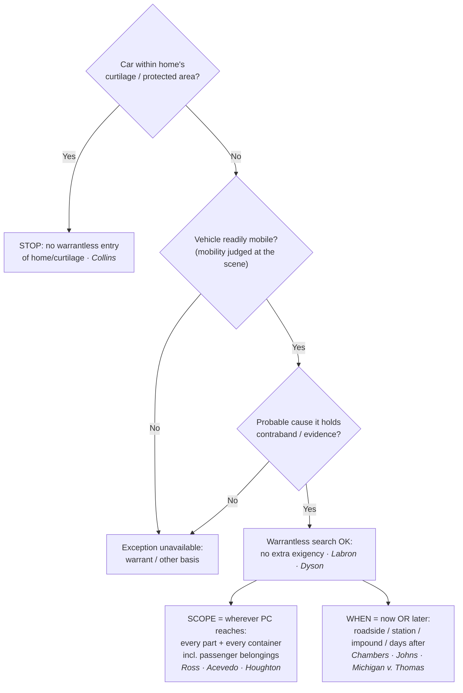

# The Automobile Exception

*Can I search this vehicle right now without a warrant, and how far does the search reach?*

> [!rule] Black-letter rule
> A warrantless search of a vehicle is permitted when **(1)** the vehicle is **readily mobile** and **(2)** the officer has **probable cause** to believe it contains contraband or evidence. On those two facts the search needs **no warrant and no separate showing of exigency**, and it reaches every part of the car and every container in it where the object of the probable cause could be hidden. *[[Carroll v. United States|Carroll]]*, 267 U.S. 132 (1925); *[[Pennsylvania v. Labron|Labron]]*, 518 U.S. 938, [940](https://www.courtlistener.com/opinion/118063/pennsylvania-v-labron/) (1996) (per curiam); *[[United States v. Ross|Ross]]*, 456 U.S. 798, [825](https://www.courtlistener.com/opinion/110719/united-states-v-ross/) (1982).
> ^rule-automobile

## The Brief

**What it is, and is not.** One fact decides the exception: probable cause to believe a readily mobile vehicle contains evidence or contraband. With it, an officer may search the car on the spot, or later at the station after impoundment, with no warrant and no separate [[Exigent Circumstances and Hot Pursuit|exigency]] showing, and the search reaches wherever the object of the probable cause could be hidden. Without probable cause, the exception gives nothing. It is not a [[Search Incident to Arrest|search incident to arrest]], not an inventory, and not [[Community Caretaking|community caretaking]]; those neighboring theories have their own triggers, and naming the right one matters.

**The test up front.** A warrantless vehicle search fits the exception only if both elements hold:
1. **Ready mobility.** The vehicle is capable of being moved, judged at the scene; the Fourth Amendment then "permits police to search the vehicle without more." *[[Pennsylvania v. Labron|Labron]]*, 518 U.S. 938, [940](https://www.courtlistener.com/opinion/118063/pennsylvania-v-labron/) (1996) (per curiam).
2. **Probable cause.** The officer has probable cause to believe the vehicle contains contraband or evidence. *[[United States v. Ross|Ross]]*, 456 U.S. 798, [825](https://www.courtlistener.com/opinion/110719/united-states-v-ross/) (1982). A recent restatement of the two-element formulation is *[[United States v. Morley|Morley]]*, 99 F.4th 1328 (11th Cir. 2024).

**The origin, and why mobility matters.** The exception traces to *[[Carroll v. United States|Carroll]]*, which excused the warrant for a vehicle "where it is not practicable to secure a warrant, because the vehicle can be quickly moved out of the locality or jurisdiction in which the warrant must be sought." 267 U.S. 132, 153 (1925). The car's capacity to disappear, not its label as a "car," is what excuses the warrant.

**Two rationales, both load-bearing.** Modern doctrine rests on a pair of justifications, and an officer should be able to articulate both:

> "First, the vehicle is obviously readily mobile by the turn of an ignition key, if not actually moving. Second, there is a reduced expectation of privacy stemming from its use as a licensed motor vehicle subject to a range of police regulation inapplicable to a fixed dwelling." — *[[California v. Carney|Carney]]*, 471 U.S. 386, [393](https://www.courtlistener.com/opinion/111423/california-v-carney/) (1985).

*[[California v. Carney|Carney]]* confirms the exception covers a **motor home** in use as a vehicle, not just an ordinary car. The reduced-privacy rationale also explains why merely examining a car's **exterior** on probable cause (paint scrapings, a tire-tread cast) invades no protected interest at all. *[[Cardwell v. Lewis|Cardwell]]*, 417 U.S. 583 (1974).

**Scope tracks probable cause, and it reaches containers, including a passenger's.** "If probable cause justifies the search of a lawfully stopped vehicle, it justifies the search of every part of the vehicle and its contents that may conceal the object of the search." *[[United States v. Ross|Ross]]*, 456 U.S. at [825](https://www.courtlistener.com/opinion/110719/united-states-v-ross/). The distinction between a "container" and the "vehicle" has been collapsed: with probable cause, police may search a container found in a car where they believe it holds the object, *[[California v. Acevedo|Acevedo]]*, 500 U.S. 565, [580](https://www.courtlistener.com/opinion/112608/california-v-acevedo/) (1991) (overruling the separate-warrant rule of *[[Arkansas v. Sanders|Sanders]]*), just as *[[United States v. Ross|Ross]]* had earlier swept aside the closed-container rule of *[[Robbins v. California|Robbins]]*. The "every container" reach is not limited to the driver's; with probable cause to search the car, officers may inspect "passengers' belongings found in the car that are capable of concealing the object of the search." *[[Wyoming v. Houghton#^pin-307|Houghton]]*, 526 U.S. 295, [307](https://www.courtlistener.com/opinion/118277/wyoming-v-houghton/#:~:text=We%20hold%20that%20police%20officers) (1999) (though *[[Wyoming v. Houghton|Houghton]]* reaches a passenger's belongings, not the passenger's person or body, which needs its own probable cause or a search incident to arrest). Scope is **object-limited**: probable cause to find a stolen flat-screen does not justify opening a pill bottle, and probable cause as to one container is not probable cause to dismantle the whole car. *(How the container rule developed, and how a container's protection differs inside versus outside a vehicle, is the container-doctrine story told on [[Searching Effects and Containers]].)*

**No separate exigency beyond mobility plus probable cause.** *[[Pennsylvania v. Labron|Labron]]* reversed a state rule demanding proof of *additional* exigent circumstances; mobility plus probable cause is the whole showing, reaffirmed per curiam in *[[Maryland v. Dyson|Dyson]]*, which held the exception "has no separate exigency requirement" even when officers had ample time to get a warrant. 527 U.S. 465, 466–467 (1999) (per curiam).

**Delay and immobilization do not defeat the exception.** Because the justification does not evaporate when the car is immobilized, the search may be conducted later. "Given probable cause to search, either course [immediate search or seizing and holding the car] is reasonable under the Fourth Amendment." *[[Chambers v. Maroney|Chambers]]*, 399 U.S. 42, [52](https://www.courtlistener.com/opinion/108184/chambers-v-maroney/) (1970). *[[United States v. Johns|Johns]]* upheld a search of packages three days after they were removed from the truck. 469 U.S. 478, 487 (1985). The same logic validates a warrantless search of an **impounded** car at the station (*[[Michigan v. Thomas|Michigan v. Thomas]]*, 458 U.S. 259 (1982) (per curiam)) and even a second search of an already-impounded car hours later (*[[Florida v. Meyers|Meyers]]*, 466 U.S. 380 (1984) (per curiam)); a car lawfully held in custody may likewise be searched where the search is closely related to the reason it was seized (*[[Cooper v. California|Cooper]]*, 386 U.S. 58 (1967)). As a vivid in-circuit illustration, *[[United States v. Gastiaburo|Gastiaburo]]* (4th Cir.) pushed the point to 38 days, holding "the passage of time between the seizure and the search . . . is legally irrelevant." 16 F.3d 582, 587 (4th Cir. 1994). Mobility is judged **at the scene**; do not assume a warrant is suddenly required merely because the car is now immobilized or impounded.

**The curtilage limit.** The exception reaches the *vehicle*, not the constitutionally protected ground it sits on. The automobile exception does not permit an officer without a warrant to enter a home or its curtilage in order to search a vehicle parked there. *[[Collins v. Virginia|Collins]]*, 584 U.S. 586 (2018). A car parked in a driveway within the curtilage is off-limits without a warrant or a separate exception, the most common overreach in the field (cross-link [[Curtilage]]).

**Keep it separate from the neighboring vehicle theories.** The auto exception is not a search incident to arrest, and confusing the two is a recurring error. A search incident to arrest cannot justify a search of a car already removed to the station with the arrestee in custody (*[[Preston v. United States|Preston]]*, 376 U.S. 364 (1964)), the gap the auto exception fills, and the vehicle search-incident rule is the narrow, arrest-tethered *[[Arizona v. Gant|Gant]]* rule (search only if the arrestee is unsecured and within reach, or it is reasonable to believe evidence of the arrest offense is in the car), not the probable-cause-driven whole-car reach of the auto exception. Nor is it the **inventory** route: a lawful impound supports a standardized inventory with no probable cause at all (*[[South Dakota v. Opperman|Opperman]]* / *[[Colorado v. Bertine|Bertine]]*, see [[Inventory Searches]]), but only where it is not a ruse for general rummaging (*[[Florida v. Wells|Wells]]*). And it is neither the **community-caretaking** basis for entering a disabled or impounded vehicle (*[[Cady v. Dombrowski|Cady]]*) nor the Terry-level **protective sweep** of the passenger compartment for weapons on reasonable suspicion the driver is dangerous (*[[Michigan v. Long|Long]]*). Separately, where police have probable cause the **vehicle itself is forfeitable contraband**, they may seize it from a public place without a warrant (*[[Florida v. White|White]]*, 526 U.S. 559 (1999)).

**Burden, standard of review, remedy.** Because this is a warrantless search, the **government** bears the burden of bringing it within the exception by showing ready mobility and probable cause. Whether probable cause existed is reviewed [[Common Legal Terms#de-novo|de novo]] on appeal, with the historical facts taken for [[Common Legal Terms#clear-error|clear error]]. Cf. *[[Ornelas v. United States|Ornelas]]*, 517 U.S. 690, [699](https://www.courtlistener.com/opinion/118030/ornelas-v-united-states/) (1996). The **remedy** for a search that falls outside the exception is suppression of the evidence and its fruits under [[The Exclusionary Rule]].

**Apply it.**
1. **Establish probable cause first.** The exception is nothing without it. Pin down the specific object you have probable cause to find; that object fixes the scope.
2. **Confirm ready mobility at the scene.** A car on a public road or lot qualifies. Do not treat later immobilization or impoundment as reviving the warrant requirement (*[[Chambers v. Maroney|Chambers]]* / *[[United States v. Johns|Johns]]*).
3. **Search where the object could be.** That includes closed containers and a passenger's belongings capable of hiding it (*[[United States v. Ross|Ross]]* / *[[Wyoming v. Houghton|Houghton]]*), but not beyond the object's likely location.
4. **Stop at the [[Curtilage|curtilage]].** Do not walk onto a home's protected ground to reach the car; get a warrant or another exception (*[[Collins v. Virginia|Collins]]*).
5. **Name your theory.** If your basis is really inventory, caretaking, or a [[Search Incident to Arrest|search incident to arrest]], invoke that theory on its own terms rather than stretching the auto exception.

**Common pitfalls.**
- **Treating "automobile" as the magic word.** *[[California v. Carney|Carney]]*'s reduced-privacy rationale lowers the bar; it never eliminates the probable-cause requirement.
- **Searching beyond the object's likely location.** Probable cause defines the scope (*[[United States v. Ross|Ross]]* / *[[California v. Acevedo|Acevedo]]*); probable cause to find a rifle does not justify opening a jewelry box, and conversely a passenger's bag is not automatically off-limits (*[[Wyoming v. Houghton|Houghton]]*).
- **Assuming you must search now, or that you no longer can.** You may search later (*[[United States v. Johns|Johns]]*), and immobilization does not revive the warrant requirement.
- **Driveway or [[Curtilage|curtilage]] overreach.** *[[Collins v. Virginia|Collins]]* forbids entering protected ground to reach the car.
- **Over-relying on *[[United States v. Anchondo|Anchondo]]*.** Frequently miscited as auto-exception authority, it is not: the defendant conceded vehicle probable cause and the cocaine was upheld as a [[Search Incident to Arrest|search incident to arrest]] of his person. Do not anchor any auto-exception rule to it.

## Lower-court developments

The core rule (mobility plus probable cause, no separate [[Exigent Circumstances and Hot Pursuit|exigency]], object-limited scope reaching containers) is SCOTUS-settled and stable; the live edge is **digital**. The open question is whether the "every container" reach extends to the **data** on a cell phone found in a car, with *[[Riley v. California|Riley]]*'s privacy logic pulling courts toward a warrant requirement for phone contents. The decisions below bind only in their own circuits and are persuasive elsewhere.

- ***[[United States v. Camou|United States v. Camou]]* (9th Cir. 2014)** — *first-impression, digital limit.* Holds the automobile exception does not authorize a warrantless search of the **data** on a cell phone found in a vehicle: a phone is not a container for exception purposes, and *[[Riley v. California|Riley]]*'s reasoning applies with even greater force because the exception's scope is broader than a search incident to arrest. 773 F.3d 932. **Binding in-circuit — 9th Cir.**
- ***[[United States v. Morley|Morley]]* (11th Cir. 2024)** — *recent restatement (no split).* Distills the doctrine to the clean two-element test (readily mobile plus probable cause to search), a recent in-circuit articulation of the settled rule that applies rather than extends it. 99 F.4th 1328. **Binding in-circuit — 11th Cir.**

The through-line: post-*[[Riley v. California|Riley]]*, the settled physical-scope rule is largely undisturbed, and the frontier is confined to whether a device's *data* is a "container" the exception can reach or a distinct privacy interest that demands its own warrant.

## Key cases

| Case | Holding | Opinion |
|---|---|---|
| *[[Carroll v. United States]]*, 267 U.S. 132 (1925) | **Origin.** A vehicle may be searched warrantless on probable cause because, unlike a fixed structure, it can be quickly moved out of the jurisdiction before a warrant issues (ready mobility). | [opinion](https://www.courtlistener.com/opinion/100567/carroll-v-united-states/) |
| *[[Chambers v. Maroney]]*, 399 U.S. 42 (1970) | **Delayed search.** Where probable cause plus mobility existed at the scene, a station-house search is as reasonable as a roadside one; immobilizing the car until a warrant issues is no better. | [opinion](https://www.courtlistener.com/opinion/108184/chambers-v-maroney/) |
| *[[United States v. Ross]]*, 456 U.S. 798 (1982) | **Scope anchor.** Probable cause to search the vehicle justifies a search of every part of it and every container within that may conceal the object of the search. | [opinion](https://www.courtlistener.com/opinion/110719/united-states-v-ross/) |
| *[[California v. Carney]]*, 471 U.S. 386 (1985) | **Two rationales.** Applies to a motor home in use as a vehicle; states the paired justifications of ready mobility and reduced expectation of privacy from pervasive regulation. | [opinion](https://www.courtlistener.com/opinion/111423/california-v-carney/) |
| *[[California v. Acevedo]]*, 500 U.S. 565 (1991) | **Container in a car.** With probable cause a container found in a car may be searched on the spot; the old container/vehicle distinction is collapsed into one rule (fuller treatment on [[Searching Effects and Containers]]). | [opinion](https://www.courtlistener.com/opinion/112608/california-v-acevedo/) |
| *[[Wyoming v. Houghton]]*, 526 U.S. 295 (1999) | **Passenger belongings.** With probable cause to search a car, officers may search a passenger's belongings capable of concealing the object; a non-suspect passenger's ownership is no shield. | [opinion](https://www.courtlistener.com/opinion/118277/wyoming-v-houghton/) |
| *[[Pennsylvania v. Labron]]*, 518 U.S. 938 (1996) (per curiam) | **No separate [[Exigent Circumstances and Hot Pursuit\|exigency]].** Readily mobile plus probable cause permits a warrantless search "without more." | [opinion](https://www.courtlistener.com/opinion/118063/pennsylvania-v-labron/) |
| *[[Maryland v. Dyson]]*, 527 U.S. 465 (1999) (per curiam) | **No [[Exigent Circumstances and Hot Pursuit\|exigency]] requirement.** Reaffirms that the exception has no separate [[Exigent Circumstances and Hot Pursuit\|exigency]] requirement, valid even with ample time to obtain a warrant. | [opinion](https://www.courtlistener.com/opinion/2621047/maryland-v-dyson/) |
| *[[United States v. Johns]]*, 469 U.S. 478 (1985) | **Delay is fine.** A delayed search of packages lawfully removed from a vehicle (three days later) is valid; immobilization does not end the justification. | [opinion](https://www.courtlistener.com/opinion/111305/united-states-v-johns/) |
| *[[Michigan v. Thomas]]*, 458 U.S. 259 (1982) (per curiam) | **Impound search.** A warrantless search of an impounded car at the station is valid on probable cause; the justification does not vanish once the car is immobilized, and no separate [[Exigent Circumstances and Hot Pursuit\|exigency]] is required. | [opinion](https://www.courtlistener.com/opinion/110776/michigan-v-thomas/) |
| *[[Collins v. Virginia]]*, 584 U.S. 586 (2018) | **[[Curtilage]] limit.** The exception does not reach a vehicle parked within the home's [[Curtilage\|curtilage]]; there is no warrantless entry of home or [[Curtilage\|curtilage]] to search a car. | [opinion](https://www.courtlistener.com/opinion/4501697/collins-v-virginia/) |
| *[[United States v. Gastiaburo]]*, 16 F.3d 582 (4th Cir. 1994) | **No temporal limit.** A 38-day gap between seizure and search is "legally irrelevant." | [opinion](https://www.courtlistener.com/opinion/7027957/united-states-v-gastiaburo/) |

## Related cases across doctrines

These are treated in full elsewhere but bear on the automobile exception, framed for it here.

| Case | Relevance here | Primary home | Opinion |
|---|---|---|---|
| *[[United States v. Chadwick]]*, 433 U.S. 1 (1977) | ***Container contrast.*** Personal luggage (a double-locked footlocker) reduced to exclusive police control keeps a high expectation of privacy and needs a warrant; *[[California v. Acevedo|Acevedo]]* limits that rule for a container found in a car, where probable cause supports an on-the-spot search. | [[Searching Effects and Containers]] | [opinion](https://www.courtlistener.com/opinion/109714/united-states-v-chadwick/) |
| *[[Preston v. United States]]*, 376 U.S. 364 (1964) | ***SITA limit that made the exception necessary.*** A warrantless car search is not incident to arrest once the arrestee is in custody and the car removed. | [[SIA Persons]] | [opinion](https://www.courtlistener.com/opinion/106771/preston-v-united-states/) |
| *[[Arizona v. Gant]]*, 556 U.S. 332 (2009) | ***The other vehicle theory.*** A [[Search Incident to Arrest\|search incident to arrest]] reaches the car only if the arrestee is unsecured and within reach, or evidence of the arrest offense may be inside, far narrower than the probable-cause-driven auto exception. | [[SIA Vehicles]] | [opinion](https://www.courtlistener.com/opinion/145887/arizona-v-gant/) |
| *[[Thornton v. United States]]*, 541 U.S. 615 (2004) | ***SITA, not auto exception.*** Extended the *[[New York v. Belton|Belton]]* recent-occupant rule; limited by *[[Arizona v. Gant|Gant]]*'s two-justification test, and not auto-exception authority. | [[SIA Vehicles]] | [opinion](https://www.courtlistener.com/opinion/134746/thornton-v-united-states/) |
| *[[Maryland v. Pringle]]*, 540 U.S. 366 (2003) | ***PC predicate.*** Drugs and cash in a car with no occupant claiming them give probable cause as to the car and all occupants, the "probable cause it contains contraband" element. | [[Probable Cause]] | [opinion](https://www.courtlistener.com/opinion/131150/maryland-v-pringle/) |
| *[[South Dakota v. Opperman]]*, 428 U.S. 364 (1976) | ***Inventory alternative.*** A warrantless search of a lawfully impounded car under standardized procedures, a separate basis needing no probable cause. | [[Inventory Searches]] | [opinion](https://www.courtlistener.com/opinion/109537/south-dakota-v-opperman/) |
| *[[Colorado v. Bertine]]*, 479 U.S. 367 (1987) | ***Inventory of containers.*** Inventory of an impounded car may include opening closed containers under standardized criteria, the no-probable-cause route to a container the auto exception reaches only with probable cause. | [[Inventory Searches]] | [opinion](https://www.courtlistener.com/opinion/111788/colorado-v-bertine/) |
| *[[Florida v. Wells]]*, 495 U.S. 1 (1990) | ***Inventory boundary.*** An inventory cannot be a ruse for general rummaging; when officers really hunt evidence without probable cause, neither inventory nor the auto exception saves the search. | [[Inventory Searches]] | [opinion](https://www.courtlistener.com/opinion/112412/florida-v-wells/) |
| *[[Cady v. Dombrowski]]*, 413 U.S. 433 (1973) | ***[[Community Caretaking\|Community caretaking]].*** A distinct, non-investigatory warrantless basis to enter a car (disabled or impounded) that does not require the probable cause the auto exception demands. | [[Community Caretaking]] | [opinion](https://www.courtlistener.com/opinion/108850/cady-v-dombrowski/) |
| *[[Michigan v. Long]]*, 463 U.S. 1032 (1983) | ***[[Securing the Scene\|Protective sweep]].*** On reasonable suspicion the driver is dangerous, officers may sweep the passenger compartment for weapons, a suspicion-level search distinct from the probable-cause auto exception. | [[Traffic Stops]] | [opinion](https://www.courtlistener.com/opinion/111020/michigan-v-long/) |
| *[[Byrd v. United States]]*, 584 U.S. 395 (2018) | ***Standing predicate.*** A driver in lawful possession of a rental car has a [[Reasonable Expectation of Privacy\|reasonable expectation of privacy]] even if not on the rental agreement, so he can challenge an auto-exception search. | [[Standing to Challenge a Search]] | [opinion](https://www.courtlistener.com/opinion/4497658/byrd-v-united-states/) |
| *[[Riley v. California]]*, 573 U.S. 373 (2014) | ***Digital frontier.*** *[[Riley v. California|Riley]]*'s logic (a phone's data implicates privacy far beyond physical effects) drives the open question whether the exception reaches the **data** on a phone found in a car; treat phone contents as warrant-required. | [[SIA Cell Phones]] | [opinion](https://www.courtlistener.com/opinion/2680439/riley-v-cal-united-states/) |
| *[[Harris v. United States (1968)]]*, 390 U.S. 234 (1968) | ***Plain view.*** Objects in plain view of an officer rightfully positioned (securing a lawfully impounded car) are subject to seizure; the protective step was not a search. | [[Plain View Doctrine]] | [opinion](https://www.courtlistener.com/opinion/107625/harris-v-united-states/) |

## Visual

## Sources
- [*Carroll v. United States*, 267 U.S. 132 (1925)](https://www.courtlistener.com/opinion/100567/carroll-v-united-states/) (pinpoint: 153)
- [*Chambers v. Maroney*, 399 U.S. 42 (1970)](https://www.courtlistener.com/opinion/108184/chambers-v-maroney/) (pinpoint: 52)
- [*United States v. Ross*, 456 U.S. 798 (1982)](https://www.courtlistener.com/opinion/110719/united-states-v-ross/) (pinpoint: 825)
- [*California v. Carney*, 471 U.S. 386 (1985)](https://www.courtlistener.com/opinion/111423/california-v-carney/) (pinpoint: 393)
- [*California v. Acevedo*, 500 U.S. 565 (1991)](https://www.courtlistener.com/opinion/112608/california-v-acevedo/) (pinpoint: 580; container-unification treatment on [[Searching Effects and Containers]])
- [*Wyoming v. Houghton*, 526 U.S. 295 (1999)](https://www.courtlistener.com/opinion/118277/wyoming-v-houghton/) (pinpoint: 307)
- [*Pennsylvania v. Labron*, 518 U.S. 938 (1996) (per curiam)](https://www.courtlistener.com/opinion/118063/pennsylvania-v-labron/) (pinpoint: 940)
- [*Maryland v. Dyson*, 527 U.S. 465 (1999) (per curiam)](https://www.courtlistener.com/opinion/2621047/maryland-v-dyson/) (pinpoints: 466–467)
- [*United States v. Johns*, 469 U.S. 478 (1985)](https://www.courtlistener.com/opinion/111305/united-states-v-johns/) (pinpoint: 487)
- [*Michigan v. Thomas*, 458 U.S. 259 (1982) (per curiam)](https://www.courtlistener.com/opinion/110776/michigan-v-thomas/)
- [*Florida v. Meyers*, 466 U.S. 380 (1984) (per curiam)](https://www.courtlistener.com/opinion/111157/florida-v-meyers/)
- [*Cooper v. California*, 386 U.S. 58 (1967)](https://www.courtlistener.com/opinion/107360/cooper-v-california/)
- [*United States v. Gastiaburo*, 16 F.3d 582 (4th Cir. 1994)](https://www.courtlistener.com/opinion/7027957/united-states-v-gastiaburo/) (pinpoint: 587) (Binding in-circuit — 4th Cir.)
- [*Collins v. Virginia*, 584 U.S. 586 (2018)](https://www.courtlistener.com/opinion/4501697/collins-v-virginia/)
- [*Cardwell v. Lewis*, 417 U.S. 583 (1974)](https://www.courtlistener.com/opinion/109069/cardwell-v-lewis/)
- [*Florida v. White*, 526 U.S. 559 (1999)](https://www.courtlistener.com/opinion/118287/florida-v-white/)
- [*Ornelas v. United States*, 517 U.S. 690 (1996)](https://www.courtlistener.com/opinion/118030/ornelas-v-united-states/) (pinpoint: 699)
- [*United States v. Chadwick*, 433 U.S. 1 (1977)](https://www.courtlistener.com/opinion/109714/united-states-v-chadwick/) (limited by *California v. Acevedo* for containers in a car; home = [[Searching Effects and Containers]])
- [*United States v. Camou*, 773 F.3d 932 (9th Cir. 2014)](https://www.courtlistener.com/opinion/2759861/united-states-v-chad-camou/) (Binding in-circuit — 9th Cir.)
- [*United States v. Morley*, 99 F.4th 1328 (11th Cir. 2024)](https://www.courtlistener.com/opinion/9498175/united-states-v-derrick-alfondso-morley/) (Binding in-circuit — 11th Cir.)
- [*United States v. Anchondo*, 156 F.3d 1043 (10th Cir. 1998)](https://www.courtlistener.com/opinion/758111/united-states-v-erick-anchondo/) (miscited pitfall, upheld as a search incident to arrest, not auto-exception authority) (Binding in-circuit — 10th Cir.)
- [*Arkansas v. Sanders*, 442 U.S. 753 (1979)](https://www.courtlistener.com/opinion/110119/arkansas-v-sanders/) (overruled by *California v. Acevedo*; container-doctrine history on [[Searching Effects and Containers]])
- [*Robbins v. California*, 453 U.S. 420 (1981)](https://www.courtlistener.com/opinion/110558/robbins-v-california/) (overruled by *United States v. Ross*; container-doctrine history on [[Searching Effects and Containers]])
