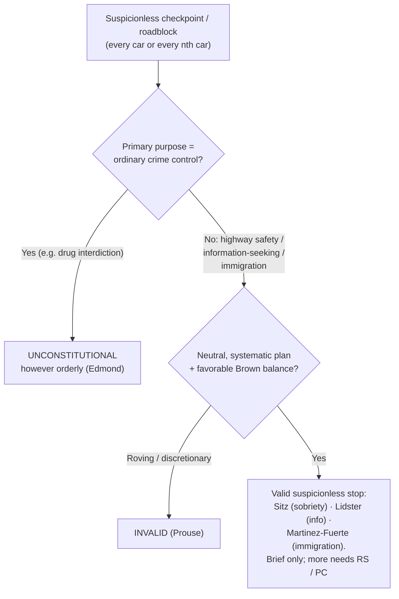

# Checkpoints & Roadblocks

*Does this suspicionless checkpoint serve a primary purpose beyond ordinary crime control, so a programmatic balance can sustain it, or is it crime control in disguise, which gets no discount?*

> [!rule] Black-letter rule
> A brief, suspicionless, **systematic** checkpoint stop is a seizure that can be reasonable **without individualized suspicion** under a programmatic balance of the public interest against the minimal intrusion, **but only if its primary purpose is not to detect evidence of ordinary criminal wrongdoing**. A sobriety or safety checkpoint is valid, *[[Michigan Dept. of State Police v. Sitz|Sitz]]*, 496 U.S. 444, 455 (1990); a checkpoint whose primary purpose is general crime control (drug interdiction) is unconstitutional however orderly, *[[City of Indianapolis v. Edmond|Edmond]]*, 531 U.S. 32, 41–42 (2000).
> ^rule-checkpoint

## The Brief

**What it is, and is not.** A checkpoint is a **seizure without suspicion**: officers stop every car (or every nth car) on a neutral, pre-announced plan, not because any driver did anything. What makes that constitutional is not a warrant but a **programmatic balance** in which the checkpoint's design removes officer discretion and serves a defined public need. It is **not** a license to fish for crime, and it is a distinct doctrine from the individualized [[Traffic Stops|traffic stop]] (which needs reasonable suspicion) and from the [[Border Searches|border-search]] power (sovereignty at the border). The dispositive move is naming the checkpoint's **primary purpose**.

**The test up front.** A suspicionless checkpoint seizure is reasonable when:
1. **Primary purpose.** The programme's primary purpose is something **other than** detecting evidence of ordinary criminal wrongdoing, such as highway safety or information-seeking. *[[City of Indianapolis v. Edmond|Edmond]]*, 531 U.S. at 41–42.
2. **Programmatic balance.** Weighing "the gravity of the public concerns served by the seizure, the degree to which the seizure advances the public interest, and the severity of the interference with individual liberty," the balance favors the programme. *[[Brown v. Texas|Brown]]*, 443 U.S. 47, 51 (1979).
3. **Neutral, systematic operation.** The stops follow "explicit, neutral limitations on the conduct of individual officers" rather than roving, ad hoc discretion. *Id.*

**The purpose gate comes first, and it is dispositive.** Before any balancing, ask what the checkpoint is *for*. *[[City of Indianapolis v. Edmond|Edmond]]* struck down a narcotics checkpoint precisely because "the primary purpose of the Indianapolis narcotics checkpoint program is to uncover evidence of ordinary criminal wrongdoing," and the Court had "never approved a checkpoint program whose primary purpose was to detect evidence of ordinary criminal wrongdoing." 531 U.S. at 41–42. A "drug checkpoint" is unconstitutional **even if run exactly like a lawful sobriety checkpoint**, because purpose, not procedure, decides.

**The valid poles.** Two purposes have been sustained:
- **Highway safety (sobriety).** *[[Michigan Dept. of State Police v. Sitz|Sitz]]* upheld a DUI sobriety checkpoint: balancing the State's interest in stopping drunk driving, the programme's effectiveness, and the brief intrusion, the Court held it "consistent with the Fourth Amendment." 496 U.S. at 455.
- **Information-seeking about someone else's crime.** *[[Illinois v. Lidster|Lidster]]* upheld a checkpoint that stopped motorists to ask for help solving a hit-and-run: its "primary law enforcement purpose was not to determine whether a vehicle's occupants were committing a crime, but to ask . . . for their help in providing information about a crime in all likelihood committed by others." 540 U.S. 419, 423, 427 (2004). *[[Illinois v. Lidster|Lidster]]* applies the *[[Brown v. Texas|Brown]]* factors case by case rather than presuming validity.

**The immigration and random-stop lines.** Two neighboring rules bound this doctrine and are treated in full elsewhere. Fixed **interior immigration checkpoints** are the doctrinal ancestor: brief suspicionless stops for questioning at a permanent checkpoint are constitutional "in the absence of any individualized suspicion." *[[United States v. Martinez-Fuerte|Martinez-Fuerte]]*, 428 U.S. 543, 566 (1976); that immigration line is developed on [[Border Searches]]. At the other end, **random, discretionary** roving stops are barred: an officer may not stop a car to check license and registration on a whim, because that leaves "standardless and unconstrained discretion" with the officer, though the Court expressly left room for "questioning of all oncoming traffic at roadblock-type stops." *[[Delaware v. Prouse|Prouse]]*, 440 U.S. 648, 663 (1979); the individualized-stop rules live on [[Traffic Stops]].

**What it yields, and its limits.** A valid checkpoint legitimates the brief stop and whatever an officer observes in [[Plain View Doctrine|plain view]] from it; escalation beyond the checkpoint's purpose (a full search, a prolonged detention) needs its own justification (reasonable suspicion or probable cause). An invalid-purpose checkpoint taints every stop it produces, whatever an individual officer subjectively intended, because the inquiry is **programmatic**.

**Burden, standard of review, remedy.** The **government** must establish the checkpoint's lawful primary purpose and neutral operation. The purpose inquiry looks to the programmatic level, not one officer's motive; reasonableness is reviewed [[Common Legal Terms#de-novo|de novo]] on facts found for [[Common Legal Terms#clear-error|clear error]]. The **remedy** for an unlawful checkpoint is suppression under [[The Exclusionary Rule]].

**Apply it.**
1. **Name the primary purpose.** Highway safety or information-seeking can support a checkpoint; general crime control cannot. Write down the programme's purpose before you defend it.
2. **Show the plan.** Point to the neutral, systematic protocol (which cars are stopped, what officers do), not on-the-spot discretion (*[[Delaware v. Prouse|Prouse]]*).
3. **Keep the stop brief.** A checkpoint buys a short, suspicionless stop; anything more needs independent suspicion or probable cause.
4. **Do not relabel a drug checkpoint.** Running it like *[[Michigan Dept. of State Police v. Sitz|Sitz]]* does not save a crime-control purpose (*[[City of Indianapolis v. Edmond|Edmond]]*).

**Common pitfalls.**
- **Treating any orderly checkpoint as valid.** *[[City of Indianapolis v. Edmond|Edmond]]* makes the programme's **primary purpose dispositive**; procedure cannot cure a crime-control purpose.
- **Bootstrapping crime control onto a safety checkpoint.** Adding a narcotics-detection objective to a sobriety checkpoint risks converting the whole programme into an *[[City of Indianapolis v. Edmond|Edmond]]* violation.
- **Confusing a checkpoint with an individualized stop.** A [[Traffic Stops|traffic stop]] needs reasonable suspicion; a checkpoint substitutes a neutral programme for suspicion. Do not mix the justifications.
- **Confusing an immigration checkpoint with a search.** *[[United States v. Martinez-Fuerte|Martinez-Fuerte]]* authorizes a suspicionless *stop*, not a suspicionless *search* away from the border.

## Lower-court developments

The Supreme Court framework (*[[Michigan Dept. of State Police v. Sitz|Sitz]]* / *[[City of Indianapolis v. Edmond|Edmond]]* / *[[Illinois v. Lidster|Lidster]]* / *[[United States v. Martinez-Fuerte|Martinez-Fuerte]]* / *[[Delaware v. Prouse|Prouse]]*) is stable and controlling; the recurring work in the lower courts is applying the **primary-purpose** test to mixed-motive checkpoints (safety plus incidental drug detection), to "ruse" checkpoints (a sign advertising a nonexistent drug checkpoint, catching drivers who exit or discard contraband), and to license-and-registration or immigration-status roadblocks. Those applications are circuit- and state-specific and turn on the *[[City of Indianapolis v. Edmond|Edmond]]* purpose inquiry and the *[[Brown v. Texas|Brown]]* balance; the individualized-stop developments are catalogued on [[Traffic Stops]].

## Key cases

| Case | Holding | Opinion |
|---|---|---|
| *[[Michigan Dept. of State Police v. Sitz]]*, 496 U.S. 444 (1990) | **Valid pole.** A suspicionless DUI sobriety checkpoint is reasonable; the State's interest in combating drunk driving outweighs the brief, minimal intrusion. | [opinion](https://www.courtlistener.com/opinion/112459/michigan-department-of-state-police-v-sitz/) |
| *[[City of Indianapolis v. Edmond]]*, 531 U.S. 32 (2000) | **Purpose gate.** A checkpoint whose primary purpose is ordinary crime control (drug interdiction) is unconstitutional, however brief or orderly. | [opinion](https://www.courtlistener.com/opinion/118391/city-of-indianapolis-v-edmond/) |
| *[[Illinois v. Lidster]]*, 540 U.S. 419 (2004) | **Information-seeking.** A checkpoint that stops motorists to ask for help about a crime committed by someone else is valid under the *[[Brown v. Texas|Brown]]* balance. | [opinion](https://www.courtlistener.com/opinion/131154/illinois-v-lidster/) |

## Related cases across doctrines

These are treated in full elsewhere but bear directly on the checkpoint line, framed here.

| Case | Relevance here | Primary home | Opinion |
|---|---|---|---|
| *[[United States v. Martinez-Fuerte]]*, 428 U.S. 543 (1976) | ***Ancestor.*** Brief suspicionless stops at fixed interior immigration checkpoints are reasonable on a programmatic balance, the model for the no-suspicion, no-discretion checkpoint. | [[Border Searches]] | [opinion](https://www.courtlistener.com/opinion/109541/united-states-v-martinez-fuerte/) |
| *[[Delaware v. Prouse]]*, 440 U.S. 648 (1979) | ***Floor.*** Random, discretionary license/registration stops are barred, but a neutral, systematic roadblock could pass, the line every checkpoint must clear. | [[Traffic Stops]] | [opinion](https://www.courtlistener.com/opinion/110045/delaware-v-prouse/) |
| *[[Brown v. Texas]]*, 443 U.S. 47 (1979) | ***Balancing engine.*** Supplies the three-factor test (public concern, advancement, interference) and the "neutral limitations" requirement that the checkpoint cases run on. | [[Terry Stops and Reasonable Suspicion]] | [opinion](https://www.courtlistener.com/opinion/110128/brown-v-texas/) |

## Visual

## Sources
- [*Michigan Dept. of State Police v. Sitz*, 496 U.S. 444 (1990)](https://www.courtlistener.com/opinion/112459/michigan-department-of-state-police-v-sitz/) (pinpoint: 455)
- [*City of Indianapolis v. Edmond*, 531 U.S. 32 (2000)](https://www.courtlistener.com/opinion/118391/city-of-indianapolis-v-edmond/) (pinpoints: 41, 42)
- [*Illinois v. Lidster*, 540 U.S. 419 (2004)](https://www.courtlistener.com/opinion/131154/illinois-v-lidster/) (pinpoints: 423, 426, 427)
- [*United States v. Martinez-Fuerte*, 428 U.S. 543 (1976)](https://www.courtlistener.com/opinion/109541/united-states-v-martinez-fuerte/) (pinpoint: 566; immigration checkpoints; home = [[Border Searches]])
- [*Delaware v. Prouse*, 440 U.S. 648 (1979)](https://www.courtlistener.com/opinion/110045/delaware-v-prouse/) (pinpoint: 663; random-stop floor; home = [[Traffic Stops]])
- [*Brown v. Texas*, 443 U.S. 47 (1979)](https://www.courtlistener.com/opinion/110128/brown-v-texas/) (pinpoint: 51; three-factor balance; home = [[Terry Stops and Reasonable Suspicion]])
