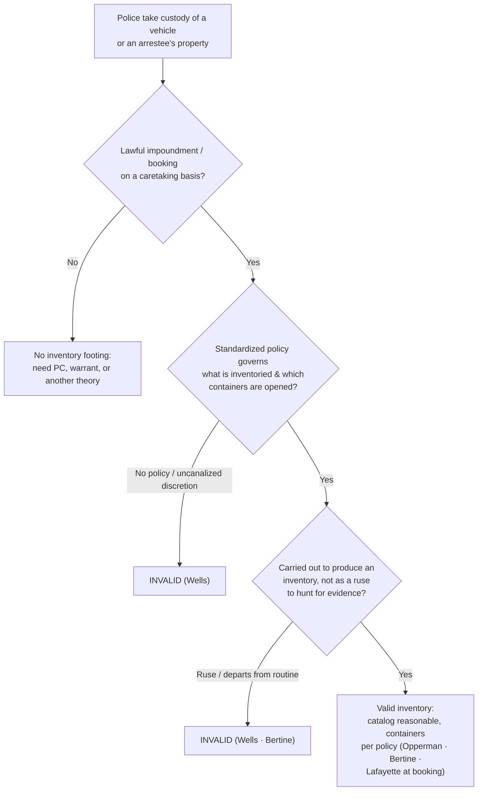

# Inventory Searches

*Is this a genuine caretaking inventory run under a standardized policy, or an investigative search wearing an inventory's clothes?*

> [!rule] Black-letter rule
> An inventory of a lawfully impounded vehicle, or of an arrestee's effects during the routine booking process, is reasonable **without a warrant or probable cause** when two things hold: it is conducted **according to standardized procedures** that cabin officer discretion, and it is **not a ruse** for a general rummaging to find evidence. *[[South Dakota v. Opperman|Opperman]]*, 428 U.S. 364, 376 (1976); *[[Florida v. Wells|Wells]]*, 495 U.S. 1, 4 (1990). It is a **caretaking**, not an investigative, function; its lawfulness turns on the governing policy, never on suspicion of crime.
> ^rule-inventory

## The Brief

**What it is, and is not.** An inventory is a catalog. When police lawfully take custody of a vehicle or an arrestee's property, they may list its contents to protect the owner's property, shield the department against false claims, and guard against dangerous items. That caretaking purpose is what justifies the intrusion, so the inventory is **not** an evidence hunt and does not depend on probable cause. It is a distinct theory from the [[Automobile Exception]] (a probable-cause search of a mobile vehicle) and from a vehicle [[Search Incident to Arrest|search incident to arrest]] under *[[Arizona v. Gant|Gant]]* (see [[SIA Vehicles]]). Say which theory you are on: evidence found during a valid inventory is admissible, but calling an investigative search an "inventory" forfeits all three theories.

**The test up front.** A warrantless inventory is reasonable when:
1. **Custody is lawful.** The vehicle was impounded, or the person arrested, on a legitimate basis; the impoundment itself must be a reasonable caretaking decision, not a pretext to search.
2. **A standardized policy governs.** An established routine or written criteria control what is inventoried and when containers are opened, so the officer is not left with "uncanalized discretion." *[[Florida v. Wells|Wells]]*, 495 U.S. at 4.
3. **No investigative ruse.** The inventory is carried out in good faith to produce an inventory, not "as a ruse for a general rummaging in order to discover incriminating evidence." *Id.*

**Standardized criteria are the whole ballgame.** *[[South Dakota v. Opperman|Opperman]]* upheld the routine inventory of an impounded car because "there [was] no suggestion whatever that this standard procedure . . . was a pretext concealing an investigatory police motive." 428 U.S. at 376. Discretion is permissible so long as it is cabined: *[[Colorado v. Bertine|Bertine]]* allows officers to open closed containers during an inventory, but only where "that discretion is exercised according to standard criteria and on the basis of something other than suspicion of evidence of criminal activity." 479 U.S. 367, 375 (1987). *[[Florida v. Wells|Wells]]* supplies the outer limit: with **no** policy at all on opening containers, the search fails, because the Fourth Amendment will not tolerate uncanalized discretion. 495 U.S. at 4.

**The doctrine reaches the stationhouse.** The same standardized-criteria rule extends from the roadside to booking. *[[Illinois v. Lafayette|Lafayette]]* held it "not 'unreasonable' for police, as part of the routine procedure incident to incarcerating an arrested person, to search any container or article in his possession, in accordance with established inventory procedures." 462 U.S. 640, 648 (1983). The justification does not rest on probable cause, so the absence of a warrant is immaterial. (Booking and jail-intake **strip searches** of the person are a different rule, judged by institutional-security balancing under *[[Bell v. Wolfish|Bell]]* and *[[Florence v. County of Burlington|Florence]]*; those live on [[Special Needs and Administrative Searches]].)

**What it yields, and its limits.** A valid inventory legitimates whatever the standardized catalog turns up, including items in containers the policy directs officers to open. It does not authorize prying beyond the policy, and it cannot retroactively justify a search the officer was really conducting for evidence. Where impoundment was itself unjustified, or the "inventory" strayed from the routine, the caretaking rationale collapses and the fruits are suppressed.

**Burden, standard of review, remedy.** Because this is a warrant exception, the **government** bears the burden of showing a lawful impoundment or booking and a genuine, policy-governed inventory. Historic facts are reviewed for [[Common Legal Terms#clear-error|clear error]] and the ultimate reasonableness [[Common Legal Terms#de-novo|de novo]]; the **remedy** for an inventory that departs from the standard, or that masks an investigation, is suppression under [[The Exclusionary Rule]].

**Apply it.**
1. **Confirm lawful custody.** Is the impoundment (or arrest) a legitimate caretaking decision under department criteria, not a device to get inside the car? If impoundment is discretionary, follow the policy that governs it.
2. **Follow the written routine.** Inventory what the policy says, when it says, in the manner it says. Open containers only if the policy directs or permits it on standard criteria.
3. **Stay in the caretaking lane.** If you are really looking for evidence, stop and get a warrant or invoke the [[Automobile Exception|automobile exception]] on probable cause. Do not relabel that search an inventory.
4. **Document the policy.** Be able to name the standardized procedure you followed; a bare "we always look" will not survive *[[Florida v. Wells|Wells]]*.

**Common pitfalls.**
- **Using the inventory as an investigative tool.** Deviating from the policy, or opening containers to hunt for evidence, voids it (*[[Florida v. Wells|Wells]]*; *[[Colorado v. Bertine|Bertine]]*).
- **No standardized policy.** Uncanalized discretion over what to open is fatal (*[[Florida v. Wells|Wells]]*).
- **Assuming the impoundment is automatically lawful.** The decision to impound must itself be a reasonable, policy-guided caretaking choice, or the inventory that follows has no lawful footing.
- **Confusing inventory with the automobile exception or *[[Arizona v. Gant|Gant]]*.** Inventory is caretaking on a policy; the automobile exception is a probable-cause search; *[[Arizona v. Gant|Gant]]* is an arrest theory. Name the one you are using.

## Lower-court developments

The Supreme Court framework (*[[South Dakota v. Opperman|Opperman]]* / *[[Colorado v. Bertine|Bertine]]* / *[[Florida v. Wells|Wells]]* / *[[Illinois v. Lafayette|Lafayette]]*) is settled; the live circuit work is over how much the **impoundment decision** itself must be policy-governed, and how courts police the line between a genuine inventory and an investigatory search. The decisions below bind only in their own circuits and are persuasive elsewhere.

- ***[[United States v. Evans|Evans]]* (10th Cir. 1991)** — *applies the rule; place is not the test.* A bus-station inventory of a carry-on bag was valid because officers followed the department's standardized procedure; the policy "does not require officers to conduct their inventory at a particular place," and *[[Florida v. Wells|Wells]]* cautions only against inventories "used as a ruse for investigatory purposes." 937 F.2d 1534, 1539. **Binding in-circuit — 10th Cir.**
- ***[[United States v. Braxton|Braxton]]* (10th Cir. 2023)** — *the impoundment/inventory must be proved, not assumed.* Where a bag search was conceded not to be a valid search incident to arrest, the government could not salvage the evidence by inevitable discovery without proving that a lawful impoundment and inventory **would in fact have occurred**; speculation that officers "would have" inventoried the bag was not enough, and suppression followed. 61 F.4th 830. **Binding in-circuit — 10th Cir.**

The through-line: an inventory earns its warrant-free status only from a real, followed policy. Circuits that scrutinize the impoundment decision (was there a caretaking reason to tow at all?) apply the same anti-pretext logic one step earlier in the sequence.

## Key cases

| Case | Holding | Opinion |
|---|---|---|
| *[[South Dakota v. Opperman]]*, 428 U.S. 364 (1976) | **Anchor.** A routine inventory of a lawfully impounded vehicle under standard procedures, not a pretext for investigation, is reasonable without a warrant or probable cause. | [opinion](https://www.courtlistener.com/opinion/109537/south-dakota-v-opperman/) |
| *[[Colorado v. Bertine]]*, 479 U.S. 367 (1987) | **Containers.** Closed containers may be opened during an inventory where discretion follows standard criteria and rests on something other than suspicion of evidence. | [opinion](https://www.courtlistener.com/opinion/111788/colorado-v-bertine/) |
| *[[Florida v. Wells]]*, 495 U.S. 1 (1990) | **Outer limit.** An inventory must follow standardized criteria; with no policy on opening containers, the search is invalid, and it may never be a ruse for general rummaging. | [opinion](https://www.courtlistener.com/opinion/112412/florida-v-wells/) |
| *[[Illinois v. Lafayette]]*, 462 U.S. 640 (1983) | **Booking.** The stationhouse booking inventory of an arrestee's effects, including containers, is reasonable under established procedures, no warrant or probable cause needed. | [opinion](https://www.courtlistener.com/opinion/110976/illinois-v-lafayette/) |

## Related cases across doctrines

These are treated in full elsewhere but bear on the inventory line, framed here.

| Case | Relevance here | Primary home | Opinion |
|---|---|---|---|
| *[[Cady v. Dombrowski]]*, 413 U.S. 433 (1973) | ***Origin.*** The community-caretaking idea that police perform noncriminal custodial functions with vehicles, the caretaking premise the inventory line rests on. | [[Community Caretaking]] | [opinion](https://www.courtlistener.com/opinion/108850/cady-v-dombrowski/) |
| *[[Florence v. County of Burlington]]*, 566 U.S. 318 (2012) | ***Different rule.*** A jail-intake strip search of the person is judged by institutional-security balancing, not the inventory rule, though both are custodial and suspicionless. | [[Special Needs and Administrative Searches]] | [opinion](https://www.courtlistener.com/opinion/626454/florence-v-board-of-chosen-freeholders-of-county-of-burlington/) |
| *[[Bell v. Wolfish]]*, 441 U.S. 520 (1979) | ***Different rule.*** The institutional-deference balancing that governs searches of detainees at a custodial facility, distinct from the property-catalog inventory. | [[Special Needs and Administrative Searches]] | [opinion](https://www.courtlistener.com/opinion/110075/bell-v-wolfish/) |

## Visual

## Sources
- [*South Dakota v. Opperman*, 428 U.S. 364 (1976)](https://www.courtlistener.com/opinion/109537/south-dakota-v-opperman/) (pinpoint: 376)
- [*Colorado v. Bertine*, 479 U.S. 367 (1987)](https://www.courtlistener.com/opinion/111788/colorado-v-bertine/) (pinpoints: 374, 375)
- [*Florida v. Wells*, 495 U.S. 1 (1990)](https://www.courtlistener.com/opinion/112412/florida-v-wells/) (pinpoint: 4)
- [*Illinois v. Lafayette*, 462 U.S. 640 (1983)](https://www.courtlistener.com/opinion/110976/illinois-v-lafayette/) (pinpoint: 648)
- [*United States v. Evans*, 937 F.2d 1534 (10th Cir. 1991)](https://www.courtlistener.com/opinion/564407/united-states-v-daryl-lee-evans/) (pinpoint: 1539) (Binding in-circuit — 10th Cir.)
- [*United States v. Braxton*, 61 F.4th 830 (10th Cir. 2023)](https://www.courtlistener.com/opinion/9381854/united-states-v-braxton/) (Binding in-circuit — 10th Cir.)
- [*Cady v. Dombrowski*, 413 U.S. 433 (1973)](https://www.courtlistener.com/opinion/108850/cady-v-dombrowski/) (community-caretaking origin; home = [[Community Caretaking]])
- [*Florence v. County of Burlington*, 566 U.S. 318 (2012)](https://www.courtlistener.com/opinion/626454/florence-v-board-of-chosen-freeholders-of-county-of-burlington/) (jail-intake balancing; home = [[Special Needs and Administrative Searches]])
- [*Bell v. Wolfish*, 441 U.S. 520 (1979)](https://www.courtlistener.com/opinion/110075/bell-v-wolfish/) (institutional-security balancing; home = [[Special Needs and Administrative Searches]])
