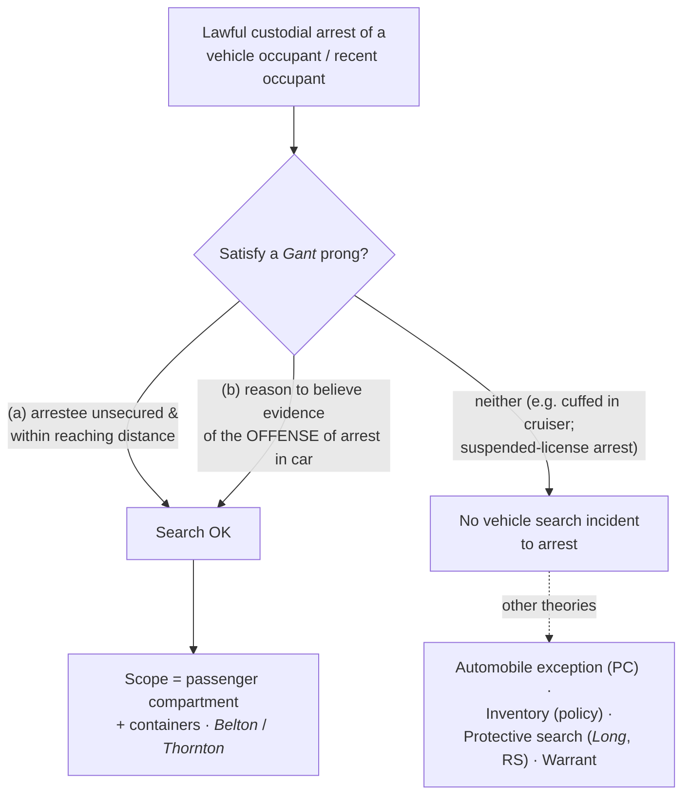

# SIA — Vehicles

*This page states when the arrest of a vehicle's occupant justifies searching the passenger compartment. It is a distinct theory from the [[Automobile Exception]], which searches a vehicle on probable cause and does not depend on any arrest.*

> [!rule] Black-letter rule
> A vehicle search incident to a recent occupant's arrest is lawful **only** when **(a)** the arrestee is **unsecured and within reaching distance** of the passenger compartment at the time of the search, **or (b)** it is **reasonable to believe the vehicle contains evidence of the offense of arrest**. *[[Arizona v. Gant#^pin-351|Gant]]*, 556 U.S. 332, [351](https://www.courtlistener.com/opinion/145887/arizona-v-gant/) (2009). If a prong is met, the search reaches the **passenger compartment and any containers in it** (*[[New York v. Belton|Belton]]*, 453 U.S. 454, [460](https://www.courtlistener.com/opinion/110559/new-york-v-belton/) (1981)); if neither is met, *[[New York v. Belton|Belton]]*'s scope is never reached.
> ^rule-sia-vehicle

## The Brief

**Field-decisive question: I arrested a driver or passenger — may I search the car?** Not automatically. First satisfy one of *[[Arizona v. Gant|Gant]]*'s two triggers; only then does *[[New York v. Belton|Belton]]*'s scope apply. Because this is a warrant exception, the **government bears the burden**; review of the historic facts is deferential and the ultimate reasonableness is [[Common Legal Terms#de-novo|de novo]]; the **remedy** for an unjustified search is suppression under [[The Exclusionary Rule]] (subject to the good-faith reliance recognized in *[[Davis v. United States]]*).

**Belton fixed the scope; Gant supplied the trigger.** *[[New York v. Belton|Belton]]* answered a scope question: on a lawful custodial arrest of a vehicle occupant, the searchable area is "the passenger compartment of that automobile" and "any containers found within the passenger compartment." *[[New York v. Belton|Belton]]*, 453 U.S. at [460](https://www.courtlistener.com/opinion/110559/new-york-v-belton/). *[[Thornton v. United States#^pin-623|Thornton]]* extended that reach to a **"recent occupant"** who had already stepped out before the officer made contact. 541 U.S. 615, 623–24 (2004). Read broadly, *[[New York v. Belton|Belton]]* became an automatic entitlement to search any arrestee's car — the reading *[[Arizona v. Gant|Gant]]* rejected.

**Gant re-tethered the doctrine to *[[Chimel v. California|Chimel]]* and set a real trigger.** "Police may search a vehicle incident to a recent occupant's arrest only if the arrestee is within reaching distance of the passenger compartment at the time of the search or it is reasonable to believe the vehicle contains evidence of the offense of arrest." *[[Arizona v. Gant#^pin-351|Gant, 556 U.S. at 351]]*. Prong (a) is the *[[Chimel v. California|Chimel]]* officer-safety/evidence-preservation rationale applied to a car; prong (b) is an evidence-of-the-offense rationale drawn from Justice Scalia's *[[Thornton v. United States|Thornton]]* [[Common Legal Terms#concurring-opinion|concurrence]]. Scope is not a trigger: if neither prong is satisfied, you never reach *[[New York v. Belton|Belton]]*.

**The point-status of *[[New York v. Belton|Belton]]* after *[[Arizona v. Gant|Gant]]*.** *[[New York v. Belton|Belton]]* is neither wholly good nor wholly dead — its validity varies by point.

| Point of law | Status | Controlling authority |
|---|---|---|
| Automatic passenger-compartment search on any occupant's arrest | **Superseded** | *[[Arizona v. Gant]]*, 556 U.S. 332 (2009); the automatic trigger is replaced by *[[Arizona v. Gant\|Gant]]*'s two-justification test |
| Scope, once a *[[Arizona v. Gant\|Gant]]* prong is met (passenger compartment + containers in it) | **Good law** | *[[New York v. Belton]]*, 453 U.S. 454, [460](https://www.courtlistener.com/opinion/110559/new-york-v-belton/) (1981); the container rule survives inside *[[Arizona v. Gant\|Gant]]*'s framework |

So *[[New York v. Belton|Belton]]*'s **scope** holding still tells you *where* you may search; *[[Arizona v. Gant|Gant]]* now tells you *whether* you may search at all. (On *[[New York v. Belton|Belton]]*'s own case page the composite reads **Caution — varies by point**, with the vehicle-trigger point flagged superseded and the container point good law.)

**Prong (a) usually fails once the arrestee is secured.** Routinely cuffing the arrestee and placing him in the cruiser puts him **outside** reaching distance, so prong (a) is typically gone by the time of the search — leaving only prong (b). And prong (b) is offense-specific: an arrest for **driving on a suspended license** or an outstanding warrant supplies no reason to believe the car holds evidence *of that offense*, so it will rarely justify the search. This is the most common field error the *[[Arizona v. Gant|Gant]]* structure is designed to catch.

**Keep the vehicle theories distinct.** The **automobile exception** (see [[Automobile Exception]]) is a *separate* justification: probable cause that the vehicle contains contraband, no arrest required, reaching the whole vehicle and every container where the object might be. **Inventory** of an impounded vehicle (see [[Inventory Searches]]) is an administrative caretaking search on a standardized policy, not an arrest theory. And a *[[Arizona v. Gant|Gant]]*-secured arrestee does not shrink a separate **protective** vehicle search for weapons under *[[Michigan v. Long]]* on reasonable suspicion (*[[United States v. Vinton|Vinton]]*). A search that fails *[[Arizona v. Gant|Gant]]* may still be lawful under one of these — but say which theory you are using.

**Apply it.**
1. Make the arrest, then ask *[[Arizona v. Gant|Gant]]*'s two questions **before** searching the car.
2. **Prong (a):** Is the arrestee **unsecured and within reaching distance** of the passenger compartment right now? If he is cuffed in the cruiser, prong (a) is gone.
3. **Prong (b):** Is it **reasonable to believe** the car contains **evidence of the offense of arrest**? Tie it to *this* offense.
4. If a prong is met, search the **passenger compartment and containers in it** (*[[New York v. Belton|Belton]]* scope) — not the trunk (that is the automobile exception's reach on probable cause).
5. If neither prong is met, do not search on the arrest; consider the **automobile exception** (probable cause), **inventory** (impoundment + policy), a **protective** search (*[[Michigan v. Long|Long]]*, reasonable suspicion), or a **warrant**.

**Common pitfalls.**
- **Treating any arrest as authority to search the car.** *[[Arizona v. Gant|Gant]]* killed the automatic *[[New York v. Belton|Belton]]* reading — satisfy a prong first.
- **Forgetting that securing the arrestee kills prong (a).** A cuffed, cruiser-seated arrestee is not within reaching distance.
- **Stretching prong (b) past the offense of arrest.** A suspended-license or warrant arrest rarely gives reason to believe the car holds evidence of that offense.
- **Confusing *[[Arizona v. Gant|Gant]]* with the automobile exception.** *[[Arizona v. Gant|Gant]]* is an arrest theory limited to the passenger compartment; the automobile exception is a probable-cause theory reaching the whole car.
- **Over-reading the circuit container cases as a national rule.** Whether *[[Arizona v. Gant|Gant]]* prong (a) reaches a secured arrestee's out-of-car bag is an unresolved split (below), not a SCOTUS holding.

## Lower-court developments

The SCOTUS framework (*[[New York v. Belton|Belton]]* / *[[Thornton v. United States|Thornton]]* / *[[Arizona v. Gant|Gant]]*) is stable; the live circuit fight is whether *[[Arizona v. Gant|Gant]]* prong (a)'s reaching-distance limit reaches **outside the vehicle** to a secured arrestee's non-vehicular container. The decisions below bind only in their own circuits and are persuasive elsewhere; the split is genuine and unresolved at the Supreme Court.

- **Does *[[Arizona v. Gant|Gant]]* prong (a) reach a secured arrestee's out-of-reach bag?** ⚖ **Developing circuit split.** *[[United States v. Howard Davis|Davis]]* (4th Cir. 2021) says **yes**: a secured arrestee's out-of-reach backpack cannot be searched as incident to arrest, reasoning joined in substance by the Third, Ninth, and Tenth Circuits (*Shakir*, *Cook*, *Knapp*). **Binding in-circuit — 4th Cir.; Persuasive (outside circuit).** [opinion](https://www.courtlistener.com/opinion/4881258/united-states-v-howard-davis/)
- **The other way.** *[[United States v. Perez|Perez]]* (1st Cir. 2023) **declined** to extend *[[Arizona v. Gant|Gant]]* prong (a) to a bag already removed from the fleeing arrestee and secured on a cruiser, relying on pre-*[[Arizona v. Gant|Gant]]* circuit precedent (*Eatherton*) and squarely rejecting *[[United States v. Howard Davis|Davis]]*; *Curtis* (5th Cir.) and *Perdoma* (8th Cir.) are contrary or reserved. Treat the container question as **unsettled** (circuits named). **Binding in-circuit — 1st Cir.; Persuasive (outside circuit).** [opinion](https://www.courtlistener.com/opinion/9456060/united-states-v-perez/)

## Key cases

| Case | Holding | Opinion |
|---|---|---|
| *[[Arizona v. Gant]]*, 556 U.S. 332 (2009) | **Anchor.** Vehicle [[Search Incident to Arrest\|search incident to arrest]] is lawful **only** if the arrestee is unsecured and within reaching distance of the passenger compartment, **or** it is reasonable to believe the car holds evidence of the offense of arrest. | [opinion](https://www.courtlistener.com/opinion/145887/arizona-v-gant/) |
| *[[New York v. Belton]]*, 453 U.S. 454 (1981) | **Scope.** Fixes the searchable area as the passenger compartment and containers in it; its automatic-trigger reading is **superseded by *Gant***, while the container/scope rule survives. | [opinion](https://www.courtlistener.com/opinion/110559/new-york-v-belton/) |
| *[[Thornton v. United States]]*, 541 U.S. 615 (2004) | **Recent occupant.** *[[New York v. Belton\|Belton]]* reaches a "recent occupant" who has stepped out; Scalia's [[Common Legal Terms#concurring-opinion\|concurrence]] floats the evidence-of-offense rationale *[[Arizona v. Gant\|Gant]]* later adopts. Trigger now **limited by *Gant***. | [opinion](https://www.courtlistener.com/opinion/134746/thornton-v-united-states/) |

## Related cases across doctrines

These cases are treated in full elsewhere but bear on the vehicle incident search, framed here.

| Case | Relevance here | Primary home | Opinion |
|---|---|---|---|
| *[[United States v. Chadwick]]*, 433 U.S. 1 (1977) | ***Exclusive-control limit.*** Luggage in exclusive police control with no [[Exigent Circumstances and Hot Pursuit\|exigency]] may not be searched as incident to arrest; the container aspect is limited by *[[California v. Acevedo\|Acevedo]]* inside a vehicle. | [[Automobile Exception]] | [opinion](https://www.courtlistener.com/opinion/109714/united-states-v-chadwick/) |
| *[[United States v. Vinton]]*, 594 F.3d 14 (D.C. Cir. 2010) | ***Distinct theory.*** *[[Arizona v. Gant\|Gant]]*'s "secured arrestee" limit does not shrink a separate *[[Michigan v. Long]]* protective vehicle search on reasonable suspicion. | [[Traffic Stops]] | [opinion](https://www.courtlistener.com/opinion/187527/united-states-v-vinton/) |
| *[[United States v. Anchondo]]*, 156 F.3d 1043 (10th Cir. 1998) | ***Person, not vehicle.*** Drugs found on the arrestee's body were the fruit of a lawful search of the **person** incident to arrest; that theory stands apart from any vehicle rule. | [[Automobile Exception]] | [opinion](https://www.courtlistener.com/opinion/758111/united-states-v-erick-anchondo/) |

## Visual

## Sources
- [*Arizona v. Gant*, 556 U.S. 332 (2009)](https://www.courtlistener.com/opinion/145887/arizona-v-gant/) (pinpoint: 351)
- [*New York v. Belton*, 453 U.S. 454 (1981)](https://www.courtlistener.com/opinion/110559/new-york-v-belton/) (pinpoint: 460) (vehicle-search trigger superseded by *Gant* (2009))
- [*Thornton v. United States*, 541 U.S. 615 (2004)](https://www.courtlistener.com/opinion/134746/thornton-v-united-states/) (pinpoints: 623–624) (limited by *Gant*)
- [*United States v. Chadwick*, 433 U.S. 1 (1977)](https://www.courtlistener.com/opinion/109714/united-states-v-chadwick/) (auto-container aspect limited by *Acevedo*)
- [*United States v. Vinton*, 594 F.3d 14 (D.C. Cir. 2010)](https://www.courtlistener.com/opinion/187527/united-states-v-vinton/)
- [*United States v. Anchondo*, 156 F.3d 1043 (10th Cir. 1998)](https://www.courtlistener.com/opinion/758111/united-states-v-erick-anchondo/)
- [*United States v. Davis*, 997 F.3d 191 (4th Cir. 2021)](https://www.courtlistener.com/opinion/4881258/united-states-v-howard-davis/) (Binding in-circuit — 4th Cir.)
- [*United States v. Perez*, 89 F.4th 247 (1st Cir. 2023)](https://www.courtlistener.com/opinion/9456060/united-states-v-perez/) (Binding in-circuit — 1st Cir.)
