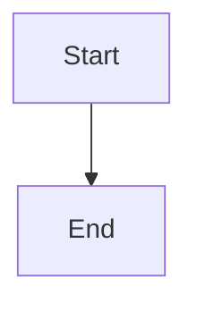

# Fixture Doctrine

*A one-line hypo framing the fixture doctrine.*

> [!rule] Black-letter rule
> The fixture black-letter rule statement binds here.
> ^rule-fixture-doctrine

## The Brief
Some prose with [[Fixture v. Sample]] and a [[Common Legal Terms#mens-rea|term]] link.

## Key cases

| Case | Holding | Opinion |
|---|---|---|
| *[[Fixture v. Sample]]*, 123 U.S. 45 (1900) | Anchor holding. | [opinion](https://www.courtlistener.com/opinion/1/fixture-v-sample/) |
| *[[Later v. Case]]*, 200 U.S. 1 (1905) | Refinement holding. | [opinion](https://www.courtlistener.com/opinion/3/later-v-case/) |

## Related cases across doctrines

| Case | Relevance here | Primary home | Opinion |
|---|---|---|---|
| *[[Third v. Party]]*, 300 U.S. 2 (1910) | Relevance text. | [[Other Page]] | [opinion](https://www.courtlistener.com/opinion/4/third-v-party/) |

## Visual

## Sources
- [*Fixture v. Sample*, 123 U.S. 45 (1900)](https://www.courtlistener.com/opinion/1/fixture-v-sample/) (pinpoint: 45)
